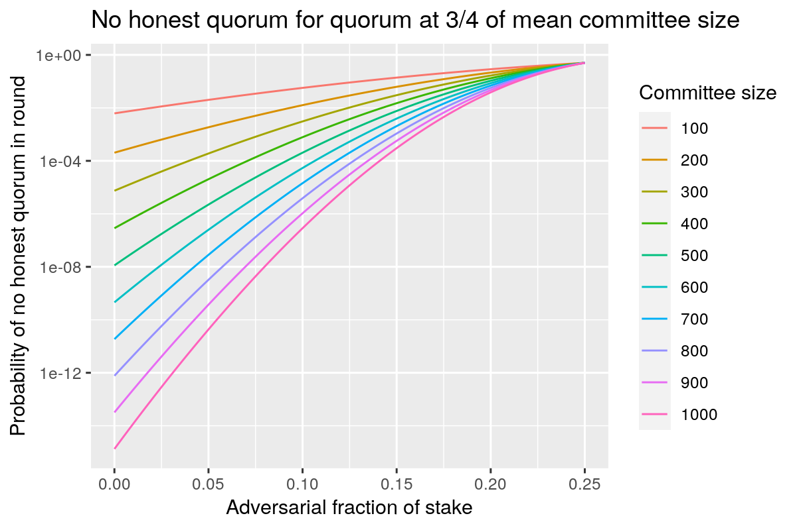

## 2024-05-06

### Team retrospective

We followed the [Liked/Lacked/Learned](https://www.funretrospectives.com/the-3-ls-liked-learned-lacked/) retrospective process, yielding the following output:


Then we spent some time grouping the various items in various "domains" and define some actionable item for each of those groupings


### Optimising ALBAs

Spent some time optimising ALBAs, implementing the depth-first search suggested by Pyrros to speed up construction of the proof. This turned out to 1/ be quite simple to implement and 2/ provide a dramatic boost in performance.

## 2024-05-01

### Probabilities of various Peras scenarios

The document [analytics/analytics-1.md](analytics/analytics-1.md) derives formulae for several Peras scenarios involving adversaries.

- Adversaries refuse to vote in a round, causing a failure to reach a quorum.
- A non-zero probability of entering a cool-down period results in the chain being in cool-down a fraction of the time it operates.
- Adversarial block-producers refuse to include certificates in blocks, letting them expire instead. (This would only affect the operation of the protocol during times when a certificate must be recorded on the chain.)
- Adversaries both forge a block and later muster a quorum to vote for it.

QuickCheck tests could be constructed to test that the chain dynamics conform to these analytic expressions when adversaries act accordingly.

|   |   |   |
|---|---|---|
| No honest quorum in round |  |  |
| Fraction of time in cool down |  |   |
| No certificate in honest block |  |  |
| Adversarial block with adversarial quorum |  |   |

## 2024-04-29

### Crypto benchmarks

Raw benchmarks for ALBA

| Name                     | Mean    | MeanLB  | MeanUB  | Stddev  | StddevLB | StddevUB |
|--------------------------|---------|---------|---------|---------|----------|----------|
| Hashing/hashing len=256  | 5.81e-7 | 5.71e-7 | 5.85e-7 | 1.93e-8 | 1.01e-8  | 3.77e-8  |
| "Proving 100/64 λ = 8"   | 7.24e-3 | 7.19e-3 | 7.45e-3 | 2.43e-4 | 5.38e-5  | 5.31e-4  |
| "Proving 100/64 λ = 9"   | 8.84e-3 | 8.79e-3 | 8.88e-3 | 1.19e-4 | 7.41e-5  | 1.71e-4  |
| "Proving 100/64 λ = 10"  | 1.07e-2 | 1.07e-2 | 1.08e-2 | 1.15e-4 | 9.23e-5  | 1.48e-4  |
| "Proving 100/128 λ = 8"  | 7.46e-3 | 7.41e-3 | 7.50e-3 | 1.39e-4 | 9.07e-5  | 2.32e-4  |
| "Proving 100/128 λ = 9"  | 9.04e-3 | 9.01e-3 | 9.06e-3 | 8.13e-5 | 6.39e-5  | 1.12e-4  |
| "Proving 100/128 λ = 10" | 1.12e-2 | 1.11e-2 | 1.12e-2 | 1.61e-4 | 9.70e-5  | 2.74e-4  |
| "Proving 100/256 λ = 8"  | 7.12e-3 | 6.79e-3 | 7.57e-3 | 1.09e-3 | 7.48e-4  | 1.58e-3  |
| "Proving 100/256 λ = 9"  | 7.50e-3 | 7.38e-3 | 7.66e-3 | 3.97e-4 | 3.24e-4  | 4.68e-4  |
| "Proving 100/256 λ = 10" | 9.52e-3 | 9.44e-3 | 9.67e-3 | 2.89e-4 | 1.80e-4  | 3.87e-4  |
| "Proving 200/64 λ = 8"   | 1.14e-2 | 1.12e-2 | 1.17e-2 | 5.79e-4 | 3.24e-4  | 9.20e-4  |
| "Proving 200/64 λ = 9"   | 1.36e-2 | 1.35e-2 | 1.37e-2 | 2.01e-4 | 1.31e-4  | 3.27e-4  |
| "Proving 200/64 λ = 10"  | 1.70e-2 | 1.66e-2 | 1.81e-2 | 1.58e-3 | 3.02e-4  | 2.93e-3  |
| "Proving 200/128 λ = 8"  | 1.15e-2 | 1.14e-2 | 1.16e-2 | 3.07e-4 | 2.34e-4  | 4.85e-4  |
| "Proving 200/128 λ = 9"  | 1.37e-2 | 1.35e-2 | 1.42e-2 | 6.58e-4 | 1.90e-4  | 1.30e-3  |
| "Proving 200/128 λ = 10" | 1.71e-2 | 1.70e-2 | 1.71e-2 | 1.46e-4 | 9.06e-5  | 2.33e-4  |
| "Proving 200/256 λ = 8"  | 1.13e-2 | 1.12e-2 | 1.18e-2 | 5.40e-4 | 1.13e-4  | 1.15e-3  |
| "Proving 200/256 λ = 9"  | 1.37e-2 | 1.36e-2 | 1.39e-2 | 2.90e-4 | 1.16e-4  | 5.40e-4  |
| "Proving 200/256 λ = 10" | 1.67e-2 | 1.66e-2 | 1.69e-2 | 2.46e-4 | 1.34e-4  | 3.61e-4  |
| "Proving 300/64 λ = 8"   | 1.72e-2 | 1.70e-2 | 1.75e-2 | 6.46e-4 | 2.95e-4  | 9.78e-4  |
| "Proving 300/64 λ = 9"   | 2.17e-2 | 2.11e-2 | 2.37e-2 | 2.06e-3 | 9.34e-4  | 3.92e-3  |
| "Proving 300/64 λ = 10"  | 2.60e-2 | 2.51e-2 | 2.91e-2 | 3.19e-3 | 7.36e-4  | 6.51e-3  |
| "Proving 300/128 λ = 8"  | 1.67e-2 | 1.64e-2 | 1.79e-2 | 1.12e-3 | 5.36e-4  | 2.09e-3  |
| "Proving 300/128 λ = 9"  | 1.99e-2 | 1.98e-2 | 2.00e-2 | 2.09e-4 | 1.09e-4  | 3.38e-4  |
| "Proving 300/128 λ = 10" | 2.55e-2 | 2.53e-2 | 2.60e-2 | 7.56e-4 | 4.00e-4  | 1.16e-3  |
| "Proving 300/256 λ = 8"  | 1.66e-2 | 1.66e-2 | 1.67e-2 | 1.68e-4 | 9.74e-5  | 2.88e-4  |
| "Proving 300/256 λ = 9"  | 1.99e-2 | 1.99e-2 | 2.01e-2 | 2.22e-4 | 1.01e-4  | 3.25e-4  |
| "Proving 300/256 λ = 10" | 2.59e-2 | 2.56e-2 | 2.66e-2 | 8.47e-4 | 2.02e-4  | 1.67e-3  |

Raw benchmarks table for cardano-crypto stuff

| Name                               | Mean    | MeanLB  | MeanUB  | Stddev   | StddevLB | StddevUB |
|------------------------------------|---------|---------|---------|----------|----------|----------|
| DSIGN/Ed25519/genKeyDSIGN          | 1.06e-5 | 1.06e-5 | 1.07e-5 | 9.35e-8  | 4.82e-8  | 1.77e-7  |
| DSIGN/Ed25519/signDSIGN            | 1.14e-5 | 1.14e-5 | 1.15e-5 | 1.95e-7  | 1.09e-7  | 3.46e-7  |
| DSIGN/Ed25519/verifyDSIGN          | 3.27e-5 | 3.26e-5 | 3.28e-5 | 3.35e-7  | 2.17e-7  | 4.73e-7  |
| DSIGN/EcdsaSecp256k1/genKeyDSIGN   | 7.72e-8 | 7.69e-8 | 7.77e-8 | 1.28e-9  | 9.28e-10 | 1.96e-9  |
| DSIGN/EcdsaSecp256k1/signDSIGN     | 2.03e-5 | 2.02e-5 | 2.05e-5 | 4.42e-7  | 1.74e-7  | 8.52e-7  |
| DSIGN/EcdsaSecp256k1/verifyDSIGN   | 2.29e-5 | 2.29e-5 | 2.30e-5 | 1.82e-7  | 9.27e-8  | 3.71e-7  |
| DSIGN/SchnorrSecp256k1/genKeyDSIGN | 3.10e-8 | 3.07e-8 | 3.14e-8 | 1.22e-9  | 8.93e-10 | 1.86e-9  |
| DSIGN/SchnorrSecp256k1/signDSIGN   | 3.14e-5 | 3.12e-5 | 3.19e-5 | 1.01e-6  | 5.93e-7  | 1.69e-6  |
| DSIGN/SchnorrSecp256k1/verifyDSIGN | 2.50e-5 | 2.50e-5 | 2.53e-5 | 4.72e-7  | 1.18e-7  | 9.74e-7  |
| HASH/Blake2b_224/hashWith          | 3.58e-7 | 3.51e-7 | 3.78e-7 | 3.60e-8  | 1.26e-8  | 6.51e-8  |
| HASH/Blake2b_224/decodeHash        | 8.32e-8 | 8.01e-8 | 8.83e-8 | 1.43e-8  | 1.01e-8  | 2.30e-8  |
| HASH/Blake2b_256/hashWith          | 3.39e-7 | 3.39e-7 | 3.40e-7 | 2.73e-9  | 1.90e-9  | 3.86e-9  |
| HASH/Blake2b_256/decodeHash        | 7.09e-8 | 7.07e-8 | 7.13e-8 | 7.90e-10 | 3.37e-10 | 1.49e-9  |
| KES/Sum6KES/genKey                 | 1.25e-3 | 1.25e-3 | 1.26e-3 | 1.61e-5  | 1.35e-5  | 1.95e-5  |
| KES/Sum6KES/signKES                | 1.26e-3 | 1.25e-3 | 1.27e-3 | 2.32e-5  | 1.76e-5  | 3.08e-5  |
| KES/Sum6KES/verifyKES              | 1.25e-3 | 1.24e-3 | 1.29e-3 | 6.23e-5  | 1.17e-5  | 1.30e-4  |
| KES/Sum6KES/updateKES              | 1.24e-3 | 1.23e-3 | 1.25e-3 | 2.71e-5  | 1.98e-5  | 4.49e-5  |
| KES/Sum7KES/genKey                 | 2.45e-3 | 2.44e-3 | 2.46e-3 | 1.97e-5  | 1.61e-5  | 2.87e-5  |
| KES/Sum7KES/signKES                | 2.48e-3 | 2.46e-3 | 2.60e-3 | 1.30e-4  | 2.59e-5  | 3.12e-4  |
| KES/Sum7KES/verifyKES              | 2.46e-3 | 2.45e-3 | 2.47e-3 | 3.64e-5  | 2.77e-5  | 5.04e-5  |
| KES/Sum7KES/updateKES              | 2.42e-3 | 2.36e-3 | 2.51e-3 | 2.51e-4  | 1.91e-4  | 3.72e-4  |
| KES/CompactSum6KES/genKey          | 1.24e-3 | 1.23e-3 | 1.26e-3 | 4.41e-5  | 2.62e-5  | 7.32e-5  |
| KES/CompactSum6KES/signKES         | 1.26e-3 | 1.24e-3 | 1.27e-3 | 5.96e-5  | 3.26e-5  | 8.88e-5  |
| KES/CompactSum6KES/verifyKES       | 1.27e-3 | 1.26e-3 | 1.27e-3 | 1.68e-5  | 1.27e-5  | 2.29e-5  |
| KES/CompactSum6KES/updateKES       | 1.28e-3 | 1.27e-3 | 1.28e-3 | 2.02e-5  | 1.41e-5  | 3.18e-5  |
| KES/CompactSum7KES/genKey          | 2.53e-3 | 2.51e-3 | 2.54e-3 | 3.93e-5  | 2.76e-5  | 6.38e-5  |
| KES/CompactSum7KES/signKES         | 2.54e-3 | 2.52e-3 | 2.55e-3 | 3.38e-5  | 2.38e-5  | 5.44e-5  |
| KES/CompactSum7KES/verifyKES       | 2.53e-3 | 2.51e-3 | 2.54e-3 | 4.35e-5  | 2.76e-5  | 7.28e-5  |
| KES/CompactSum7KES/updateKES       | 2.55e-3 | 2.54e-3 | 2.58e-3 | 6.05e-5  | 3.82e-5  | 1.03e-4  |
| VRF/SimpleVRF/genKey               | 5.39e-7 | 5.06e-7 | 6.30e-7 | 1.71e-7  | 7.26e-8  | 3.22e-7  |
| VRF/SimpleVRF/eval                 | 1.19e-2 | 1.17e-2 | 1.27e-2 | 1.03e-3  | 5.47e-5  | 2.12e-3  |
| VRF/SimpleVRF/verify               | 1.02e-2 | 1.01e-2 | 1.03e-2 | 1.87e-4  | 1.13e-4  | 2.70e-4  |
| VRF/PraosVRF/genKey                | 1.18e-5 | 1.16e-5 | 1.26e-5 | 1.25e-6  | 1.30e-7  | 2.63e-6  |
| VRF/PraosVRF/eval                  | 1.00e-4 | 1.00e-4 | 1.02e-4 | 2.17e-6  | 7.78e-7  | 4.41e-6  |
| VRF/PraosVRF/verify                | 1.02e-4 | 9.79e-5 | 1.20e-4 | 2.56e-5  | 2.91e-6  | 5.55e-5  |

### AB on ALBA Certificates

I spent some time building a [Haskell implementation for ALBAs](https://github.com/cardano-scaling/alba), here are some notes related to this experience.

* It uses [libsodium](https://libsodium.gitbook.io/doc) to provide hashing function, just like cardano-base. I did not want to depend on cardano-crypto-class as hashing is the only function I need, but this would  be a good idea later on to handle voting and signatures
* Hashing is done with Blake2b256. My initial implementation took about 1μs/hash which is 3x what cardano-crypto-class provides. I had a look at the implementation their and it relies on [unsafeCreate](https://hackage.haskell.org/package/bytestring-0.12.1.0/docs/Data-ByteString-Internal.html#v:unsafeCreate) and [useAsCStringLen](https://hackage.haskell.org/package/bytestring-0.12.1.0/docs/Data-ByteString.html#v:useAsCStringLen) which provide much better performance. For some reason, my code is still 30% slower than cardano-crypto-class at ~420ns :shrug:
  * Perhaps SHA256 would be enough as a hashing function?
* The code now implements, or is supposed to implement, optimisation from section 3.2 of the paper:
  * The input set of elements are hashed and their modulus $n_p$ is compared to the iteratively computed hashes and modulus of the selected proof tuples
  * On a test run for 200 items, with 70/30 honest to faulty ratio, and security parameter 8, it computes 35400 hashes which seems consistent with the theoretical complexity of $\lambda^3 . n_p$
* It also implements the optimisation on computation of parameter $d$ from section C.1 of the paper but this does not seem to have a significant impact on running time
* The code as it is checks the number of signatures needed ($u$) is consistent with what's provided in the paper. In the case of a 1000 signatures, for a ratio of 60/40, and a λ of 128, gives $u=232$.
  * Given a KES signature size of 448 bytes, this gives us a certificate size of 103936 bytes which is about the size of block
* The biggest issue with the current implementation lies in how the size of the set of items to select from increases over rounds while constructing the proof. Here is an example for the parameter given above, showing the length of the selection set which needs to be paired with input set:

  ```
  length = 35446
  length = 95810
  length = 159506
  length = 265489
  length = 441223
  length = 734386
  ...
  ```

  The values of the protocol inner parameters are: u = 234, d = 21192, q = 8.373238874261325e-3

  The value of $d$ is quite large and therefore leads to fast increase in the size of the set.
* This implementation can generate a proof for 300 items with a λ of 10 and honest fraction of 80% in a bit over _20ms_

Optimising ALBA code was a bit of a journey, took me a while to figure out how to remove the "exponentially increasing" calls to `hash` while constructing the proofs iteratively. I had to resort to profiling support from GHC and manually insert `SCC` pragmas all over the place to get a sense of where the time was spent. Biggest time consumer was garbage allocation, which was up to 10s of GBs for a relatively small run, and is now about 150MB for the aforementioned parameters, which seems quite reasonable.

* I had to look at cardano-base's codebase to understand what I was doing wrong with the call to libsodium: Under the hood it's the exact same code that's called, but I was using allocators from `Foreign` which apparently are quite inefficient
* I dropped use of `Integer` in computations in favor of `Word64` to ensure fast modulus for bytestrings. It's possible that native code would be even faster here
* At some point I have tried to dump GHC core in order to understand why my code was allocating so much data, but it wasn't very helpful at a glance

## 2024-04-17

### Meeting PNSol on Vote network modelling

* Seems like the vote diffusion should not be problematic on sunny days, so the modelling and thinking effort should be focused on "rainy days", eg. what happens under heavy load, eg. CPU load (also possibly network load?). These are the circumstances into which backpressure should be applied

Some key questions to answer to:
* How much computation do we do on each vote?
* How much computation do we do on certificate?
* What kind of backpressure do we need to bake in?
* ND: "do these things form a monoid" -> pack things together

Interesting observation:
* We could build certificate to reduce amount of data transferred, eg. trading CPU time (building certificate) for space and network bandwidth consumption

## 2024-04-15

* Working on [technical report](docs/reports/tech-report-1.md), filling in section on quickcheck-dynamic example protocol from Quviq
* Also trying to provide a better intuition about the protocol and rework the introductory section following our discussions in Paris
* Some questions for researchers related to committee selection and the number of messages we need to broadcast across the network

## 2024-04-10

Published [detailed notes](docs/reports/2024-04-10-paris-workshop.md) about the Peras team workshop in Paris

## 2024-03-30

### New QuickCheck-Dynamic model

A new `quickcheck-dynamic` model was created for closer and cleaner linkage between code generated by `agda2hs` and Haskell and Rust simultations. The model has the following features:

- Separation between "idealized" votes, certificates, blocks, and chains of the specification from "realized" ones generated by `agda2hs` and used in the simultions.
    - The idealized version ignores some details like signatures and proofs.
    - It would be possible to remove this separation between ideal and real behavior is fully deterministic (including the bytes of signatures and proofs).
    - However, this exercise demonstrates the feasiblity of having a slightly more abstract model of a node for use in `Test.QuickCheck.StateModel`.
- A `NodeModel` with sufficient detail to implement Peras.
    - Ideally, this would be generated by `agda2hs`.
- Executable specification for the node model.
    - Ideally, this would be generated by `agda2hs`.
- A `class PerasNode` representing the abstract interface of nodes.
- An `instance StateModel NodeModel` that uses the executable specification for state transitions and includes generators for actions, constrained by preconditions.
- An `instance (Monad m, PerasNode n m) => RunModel NodeModel (RunMonad n m)` that runs actions on a `PerasNode` and checks postconditions.
- An `instance PerasNode ExampleNode` embodying a simple, intentionally buggy, node for exercising the dynamic logic tests.
- A simple property for the example node.

The model is implemented by the following Haskell modules.

- [`Peras.OptimalModel`](peras-quickcheck/src/Peras/OptimalModel.hs)
- [`Peras.OptimalModelSpec`](peras-quickcheck/test/Peras/OptimalModelSpec.hs)

The example property simply runs a simulation using `ExampleNode` and checks the trace's conformance to the executable specification. Because the example node contains a couple of intentional bugs, we expect the test to fail. Shrinkage reveals a parcimonious series of actions that exhibit one of the bugs.

```console
$ cabal run test:peras-quickcheck-test -- --match "/Peras.OptimalModel/Example node/Simulation respects model/"

Peras.OptimalModel
  Example node
    Simulation respects model [✔]
      +++ OK, failed as expected. Assertion failed (after 4 tests and 1 shrink):
      do action $ Initialize (Peras {roundLength = 10, quorum = 3, boost = 0.25}) 0
         action $ ANewChain [BlockIdeal {hash = "92dc9c1906312bb4", creator = 1, slot = 0, cert = Nothing, parent = ""}]
         action $ ATick False True
         pure ()

Finished in 0.0027 seconds
1 example, 0 failures
```

Instead of migrating `peras-iosim` and `peras-netsim`, we might start with a clean slate and use a more TDD-focused approach that builds out from the Agda and Dynamic QuickCheck specifications. Those legacy, prototype codebased can be mined for lessons learned and code fragments in the new, cleaner framework.

### Mini state machine refactoring of `peras-iosim`

The branch [bwbush/march-sm](https://github.com/input-output-hk/peras-design/tree/bwbush/march-sm) contains work in progress for a major refactoring of `peras-iosim` that will use miniature state machines for each node's upstream/downstream channels and that will implement the full Peras protocol. The key features are:

- Pure functions for each clause in the March pseudo-code specification for the Peras protocol.
- Each node-to-node channel is implemented as a composition of state machines.
    - Chains under evaluation or fully evaluated.
    - Block bodies requested and successfully fetched.
    - Certificates requested and successfully fetched.
    - Votes seen.
- A similar node-level state machine aggregates the activity of the individual channels so, for example, a block body is only requested from one peer instead of every peer that mentions it.
- `InEnvelope` and `OutEnvelope` are redesigned for clean usage.
- Time is managed via the network's centralized priority queue, which dispatched messages over the channels.
- No use of threading or STM.
    - The design is compatible with this, but the complexity outweighs the value that would be added.
    - `IOSim` is single-threaded anyway, so implementing sophisticated parallel simulation would only have benefits outside of `IOSim`.
-  Overall the node interface has been simplified.
    - Each node receives a single message at a time.
    - The node outputs a sequence of timestamped messages to specified recipients.
    - The result of each message-handling call also includes statistics on CPU and bandwidth usage.
    - Structured `Event`s (including ad-hoc debug tracing) are observable.
    - Outgoing results are tagged with a guaranteed minimum time before which a node will not send any more messages.

This branch is abandoned in favor a TDD approach using QuickCheck Dynamic, but lessons learned and design principles will be incorporated into a future faithful simulation of the March version of the Peras protocol.

### Congestion experiment

We conducted a coarse study to exercise `peras-iosim` in [a simulation experiment involving network congestion](peras-iosim/analyses/congestion/ReadMe.md). It was meant to check capabilities in these areas:

- simulation/analysis workflow
- scalability and performance
- observability

It was a full factorial experiment where bandwidth and latency are varied on a small network with semi-realistic Peras parameters. Each block has its maximum size.

- 250 nodes with fivefold connectivity
- ~25 committee members
- Full blocks (90.112 kB)
- Latency from 0.25 s to 1.00 s
- Bandwidth from 8 Mb/s to 400 Mb/s

The experiment is not realistic in several aspects:

- Memory pool and other non-block/non-vote messages not modeled
- February version of Peras protocol
- Simulation not validated - not suitable for making conclusions about Peras

Several findings were apparent:

- A threshold is readily detectable at a bandwidth of ~20 Mb/s.
- Non-block and not-vote messages such as those related to the memory pool must be accounted for in congestion.
- The event logging and statistics system easily supports analyses such as this.
- Data on node processing times is needed.

The following diagram shows the cumulative bytes received by nodes as a function of network latency and bandwidth, illustrating the ttheshold below which bandwidth is saturated by the protocol and block/vote diffusion.


## 2024-03-27

### AB on quickcheck-dynamic

Trying to unpack the script shrinking process, calling internal functions directly.

```
test = do
  let dynformula = runDL initialAnnotatedState dl
      dynlogic = unDynFormula dynformula 10
  dlTest <- QC.generate $ generate chooseNextStep dynlogic 1 initialAnnotatedState 10
  let shrunk = shrinkScript dynlogic (getScript dlTest)
      tested = makeTestFromPruned dynlogic <$> pruned

  print $ dlTest
  print $ take 5 tested
```

yeilds something like:

```
do action $ Incr
   action $ Incr
   action $ Incr
   action $ Incr
   action $ Incr
   action $ Incr
   action $ Incr
   action $ Incr
   action $ Incr
   action $ Incr
   action $ Assert 10
   pure ()

[
   pure ()
,do action $ Incr
   action $ Incr
   pure ()
,do action $ Incr
   action $ Incr
   action $ Incr
   action $ Incr
   action $ Incr
   action $ Incr
   pure ()
,do action $ Incr
   action $ Incr
   action $ Incr
   action $ Incr
   action $ Incr
   action $ Incr
   action $ Incr
   action $ Incr
   pure ()
,do action $ Incr
   action $ Incr
   action $ Incr
   action $ Incr
   action $ Incr
   action $ Incr
   action $ Incr
   action $ Incr
   action $ Incr
   pure ()
]
```

eg. the testes is correctly shrunk

When `verboseCheck`ing the test I realise that shrunk actions do not contain any `Assert` statement which means there's no way they can fail. This is to be expected because `Assert` is marked as restricted and therefore is pruned from the generated test cases
* Is it not the case the problem lies in the fact we don't shrink the restricted actions?

Looking a bit more closely into [Issue31](https://github.com/input-output-hk/quickcheck-dynamic/blob/dab1f41f5637e10da5e13b2e09059a8724f7cc55/quickcheck-dynamic/test/Issue31.hs#L3) makes me wonder if it's not a case where the whole idea of integrated shrinking wouldn't make sense and simplify a lot of things. The technical manifestation of the problem here is that we cannot shrink a trace because the `Assert` action is `restricted` and never gets generated independently, so once we try to shrink a failing test, it produces only valid traces.

The action needs to be restricted because it depends on the state _at runtime_: When we generate an initial trace, the value is fixed and then never changed when we shrink. If we kept the sequence of generated values and then shrank on the whole sequence and not individually, we would find the case we are interested in.

We could explicitly model dependency on state at the level of the expression, and therefore be able to detect more easily those dependencies and act accordingly, eg. recompute the rest of the expression?

### Team Meeting

Discussing haeder/body split:

* how does header forwarding work?
* you can't fully adopt a chain before seeing the block body => the certificate could be just part of the body
* What if the certificate was part of a transaction? Could even be verified as another smart contract?
* Would imply that the node depends on the state of the ledger or a single tx but that's already the case?

What are the true requirements for Midnight?
Fast settlement does not mean anything: In what context? Under which conditions?

Concordium also has deterministic finality, but then they switched to BFT??

Workshop agenda:

Monday afternoon:

* Refactoring together -> adjust interfaces and actual code

Tuesday/Wednesday:

* Overview of finality across blockchains. How do other chains handle that?
* What does finality really means?
  * => we need a technical definition to be specified/tested
  * => something we can observe?
* Under what circumstances does Peras provide benefits over Praos?
  * => turn those into proper QC tests
  * => we need to build a compelling case for _implementing_ Peras
  * => Check w/ Trym? we need a product perspective
* Quviq => remote meeting to discuss their model
* Walkthrough of formal specification
  * Proof principles?
  * Discuss future work/next steps/properties
* Aligning crypto proofs/agda proofs/QC properties
  * downstream contributions -> make engineers able to tweak the spec and understand it to be able to change it
* Rust node?
* Value demonstration for PI planning?
  * need to raise awereness => fairly strong statements about the project
  * we have spent $X, we have some results, we need to spend $Y to get more info => go/no-go
  * Frame things in terms of options => use the risk section (development time, SPO investment)

## 2024-03-26

### AB on ΔQ

Read _Cardano | Timeliness Constraints_ report from Neil and Peter
which analyses the problem of timeliness of transaction inclusion in
blocks in order to provide (probabilistic) guarantees to DApps on
"time-to-chain" bounds. This is highly relevant to various
applications that are sensitive to the time their transaction is
included in the chain, eg. oracles or DEXes.

The paper explicitly mentions "finality" as being a different goal (but it's unclear how this is much different?) and explicitly mentions Peras and the impact it would have on the proposed solution:

> Affects settlement times in a probabilistic way, but doesn’t impact
> inclusion times. Settlement times are lower under low system load,
> but reduced settlement times will depend on a collection of criteria
> that can be influenced by both load and mischievous/adversarial
> activity. This may impact the market by changing when it is
> desirable to pay for priority treatment (in a dynamic way).

The proposed solution is to create a _futures market_ to front-load
SPOs mempools: Some party interested in having time-to-chain
guarantees can buy a future slot to a market maker who is responsible
for making prices in relationship with SPOs consortia that provide the
front-loading capability. Inclusion guarantee is tied to a certain
time window and the probability depends on a consortium's share of
stakes: The larger the share, the smaller the time window can be.

### Meeting on ΔQ w/ PNSol

* Number of active SPOs is ~3000 but the number of more important nodes is 1000
* => increase the degree
* => measure the numbers for the number of block size

Notes about the diagrams:
* Label the axis!!
* Ensure consistency of colors

* Karl -> fractions of blocks diffused w/in 3s

* linear condition on the // operator
* need to combine them later

* header/body split => header/body fastpath
  * typical -> pipelining
  * normal operation worst case
  * worst case w/ adversarial

* analyse by case -> number of forks => throughput will be reduced
* ND -> forking model
  * cert will increase height battles

* important interval = beginning of slot where block is minted to start of minting of next block

* Peras is not about txs -> about blocks
  * tx finality under load vs. block finality under forking

* forking occurs a bit more frequently => blocks are bigger, longer to diffuse, critical time longer => more chances of forking
* votes stabilise the system -> block size diffusion dominates under load => impact of certificates is smaller

## 2024-03-25

### AB on ΔQ

Thinking of modelling the whole journey of a tx through ΔQ:
1. tx gets (or not) into a local mempool at a node (could be rejected because mempool is full but this should not happen in leaf nodes)
2. tx propagates across the network to other mempools -> a tx has max size of 16kB so we can apply network hops diffusion model for this size => need diffusion time for various size increments
   a. need to include the effect of network congestion here: If mempools are full, they won't pull new tx which will sit idle for a longer period
3. tx gets included in a block by a BP => includes block forging time
4. forged block gets propagated across the network
   a. reuse previous analysis for block diffusion
   b. need to take into account a different topology -> more nodes but less well connected?

installing scipy as it seems python is the defacto standard for various scientific tools and graphs algorithms
* https://networkx.org/documentation/stable/install.html -> want to produce new and different graphs
* also this one: https://networkit.github.io/dev-docs/notebooks/Generators.html

Using iperf3 to measure throughput between my machine and cardano.hydra.bzh

```
% iperf3 -c cardano.hydra.bzh -p 5002
Connecting to host cardano.hydra.bzh, port 5002
[  7] local 10.1.18.185 port 58792 connected to 95.217.84.233 port 5002
[ ID] Interval           Transfer     Bitrate
[  7]   0.00-1.00   sec  23.1 MBytes   194 Mbits/sec
[  7]   1.00-2.01   sec  4.62 MBytes  38.7 Mbits/sec
[  7]   2.01-3.01   sec  3.88 MBytes  32.5 Mbits/sec
[  7]   3.01-4.00   sec  12.8 MBytes   107 Mbits/sec
[  7]   4.00-5.00   sec  19.1 MBytes   160 Mbits/sec
[  7]   5.00-6.00   sec  19.9 MBytes   167 Mbits/sec
[  7]   6.00-7.00   sec  18.2 MBytes   153 Mbits/sec
[  7]   7.00-8.00   sec  17.0 MBytes   143 Mbits/sec
[  7]   8.00-9.01   sec  16.6 MBytes   139 Mbits/sec
[  7]   9.01-10.00  sec  18.8 MBytes   158 Mbits/sec
- - - - - - - - - - - - - - - - - - - - - - - - -
[ ID] Interval           Transfer     Bitrate
[  7]   0.00-10.00  sec   154 MBytes   129 Mbits/sec                  sender
[  7]   0.00-10.06  sec   153 MBytes   128 Mbits/sec                  receiver
```

Going through networkit user guide: https://networkit.github.io/dev-docs/notebooks/User-Guide.html
looking for a function to compute distribution of distances between nodes ->

```
>>> dist = nk.distance.APSP(ergG)
>>> dist.run()
>>> x= dist.getDistances()
>>> plt.hist(x)
```

Latter's resulting graph is ugly as it plots x-axis with all the (float) values which does not make sense here

## 2024-03-23

### ΔQ Modelling

IETF RFC for Quality of Outcome measure: https://www.ietf.org/archive/id/draft-ietf-ippm-qoo-00.html#name-motivation

## 2024-03-22

### ΔQ modelling

This website provides measured latency between various AWS regions: https://www.cloudping.co/grid/p_90/timeframe/1D
Here is the 90th percentile table measured over 1 day

| Location                 | code           |
|--------------------------|----------------|
| Africa (Cape Town)       | af-south-1     |
| Asia Pacific (Hong Kong) | ap-east-1      |
| Asia Pacific (Tokyo)     | ap-northeast-1 |
| Asia Pacific (Seoul)     | ap-northeast-2 |
| Asia Pacific (Osaka)     | ap-northeast-3 |
| Asia Pacific (Mumbai)    | ap-south-1     |
| Asia Pacific (Singapore) | ap-southeast-1 |
| Asia Pacific (Sydney)    | ap-southeast-2 |
| Canada (Central)         | ca-central-1   |
| EU (Frankfurt)           | eu-central-1   |
| EU (Stockholm)           | eu-north-1     |
| EU (Milan)               | eu-south-1     |
| EU (Ireland)             | eu-west-1      |
| EU (London)              | eu-west-2      |
| EU (Paris)               | eu-west-3      |
| Middle East (Bahrain)    | me-south-1     |
| SA (São Paulo)           | sa-east-1      |
| US East (N. Virginia)    | us-east-1      |
| US East (Ohio)           | us-east-2      |
| US West (N. California)  | us-west-1      |
| US West (Oregon)         | us-west-2      |


| Destination/Source  Region | af-south-1 | ap-east-1 | ap-northeast-1 | ap-northeast-2 | ap-northeast-3 | ap-south-1 | ap-southeast-1 | ap-southeast-2 | ca-central-1 | eu-central-1 | eu-north-1 | eu-south-1 | eu-west-1 | eu-west-2 | eu-west-3 | me-south-1 | sa-east-1 | us-east-1 | us-east-2 | us-west-1 | us-west-2 |
|----------------------------|------------|-----------|----------------|----------------|----------------|------------|----------------|----------------|--------------|--------------|------------|------------|-----------|-----------|-----------|------------|-----------|-----------|-----------|-----------|-----------|
| af-south-1                 | 6.91       | 320.79    | 355.13         | 349.39         | 362.82         | 240.69     | 280.08         | 388.8          | 238.12       | 154.32       | 181.63     | 161.58     | 161.98    | 152.85    | 147.82    | 196.18     | 339.34    | 224.95    | 234.08    | 282.67    | 286.48    |
| ap-east-1                  | 353.5      | 6.53      | 57.86          | 39.89          | 51.19          | 101.3      | 48.54          | 135.74         | 206.96       | 201.8        | 233.83     | 191.88     | 226.92    | 216.34    | 209.57    | 133.79     | 318.68    | 222.54    | 193.63    | 157.52    | 148.71    |
| ap-northeast-1             | 357.04     | 57.0      | 4.71           | 35.35          | 11.73          | 141.16     | 78.76          | 110.47         | 160.16       | 234.39       | 258.72     | 219.67     | 221.13    | 229.31    | 237.72    | 171.11     | 272.37    | 169.69    | 150.19    | 108.93    | 98.67     |
| ap-northeast-2             | 342.64     | 40.49     | 38.28          | 5.22           | 27.85          | 128.82     | 78.77          | 142.83         | 183.28       | 236.07       | 265.7      | 222.74     | 239.39    | 250.87    | 244.29    | 166.76     | 295.54    | 199.51    | 171.02    | 135.3     | 121.67    |
| ap-northeast-3             | 398.91     | 51.17     | 11.86          | 25.53          | 3.62           | 140.46     | 81.46          | 120.97         | 159.35       | 237.84       | 264.16     | 225.78     | 216.82    | 228.49    | 253.2     | 166.88     | 270.03    | 175.86    | 148.67    | 112.21    | 102.67    |
| ap-south-1                 | 268.63     | 97.02     | 142.17         | 128.78         | 140.23         | 4.68       | 61.88          | 155.04         | 219.75       | 125.12       | 152.89     | 110.42     | 141.55    | 133.98    | 125.89    | 39.05      | 319.87    | 205.78    | 213.54    | 233.2     | 220.49    |
| ap-southeast-1             | 282.58     | 48.35     | 82.29          | 86.11          | 78.36          | 62.72      | 6.94           | 94.74          | 219.48       | 159.42       | 190.41     | 148.99     | 184.7     | 176.48    | 168.9     | 96.19      | 331.65    | 248.93    | 219.59    | 172.8     | 166.73    |
| ap-southeast-2             | 392.73     | 137.1     | 112.98         | 144.36         | 121.0          | 156.23     | 96.11          | 6.89           | 201.35       | 252.08       | 284.6      | 246.8      | 258.17    | 267.91    | 285.22    | 189.59     | 314.17    | 200.23    | 191.46    | 142.6     | 144.18    |
| ca-central-1               | 242.97     | 207.51    | 158.07         | 183.04         | 161.26         | 223.67     | 219.54         | 204.45         | 5.82         | 111.34       | 111.69     | 115.67     | 74.73     | 86.1      | 99.29     | 177.77     | 127.08    | 17.38     | 28.3      | 81.89     | 62.99     |
| eu-central-1               | 158.05     | 200.13    | 229.96         | 234.17         | 235.68         | 122.82     | 161.43         | 251.53         | 106.91       | 8.34         | 36.87      | 13.96      | 28.71     | 17.43     | 14.87     | 94.74      | 206.26    | 95.8      | 101.64    | 152.45    | 155.12    |
| eu-north-1                 | 187.44     | 229.11    | 261.62         | 263.05         | 264.26         | 155.96     | 192.34         | 285.89         | 111.09       | 36.63        | 4.33       | 43.98      | 44.81     | 32.98     | 41.33     | 125.79     | 230.51    | 121.28    | 129.72    | 179.36    | 159.09    |
| eu-south-1                 | 167.73     | 190.82    | 222.26         | 221.93         | 225.87         | 111.5      | 149.82         | 242.25         | 117.29       | 15.73        | 45.78      | 4.36       | 37.15     | 27.89     | 21.85     | 113.29     | 213.83    | 102.82    | 110.54    | 161.34    | 162.03    |
| eu-west-1                  | 167.71     | 227.12    | 215.85         | 236.98         | 214.11         | 141.46     | 182.17         | 255.87         | 68.85        | 28.81        | 42.96      | 35.81      | 2.88      | 14.32     | 21.02     | 98.81      | 177.99    | 69.75     | 81.52     | 128.82    | 118.34    |
| eu-west-2                  | 158.81     | 219.75    | 227.55         | 249.59         | 224.92         | 135.17     | 175.83         | 266.33         | 80.41        | 18.66        | 33.61      | 26.71      | 14.78     | 2.43      | 11.93     | 89.61      | 204.08    | 94.1      | 100.42    | 150.42    | 131.47    |
| eu-west-3                  | 150.88     | 209.63    | 238.55         | 242.59         | 250.9          | 129.82     | 168.13         | 279.51         | 99.42        | 13.52        | 40.68      | 21.41      | 19.63     | 11.74     | 3.78      | 86.85      | 195.77    | 84.78     | 92.87     | 142.96    | 144.63    |
| me-south-1                 | 202.09     | 134.32    | 171.71         | 163.1          | 166.78         | 41.95      | 95.69          | 189.9          | 175.19       | 91.86        | 123.33     | 114.27     | 103.52    | 89.85     | 91.1      | 6.49       | 275.74    | 166.02    | 171.5     | 221.72    | 221.71    |
| sa-east-1                  | 342.64     | 317.45    | 272.49         | 291.29         | 270.53         | 320.97     | 332.45         | 313.25         | 125.59       | 207.67       | 230.07     | 214.59     | 178.57    | 206.02    | 195.6     | 277.95     | 4.51      | 118.14    | 126.25    | 175.74    | 176.07    |
| us-east-1                  | 229.81     | 218.75    | 171.08         | 193.94         | 178.66         | 205.98     | 252.04         | 203.12         | 18.65        | 94.55        | 120.76     | 101.77     | 73.54     | 97.77     | 90.4      | 166.61     | 119.75    | 6.37      | 14.79     | 67.03     | 65.94     |
| us-east-2                  | 237.95     | 192.85    | 151.43         | 173.89         | 154.12         | 218.68     | 219.75         | 190.71         | 31.46        | 101.6        | 135.62     | 114.36     | 83.48     | 106.93    | 92.94     | 169.45     | 130.57    | 12.37     | 8.97      | 52.83     | 58.4      |
| us-west-1                  | 287.61     | 158.41    | 109.41         | 133.19         | 109.51         | 229.13     | 171.3          | 140.01         | 81.31        | 153.2        | 179.39     | 159.43     | 128.08    | 150.25    | 143.83    | 219.65     | 173.88    | 63.3      | 55.26     | 4.17      | 22.01     |
| us-west-2                  | 289.92     | 147.82    | 98.54          | 123.17         | 100.34         | 221.72     | 162.92         | 142.49         | 63.42        | 154.99       | 160.0      | 161.99     | 118.65    | 132.59    | 144.09    | 223.0      | 175.19    | 67.6      | 51.93     | 23.32     | 5.75      |


Formula relating TCP throughput, window size and latency:

```
TCP throughput (bits/s) = TCP window size (bits) / Roundtrip latency (s)
```

owamp is a standard tool for measuring roundtrip latency: https://software.internet2.edu/owamp/owping.man.html
* Feeling a bit like a hen in front of a knife, not sure what to do next with ΔQ
* Will try to write some simple program to be able to quickly generate various models in Haskell, at least to be able to iterate over future models

## 2024-03-20

### Improvements to Haskell and Rust testing and simulation

- Improved fidelity of the node's network interface, so the `bwbush/diffusion` branch is ready for a congestion experiment, but still uses the February version of the pseudo-code.
- Fixed Haskell and Run on `main` so CI build, tests, and simulations pass.
- Merged `main` into `bwbush/diffusion` branch to create `bwbush/diffusion-ci` branch.

### Block diffusion and resource tracking in `peras-iosim`

The [diffusion](https://github.com/input-output-hk/peras-design/tree/bwbush/diffusion) branch now contains a generally faithful representation of pull-oriented block diffusion that mimic real-life block diffusion. Additionally, it now handles the latency and bandwidth of links along with the compute time at nodes. A provisional set of network, message, and CPU parameters provides coarsely representative modeling of delays in processing and tranmission.

### AB - Work on ΔQ

Trying to make the test comparing the tabulation from a `dx` on a CDF and the raw QTA is poised to fail on values that lie at the boundary of the resolution of `dx`! Experimented with increasing the resolution and it's always the case the test fails at low resolutions, but it passes when the resolution is set to 0.001

Now trying to replicate graphs representing header + body diffusion which implies convolution of 2 CDF but it seems it does not work
* The convolution is the operation needed to compute the PDF of 2 independent random variables. Given 2 CDF, the resulting CDF can be computed by first computing the PDF from the CDF through derivation, then doing the convolution, then computing integrating the resulting PDF to get a CDF.
* Some link showing computation of a general convolution in Haskell: https://jip.dev/posts/naive-convolution-in-haskell/
* As it's possible to compute a convolution faster using FFT, seems like this page could be useful: https://www.skybluetrades.net/blog/2013/11/2013-11-13-dat

Going to design models using original code from Neil as it seems the numerical computations in Artem's code are not working.
Got stuck trying to model probabilistic choice among the avarious path lengths possible, as it seems the expression I am constructing naively does not make sense.

Here are the CDFs I get for block diffusion for 2 different average degree (10 and 15).

The DeltaQ expression takes into account data from section 4 of DQSD paper:
* Block size of 64kB
* Uniform distribution of RTT between short, medium, and long distance pairwise connections
* Header/Body sequential transfer (eg. first request header, then request body)
* Distribution of number of hops for block transfer depending on graph with 10 and 15 average degree (note the current valency target for cardano-node is 20)


Unfortunately the expression is not readable when `show`ed:

```
∅ (0⇋1) δ⎣1.2e-2⎤ (1⇋2) δ⎣6.9e-2⎤ (1⇋1) δ⎣0.268⎤ ⊕ ∅ (0⇋1) δ⎣1.2e-2⎤ (1⇋2) δ⎣6.9e-2⎤ (1⇋1) δ⎣0.268⎤ ⊕ ∅ (0⇋1) δ⎣1.2e-2⎤ (1⇋2) δ⎣6.9e-2⎤ (1⇋1) δ⎣0.268⎤ ⊕ ∅ (0⇋1) δ⎣2.4e-2⎤ (1⇋2) δ⎣0.143⎤ (1⇋1) δ⎣0.531⎤ (3458764513820541⇋573001987789602947) ∅ (0⇋1) δ⎣1.2e-2⎤ (1⇋2) δ⎣6.9e-2⎤ (1⇋1) δ⎣0.268⎤ ⊕ ∅ (0⇋1) δ⎣1.2e-2⎤ (1⇋2) δ⎣6.9e-2⎤ (1⇋1) δ⎣0.268⎤ ⊕ ∅ (0⇋1) δ⎣1.2e-2⎤ (1⇋2) δ⎣6.9e-2⎤ (1⇋1) δ⎣0.268⎤ ⊕ ∅ (0⇋1) δ⎣2.4e-2⎤ (1⇋2) δ⎣0.143⎤ (1⇋1) δ⎣0.531⎤ ⊕ ∅ (0⇋1) δ⎣1.2e-2⎤ (1⇋2) δ⎣6.9e-2⎤ (1⇋1) δ⎣0.268⎤ ⊕ ∅ (0⇋1) δ⎣1.2e-2⎤ (1⇋2) δ⎣6.9e-2⎤ (1⇋1) δ⎣0.268⎤ ⊕ ∅ (0⇋1) δ⎣1.2e-2⎤ (1⇋2) δ⎣6.9e-2⎤ (1⇋1) δ⎣0.268⎤ ⊕ ∅ (0⇋1) δ⎣2.4e-2⎤ (1⇋2) δ⎣0.143⎤ (1⇋1) δ⎣0.531⎤ (826860891585223⇋8180338363155769) ∅ (0⇋1) δ⎣1.2e-2⎤ (1⇋2) δ⎣6.9e-2⎤ (1⇋1) δ⎣0.268⎤ ⊕ ∅ (0⇋1) δ⎣1.2e-2⎤ (1⇋2) δ⎣6.9e-2⎤ (1⇋1) δ⎣0.268⎤ ⊕ ∅ (0⇋1) δ⎣1.2e-2⎤ (1⇋2) δ⎣6.9e-2⎤ (1⇋1) δ⎣0.268⎤ ⊕ ∅ (0⇋1) δ⎣2.4e-2⎤ (1⇋2) δ⎣0.143⎤ (1⇋1) δ⎣0.531⎤ ⊕ ∅ (0⇋1) δ⎣1.2e-2⎤ (1⇋2) δ⎣6.9e-2⎤ (1⇋1) δ⎣0.268⎤ ⊕ ∅ (0⇋1) δ⎣1.2e-2⎤ (1⇋2) δ⎣6.9e-2⎤ (1⇋1) δ⎣0.268⎤ ⊕ ∅ (0⇋1) δ⎣1.2e-2⎤ (1⇋2) δ⎣6.9e-2⎤ (1⇋1) δ⎣0.268⎤ ⊕ ∅ (0⇋1) δ⎣2.4e-2⎤ (1⇋2) δ⎣0.143⎤ (1⇋1) δ⎣0.531⎤ ⊕ ∅ (0⇋1) δ⎣1.2e-2⎤ (1⇋2) δ⎣6.9e-2⎤ (1⇋1) δ⎣0.268⎤ ⊕ ∅ (0⇋1) δ⎣1.2e-2⎤ (1⇋2) δ⎣6.9e-2⎤ (1⇋1) δ⎣0.268⎤ ⊕ ∅ (0⇋1) δ⎣1.2e-2⎤ (1⇋2) δ⎣6.9e-2⎤ (1⇋1) δ⎣0.268⎤ ⊕ ∅ (0⇋1) δ⎣2.4e-2⎤ (1⇋2) δ⎣0.143⎤ (1⇋1) δ⎣0.531⎤ (844875290094705⇋281024616747919) ∅ (0⇋1) δ⎣1.2e-2⎤ (1⇋2) δ⎣6.9e-2⎤ (1⇋1) δ⎣0.268⎤ ⊕ ∅ (0⇋1) δ⎣1.2e-2⎤ (1⇋2) δ⎣6.9e-2⎤ (1⇋1) δ⎣0.268⎤ ⊕ ∅ (0⇋1) δ⎣1.2e-2⎤ (1⇋2) δ⎣6.9e-2⎤ (1⇋1) δ⎣0.268⎤ ⊕ ∅ (0⇋1) δ⎣2.4e-2⎤ (1⇋2) δ⎣0.143⎤ (1⇋1) δ⎣0.531⎤ ⊕ ∅ (0⇋1) δ⎣1.2e-2⎤ (1⇋2) δ⎣6.9e-2⎤ (1⇋1) δ⎣0.268⎤ ⊕ ∅ (0⇋1) δ⎣1.2e-2⎤ (1⇋2) δ⎣6.9e-2⎤ (1⇋1) δ⎣0.268⎤ ⊕ ∅ (0⇋1) δ⎣1.2e-2⎤ (1⇋2) δ⎣6.9e-2⎤ (1⇋1) δ⎣0.268⎤ ⊕ ∅ (0⇋1) δ⎣2.4e-2⎤ (1⇋2) δ⎣0.143⎤ (1⇋1) δ⎣0.531⎤ ⊕ ∅ (0⇋1) δ⎣1.2e-2⎤ (1⇋2) δ⎣6.9e-2⎤ (1⇋1) δ⎣0.268⎤ ⊕ ∅ (0⇋1) δ⎣1.2e-2⎤ (1⇋2) δ⎣6.9e-2⎤ (1⇋1) δ⎣0.268⎤ ⊕ ∅ (0⇋1) δ⎣1.2e-2⎤ (1⇋2) δ⎣6.9e-2⎤ (1⇋1) δ⎣0.268⎤ ⊕ ∅ (0⇋1) δ⎣2.4e-2⎤ (1⇋2) δ⎣0.143⎤ (1⇋1) δ⎣0.531⎤ ⊕ ∅ (0⇋1) δ⎣1.2e-2⎤ (1⇋2) δ⎣6.9e-2⎤ (1⇋1) δ⎣0.268⎤ ⊕ ∅ (0⇋1) δ⎣1.2e-2⎤ (1⇋2) δ⎣6.9e-2⎤ (1⇋1) δ⎣0.268⎤ ⊕ ∅ (0⇋1) δ⎣1.2e-2⎤ (1⇋2) δ⎣6.9e-2⎤ (1⇋1) δ⎣0.268⎤ ⊕ ∅ (0⇋1) δ⎣2.4e-2⎤ (1⇋2) δ⎣0.143⎤ (1⇋1) δ⎣0.531⎤ (9006298534815517⇋900719925475) ∅ (0⇋1) δ⎣1.2e-2⎤ (1⇋2) δ⎣6.9e-2⎤ (1⇋1) δ⎣0.268⎤ ⊕ ∅ (0⇋1) δ⎣1.2e-2⎤ (1⇋2) δ⎣6.9e-2⎤ (1⇋1) δ⎣0.268⎤ ⊕ ∅ (0⇋1) δ⎣1.2e-2⎤ (1⇋2) δ⎣6.9e-2⎤ (1⇋1) δ⎣0.268⎤ ⊕ ∅ (0⇋1) δ⎣2.4e-2⎤ (1⇋2) δ⎣0.143⎤ (1⇋1) δ⎣0.531⎤ ⊕ ∅ (0⇋1) δ⎣1.2e-2⎤ (1⇋2) δ⎣6.9e-2⎤ (1⇋1) δ⎣0.268⎤ ⊕ ∅ (0⇋1) δ⎣1.2e-2⎤ (1⇋2) δ⎣6.9e-2⎤ (1⇋1) δ⎣0.268⎤ ⊕ ∅ (0⇋1) δ⎣1.2e-2⎤ (1⇋2) δ⎣6.9e-2⎤ (1⇋1) δ⎣0.268⎤ ⊕ ∅ (0⇋1) δ⎣2.4e-2⎤ (1⇋2) δ⎣0.143⎤ (1⇋1) δ⎣0.531⎤ ⊕ ∅ (0⇋1) δ⎣1.2e-2⎤ (1⇋2) δ⎣6.9e-2⎤ (1⇋1) δ⎣0.268⎤ ⊕ ∅ (0⇋1) δ⎣1.2e-2⎤ (1⇋2) δ⎣6.9e-2⎤ (1⇋1) δ⎣0.268⎤ ⊕ ∅ (0⇋1) δ⎣1.2e-2⎤ (1⇋2) δ⎣6.9e-2⎤ (1⇋1) δ⎣0.268⎤ ⊕ ∅ (0⇋1) δ⎣2.4e-2⎤ (1⇋2) δ⎣0.143⎤ (1⇋1) δ⎣0.531⎤ ⊕ ∅ (0⇋1) δ⎣1.2e-2⎤ (1⇋2) δ⎣6.9e-2⎤ (1⇋1) δ⎣0.268⎤ ⊕ ∅ (0⇋1) δ⎣1.2e-2⎤ (1⇋2) δ⎣6.9e-2⎤ (1⇋1) δ⎣0.268⎤ ⊕ ∅ (0⇋1) δ⎣1.2e-2⎤ (1⇋2) δ⎣6.9e-2⎤ (1⇋1) δ⎣0.268⎤ ⊕ ∅ (0⇋1) δ⎣2.4e-2⎤ (1⇋2) δ⎣0.143⎤ (1⇋1) δ⎣0.531⎤ ⊕ ∅ (0⇋1) δ⎣1.2e-2⎤ (1⇋2) δ⎣6.9e-2⎤ (1⇋1) δ⎣0.268⎤ ⊕ ∅ (0⇋1) δ⎣1.2e-2⎤ (1⇋2) δ⎣6.9e-2⎤ (1⇋1) δ⎣0.268⎤ ⊕ ∅ (0⇋1) δ⎣1.2e-2⎤ (1⇋2) δ⎣6.9e-2⎤ (1⇋1) δ⎣0.268⎤ ⊕ ∅ (0⇋1) δ⎣2.4e-2⎤ (1⇋2) δ⎣0.143⎤ (1⇋1) δ⎣0.531⎤
```

so I need to resort to visual inspection of the output graph for validation :(


## 2024-03-19

### AB - Work on ΔQ

Copied Artjom's code into peras repo to start working on a ΔQ model for Peras.  the idea is to gradually refactor the existing code into something that can be more widely shared and published as an open-source repository, adding tests, utilities, and integrating Peter's Piecewise polynomial model. As this code provides a way to generate both CDF diagrams and outcome graphs (albeit through slightly different languages that should be unified), this will be a good basis to share results and simulations.

Implementing a function for transforming a list of `Quantitative Time assessment` values, eg. a monotonically increasing list of pairs of probability/value, into an `A` expression, and struggling to define a proper test for that.
My current idea is to generate arbitrary QTAs and, given an arbitrary value, check the CDF computed from the expression gives a probability that's consistent with the value and the original list of QTA

There's something wrong with the way `tabulate` is computed for `NCDF`. It says:
```
  tabulate :: t -> R t -> [(I t, R t)]
```
where the first element should be in the unit interval and the second span the possible values for which we are defining probabilities.
But it seems that what's computed is the opposite!

Looks like `tabulate` should indeed be defined as :

```
tabulate :: t -> R t -> [(R t, I t)]
```

This raises an interesting "design" issue: Even though we have strong types in the definition of the interfaces, we are practically using `Double` in both places which makes it irrelevant! We are using directly `tabulate` to draw diagrams though, so it should have raised a flag that the `x` and `y` values are not in the right position...

Still struggling to get my tests right though, to define a good property test for the `fromQTA` function. I need to work with intervals and sum values which is more or less what the code already does, and it's a bit annoying. I think I need to construct intervals from the simple `(Prob, Value)` list I have so that I can know where a random value falls in.

### Team meeting

* Discussing ΔQ modelling, network data
  > Arguments sound like navigating in the XVth century -> you're gonna fall off a cliff

* Observability layer for the node -> logs all the state transitions
* Agenda:
  1. March protocol update
  2. Node/QC interface
  3. Agenda for next week's demo

Agda model:
* Andre is working on a UC framework in Agda -> used by Genesis
* 2 different approaches, crypto research approach + CT expression
* Weekly FM consensus meeting

* Keeping dangling votes around in local state was a mistake, local state = BlockTree
* Messages : receive vote, cert, chain
  * validity of messages is a property of the block tree -> discarded if invalid, eg. no state change
* Chain weight function is simpler

* Switch to not using google doc pseudo-code anymore and use only Agda

* Some issues w/ cryptographic primitives we need to highlight in the tech report:
  * comittee selection -> how should it be done in practice?
  * certificate generation and verification -> need new keys? interactive?

* Refactoring on simulation code
  * `PerasNode` is a typeclass/interface
  * `NodeContext` -> provide various static utilities (including tracer)
  * Abstract the details of the protocol state machine
  * Wiring / node wrapper
  * `NodeStats`  -> computed, monoidal
  * `NodeResult` -> `wakeup` time => represent the node's business , node is abstracted away from STM stuff, it's a pure state machine
  * plugged into any environment -> network layer would deal with all this
  * `Protocol` -> contains the pure function primitives of the protocol
* Network:
  * contains a single queue of all messages for all nodes, single threaded loop pulling one message, letting the node react and updating its state
  * `Event`s -> `Compute` event, interesting to have some timeline of the node's actions

* March Monthly demo agenda:
  * Updated protocol (with certs) -> show diagram
    * highlight some "new" properties of the protocol, eg. smaller headers + certs verif/generation
    * simpler chain weight and chain decision -> only change on new chain/certs (eg. no need to decide on every new vote)
  * Update Agda model -> BlockTree + focus on properties
  * Block congestion experiment? => still on Feb protocol version
  * Quviq's early work -> a short presentation (ask Max/Ulf)
  * DeltaQ -> early model for Praos (+ Peras)
    * real world data from Markus/pooltool?
  * Draft Technical report


### Formal specification in Agda

* March version of Peras specification in Agda
* The blocktree is the only local state. It is an abstract data type
  specified by properties

## 2024-03-18

### Innovation stream steering committee

Shared a few issues with the steering committee regarding relationship
between Engineering and Research in the context of innovation
projects.

1. How to improve communication between the 2 departments in order to
   shorten feedback loop and ensure we both keep up with each other's
   work?
2. How to make the formal modelling effort useful both for engineering
   and for research?
3. How to maximize reuse of tools across teams and departments
   (eg. not duplicate effort in implementing network simulation)?

### AB - Understanding newer version of Peras

Trying to understand better the newest version of the protocol, I drew some diagram:


Also shared my understanding of the potential benefits of ΔQ analysis:

* My understanding is that the Delta-Q methodology was applied for the
  development of Shelley and lead the engineering team behind this
  development to fix the critical parameter Δ to 5s. This parameter is
  very important because the security argument of Ourobouros Praos, as
  far as I understand it, rests on partial synchrony assumption about
  network diffusion, and the actual value of `k` is derived from this
  bound
* The aforementioned paper section 4 describes what I think is the
  process that lead to this definition, namely the modeling of various
  characteristics of the network at a high-level:
    * Average time of TCP transmission for various block sizes gives a
      baseline for a single hop diffusion assuming uniform
      distribution of various classes of distances (small, medium,
      long), yielding a CDF for one block on one hop
    * The characteristics of the network (number of nodes,
      connectivity of each node) yields a probability distribution for
      the number of hops a single block needs to go through to travel
      between any 2 arbitrary pair of nodes
    * The Delta-Q language provides combinators and their semantics to
      build a global cumulative distribution function from those
      building blocks that tells us what to expect depending on
      various packets size, using some numerical operations on the
      individual CDFs
    * This modeling also takes into account the probability of failure
      yielding so-called _Improper Random Variables_ and a global
      distribution of the probability of failure
* In the case of Shelley, I think this modeling was done somewhat
  informally and one of the thing I have asked @neil and @Peter
  (PNSol) is to dig or rebuild a Delta-Q model for Praos as we'll need
  it to contrast it with and without Peras
* While I must confess I was initially quite puzzled by Delta-Q and it
  did not "click", reading the paper and poking around on
  https://pnsol.com website for other articles lead to some kind of
  "illumination", and ultimately helped me appreciate the potential
  benefits of this approach. Having the ability to quickly model the
  expected performance profile a complex networked system is, IMHO,
  invaluable to quickly weed out infeasible solutions.
* This does not preclude other approaches, and in particular I think
  Delta-Q modeling complements more "traditional" network simulation
  approaches, and one reinforces the others: If the simulation results
  are widely off w.r.t Delta-Q, that's strong evidence something might
  be off in our reasoning, in either or both models.
    * In Peras, we are _also_ building simulations as they help us
      refine our understanding of the system we plan to build, and
      they are amenable to finer grained analysis and experiments. For
      example, simulations would allow us to test the system under
      various adversarial behaviours in a more precise way than the
      Delta-Q model would allow
    * Moreover, it could be the case that we can merge both approaches
      in order to simplify and scale up the simulation's handling of
      messages: If we have a Delta-Q model as an IRV, we can use that
      model as a function to compute the delay (and possible loss) for
      all messages emitted by nodes in the simulation without having
      to explicitly simulate individual links.
* It might be the case Delta-Q is not suitable for modelling FastBFT,
  that's a call I am unable to make of course. And that's perfectly
  fine.

## 2024-03-17

## Redesign of Peras IOSim

The [bwbush/diffusion](https://github.com/input-output-hk/peras-design/tree/bwbush/diffusion) branch contains a major upgrade of `peras-iosim`:

1. The `PerasNode` typeclass and the `SomeNode` type separates interface from interface.
2. `Peras.IOSim.Nodes.Honest` implements the honest node.
3. `NodeState` has been split into `Node`, `NodeContext`, `NodeResult`, and `PerasNode`, so that static, dynamic, and result fields are separated.
4. Detailed event logging is provided by `Event` and `NodeStats`.
    - CPU resource consumption is now computed and log.
    - Bytes transmitted and received are tracked.
    - Slot leadership and committee membership are logged.
    - Rollbacks are recorded.
    - The sending, receiving, and dropping of messages are stored.
5. Since `IOSim` is single-threaded anyway, the use of `STM` has been eliminated, through it can be cleanly reintroduced if needed.
6. Time progresses in sub-increments of a slot.

Next steps:
- Rework `peras-quickcheck` and `peras-rust` so they are compatible.
- Finish implementing proper diffusion of blocks.

## 2024-03-13

### Formal specification in Agda

* The formal specification in Agda is inspired by the work of Søren Eller Thomsen and Bas Spitters summarized in the
  research paper "Formalizing Nakamoto-Style Proof of Stake". In this paper a formalization for a PoS protocol like
  Ouroboros Praos is presented together with the proofs for safety and liveness. For the proofs they assume 2/3 of
  the parties to be honest, whereas using the *characteristic string* technique 1/2 is sufficient. This raises the
  following questions:

  * Can the technique described in the paper be extended easily and used for Peras as well with the 2/3 honest bound
  * Do we need a formalization of the *characteristic string* technique anyway, in order to express 1/2 honest bound

* The dangling votes are now kept explicitly in the local state. An other approach would be to add the dangling votes
  as well to the block tree and therefore hide them in the abstraction. Formalizing both approaches and showing that
  they are equivalent might be used as an argument that the dangling votes are not needed.

### Meeting w/ Quviq

We go through a tour of the codebase with Quviq.

**Next steps**: Design a simple example how a state machine in Agda could be reused in q-d to model an actual system's behaviour

### Meeting w/ PNSol

While discussing the details of Peras, we realise we need to make the protocol clearer, visualising how it unfolds over time in a more precise way than how it's currently done.

*Note*: Maximum header size of 1400 bytes is baked in the consitution of Cardano => need a constitutional change to increase it!

If the header increases beyond a MUT, we'll be unable to meet the 5s threshold (need to make that more precise through ΔQ modeling)

In practice:
* diffusion is 400-600ms for small blocks
* no forks longer than 3 blocks since shelley
* code is optimised for the worst case => adversary cannot do much, system needs to do less work than the adversary
* Grinding attacks => large number of k

Tuning the ΔQ analysis depending on the header size => increase it and shows => quantify opportunity

* Having a predictable window for vote casting might be an attack vector
* We should avoid averaging over a round and stick to worst case analysis
* Even a single larger header every minute => increase faults

* Karl has a Dapp provider providing "canary" for settlement time
* https://pooltool.io => provides observation of forks (survivor bias?)
* We could do an offline analysis from mainchain to use as a baseline for current work

* Isn't a case to be made that Praos "dominates" Peras from a game theory perspective on the worst case behaviour?
* If the voting window is too big in the past => Praos will already have settled it

* current valency ~ 20 => probability of split brain is negligible
* if a whole continent's internet fails we have other problems to cater for than Cardano's settlement time

**Next steps**:
* Provide details of the timeline of messages flowing between nodes to PNSol
* Draft a ΔQ analysis

Plan for Code:
* How to present tool to potential users -> Jupyter notebook
* Backend -> piecewise polynomial -> lack thorough testing
* Provide a consistent API?
* link language for modelling and simulating => Artjoms' code

### PeerSim meeting

* PeerSim is the ancestor of PeerNet and was exclusively cycle-driven
* Peernet: https://github.com/PeerNet/PeerNet
  * provide pluggable protocol/node
  * event driven only
  * deterministic and reproducible simulations
  * interaction is only through message passing (use real world/synthetic latency)
  * defines "adversaries" [Control class](https://github.com/PeerNet/PeerNet/blob/master/src/peernet/core/Control.java)
  * can simulate several protocols at the same time

* Simulation mode = simulated time
* Emulation mode = 1 thread/node -> scale down experiment, actual time, can identify actual race conditions, non-deterministic
* Net mode = real-world execution and actual network connection
  * uses UDP message transport
  * can scale to 100s of 1000s of nodes

* lots of simulation on block dissemination in Cardano
  * take into account the validation time
  * used ΔQ model -> break a block into packets and use RT time to distritbute the blocks at that time

Discussing how we could collaborate?
* Share a common simulation description language?
* Generate JS code from Agda code to interpret it in the JVM (!)

**Next steps**: Share code about block diffusion simulations

### Weekly meeting

We discuss the expected property of Peras and how to formulate it:
Under good circumstances, a tx will be adopted much faster, eg. Txs
are buried under enough weight that even a large adversarial party
won't overthrow the chain.  It could be the case that "the adversary"
is dormant, eg. it behaves as honest node(s) until there's an
opportunity that arises.

We need to write scenarios under different _regimes_ and emphasize the
behaviour of the system while transitioning as the _core difference_
is when _going from good to bad_: Peras won't rollback/fork as deep as
Praos.

Practical engineering question is: How much? And what's the _value_ of this property?

## 2024-03-11

### Designs for sync protocol

1. [Simple handoffs between client and server](docs/diagrams/protocol-1.puml)
    - ➕ Closely corresponds to Agda Message
    - ➕ Client could use blocking calls to tidily process messages
    - ➖ `FetchChain` does not stream, so another `FetchChain` request must be made for each subsequent block header in the new chain
    - ➖ Cannot handle `FetchVotes` or `FetchBlocks` when multiple hashes are provided, so all queries must be singletons
2. [Messy multiplexing](docs/diagrams/protocol-2.puml)
    - ➕ Similar to how we currently use incoming and outgoing STM channels
    - ➖ Incoming messages won't be in any particular order
    - ➖ Client needs to correlate what they received to what they are waiting for, and why - maybe use futures or promises with closures
3. [Sequential mini-protocols](docs/diagrams/protocol-3.puml)
    - ➕ Reminiscent of the production Ouroboros design
    - ➖ Client needs to `Cancel` and re-query when they want a different type of information
4. Parallel mini-protocols
    - ➕ Separate threads for each type of sync (header, vote, block)
    - ➖ Client needs to orchestrate intra-thread communication
5. [Constrained fetching](docs/diagrams/protocol-5.puml)
    - ➕ Supports the most common use case of fetching votes and bodies right after a new header is received
    - ➕ Reduces to a request/replies protocol if the protcol's state machine is erased or implicit

| Design 1 | Design 2 | Design 3 | Design 5 |
|----------|----------|----------|----------|
|  |  |  |  |

These highlight some key issues:
- FetchVotes and `FetchBlocks` trigger multiple responses, as `FetchChain` may also do.
- Three types of information are being queried (headers, votes, blocks) in only a semi-predictable sequence.
- The DoS attack surface somewhat depends upon when the node yields agency to its peers.
- Pull-based protocols involve more communication than push-based ones.

A simple request/replies protocol would avoid this complexity:
- If we abandon the idea of a typed protocol based on a state machine, we can just have one request receive many replies.
- That's quite similar to the fifth design, but with no Next* request
- We can similarly abandon the notion of when the client or server has agency.
- If the client sends a new request before the stream of responses to the previous request is complete, then responses will be multiplexed.

The state-machine representation of Ouroboros and its handling of agency were for proof and security that maybe aren't in scope for Peras prototyping.

### Team sync

Interesting metrics for Peras:
* Fraction of the time (chain) spent in cooldown period
* Forks statistics
* What fraction of cast votes reached the slot leader?
* How many votes expired?

### AB - Rust node [#64](https://github.com/input-output-hk/peras-design/pull/64)

There's a problem with the way `netsim` defines the `Socket` interface and how _we_ model network interactions:
* At the node level we have an `InEnvelope` and `OutEnvelope` data strutcures that represent respectively incoming messages and outgoing messages
* At the network level, one is transformed into the other
* .... but a `Socket` in netsim has only one type of `Message`s transported!

Catch-up Rust code with changes in main, back to sane state: The network runs and some messages are dispatched but we don't observe any chain being formed.

Now propagates `NewChain` messages to downstream peers and adopt chains when receiving it!
* Seems like spawning many many threads without stopping them is not a good idea as the test fails with thread spawn failing! Not very surprising as the `stop()` method for network is commented out...
* Successfully stops nodes, but the test fails. Adding `noShrinking` helps to avoid endless loop and shows the problem is pretty simple: We always retrieve an empty chain from all nodes which fails the condition for the test

Got a working praos rust node that passes one instance of the NetworkModel test.
* The inner workings are quite complicated as there are a lot of different threads interacting through queues and netsim sockets.
* Need to move to `actix` framework to simplify the nodes code and let them use directly the `netsim` socket instead of having to handle rx/tx queueus.

Now the `NetworkModelSpec` tests pass: I had to introduce a delay for each `tick` in the driver's side to prevent the queueues from being flooded and give time to each node to react.
This should be replaced by better queue discipline, applying back pressure to the caller when they are full.

## 2024-03-09

### "Split-Brain" Experiment

This first ["split-brain" experiment](peras-iosim/analyses/split-brain/ReadMe.md) with `peras-iosim` involves running a network of 100 nodes with fivefold connectivity for 15 minutes, but where nodes are partitioned into two non-communicating sets between the 5th and 10th minute. The nodes quickly establish consensus after genesis, but split into two long-lived forks after the 5th minute; shortly after the 10th minute, one of the forks is abandoned as consensus is reestablished.

Nodes are divided into two "parities" determined by whether the hash of their name is an even or odd number. When the network is partitioned, only nodes of the same parity are allowed to communicate with each other: see [`Peras.IOSIM.Experiment.splitBrain`](peras-iosim/src/Peras/IOSim/Experiment.hs).

| Metric                                              | Blocks | Slots  |
|-----------------------------------------------------|-------:|-------:|
| Length of discarded chain at slot 1000              |     75 |  1000  |
| Length of dominant chain at slot 1000               |     66 |  1000  |
| Number of blocks in discarded chain after slot 1000 |    1-3 | 18-137 |
| Number of blocks afters slot 1000 to reach quorum   |     18 |   304  |


Findings:
1. The complexity of the forking, voting, and cool-down in the Peras results highlights the need for capable visualization and analysis tools.
2. The voting boost can impede the reestablishment of consensus after a network partition is restored.
3. It would be convenient to be able to start a simulation from an existing chain, instead of from genesis.
4. VRF-based randomization make it easier to compare simulations with different parameters.
5. Even though `peras-iosim` runs aren't particularly fast, we probably don't need to parallelize them because typical experiments involve many executions of simulations, which means we can take advantage of CPU resources simply by running those different scenarios in parallel.
6. The memory footprint of `peras-iosim` is small (less than 100 MB) if tracing is turned off; with tracing, it is about twenty times that, but still modest.

## 2024-03-08

### Message Interface and Event Logging

- Adga types for messages and events are now essentially faithful to the chain-sync protocol.
- Implemented event logging in `peras-iosim` using the `contra-trace` approach.
    - All sending and receiving messsages are logged.
    - Arbitrary JSON can also be logged.
    - The CLI can either collect or discard events.

### AB - Rust Node

Struggling with the handling of random seed for network generation and execution.
* When we create the network, we pass `Parameters` which contain a `u64` seed, and also another `seed` which does not make sense.
* This `u64` needs to be transformed into a `StdGen` in order to be useful for generating data, but we cannot change the type of `randomSeed` in `Parameters` because it needs to be serialisable.

The model for `Socket` in netsim is UDP rather than TCP, eg. not connection oriented but message oriented -> no need to connect nodes

Do I really need to separate the `Node` from teh `NodeHandle`?
* Tried to get rid of the split between `Node` and  `NodeHandle` but got stuck again by the thread spawn issue: The `self` referenced needs to be `move`d and this makes it unusable afterwards.

Seems like [actix](https://github.com/actix/actix) is really the way to go for serious actor-like modelling
* Will try to have a first crude version of the Netsim-based network working and then refactor to use actix.

Running the test now does not crash but eats up 500% CPU!
* Seems like it works, I can see the nodes starting/stopping and the
  message being broadcast but of course nothing happens because the
  nodes don't receive the message! I need to actually wire the socket
  handling in the network code.

## 2024-03-07

### Impact of Uneven Distribution of Stake

Here is a rough analysis of the effect of staking centralization and multi-pool operation upon the Peras committee size.

Let's say that we set the lottery probability under the assumptions of 22.8e15 lovelace being staked equally by 3029 stake pools so that the committee size is 200. The formula for the probability that a stake pool will be on the committee is $p_\text{committee} = 1 - (1 - p_\text{lottery})^\text{stake}$, where $p_\text{lottery} = 9.103828801926284 \cdot 10^{-15}$ is the probability that the holder of a single lovelace will be elected to the committee and $\text{stake}$ is the number of lovelace the pool has staked.

The actual staking distribution is not uniform over stakepools. If we use historical data from epoch 469, the mean committee size would be 173.3. So, the uneven staking levels reduce the committee size by 13%.

However, some multi-pool operators run many stake pools. Binance, for instance, runs several dozen pools. Using the data at https://www.statista.com/statistics/1279280/cardano-ada-biggest-staking-pool-groups/, we compute that number of unique operators in the committee would reduce its mean size to just 76.6, where the multi-pool operators control 13.9 votes and the single-pool operators control 62.9 votes.

|   pool   |       votes        |
|----------|--------------------|
| SPO      |  62.92786759845929 |
| Binance  | 30.489730311076144 |
| New      |  7.882970991288584 |
| Adalite  |   9.32793551428378 |
| 1PCT     |  9.973457954408731 |
| New Girl |   5.53677941289975 |
| MS       |  5.646352580388863 |
| Etoro    |  6.114357535725741 |
| Emurgo   |  5.838590839441291 |
| EVE      |  5.022310339902703 |
| New Guy  |    5.3873765779532 |
| Wave     |  4.834000742214385 |
| LEO      |   3.95591191080253 |
| CCV      | 2.8533879053049582 |
| Bloom    | 2.8009939694400066 |

Thus, the concentration of coins in multi-pool staking operations radically shrinks the committee size.

### YH Agda formalization

* Refactoring of how dangling votes are handled in Agda: Rather than delegating the dangling votes to the blocktree (abstract data type), they are kept explicitly in the local state and taken into account when needed
  * This helps with the separation of local state and what is considered on chain, i.e. in the blocktree

### Peras Netsim-based Simulation

Finished work on tallying rx/tx bytes per node in the IOSim network
simulation. This won't be anywhere near accurate right now as we don't
really receive and sned blocks, but just want to make sure we tracks
these and display them.

Getting back to work on peras-rust, now want to integrate netsim library and model a network of nodes in order to pass the `NetworkModelSpec` test
Looking at the [fastbft](https://github.com/input-output-hk/ce-fastbft) prototype to get some inspiration on how netsim is used there

Got sidetracked fixing some discrepancy between local environment
using agda2hs 1.3 which is unreleased, vs. Nix/CI which uses
1.2. There were also a bunch of generated types that were not
up-to-date anymore which lead to more fixes in the code.

Then ran into disk storage shortage again for CI, and had to `nix-garbage-collect -d` to reclaim some space, plus spend some time to fix it in the longer run.
This page list some configuration tweaks to enable auto-optimization which I Shall try to setup: https://nixos.wiki/wiki/Storage_optimization

```
nix.optimise.automatic = true;
nix.optimise.dates = [ "03:45" ];
```

Seems like the option I want is [min-free](https://nixos.org/manual/nix/stable/command-ref/conf-file#conf-min-free) as the others are relevant for nixOS only

Configured nix to have min-free of 1GB and then had to reload daemon

```
sudo launchctl stop org.nixos.nix-daemon
sudo launchctl start org.nixos.nix-daemon
```

Worked out top-down as usual:
* Implemented the haskell side of the netsim network interface,
  defining an IO `Simulator` structure, then the Haskell wrappers and
  ultimately the C stubs. Main question at this stage was about
  marshalling more complex data structures, eg `Topology` and
  `Parameters` between Haskell and C/Rust, now settling for
  ToJSON/FromJSON conversions but this is slow and cumbersome so we
  might want a better way to share the data structure, probably
  defining senseible `Storable` instances that could cross the FFI
  boundary easily
* Then implemented the Rust side, starting from the `foreign "C"` functions exposed by the library and started implementing lifecycles functions
* Main concern is how to properly construct the simulation's network and manage the nodes. `ce-fastbft` uses an [actor library](https://github.com/actix/actix) to handle the dispatching of messages which seems like a good idea, so I probably would want to move the `NodeHandle` to be a proper actor. I need to build the links between nodes according to the `Topology` and `Parameters` given by the test driver
* A next hurdle will be to retrieve a node's best chain on demand, which implies access to the node's internal states => store it as part of the `Idle` messages returned by a node when it's done processing

### Peras IOSim Improvements

* Implemented handling `SomeBlock` message.
* Revised to use the latest version of the `Vote` and `Message` types.

## 2024-03-06

### Thorough Validation in Peras IOSim

- Implemented validation of incoming chains, blocks, and votes in `peras-iosim`.
- Discarding of invalid votes when computing chain weight.
- Detection and discarding of equivocated votes.
- Construction of `type BlockTree = Data.Tree Block` from `[ChainState]`.

The additional rigorous checking of validity throughout the node's
process adds a significant computational burden. We'll need aggressive
memoization for some validation-related computations in order to have
efficient Haskell and Rust nodes. Naive implementations will call
`chainWeight`, `voteInRound`, `quorumOnChain`, and `validVote`
repeatedly with the same input; new messages require recomputing small
portions of these, but many of the previous computations can be
retained. The new indexing in `ChainState` made things quite a bit
more efficiently already, but we'll probably have to add memoization
to it, too. We need to evaluate appropriate techniques for this
because we won't want the memoization table to grow too large over the
course of a simulation.

### AB+BB Pairing

* Worked on refining the `Topology` descriptor and aligning its representation in Rust and Haskell
* Added a `messageDelay` and `reliability` on each `NodeLink` represented in the topology file
  * These could be further abstracted away later on using ΔQ distribution?
* Added golden tests for the relevant types
  * We added those manually to `peras-hs` but the types should probably live in Agda and get generated
  * We reuse the golden tests on the Rust side to ensure consistency

### Team meetings

Discussing the problem of dangling votes and equivocation -> vote tracking is problematic in general in the model
* When looking at the history of the chain, you don't know if someone cheated -> decision is local

Also: How much votes can be in the dangling set?
* About 2x committee size ~ unbounded nr of rounds but in practice 2
  or 3 at most. As a node can only vote once per round, this bounds
  the number of votes to committee size, times the time it takes to
  forge a new block including all those votes

### Weekly peras meeting

Q: We need to distinguish worst case vs. average case
* Peras improves the average case, not the worst case -> this is an interesting question
* But what does worst case means? -> there's a difference b/w worst case block load (eg. from current 50% to 80+%) and adversarial worst case (eg. adversary power close to 50%?)

Discussing the situation of dangling votes -> could be the case that we don't need the dangling votes for selecting chain
* Sandro => will check whether it's still the case we need it in the algorithm

Dangling votes counting for block selection can have an adversarial effect: a node can flip-flop between blocks because of votes arriving that change the decision which chain is heaviest
* This could be a form of attack from an upstream adversary?
* It's also problem from implementation pov because it implies there's more state to manage and carry around, and more blocks/votes to cache for possibly a long time

## 2024-03-05

### Peras IOSim improvements

Further improved validation logic in `peras-iosim` along with the monad stack.
- Fixed drawing of network topology
- Switch to using VRF-based random numbers
- Enumeration type `Invalid` for tracking different kinds of validation failures
- Exception handling within protocol functions
- Easy collection of `MonadSay` output

Also,
- Revised UML activity diagram, based on feedback from Sandro
- Fixed `LD_LIBRARY_PATH` in Nix shell

### On ΔQ

Played a bit over the week-end with existing ΔQ libraries, trying to reproduce the basic charts from the [paper](https://iohk.io/en/research/library/papers/mind-your-outcomes-the-dqsd-paradigm-for-quality-centric-systems-development-and-its-application-to-a-blockchain-case-study/).
I have tried various codebases:
* https://github.com/DeltaQ-SD/dqsd-piecewise-poly is supposed to be the latest implementation by Peter, based on [Piecewise polynomials](https://docs.scipy.org/doc/scipy/tutorial/interpolate/splines_and_polynomials.html) implementing the full spectrum of ΔQ language operators (eg. convolution, all-to-finish, any-to-finish). It kind of works but when I tried to generate the CDF at 50 sample points for a distribution built from 5 convolution of a basic transfer function, all the probabilities were set to 0
* Peter suggested I try https://github.com/DeltaQ-SD/dqsd-wip-jacob which is a reimplementation by an intern but it lacked some basics (eg. `convolve = undefined` in the source) and seemed unfinished. It could be the case some code has not been pushed or merged. It provides some type classes along with a symbolic backend and a polynomials backend to implement ΔQ language semantics
* I ended up using https://github.com/abailly-iohk/pnsol-deltaq-clone which is historical code from Neil implemented the langauge with step "functions" and random sampling using `statistics`  package. This code works and I was able to produce the following graph:

  

* There is some code in Agda, Haskell, and Python that's been written by Artjoms in [this repo](https://github.com/DeltaQ-SD/Artjoms) to support a follow-up paper on [Algebraic reasoning](https://iohk.io/en/research/library/papers/algebraic-reasoning-about-timeliness/) but it's unclear what state it's in and I haven't tried to model the examples with it. It seems it supports a numpy-based backend for easy plotting, approximating the distribution with a vector of sample values, plus a Haskell version (slow?)

## 2024-03-04

### Rewrite of `peras-iosim`

A major refactoring and rewrite of `peras-iosim`:
- Sub-algorithms for Peras protocol are now cleanly separated into pure or monadic functions.
- The implementation is now putatively faithful to the Peras pseudo-code.
    - The pseudo-code seems incorrect for two aspects of `voteInRound`.
        - A quorum will never be reached unless we define `quorumOnChain(_, _, 0) = True`.
        - The ellipses in the pseudo-code document should not be present, since otherwise a quorum can fail permanently.
    - The "weight to cut off for common prefix" is not yet implemented, but it is mostly inconsequential.
- The new `ChainState` type efficiently indexes blocks, votes, dangling blocks/votes, and rounds, which also tracking the preferred chain.
    - Implementation runs faster.
    - Much smaller memory footprint.
- Fixed handling of the simulation-termination condition.
    - The `peras-quickcheck-tests` run much faster and never deadlock.
- A proxy for the VRF has been added.
- Added support for SVG graphics.

Next steps:
- Update UML diagrams.
- Properly model block and vote diffusion via a "pull" process instead of the current "push" one. *This is critical for any realistic performance study.*
- Add unit tests, especially for `ChainState` functions.
- Implement the population of `BlockTree` and revise observability.
- Define language-independent schemas for scenario definition, observability, and visualization.
- Evaluate adding exception types specific to each kind of validation failure that can occur in the pseudo-code.
- Revise time management in simulation and parallelize its execution.

## 2024-03-01

### YH Agda formalization
* Adjusted the small-step semantics to include relations per party. This diverges from the PoS-NSB paper, but has to the following advantages:
  * No need to keep track of the global `execution-order`
  * No need for the `PermParties` rule, permutations of the messages are sufficient
  * No need of the `Fold` relation
  * `Progess` does not have to be tracked
* Added an initial `weight` function for the chain

### AB on peras-rust

Rust node is panicking with some incoming messages:
```
called `Result::unwrap()` on an `Err` value: Error("unknown variant `inMessage`, expected `Stop` or `SendMessage`", line: 1, column: 12)
```
Need to check the serialization of `InEnvelope` and `OutEnvelope` as well

Rust code fails to deserialise the following message:
```
Failed to deserialise message: {"inMessage":{"contents":1,"tag":"NextSlot"},"origin":null,"tag":"InEnvelope"}
```

Then more issues _serializing_ messages:

```
called `Result::unwrap()` on an `Err` value: Error("cannot serialize tagged newtype variant Message::NextSlot containing an integer", line: 0, column: 0)
```

This is surprising as the compiler does not balk at the serde annotations. According to [this](https://serde.rs/enum-representations.html#internally-tagged) documentation

> This representation works for struct variants, newtype variants containing structs or maps, and unit variants but does not work for enums containing tuple variants. Using a #[serde(tag = "...")] attribute on an enum containing a tuple variant is an error at compile time.

However it does fail compilation :shrug:  Seems like I need [Adjacently tagged](https://serde.rs/enum-representations.html#adjacently-tagged) variants

Solved the Haskell $\rightarrow$ Rust side at least for `NextSlot` messages, now solving the other direction:
```
       Failed to deserialise received message ("{\"tag\":\"Idle\",\"timestamp\":\"2024-03-01T08:12:24.653742Z\",\"source\":\"N1\",\"bestChain\":{\"blocks\":[],\"votes\":[]}}"): Error in $.source: parsing Peras.Message.NodeId(MkNodeId) failed, expected Object, but encountered String
```

Turned `NodeId` into a `newtype` upon code generation and refreshed the golden files and serialization to use `deriving newtype`, still need to fix some variant names

Now, seems like there's an additional level of indirection in the `OutEnvelope`'s messages. After fixing (some) serialization issues, I now get a genuine and interesting error:
```
  test/Peras/NodeModelSpec.hs:25:5:
  1) Peras.NodeModel, Netsim Honest node, mints blocks according to stakes
       Assertion failed (after 2 tests):
         do var0 <- action $ Tick 1861
            action $ ForgedBlocksRespectSchedule [var0]
            pure ()

         Actual: 5, Expected:  18.610000000000003
         Stake: 1 % 10, active slots: 0.1, Slot: 1861

```

Another interesting error this time in the CI: https://github.com/input-output-hk/peras-design/actions/runs/8108712754/job/22162439028?pr=45#step:5:147: the size of the buffer allocated to receive messages from the node is too small

There's something fishy going on in the way we get the best chain from a node, as test fails with the following error:

```
         Chain: [{"creatorId":1,"includedVotes":[],"leadershipProof":"a04ce0a663426aa1","parentBlock":"0000000000000000","payload":[],"signature":"472682854cfeb3e1","slotNumber":283},{"creatorId":1,"includedVotes":[],"leadershipProof":"a04ce0a663426aa1","parentBlock":"0000000000000000","payload":[],"signature":"472682854cfeb3e1","slotNumber":283},{"creatorId":1,"includedVotes":[],"leadershipProof":"a04ce0a663426aa1","parentBlock":"0000000000000000","payload":[],"signature":"472682854cfeb3e1","slotNumber":283},{"creatorId":1,"includedVotes":[],"leadershipProof":"a04ce0a663426aa1","parentBlock":"0000000000000000","payload":[],"signature":"472682854cfeb3e1","slotNumber":283},{"creatorId":1,"includedVotes":[],"leadershipProof":"a04ce0a663426aa1","parentBlock":"0000000000000000","payload":[],"signature":"472682854cfeb3e1","slotNumber":283},{"creatorId":1,"includedVotes":[],"leadershipProof":"a04ce0a663426aa1","parentBlock":"0000000000000000","payload":[],"signature":"472682854cfeb3e1","slotNumber":283}]
```

eg. these are all the same blocks, but tracing the `handle_slot` function in rust shows the chain actually grows correctly. Could be that the `Node` 's `best_chain` changes are not visible from the `Idle` message?
* Well, no, tracing the `Idle` messages sent shows the correct and changing chain
* Actually, it's a problem with the ordering of the chain produced by the node: In Haskell, the tip is expected to be at the `head` of the chain, whereas in Rust it's `push`ed at the  end!

There were actually 2 sorting issues:
* One in rust, which is fixed by inserting at the head for the `best_chain`
* One in `NodeModel` where we cons-ed the variables and therefore produced a chain where chunks were ordered but was overall not sorted

### Team sync

* Discussing logs and analysis/visualization
* Everything we want to put into a browser should be in Rust
* need to write an ADR about serialization
* Create a Plutus contract to do Peras voting on-chain?
* Q: What if we did not take into account the dangling votes when computing the weight of the chain?
* Organise a presentation/workshop w/ Quviq on agda2hs
* Generation -> standardise and write an ADR

## 2024-02-29

#### AB on peras-rust

Trying to wrap my head around how to design the Rust node, seems like the way to go in Rust is to have:
* A pair of channels than can be `clone`d and shared between threads -> `let (tx, rx) = mpsc::channel();`
* Run the thread moving references ownership : `let thread = thread::spawn(move || { rx.receive()...} )`
* Collect the threads higher up to `join` on them?

Found nice writeup on how to use PBT in Rust: https://www.lpalmieri.com/posts/an-introduction-to-property-based-testing-in-rust/: uses [fake](https://docs.rs/fake/latest/fake) and [quickcheck](https://docs.rs/quickcheck/latest/quickcheck/)

Found a reasonably good structure for the peras node, after a couple hours struggling with borrow checker and ownership constraints:
* The state is maintained in a `Node` structure that's owned by the thread started with `Node::start()`
* Communication with the `Node` is done through a `NodeHandle` that contains some channels and exposes methods `send()` and `receive()` to dispatch and retrieve messages
* The node can be stopped through the `NodeHandle` by sending a "poison pill" message which will stop the thread
* Found the `take()` method from `Option` which takes ownership of the content of the `Option`

Also started to use quickcheck to test some simple properties of the leader election function, mostly as an exercise.
Seems like the Rust quickcheck does not have all the nice reporting functions I am used to with Haskell's.

Now working on the core algorithm for Praos block forging in order to be able to forge a chain.
Once a node can forge a block and emit the corresponding `NewChain` message, I will ensure the `NodeModel` test passes before moving to `NetworkModel` and use netsim.

The formulat to compute slot leadership is given as
```
1 - (1 - activeSlotCoefficient') ** (fromIntegral staked / fromIntegral total)
```
but this seems wrong: if `activeSlotCoefficient` is 1, then we always produce a block no matter what our share is.
* Actually, this is a core property of Praos: The leadership check is independent of the slot and only depends on the node's stake

Trying to move the `active_coefficient` in the Node structure but it ripples all over the place.
What I need is to pass a parameters structure that will have sensible defaults.

## 2024-02-28

### AB - Agda ↔ Haskell ↔ Rust matching

Trying to write some tests in Rust to check serialisation with golden files in Haskell is ok.
* Seems a bit clunky to reference files from parent directory but not sure I have the choice... Going to write the tests in the  `peras_node` test section

Needed to change the way some data structures are serailsied in `Orphans.hs`: All newtypes were serialised with explicit fields, which does not seem useful at this stage -> made all those types produce JSON `via Bytes` in order to directly represent them as hex strings.

Added `hex` dependency on Rust side to deserialise from hex strings into vector of bytes. This requires transforming `type` alias into `struct`s but serde provides a `transparent` annotation that makes it trivial to recover Haskell's `newtype` behaviour

I am trying to change the Agda code to use `Vote Hash` instead of `Vote Block` but this fails. Is there a way to force the conversion in Agda2Hs for a specific field?
* There are [Rewrite rules](https://agda.github.io/agda2hs/features.html#rewrite-rules) in Agda2hs but not sure if they work with converting expressions. Perhaps just need to define an alias?

  This somehow works:

  ```
  rewrites:
    - from: "Peras.Chain.VoteB"
      to: "Vote Hash"
  ```

  but unfortunately the `Hash` datatype is not imported, need to import it explicitly?

Seems like I cannot force the explicit import of a symbol that's not used on the Agda side
Might need some cleverer trick but for now, let's just manually modify the Haskell file...

BB fixed some erors in the nix build which is not able to find the `golden` files as they need to be added to the cabal descriptor to be picked up by `nix build`.

## 2024-02-26

### Simulation experiment

Tracking and reporting of rollbacks has been added to `peras-iosim`:

1. Which nodes rolled back
2. At what slot this occurred
3. How many slots were rolled back
4. How many blocks were rolled back
5. The weight/length of the old and new chains

Voting propagation and graphics were also improved.

A reasonable set of [protocol parameters](peras-iosim/analyses/parameters-v1/protocol.yaml) and [network configuration](peras-iosim/analyses/parameters-v1/network.yaml) was set for a 100-node network with a mean committee size of 10. Here is the formula for setting the mean committee size:
$$
P_\text{lottery} = (1 - 1 / C)^(C / S)
$$
where $C$ is the mean committee size and $S$ is the total stake in the system.

Findings from the simulation runs highlight the impracticality of blindly running simulations with realistics parameters and then mining the data:

- The simulation results are strongly dependent upon the speed of diffusion of messages throught the network, so I high fidelity model for that is required.
- Both Peras and Praos are so stable that one would need very long simulations to observe forks of more than one or two blocks.
- Only in cases of very sparse connectivity or slow message diffusion are longer forks seen.
- Peras quickly stabilizes the chain at the first block or two in each round, so even longer forks typically never last beyond then.
- Hence, even for honest nodes, we need a mechanism to inject rare events such as multi-block forks, so that the effect of Peras can be studied efficiently.


### YH - Agda formalization

* Refactoring of the data model in Agda. This requires to adjust all dependent modules

## 2024-02-23

### Metric and visualization

- Added observation of the whole tree of blocks to `peras-iosim`.
- Revised chain visualization to use tree data type of observed blocks.
- Design for computing metrics such as frequency of forks.

### AB - Rust Node

Writing custom setup file to automatically build the `peras-rust` projet with cargo, inspired by: https://github.com/CardanoSolutions/cardano-node/blob/release/8.1.2/cddl/Setup.hs
* Curiously it cannot find the `peras.h` header file even though I have added it in the `includeDirs`? -> the correct parameter to use is `includes` not `includeDirs`: https://cabal.readthedocs.io/en/3.4/cabal-package.html#pkg-field-includes
* Need move FFI code to the `library` component of the package, not the `test` component as it's the former that will depend on rUst code. This is debatable and perhaps I should stick to have the code in `test/`?

Need to restrict the scope of the state that's returned in the `Idle` message in order to avoid sneaking in implementation details from the Haskell node.
The fact that `Idle` is part of `OutEnvelope` type and therefore of the interface between the network simulator and the node is problematic. Or is it just an artefact stemming from the fact the `NodeModelSpec` is trying to test at too low a level for its own good?

Annoyingly default JSON serialisation provided by serde is not compatible with Aeson's :
```
Failed to deserialise received message ("{\"Idle\":{\"timestamp\":1708594079,\"source\":\"N1\",\"currentState\":{}}}"): Error in $: key "timestamp" not found
```

Trying to remove the `NodeState` from the `Idle` message but it does not work as expected: I use the `chainsSeen` in the `NetworkState` to store a map from nodes to preferred chain, but it's not updated for all nodes, eg. nodes which don't have downstream consumers won't send a `NewChain` message! I need to change the way the `NetworkState`'s  `chainsSeen` is updated: It's now updated in the `Idle`  handler _also_ and is a map from `NodeId` to `Chain`. This should not be a problem for plotting the end graph, but it will lose forks that get abandoned by a node in favor of a longer/better chain which might not be what we want.

After changes in the `Setup.hs` file, `cabal build peras-quickcheck` fails with:

```
% cabal build peras-quickcheck
Build profile: -w ghc-9.6.3 -O0
In order, the following will be built (use -v for more details):
 - peras-quickcheck-0.1.0.0 (lib:peras-quickcheck, test:peras-quickcheck-test) (configuration changed)
Warning: peras-quickcheck.cabal:55:1: Ignoring trailing fields after sections:
"extra-doc-files"
Configuring peras-quickcheck-0.1.0.0...
Error: setup: Missing dependency on a foreign library:
* Missing (or bad) C library: peras_rust
This problem can usually be solved by installing the system package that
provides this library (you may need the "-dev" version). If the library is
already installed but in a non-standard location then you can use the flags
--extra-include-dirs= and --extra-lib-dirs= to specify where it is.If the
library file does exist, it may contain errors that are caught by the C
compiler at the preprocessing stage. In this case you can re-run configure
with the verbosity flag -v3 to see the error messages.

Error: cabal: Failed to build peras-quickcheck-0.1.0.0. The failure occurred
during the configure step.
```

eg. it cannot find the DLL built by the `peras-rust` project.

Seems like the `confHook` of cabal checks the existence of the library
and fails if it does not exist ->
[this](https://blog.michivi.com/posts/2022-08-cabal-setup/#build-using-cargo-from-cabal)
blog post uses the `preconfigure` hook to ensure the Rust dependency
is built.

## 2024-02-22

### YH - Formalisation in Agda

* Added new property to block tree asserting that equivocal votes can not be added

### Nix maintenance

- Fixed Nix derivations for Rust-Haskell linkages.
- Added quickcheck test to CI.

## 2024-02-21

### YH - Formalisation in Agda

* Refactored `CollisionFree` predicate and adjusted proof for the property that if the global state is collision-free, all previous state have been collision-free as well.
* Initial model of Peras in Agda (currently in separate branch)

### Peras IOSim

- Implemented quorum logic in `PseudoPeras` protocol.
- Fixed orphan JSON instance for bytes.
- Main returns exit code explicitly.
- Cleaned up github CI.
- Activity and sequence diagrams.

### Meeting on ΔQ

ΔQ is not static, can be a function of load of the system for example, or adversarial behaviour, eg. one can Transform ΔQ by some function and parameterised. Could even extend operators if needed. If we can model an adversary as a ΔQ and then hypothesis about adversarial power, we can construct a new ΔQ with probabilistic alternative of being connected to an adversary or not.

PT did recent experimental work on how to represent probability distrubtions as [piecewise polynomials](https://github.com/DeltaQ-SD/dqsd-piecewise-poly), it needs a proper project to get momentum and concrete work. There's embryonic library representing [ΔQ algebra](https://github.com/DeltaQ-SD/dqsd-classes).

Cardano ΔQ model in Neil's head => being able to answer questions about the network behaviour

Several ways of using ΔQ:
* ΔQ distribution in the simulation
* Using for design/screening => ex-ante analysis, we have a 10-12 dimensional space => sampling for scenario
* Exposing infeasability => fail early

**Next steps**:
* Outcome model for Peras => whiteboarding session
* Plug in some estimates (uniform distribution)
* Build a model with a tool

### AB - Rust node

Fleshing out the interface of the `RustNode`, eg. how it handles messages.
* Need to understand how to pass ByteString to/from FFI, looking at: https://hackage.haskell.org/package/bytestring-0.12.1.0/docs/Data-ByteString-Internal.html#toForeignPtr which provides a way to pack/unpack a BS as a pointer to `Word8`, but a `ForeignPtr` cannot be passed to a C call
* Can use `withForeignPtr` to pass the data: https://hackage.haskell.org/package/base-4.18.1.0/docs/Foreign-ForeignPtr-Safe.html#t:withForeignPtr
* Now need to encode `InEnvelope` and `OutEnvelope` messages, going for JSON encoding for the moment but we said we would settle on CBOR. Need to find a good way to generate Rust types from Agda/Haskell types as these will be tedious to maintain in the long run


Writing the FFI functions on the Rust side, trying to build a library without any implementation
* How can I return a pointer to an opaque handle from Rust code?
* Obviously, borrow checker prevents from returning non-owned values and references: https://bryce.fisher-fleig.org/strategies-for-returning-references-in-rust/ so it's simply a matter of returning a `Box<T>` in the Rust code

Managed to call into the Rust library:
```
Peras.NodeModel
  Netsim Honest node
    mints blocks according to stakes [ ]thread '<unnamed>' panicked at src/lib.rs:10:5:
not implemented
note: run with `RUST_BACKTRACE=1` environment variable to display a backtrace
fatal runtime error: failed to initiate panic, error 5
```
Not sure how to handle the dependency between the peras-quickcheck and peras-rust library at build time :thinking:? The latter would need to be installed somewhere and accessible for use by the former, perhaps provide some extra flags at build time?

## 2024-02-20

### Pseudo-Peras Protocol

Finished migrating the pseudo-Peras protocol from `random-forks` to `peras-iosim`.

- Updated `peras-iosim` to track voting.
- Implemented voting logic.
- Flagged potential ambiguities in Peras specification.
    - Clarification needed before implementing quorums.
- Revised visualization to display each vote.
- Added simulation execution to CI.

### AB - Implement Rust Node

Starting work to implement a simple honest Peras node in Rust that I can connect to the `NodeModel`. As usual, I would like to start from the top so I need to decouple the `NodeModel` from the actual implementation of a `Node` in Haskell, and then implement a Haskell driver connecting to a Rust node through `netsim`'s FFI.

Trying to generalise `runPropInIOSim` as used in the tests to an arbitrary runner, typechecker does not like the `forall s. PropertyM (IOSim s) a` type and cannot unify with ``Property m ()`.  Gave up trying to parameterise the `Actions -> Property` function with a monadic function, will just implement 2 functions in 2 different properties which will be just fine

Trying to introduce a `runPropInNetsim` function which would run in some `Netsim m` monad transformer. This does not work because there are still `MonadSTM` constraints on the `RunModel` for `NodeModel` so I first need to cut a proper interface that's independent of io-classes.

Scaffolded test runner in netsim and some simple Rust code, not linked still.
Looking at waht are the good practices for Cargo.lock on https://doc.rust-lang.org/cargo/guide/cargo-toml-vs-cargo-lock.html, seems like it's a good idea at first to commit it.

Revisiting Rust code and how to connect with Haskell code through C FFI. I probably don't need `netsim.h` directly to interact with a rust node through q-d. I should rather define my own interface, expose that and _use_ `netsim` under the hood to orchestrate the process, but there's no value in using `netsim-ffi` directly.

What I need is an interface that exposes these functions:

```
  , sendMessage :: InEnvelope -> m ()
  , receiveMessage :: m OutEnvelope
```

but for Rust

Got sidetracked while setting up peras-rust project as rust-analyser failed to run properly with LSP => Needed a `rustup update` which gave me rustc 1.76.0
Worked out a test runner that takes a `PropertyM (RunMonad IO) a` and runs actions, creating and destroying and internal node in the process. Given we are working in IO it's good hygiene to ensure that we don't leak resources when start/stop nodes living in Rust, so better wrap everything in some kind of simple bracket-style function

Reading again CAPI guide: https://downloads.haskell.org/ghc/9.0.1/docs/html/users_guide/exts/ffi.html?highlight=capiffi#extension-CApiFFI

### Pairing on Agda Network Model

Pairing on the Agda network model, we want to prove that `a ⊆ b -> a ⨉ a  ⊆ b ⨉ b`. It turned out to be surprisingly challenging, because of the functions and types used which did not lend themselves to nice reduction. YH finally found a solution later using some existing property of list membership:

```
   open import Data.List.Membership.Propositional.Properties

    ⊆→⊆-cartesianProduct : ∀ {a b} → a ⊆ₘ b → cartesianProduct a a ⊆ₘₓ cartesianProduct b b
    ⊆→⊆-cartesianProduct {a} a⊆b x =
      let x₁ , x₂ = ∈-cartesianProduct⁻ a a x
       in ∈-cartesianProduct⁺ (a⊆b x₁) (a⊆b x₂)
```

which replaced 20+ lines of complicated and unfinished proof by induction over various cases of `a` and `b`.

Made me think that perhaps we could use `postulate` or `trustMe` more
liberally at this stage of the code, to focus on types that matter. I
have the feeling that spending an afternoon to prove that `a ⊆ b -> (a
x a ) ⊆ (b x b)` is not the best use of our time, just like spending
time to define what a transaction is or implementing real VRF in the
prototype

## 2024-02-19

### Nix CI and Development Environment

Fixed Nix CI and development environment to handle literate Agda and an Agda dependency on `agda2hs`.

### AB fixing Common Prefix

Trying to fix error in `NetworkModelSpec`, I first struggle with shrinking problems as I end up with traces without any `Tick` which is problematic as this means there won't be anything but a `Genesis` chain in all nodes.
* Fix it by adding a clause in the property, namely that if all nodes' chains are Genesis, this is fine as this means noone made progress. Anyhow, this is not the correct `commonPrefix` property.
* Tried to fiddle with `DynLogicModel` instance and function `restricted` which _restricts_ which value is generated with `anyAction` (I think).

Ended up with a chain that's supposed to fail the property but is apparently not, problem being that the `Show` instance yields something that's not `Read`able again:

```
err =
  [ Cons (Block{slotNumber = 49, creatorId = 7392 b2bd2853, includedVotes = (), leadershipProof = f2a6ab5f8122, payload = [], signature = 06 f34b7da9fd}) (Cons (Block{slotNumber = 44, creatorId = ece20dec9edc, includedVotes = (), leadershipProof = 0 faf57e3c126, payload = [], signature = c63cff5266ee}) Genesis)
  , Cons (Block{slotNumber = 44, creatorId = ece20dec9edc, includedVotes = (), leadershipProof = 0 faf57e3c126, payload = [], signature = c63cff5266ee}) Genesis
  , Cons (Block{slotNumber = 49, creatorId = 7392 b2bd2853, includedVotes = (), leadershipProof = f2a6ab5f8122, payload = [], signature = 06 f34b7da9fd}) (Cons (Block{slotNumber = 44, creatorId = ece20dec9edc, includedVotes = (), leadershipProof = 0 faf57e3c126, payload = [], signature = c63cff5266ee}) Genesis)
  , Cons (Block{slotNumber = 49, creatorId = 7392 b2bd2853, includedVotes = (), leadershipProof = f2a6ab5f8122, payload = [], signature = 06 f34b7da9fd}) (Cons (Block{slotNumber = 44, creatorId = ece20dec9edc, includedVotes = (), leadershipProof = 0 faf57e3c126, payload = [], signature = c63cff5266ee}) Genesis)
  , Cons (Block{slotNumber = 49, creatorId = 7392 b2bd2853, includedVotes = (), leadershipProof = f2a6ab5f8122, payload = [], signature = 06 f34b7da9fd}) (Cons (Block{slotNumber = 44, creatorId = ece20dec9edc, includedVotes = (), leadershipProof = 0 faf57e3c126, payload = [], signature = c63cff5266ee}) Genesis)
  , Cons (Block{slotNumber = 44, creatorId = ece20dec9edc, includedVotes = (), leadershipProof = 0 faf57e3c126, payload = [], signature = c63cff5266ee}) Genesis
  , Cons (Block{slotNumber = 49, creatorId = 7392 b2bd2853, includedVotes = (), leadershipProof = f2a6ab5f8122, payload = [], signature = 06 f34b7da9fd}) (Cons (Block{slotNumber = 44, creatorId = ece20dec9edc, includedVotes = (), leadershipProof = 0 faf57e3c126, payload = [], signature = c63cff5266ee}) Genesis)
  , Cons (Block{slotNumber = 49, creatorId = 7392 b2bd2853, includedVotes = (), leadershipProof = f2a6ab5f8122, payload = [], signature = 06 f34b7da9fd}) (Cons (Block{slotNumber = 44, creatorId = ece20dec9edc, includedVotes = (), leadershipProof = 0 faf57e3c126, payload = [], signature = c63cff5266ee}) Genesis)
  , Cons (Block{slotNumber = 49, creatorId = 7392 b2bd2853, includedVotes = (), leadershipProof = f2a6ab5f8122, payload = [], signature = 06 f34b7da9fd}) (Cons (Block{slotNumber = 44, creatorId = ece20dec9edc, includedVotes = (), leadershipProof = 0 faf57e3c126, payload = [], signature = c63cff5266ee}) Genesis)
  , Cons (Block{slotNumber = 49, creatorId = 7392 b2bd2853, includedVotes = (), leadershipProof = f2a6ab5f8122, payload = [], signature = 06 f34b7da9fd}) (Cons (Block{slotNumber = 44, creatorId = ece20dec9edc, includedVotes = (), leadershipProof = 0 faf57e3c126, payload = [], signature = c63cff5266ee}) Genesis)
  ]
```

First issue: There are missing double-quotes in the `Show` instance for `Bytes`

Trying to have lawful Read/Show instance for Chain in order to
investigate with copy/paste why the sample chains do not validate
`commonPrefix` property, got hit by a weird error when trying to
`derive via Bytes` TX instances:

```
src/Peras/Orphans.hs:221:1: error: [GHC-18872]
    • Couldn't match representation of type ‘BS8.ByteString’
                               with that of ‘Tx’
        arising from a use of ‘ghc-prim-0.10.0:GHC.Prim.coerce’
    • In the expression:
        ghc-prim-0.10.0:GHC.Prim.coerce
          @(Int -> ReadS Bytes) @(Int -> ReadS Tx) (readsPrec @Bytes)
      In an equation for ‘readsPrec’:
          readsPrec
            = ghc-prim-0.10.0:GHC.Prim.coerce
                @(Int -> ReadS Bytes) @(Int -> ReadS Tx) (readsPrec @Bytes)
      When typechecking the code for ‘readsPrec’
        in a derived instance for ‘Read Tx’:
        To see the code I am typechecking, use -ddump-deriv
      In the instance declaration for ‘Read Tx’
    |
221 | deriving via Bytes instance Read Tx
    | ^^^^^^^^^^^^^^^^^^^^^^^^^^^^^^^^^^^
```

Found the issue: `Tx` was declared as `data Tx` which breaks the representation equivalence of `newtype`s.
* Need to add an annotation on Agda code to ensure it produces a `newtype`

Looks like the `IsString` instance for some types are invalid!
* Finally got to the bottom of the problem: The `fromString` function was delegating to `read` but this is wrong as `read` for a `String` would expect double-quotes but `fromSTring` would be given directly the `String` value _without_ the double-quotes!

Getting back to the main problem, there's definitely something wrong with my `commonPrefix` function as demonstrated by some unit tests I copy/pasted from the failures observed in `NetworkModelSpec`!

Fixed the `commonPrefix` computation: The Agda code was not recursing when the 2 values were inequal, which was a remainder of the previous Haskell computation where the prefix was computed by first `reverse`ing the block list :facepalm:

## 2024-02-16

### Odds & Ends

- Added CLI interface to `peras_topology`.
- Refactored and cleanly isolated random-number generation in `peras-iosim`.

### YH code extraction for property based tests

* For extracting properties from Agda to Haskell we can use as similar type as the `Equal` type from the agda2hs examples. The constructor for `Equal` takes a pair of items and a proof that those are equal. When extracting to Haskell the proof gets erased. We can use this idea for extracting properties to be used with quick-check.

```agda
prop-genesis-in-slot0 : ∀ {c : Chain} → (v : ValidChain c) → slot (last c) ≡ 0
prop-genesis-in-slot0 = ...

propGenesisInSlot0 : ∀ (c : Chain) → (@0 v : ValidChain c) → Equal ℕ
propGenesisInSlot0 c v = MkEqual (slot (last c) , 0) (prop-genesis-in-slot0 v)
```

### Notes on serialization

Serialisation from Agda
* serde can mimick Aeson serialisation -> configuration on the rust side
* serialisation should be CBOR
* should we start from the CDDL or the code? Probably want to be both, as long as we respect the specification

### AB - commonPrefix in Agda

Trying again to implement `commonPrefix` in Agda, this time depending on Haskell equality instances
* need to add `--erasure` in the agda-lib as a flag to be able to import agda2hs

Looks like the Agda version of `commonPrefix` does not work as expected, investigating what's wrong...
It's an interesting exercise as I would like to write properties about that code, eg. something like:

```
commonPrefixEq : {t : Set } -> ⦃ eqt : Eq t ⦄ -> (c₁ c₂ : Chain t) ->  (c₁ ≡ c₂) -> (commonPrefix (c₁ ∷ c₂ ∷ []) ≡ c₁)
commonPrefixEq = {!!}
```

where c1 and c2 would be `Arbitrary` on the Haskell side.

Here is the property I write in QC:

```
spec :: Spec
spec =
  prop "(c₁ ≡ c₂) -> (commonPrefix (c₁ ∷ c₂ ∷ []) ≡ c₁)" propCommonPrefixSelf

propCommonPrefixSelf :: Property
propCommonPrefixSelf =
  forAllShrink arbitrary shrink $ \c ->
    commonPrefix @() [c, c] == c
```


I am not too far but still stuck with scope of type varilables in  `where` clause, don't know how to generate the needed `forall t. ` for nested definitinos in `where` clause. Alternatively, erasing the type ascriptions could work :thinking:
* Found the issue after adding some property to check `asChain (asList c) == c` which would also be great to guarantee in Agda!
* There was an additional `reverse` when returning the list of blocks prefix which did not make sense!

Now I have an interesting error in the properties!

```
Test suite quickcheck-model-test: RUNNING...

Peras.NetworkModel
  Chain progress [✘]

Failures:

  test/Peras/NetworkModelSpec.hs:40:33:
  1) Peras.NetworkModel Chain progress
       Falsified (after 4 tests and 3 shrinks):
         do action $ ChainsHaveCommonPrefix [var3,var4,var5,var6,var7,var8,var9,var10,var11,var12]
            pure ()

         FailureEvaluation Variable var12 is not bound!
         CallStack (from HasCallStack):
           error, called at src/Test/QuickCheck/StateModel.hs:252:14 in qckchck-dynmc-3.3.1-99b3f6b4:Test.QuickCheck.StateModel
         Exception thrown while showing test case:
           Variable var12 is not bound!
           CallStack (from HasCallStack):
             error, called at src/Test/QuickCheck/StateModel.hs:252:14 in qckchck-dynmc-3.3.1-99b3f6b4:Test.QuickCheck.StateModel
```

This error was caused by the lack `HasVariables` instance to properly shrink, now I have another error:
```
Peras.NetworkModel
  Chain progress [✘]

Failures:

  test/Peras/NetworkModelSpec.hs:40:33:
  1) Peras.NetworkModel Chain progress
       Falsified (after 19 tests and 8 shrinks):
         do var62 <- action $ ObserveBestChain N1
            var63 <- action $ ObserveBestChain N2
            var64 <- action $ ObserveBestChain N3
            var65 <- action $ ObserveBestChain N4
            var66 <- action $ ObserveBestChain N5
            var67 <- action $ ObserveBestChain N6
            var68 <- action $ ObserveBestChain N7
            var69 <- action $ ObserveBestChain N8
            var70 <- action $ ObserveBestChain N9
            var71 <- action $ ObserveBestChain N10
            action $ ChainsHaveCommonPrefix [var62,var63,var64,var65,var66,var67,var68,var69,var70,var71]
            pure ()

         FailureEvaluation Map.!: given key is not an element in the map
         CallStack (from HasCallStack):
           error, called at libraries/containers/containers/src/Data/Map/Internal.hs:617:17 in containers-0.6.7:Data.Map.Internal
         Exception thrown while showing test case:
           Map.!: given key is not an element in the map
           CallStack (from HasCallStack):
             error, called at libraries/containers/containers/src/Data/Map/Internal.hs:617:17 in containers-0.6.7:Data.Map.Internal

```

Which seems to mean the nodes are not available to observe. Given the number of variables involved the trace took a while to shrink!

## 2024-02-15

### Rust-based generator of randomized network topologies

The [peras\_topology](peras_topology/ReadMe.md) Rust crate contains a rudimentary implementation of a randomized network generator, like that in the `peras-iosim` Haskell package.
- Reads YAML-formatted `Parameters` describing the network.
- Outputs a JSON file with the `Topology`.
- The serialization formats are compatible with `peras-iosim`.
- Added build of `peras_topology` to the CI.

This raises several issues related to Rust:
1. How do we want to organize our Rust crate structure?
2. Should we try to generate the Rust types directly from Agda?
    - How mature is IOG's work on `agda2rust`?
3. Which tools do we want to code in Rust vs Haskell?
4. Is the default `rustfmt` sufficient as a code-style standard, for the time being?

### YH working on code extraction using agda2hs

* In the agda2hs documentation there are good examples guiding on how to extract properties (i.e. equality) from Agda to Haskell: https://github.com/agda/agda2hs/blob/02f495cdbc45874749665917f8a3f0bd7db5a158/docs/source/features.md?plain=1#L353-L410
* In agda2hs there is the module `Haskell.Law` providing helpers for that
* Currently I'm using a simple toy chain for experimenting with code extraction

### ΔQ library

Did some brushing up of PNSol's
[DeltaQ](https://github.com/DeltaQ-SD/pnsol-deltaq-clone) library as
it's easier for me to understand things once they are written down as
code. Would be interesting to have a look at how they manage the
probability distributions and integrate that in our network modelling.

### AB on `NetworkModel`ing

Shaving some yaks while trying to implement "common prefix"  property for the `NetworkModel`.
I implemented a couple of functions for `Chain` types in Agda, got sidetracked into looking for shortcuts to do some goal-driven development and could not find one to fill in the body of a function given its type.
* Wrote `asChain` and `asList` functions to convert between `Chain` and `[Block]` as the two types are isomorphic.
* I would like to implement all pure functions related to chain manipulation in Agda. Going to not waste time right now to do that but something to keep in mind

There is something mind boggling with the `runNetwork` function that mesmerizes me!
I can't find a good way to start cutting it in pieces to be able to separate the step, stop and observation functions!

_(few hours later)_

Managed to connect the network model to the network runner at least for the step part, now need to retrieve the preferred chain from each node.
The problem is that nodes' state is pretty much opaque, eg. it's initialised and then updated in a separate thread, need a new kind of message ?

### Pairing on NetworkModel's last mile

Thinking about time, we realise that time management and messages delivery are tricky.
The `Network` code  ransforms individual delays of messages into a statistical delivery of messages which is currently very simple, eg. 300ms delay over a 1s slot => 30% of messages got delayed to next slot.

This seems to be a nicelink to ΔQ formalism because we could put a (partial) CDF as a function to manager the dealys of messages and then use q-d to check the behaviour of the model under various assumptions.
* no need to reinvent the wheel, we could leverage their formalism for handling statistical distributions

We have some nice monitoring in place to report what the chain look like after a quickcheck test run. Here is a report for 10 samples with 1/20 active slot coefficient which demonstrates the observed behaviour is consistent with what we expect from Praos chain:

```
Peras.NetworkModel
  Chain progress [✔]
    +++ OK, passed 10 tests.

    Action polarity (360 in total):
    100.0% +

    Actions (360 in total):
    64.7% +Tick
    32.5% +ObserveBestChain
     2.8% +ChainsHaveCommonPrefix

    Prefix density (10 in total):
    50% <= 6%
    40% <= 5%
    10% <= 10%

    Prefix length (10 in total):
    70% <= 100
    20% <= 400
    10% <= 300
```

Struggling again to convert the `commonPrefix` function as an Agda function, forgot that scope of implicit variables comes from pattern matching on the LHS.
Now need to understand equality...

Seems like porting my simple prefix function to Agda is a non-trivial effort:
* Agda does not have builtin structural equality (?) nor typeclasses so one needs to define equality for specific types
* There is a decidable equality provided by the builtins but it's not erased. According to Orestis one needs _erased decidability which is like https://github.com/agda/agda2hs/blob/master/lib/Haskell/Extra/Dec.agda
* it's a bit sad as this function seems simple enough :(

## 2024-02-14

### BB on testing statistical properties

1. Ran and statistically analyzed an experiment [using this Jupyter notebook](peras-iosim/analyses/block-production/ReadMe.ipynb) to verify the correctness of slot leadership and block production for the `PseudoPraos` protocol.
2. Research QuickCheck-based approaches for handling approximate equality and statistical properties.
    - There don't seem to be special-purpose libraries of this.
    - QuickCheck and its extension provide some control over coverage and sampling, but this doesn't address the fundamental problem of determining when a failure is a valid statistical outlier vs an error.
3. Revised QuickCheck test for block production to use a three-sigma confidence interval. Eventually, we'll need to make the sigma level tunable.

Other revisions to `peras-iosim`:
- Added an explicit parameter for total stake to `Peras.IOSim.Simulate.Types.Parameters`.
- Changed serialization of `Peras.Chain` so that it doesn't keeply next JSON, since that causes most JSON parsers to crash for long chains.

### AB on Network Modeling

Reading about Rust's FFI: https://www.michaelfbryan.com/rust-ffi-guide/setting_up.html
* `ByteBuffer` is a type exported from `ffi_support` library which means foreign code will need to link to this library too, which is annoying.
* There's a [PR #9](https://github.com/input-output-hk/ce-netsim/pull/9) baking to build a proper FFI library

Looking at `runNetwork` code to understand how I can instrument it for inclusion in a quickcheck model. `runNetwork` is opaque, eg. it runs a predefined network until some slot is reached.

### AB on ΔQ

Trying to (again) understand what ΔQ is and how to use it, found [this paper](https://www.broadband-forum.org/pdfs/mr-452.2-1-0-0.pdf) on PnSOL's website that sheds some light on it: The idea is to relate SLAs to _Quantitative Timeliness Attenuation_ which is then expressed as an "improper CDF" incorporating expectations about delivery time and loss probability. For example, one can say:
* 50% delivered under 100ms
* 95% delivered under 200ms
* 2% packet loss

This defines a crude distribution function with steps and then ΔQ actual measurements can be done to assess whethere these are met.

Also, individual components' ΔQ profiles can be composed to yield global measure.

#### Original paper

Going through the first sections of https://www.mdpi.com/2073-431X/11/3/45 to understand how it's been applied to Cardano block diffusion

Problem is stated as:

> Starting from blockchain node A, what is the probability distribution of the time taken for a block to reach a different node Z when A and Z are picked at random from the graph?

Then the next paragraph says the "the graph is random with some
limited node degree N" which seems to imply we assume a _random
graph_. But is it really the case? Is the graph really a _random
graph_ (with all the properties as defined by Barabasi et al.) or is
it rather a _power law graph_? What would that change?

Delay distributions can be combined either sequentially (through a convolution?):

Definition on continuous domain is:
$$
(f*g)(t):=\int _{-\infty }^{\infty }f(t-\tau )g(\tau )\,d\tau.
$$

which translates to finite domains as:
$$
h(n) = (f \star g)(n) = \Sigma_{i=-\inf}^{\inf} f(n−i)g(i).
$$

Found this Algorithm in 1D (which is what's interesting for us): https://www.algorithm-archive.org/contents/convolutions/1d/1d.html

#### Refinement & alternatives exploration

ΔQ can be applied to refine steps in a process, but also explore alternative designs:
* Impact of a distribution of path length on block diffusion time
* Impact of header/body split on overall diffusion

For example:

> For the ‘Near’ peers shipping a 64 kB block, this means an intensity of 42.7 Mb/s (8 × 64000/(0.024 − 0.012))

* 0.024 = time to ship a full block between 2 nodes in the same DC
* 0.012 = latency between 2 nodes in same DC (RTT)
* 8 = number of nodes from which we download full block ?
* 64000 = size of a block

Not sure what does this number means? Bandwidth lower-bound of a node?

#### Comparison between ΔQ analysis and simulation

Aims at showing that simulation is intractable as it would need too many samples to provide similar information
* Feeling that the argument about the number of graphs to generate is a strawman argument. There's a huge amount of them of course, but you don't really care to cover those, you only want to ensure your sample has some variety while staying consistent with the expected characteristics of the network.
* you can reduce the search space to _relevant_ graphs and leave pathological ones aside

#### Semantics of ΔQ

Δ0 is a partial CDF, eg. a CDF with some cutoff before 1 to represent failures

```
ΔQ(Δ0) = Δ0
ΔQ(A -> B) = ΔQ(A) * ΔQ(B) -- convolution
ΔQ(A // B) = p(A)ΔQ(A) + p(B)ΔQ(B) -- alternative w/ proba
ΔQ(∃(A | B)) = ΔQ(A) + ΔQ(B) - ΔQ(A) x ΔQ(B) -- exclusive one outcome
ΔQ(∀(A | B)) = ΔQ(A) x ΔQ(B) -- all outcomes
```

How can we apply ΔQ to the problem of finality in a blockchain?
We first need to define finality and settlement: It's the time it takes for a transaction to be considered _Final_ by one node? By all nodes?

A survey paper about networking in cryptocurrencies: https://arxiv.org/pdf/2008.08412.pdf

## 2024-02-13

### YH - Formal specification

- Introduced `CollisionFree` predicate
- Refactored relation on global state
- Proofing property that when there is collision-free state all previous states have been collision-free as well

### IOSim enhancements

- Improved faithfulness of slot-leader selection.
- Refactored to use `MonadRandom` throughout.

### AB - Model-Based Testing a node

Trying to express block production property as a ratio of number of blocks over current slot for a single node, got a failed test:

```
  2) Peras.NodeModel Honest node mints blocks according to stakes
       Assertion failed (after 5 tests):
         do var0 <- action $ Tick 45
            var1 <- action $ Tick 73
            var2 <- action $ Tick 35
            var3 <- action $ Tick 19
            action $ ForgedBlocksRespectSchedule [var3,var2,var1,var0]
            pure ()

         trace:

         Produced 4 blocks in 172 slots
```

* First, the good news is that the test works and we actually produce blocks and can check those
* Second, the condition is an equality but it should be a bounde interval c
* I like the fact the failure produces a useful trace, but in this case it does not shrink

Tweaking the property checked, taking into account the actual stake of the node which is randomly generated from max stake.
I am surprised by the discrepancy between what I compute as expected and what's actually produced:

```
 Assertion failed (after 2 tests):
   do var0 <- action $ Tick 85
      action $ ForgedBlocksRespectSchedule [var0]
      pure ()

   trace:

   Actual: 17, Expected:  7.769
   Stake: 457 % 500, active slots:  0.1, Slot: 85
```

Trying to scale the number of slots in each action to see if this has an impact on the difference innumber of blocks produced

Looks like the discrepancy is not very surprising as the formula for slot learder ship is currently computed as:

```
  let expectedStake = fromIntegral $ peerCount * maximumStake `div` 2
      pSlotLottery = 1 - (1 - activeSlotCoefficient') ** (1 / expectedStake)
      p = 1 - (1 - pSlotLottery) ^ currency
   in (<= p) `first` uniformR (0, 1) gen
```

### Ensemble discussion

We need to start Experimenting with adversarial node/network behaviour, to be able to mix honest nodes + various types of malicious node in a single test run and simulation. Big question is: What it means to be adversarial? How does it impact the chain and the network? Perhaps a simple and generic answer is that dishonest nodes are the ones producing "malicious" blocks, whose content we do not really care about?

:right_arrow: We want to mark blocks produced by adversarial nodes and check how much such blocks the chain ultimately contains

This leads to the interesting question of whether or not the mempool should be out of scope? We think so but perhaps there are expectations we are not aware of?

### Network Simulator

* Tools to simulate and emulate protocols
* 2 different multiplexers -> green vs. native threads (tokio)
  * sockets/handles for sending/receiving messages
  * implement policies/latencies
  * in Cardano -> nodes come slower to each other

* Alan -> working on Simplex, no imminent consumer of it
  * Fast BFT/HotStuff/Simplex -> need some kind of network simiulator
  * have something, but not as complete as what netsim aims
  * Rust/Scala

* easy to port and use Wasm -> native threads converted to JS
* handling time? -> global clock
* metrics? => latency, bandwidth

## 2024-02-12

### IOSim enhancements

1. Enabled optional profiling of Haskell code, via Nix.
2. Fixed memory leak cause by bug in `io-classes-1.3.1.0`.
3. Finished provisional algorithm for routing.
4. Improved visualization of chain forking.

### Haskell package maintenance

1. Separated Haskell files generated by `agda2hs` to separate folders from the Agda source, in the [peras-hs](peras-hs/) package.
2. Relocated `Peras.Ophans` from `peras-iosim` to `peras-hs`.
3. Added Haskell package builds to CI.
4. Added formatting pre-commit check for Haskell and Nix files.
5. Turned on `StrictData` language extension for `peras-hs` and `peras-iosim`.
6. Temporarily disabled `peras-quickcheck` in [cabal.project](cabal.project) and [.github/workflows/ci.yaml](.github/workflows/ci.yaml), due to missing `netsim` library.

### AB - Connecting quickcheck & Rust

Having "fun" calling Rust library from Haskell through FFI.
* Some interesting article on how to build Haskell + Rust together: https://blog.michivi.com/posts/2022-08-cabal-setup/
* I am trying to understand how to write correct capi calls from documentation: https://wiki.haskell.org/Foreign_Function_Interface#Generalities
* Defining additional header and library directories for cabal to find netsim stuff: https://cabal.readthedocs.io/en/3.4/cabal-project.html#foreign-function-interface-options
* Another blog post about C++ FFI https://topikettunen.com/blog/haskell-cpp-ffi/

Managed to use `dummyFFI` from `netsim` library which is just an echo,
but it definitely works. Now need to better understand how the library
is supposed to work, possibly implementing some very simple node.

### AB - Connecting Quickcheck & peras-iosim

* Split `peras-quickcheck`'s model in 2, one `NetworkModel` and one `NodeModel` which should respectively assert properties of a whole network, and of a single node
* Run model test against a single [Peras.IOSim.Node](https://github.com/input-output-hk/peras-design/blob/52a6b882d2363148f6fd1cc430d6054a5f5215eb/peras-iosim/src/Peras/IOSim/Node.hs#L73) with the goal of checking the node respects leader's schedule which is a very basic property but not so simple to express and useful to check
  * Property is not implemented, I would like to express it as some expected number of blocks produced during a time interfval
  * Had some discussoing with John Hughes on how to express that in DL: The number of blocks is not directly accessible as it's an _output_ of the SUT and only accessible to the DL as `Var`iables
  * Currently needs to be done as an `action` with a `postcondition` that can resolve the variables, but it might be possible and useful to extend DL to be able to resolve variables as an expression in order to avoid having to modify the model only for the purpose of observing some computation result

### Team Discussion

The quality of the Network simulation is important
* We want both an idealised network, statistical regularities, and a faitful model of the actual network -> realistically inferred from existing network
* Network modelling is a big risk area for the project as its quality and the ability to run simulations and experiments will be critical to produce meaningful and useful results
* => meet netsim implementation team to better align on goals and where we want to go

* Take the Agda types as is + incorporate in the simulation
  * How faithful is the traduction?

* **Goal of the week**:
  * Express _knowledge propagation_ property in Agda?
  * Perhaps leader schedule respect would be an even simpler property to state and test?
  * Translate to Haskell
  * Run q-d over implementation in both Haskell and Rust

## 2024-02-10

### Peras IOSim

Mostly finished refactoring of `peras-iosim` to incorporate functionality of `random-forks`.

- Additions and changes
    1. Various refactorings.
    2. Implemented a Praos-like protocol.
    3. Command-line options.
    4. YAML input and JSON output.
    5. Visualization.
- Next steps
    - Diagnose and fix memory leak.
    - Migrate Peras algorithm from `random-forks`.
    - Implement logging via a suitable logging monad.

## 2024-02-09

### Peras IOSim

Continued refactoring of `peras-iosim` to incorporate functionality of `random-forks`.

- Additions and changes
    1. Integrated `peras-iosim` with Agda-derived types.
    2. Implemented orphan instances.
    3. Implemented JSON serialization.
    4. Aligned usage of Agda types.
    5. Implemented network routing.
    6. Implemented random-network generation.
- Next steps
    - Read YAML files as input.
    - Migrate Praos algorithm from `random-forks`.
    - Migrate Peras algorithm from `random-forks`.
    - Implement logging via a suitable logging monad.
    - Migrate visualization from `random-forks`.

### YH - Model in Agda

* Moved the initial implementation of the semantics into a separate module: [SmallStep.agda](src/Peras/SmallStep.agda)
* Similar for the proofs: [SmallStep/Propeties.agda](src/Peras/SmallStep/Propeties.agda)
* The small-step semantics implement closely the semantics proposed in the PoS-NSB paper

### AB - Quickcheck Model

Adding self-hosted runner on my Mac OS machine for Peras in order to benefit from caching.
Configuration is straightforward but unfortunately it's not possibler to share runners between repositories on a case-by-case basis: They have to be defined as organisation-level runners and then can be shared.

* Initial build time is 12m57s
* Rebuild took 1m9s :tada:

Got a first stab at `ModelSpec` compiling and "running", trying to express chain progress property as:

```
chainProgress :: DL Network ()
chainProgress = do
  anyActions_
  getModelStateDL >>= \Network{nodeIds} -> do
    bestChains <- forM nodeIds (action . ObserveBestChain)
    let (settled, unsettled) = commonPrefix bestChains
    DL.assert "" $
      all (((< 42) . length) . asList) unsettled
        && not (null (asList settled))
```

Need to look at the actual definition in the Praos or PoS-NB paper perhaps...

One issue is that this can't work as is: an `action SomeAction` where `SomeAction :: Action MyState a` return `Var a` which is just a symbolic reference to a value and not the value itself.
It actually does not make sense for the Model to attempt to track all the chains produced, it's actually simpler to just track the elapsed time (slots) and compute how long the common prefix should be

Modified model to check observation on the `postcondition` of the `RunModel` but now the test loops!
* Sprinkling traces does not reveal anything of interest, seems like it's stuck somewhere between computing next state and performing the action on the run model :thinking:
* Struggling to understand why my q-d run is hanging, trying to run it within `IO` instead of `IOSim` but the type tetris is annoying...

Managed to write a function to run actions in IO, inspired by [runPropertyStateT](https://github.com/input-output-hk/quickcheck-dynamic/blob/c309099aa30333a34d3f70ad7acc87d033dd5cdc/quickcheck-dynamic/src/Test/QuickCheck/Extras.hs#L7)
* I don't understand much of what I am doing here as it's really unclear what's going on in the `PropertyM`, but it compiles.
* It still hangs however -> compiling with profiling to be able to dump some traces statistics

Thanks to profiling I found out where my error was :facepalm: : the `baseNodes` function uses `unfoldr` to generate node ids and then `take 10`, but then it generates node ids using `unfoldr` again without any stopping condition which of course never terminates

### Team sync

Discussing whether or not to check-in generated code?
* Checking in would be useful and then have some check in place in the CI
* it's probably ok either way now

What about Praos Genesis?
* could have impact on our work as the criterion for chain extension is different
* also has impact on the networking stuff

First simulation should focus on committee size -> most important number in the system, needs intuition on what's the right value

## 2024-02-08

### Nix, Agda, and Haskell housekeeping

1. Reconciled Haskell package dependencies.
2. Switched to IOGX-style flake.
3. Included pre-built Agda standard library.
4. Added `nix build .#peras` for building the Peras library in Agda and Haskell.
5. Nix-based CI.
6. Cabal file for Haskell code generated by `agda2hs`.

*Issue:* the Nix-based CI test takes ~28 minutes, but this will be far faster when caching is enabled.

### Pairing session - Agda modelling of messages

Some resources on agda2hs:
  * What's  the best practice for generating code from Agda?
  * Haskell.Prelude contains Agda exports suitable for Haskell
  * agda2hs tutorial: https://agda.github.io/agda2hs/tutorials.html and [paper](https://dl.acm.org/doi/pdf/10.1145/3546189.3549920)
  * The most elaborate project so far is [agda-core](https://github.com/jespercockx/agda-core/), which itself relies on a Agda/Haskell library for well-scoped syntax (https://github.com/jespercockx/scope).

Together with AB we started to work on the extraction of the model from Agda to Haskell using `agda2hs`
* The tool requires to put the `AGDA2HS` pragma for all data types that are exported
* We renamed constructors to be upper case and type parameters to be lower case as required in Haskell
* Data types that used the standard library had to be adjusted. For example we changed the `Block` data type that used `set` to a parameterized data type:
```agda
open import Data.Tree.AVL.Sets renaming (⟨Set⟩ to set)

...

record Block (t : Set) : Set where
  field slotNumber : Slot
        blockHeight : Word64
        creatorId : PartyId
        parentBlock : Hash
        includedVotes : t
        leadershipProof : LeadershipProof
        payload : List Tx
        signature : Signature

Block⁺ = Block (set HashO)
```
* The import of `Data.ByteString` in Haskell is possible using the `FOREIGN` pragma

We then try to parameterise the `Block` type on the agda side to be able to inject whatever we want as concrete type, but agda2hs does not like our kind for the parameter -> needs to be a `Set`, or a simple type-level expression.
There should be a way to map types/imports from Agda to HS?

We have some kind of strategy to go from Agda, sticking to "simple" types wherever we need it but it's not entirely satisfactory as we are losing information in the process
Then got an interesting discussion with some other agda2hs user:

> I found that if I had something in Agda that couldn't turn into
> Haskell then I was going to wrong way - you need to figure out what
> it looks like in Haskell and then try to handle that in Agda, rather
> than fitting the Haskell to the Agda, if you see what I mean?
>
> At least you are doing proofs over the Haskell code, not an abstract
> model that may or may not relate to the real implementation. Agda2hs
> seems to come with a bunch of Haskell.Prelude related modules that
> mirror the Haskell modules. For anything bespoke I just used
> postulate (and, if I had kept going, would have re-implemented them
> as "Haskell in Agda")
>
> I would suggest that agda2hs should be renamed to hsInAgda
> :slightly_smiling_face: I found like that agda2hs keeps almost
> exactly what I wrote in the .agda file when it converts. I also
> found that you could do nice things with syntax declarations if you
> want to use unicode in the agda file though. So I defined functions
> with long Haskell names but could give them unicode
> symbols. Wherever I used the unicode symbol subsequently agda2hs
> dropped in the long name.

## 2024-02-07

### Team session

Q: How does Praos Security model relates to PoS-NB paper's model? Seems like the latter is simpler, has stronger assumptions thus leading to weaker guarantees

Some high-level questions being discussed:
* What are the next steps on simulations?
* Could be good to have "foundation" code in Agda and then evaluates simulation tools using always the same code in order to ensure interoperability
* JSON serialisation is hard in Agda, need to be done at generated code level
* Write down the types together?

What is a good property to express?
* How to express finality?
* What are block diffusion properties and their impact on the finality => impact on nr. of peers on speed of finality

Exploring simulation tools:
* discrete event simulators?
* not too much concerned about scale?
* could leverage https://github.com/input-output-hk/hydra-sim

Some hypothesis about Peras protocol itself:
* if $A$ is too low, cooldown periods happen to often
* Later discussion w/ researchers tell us $A$ is not so important because the protocol is geared towards optimistic cases, so it can be small

Cool idea we played a bit with: Have a visualisation up and running as a demo so that people can tweak the parameters to see how the protocol is behaving. Then we can gamify it, asking people to share their favorite parameters set and run more thorough simulations with those parameters. It will also be a nice way to engage with the community and have apeople understand the benefits and tradeoffs of this new protocol extension.

Code generation:
* Trying to write a simple model of the message types in Agda and generate HS code
* Default generator yields unreadable and encoded haskell -> not super
  useful for embedding in QC, so we'd rather want [agda2hs](https://github.com/agda/agda2hs) which generates pretty readable code

Possible experiment:
* build a slurp node
* Run the node in various datacenters connected to other peers
* store the chain following data -> reconstruct the progress of the chain at vartious point in time
* Is this not what the CF is doing with their Cardano network monitoring project? => ask for more information

### Peras simulation using `IOSim`

- Began work on `IOSim`-based Peras simulator.
    - A couple of days from now, this will replace the `random-forks` model.
    - Based on ideas from Hydra simulator.
    - Initially use a simple centralized barrier for synchronizing clocks.
        - A more sophisticated barrier algorithm can be implemented later, if needed.
    - Status
        - Foundational types for Praos.
        - Partial implementation of network.
    - Next steps
        - Basic Praos-like protocol.
        - Visualization of output.
        - Integrate with Agda-generated types.
- Notes and ideas
    - Study other network simulators (6+ candidates already)
    - Review design document for Cardano network.
    - Consider how $\Delta$Q-analysis can be used with the simulation.
    - The `random-forks` simulator runs 3000 nodes for one hour of simulated time in two seconds of wall-clock time.
    - Statistical design of experiments will be needed (OAT sensitivities, then LHS or OA designs).
    - Talk to Karl Knutson of CF about network statistics
    - Eventually, publish a web-based version of the simulator.

## 2024-02-06

### Simplfied Praos/Peras Simulation/Visualization

- Changes
    - Removed use of `IO`, in order to accommodate `IOSim`.
    - Refactored random-number generation.
    - Refactored types into separate module.
    - Refactored graph visualization into separate module.
    - Added rounds and voting.
- Not yet implemented
    - Cooling-off period.
    - The code is still hacky and disposable.
    - Vertical alignment of blocks by slot in visualization.
    - Display of voting-round boundaries in visualization.
- Observations
    - `StatefulGen` and `IOSim` don't easily coexist.
    - Visualization the block production, voting, and forking is practical for many nodes and slots.
    - The Peras procotol can equally well be simulated via a centrally managed or a distributed simulation, but a distributed simulation seems cleanest and closest to the protocol.
- Next steps
    - Consider whether it is worthwhile further developing the model, or whether it would be better to re-architect the model in Agda or in a simulation framework.
    - Document visualization lessons-learned and next-generation design.

| Example chain                                                                 | Example topology                                                                  |
|-------------------------------------------------------------------------------|-----------------------------------------------------------------------------------|
|  |  |

### YH

Reading the PoS-NSB paper and Coq code
  * Use of `math-comp` library in Coq takes getting used to
  * Sketched the relation on what states are reachable, i.e. the small steps semantics and the transitive closure in Agda
    https://github.com/input-output-hk/peras-design/blob/d90f164d5b5d1ac15bc6c8126d8180addb872681/src/Peras/Chain.agda#L131-L151

#### AB - Test Model

Reading PoS-NSB paper let me think about how to generate meaningful tests:
* The Model could generate a valid sequence of transactions, inject
  them in arbitrary nodes, and verify all nodes converge to a valid
  maximal chain
* This requires modelling txs which is annoying
* We could instead have the Model just play the role of the
  network/diffusion layer for blocks (And later votes) and select
  block to broadcast from whatever each node has made available some
  blocks, possibly injecting also rogue blocks. This removes the need
  to forge transactions and put the model in the shoes of the
  adversary, interposing itself between otherwise honest nodes

Trying to get a working environment (Again) but I have issues with
HLS/LSP: Code action for filling missing variables did not work, so I
upgraded to latest available `lsp-haskell` but now I get another
error:

```
Symbol’s value as variable is void:
lsp-haskell-plugin-cabal-code-actions-on
```

Managed to propertly configure auto formatting for Haskell on local
environment for Peras, such that it picks up the right configuration
file.  I ditched use of lsp-format-code action because it's borked as
per https://github.com/haskell/haskell-language-server/issues/411


Pushed a first version of a test model, along the lines sketched above.
The model's actions are very simple:
* `Tick` to advance the slot for all nodes,
* `ObserveChain` to retrieve the current best chain from a node.

Then when `perform`ing `Tick` on the real nodes, they will produce
some `Block`s which will be broadcast to other nodes, possibly later
with some delays or loss...

A basic property that could be interesting to state as our first test
would be the _Common Prefix_ property:

```
do anyActions_ getState >>= \ nodes -> do
   chains <- mapM (action. ObserveBestChain) nodes
   assert $ all ((< k) . lengthDivergingSuffix) chains
```

eg. all nodes' potential forks are not deeper than the security parameter `k` or equivalently all nodes have a common prefixs.

When we express properties for Peras, we could have this property
provide a tighter bound than `k` in the "steady state", or fallback to
`k` when confronted with adversarial behaviour.

## 2024-02-05

### BB

[Initial work in progress on a crude simulation of peers, chains, and forks](random-forks/ReadMe.md):

- Generates a reasonable but random topology of peers.
- Simplified election of slot leaders.
- Simplified lottery of voting committee.
- Forking of chain and message passing to downstream neighbors.
- The chaining is a work in progress, with several glaring but easily remedied deficiencies.
- The code is unpolished and hacky.
- The next step would be to add an approximation of the Peras protocol.

This is a disposable model, just  for exploration and building intuition.

| Example chain                                                                                                         | Example topology                                                                                                     |
|-----------------------------------------------------------------------------------------------------------------------|----------------------------------------------------------------------------------------------------------------------|
|  |  |


#### AB

Trying to assess what would be most useful to start working on for Peras.

We basically have a few moving pieces that need to fit together:
* A formal (eg. Agda-based) model of the protocol, along the lines of [Formalizing Nakamoto-Style Proof of Stake](https://eprint.iacr.org/2020/917)
  * need to analyse the original paper and the modeling and proof techniques used
  * need to port those to Agda
* An executable encoding of this formal model that's suitable for use by quickcheck-dynamic (or similar tool) to generate test traces for the protocol
  * requires to be able to generate something from Agda?
  * requires some kind of modeling of the environment of an instance of the protocol -> need to be done at the formal level too?
* Some driver/glue code to be able to actually test an executable (prototype) against this specificaiton/environment
* An actual prototype
  * need to be "embeddable" in order to maximise testing capabilities and minimise time, eg. use some form of IPC/shared memory instead of relying on full-blown network communications
  * abstracts away the details of the communication, e.g assumes some form of async message-passing from a network layer

Some interesting article defining what it means to formalise a Nakamoto consensus: https://allquantor.at/blockchainbib/pdf/stifter2018agreement.pdf

Looking at generated code from Agda:
* HS code is just unreadable: names and symbols are encoded, variables are just numbered with a single character prefix, etc.
* Not sure what this `MAlonzo` thing is? -> https://wiki.portal.chalmers.se/agda/Docs/MAlonzo says it's the standard compiler backend that generates Haskell from Agda code

As expected, generated code should be treated as opaque and "Sealed" and not easily amenable to extensions and modifications

Perhaps I should just start focusing on a simple aspect, e.g the Chain
Weight algorithm. Algorithm is rather complicated as it involves both
chains and votes and is pretty critical for the system. Other option
is to go top-down and just ignore the details of chain weight for the
moment, eg. write the pure protocol state machine model and build the
full chain from that?


Looking at
[AFLNet](https://thuanpv.github.io/publications/AFLNet_ICST20.pdf)
article which leverages AFL fuzzer to work on protocol/network
systems, not sure how this is done or if there's actual introspection
of the fuzzed system as AFL does

Retrieving https://github.com/AU-COBRA/PoS-NSB and adding as submodule for peras,  then trying to "Build it".
My memories of Coq are a bit blurry but it seems necessary to understand how they formalised the problem if we hope to be able to replicate it for Peras

#### Ensemble session

##### Topology of the network

A good experiment to evaluate it:
* Spin-up nodes all over the network and check propagation time
* Would allow us to create realistic simulation
* build an intuition about the structure of the network
* how much of the protocol survives depending on topology of netwokr

We might want to start asking now to experts what the actual topology looks like:
* Start w/ network team
* -> Karl Knutsson + Markus Gufler
* Galois ? -> CNSA project -> ?


Key metrics we might want to evaluate for running Peras:
* bytes storage => Disk
* bytes in RAM => Mem
* nbr + size of messages => impact on bandwidth
* pooltool.io -> measure latency

first-order -> network details independent, use distribution (ΔQ)
* used dQ in Marlowe to reason about degradation and back-pressure
* used fixed size queues -> tell the client to wait

partial deployment of Peras?

which formal model?
* experiment with https://github.com/input-output-hk/ouroboros-high-assurance ?
* try to formalise a piece of it? -> better go down the Coq/Agda route
* good inspiration for Agda: https://github.com/oracle/bft-consensus-agda

#### Some estimates for the protocol params

Some values for the parameters

* $T$: the length (in slots) of a voting round --> order of a few network deltas
* $K$: the length of a cooldown period (in voting rounds) --> large
  enough so that order of $b\times n + k$ blocks are produced in time $T\times K$,
  where $k$ is the current common-prefix parameter
* $L_{low}$, $L_{high}$: define vote-candidate window -->
  * $L_{high}$: some constant so that we think there is common prefix in
    practice if we cut off blocks newer than $current_time - L_{high}$;
  * $L_{low}$: should in theory be security parameter to guarantee that
    there exists a block in the interval $[L_{low}, L_{high}]$
* $A$: max. age for including vote --> security parameter to ensure
  honest votes get included (because of bad chain quality of Praos)
* $\tau$: number of votes required for quorum -->
  $`  \frac{3}{4\times n} + 2\times\delta, \mathrm{for some} \delta > 0  `$
* $b$: weight boost per vote --> prob. some small constant
* $W$: weight to cut off for common prefix --> order of security
  parameter; should be informed by the fact that R successful voting
  rounds give error
  $` e^{-2\delta\times b\times n\times R} `$
* $n$: committee size: order of security parameter to avoid
  adversarially dominated committees; we're also hoping to make it
  work for smaller committee sizes at some point

## 2024-01-31

### Peras Meeting

* Cardano Vision workshop -> CH + Research plan for next years
* Intermediate solutions to speed up finality -> low hanging fruits
  * CH ask about anti-grinding?
  * Peter also asked what happened to anti-grinding?
* grinding = making a block makes it possible to manipulate future lottery to make more block
  * introduce some PoW to calculate nonce over the epoch
  * no work on the Peras R&D team
  * could be good to still track it here and ensure it's making progress and tackled by someone?

* Peras paper: Alex, Aggelos, Christian, Peter, Sandro
  * targeting CCS but it's a bit soon
  * draft of the paper?
  * what kind of support? -> depends on the venue
  * could be good to have some kind of artifact

* Formal model ?
  * Best known approach so far : https://arxiv.org/abs/2007.12105
  * We need to start somewhere -> Write Sandro's algorithm in Agda
  * Could then port proof techniques from Coq
