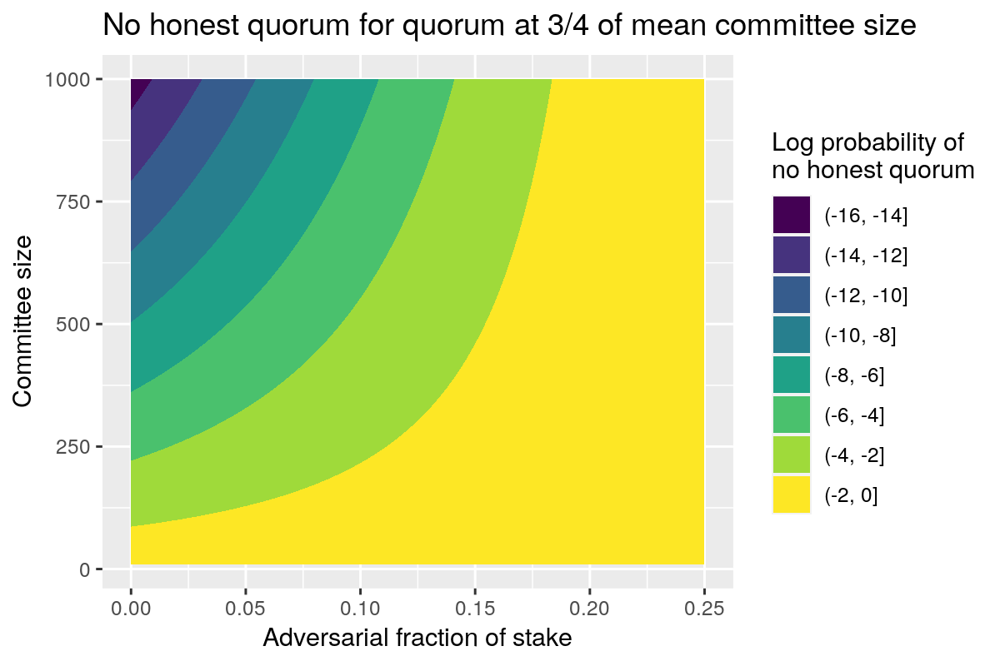
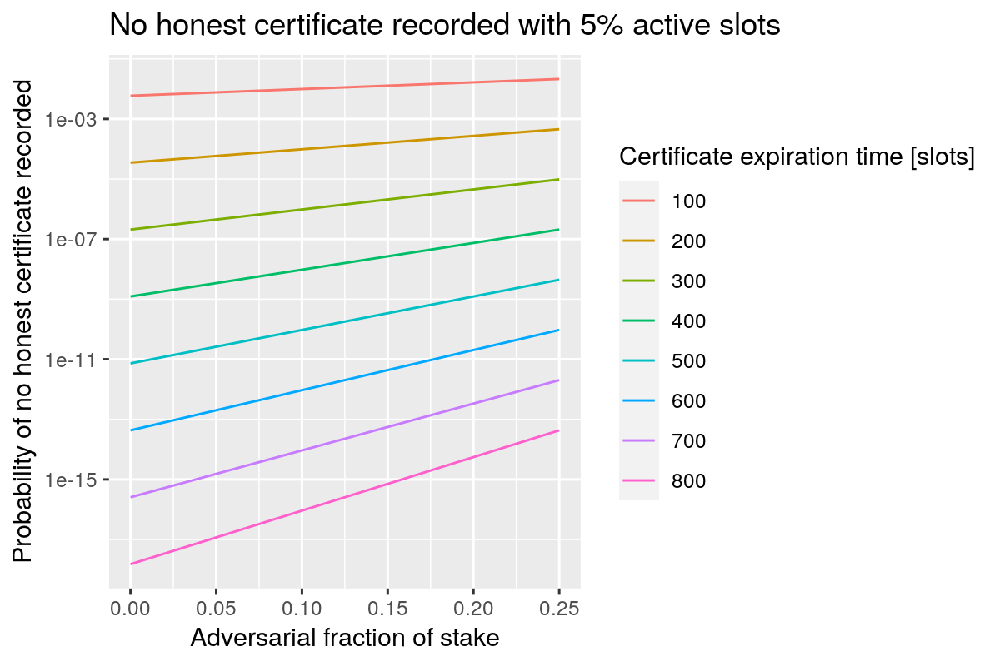

# Probabilistic Analyses - Part I

This document derives analytic expressions for several adversarial Peras scenarios and plots the results.

## Notation

Let $\tau$ be the voting-quorum size and let $U$ be the length (in slots) of a voting round.

Let $\beta$ be the probability of the holder of one lovelace of stake being selected for voting-committee membership. Because this process is binomially distributed, the mean committee size will be $C = T \beta$, where $T$ is the total stake in the blockchain.

Let $H$ be the honest stake and let $f = \frac{T - H}{T}$ be the fraction of adversarial stake

Let $A$ be the certificate-experation time, measured in slots.

Let $\alpha$ be the active-slot coefficient.

## No honest quorum in round

Consider the situation where the adversary decides not to vote in a round, in order to prevent a quorum from occurring and forcing the chain into a cool-down period. This occurs when the number of honest voters is less than the quorum size.

$$
p_\text{nhq} = P \left( \text{honest votes} < \tau \right) \\
 = \sum_{k=0}^{\lfloor\tau\rfloor} {H\choose{k}} \beta^k (1 - \beta)^{H-k} \\
 \approx N_\text{CDF} \left( \frac{\tau - H \beta}{\sqrt{H \beta (1 - \beta)}} \right)
$$

where $N_\text{CDF}(x)$ is the unit normal cumulative probability distribution function, since the honest stake $H$ is large.

For illustration, set the recommended quorum to three-quarters of the committee size, $\tau = \frac{3}{4}C$. Hence, for committee sizes much smaller than the total stake,

$$
p_\text{nhq} \approx N_\text{CDF} \left( \left( f - \frac{1}{4} \right) \sqrt{\frac{C}{1 - f}} \right)
$$

If we're actually only interested in small probabilities, we can even use an asympototic expansion (Mill's ratio) to simplify the result for large committees:

$$
p_\text{nhq} \approx \frac{4}{1 - 4 f} \sqrt{\frac{1 - f}{2 \pi C}} e^{-\frac{C}{2 (1 - f)}}
$$

|   |   |
|---|---|
|  |  |

## Fraction of time in cool-down period

Consider the situation where adversarial conditions repeated force a cool-down period. Let $p_c$ be the probability of entering a cool-down period in any given round and let $c$ be the average duration of the period, in rounds.

$$
F_c = \left(1 + (p_c K)^{-1} \right)^{-1} \\
 \approx p_c K
$$

## No certificate in honest block

Consider the situation where the voting certificate must be included on the chain (perhaps because it has entered cool-down period). The probability that adversaries forge every block during the period when the certificate hasn't expired is

$$
p_\text{nc} = P \left( \text{no honest blocks for $A$ slots} \right) \\
 = \left( (1 - \alpha)^{H / T} \right)^A \\
 = (1 - \alpha)^{(1 - f) A}
$$

|   |   |
|---|---|
|  |  |

## Forge an adversarial block and adversarial quorum for it

We combine the probability for producing an adversarial block, $p_\text{ab}$, and the probability for producing an adversarial quorum, $p_\text{aq}$, to yield the probability of adversarial voting for an adversarial quorum, $p_\text{abq}$.

$$
p_\text{ab} = 1 - (1 - \alpha)^f \\
p_\text{aq} = \sum_{k=\lceil \tau \rceil}^{T-H} {{T - H} \choose{k}} \beta^k (1 - \beta)^{T-H-k} \\
p_\text{abq} = p_\text{ab} p_\text{aq} \\
 \approx \left( 1 - (1 - \alpha)^f \right) \left( 1 - N_\text{CDF} \left( \frac{\tau - (T - H) \beta}{\sqrt{(T - H) \beta (1 - \beta)}} \right) \right) \\
 \approx \left( 1 - (1 - \alpha)^f \right) N_\text{CDF} \left( - \left( \frac{3}{4} - f \right) \sqrt{\frac{C}{f}} \right)
$$

, where we require a quorum size $\tau = \frac{3}{4} C$.

