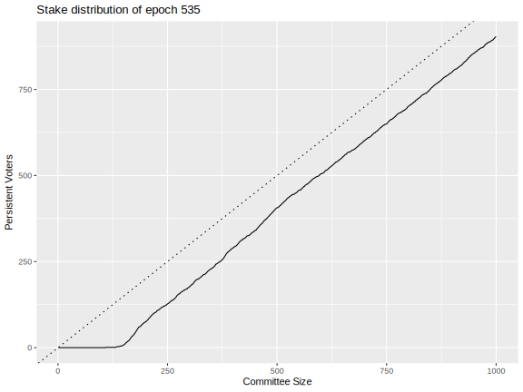
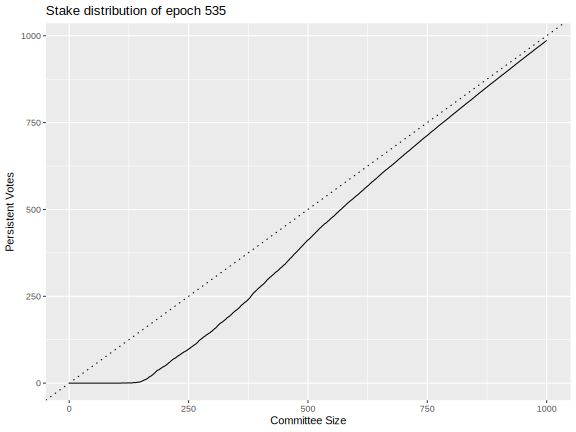
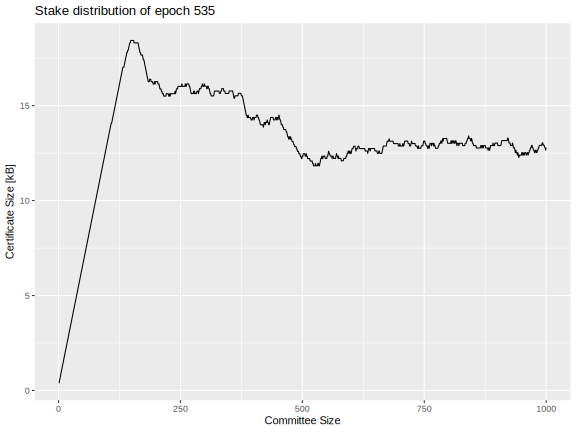

# Peras certificates revisited: January 2025

## Overview of options

The January 27 IOG R&D Seminar entitled "ALBA" summarizes recent developments for the ALBA algorithm and indicates that new variants of ALBA may be suitable for compactly storing Peras certificates, perhaps even using existing Praos VRF and KES keys. Similarly, progress has also been made on certificate compression via SNARKs.

This write-up documents that BLS certificates based on the Fiat Accompli sortition scheme comprise a viable option, with certificates being smaller that 15 kB. The downside of BLS approaches like this is that new keys must be registered and occasionally rotated.

However, if any of the ALBA- and/or SNARK-based voting and certificate schemes meet the following conditions, they would be superior to the BLS-based scheme outlined later in this document.

1. No new keys need be registered. (E.g., the existing VRF and KES keys can be used for voting.)
2. The certificate size is well under the 90,112 byte maximum size of a Praos block.
3. Proof and verification times fit within the `cardano-node` CPU budget.

Ideally, of course, the same voting and certificate infrastructure would be used for Mithril, Peras, Leios, and partner chains.

## Committee and quorum size

Previous analysis indicates that the Peras committee size should be no smaller than 900 votes and the quorum should be at least 75% of those votes. Note that the certificate need only record a quorum of votes and, for minimization of certificate size, need not include any votes in excess of the quorum.

## BLS certificates

Leios is currently entertaining the following certificate scheme, and it could be considered for adoption by Peras, too.

1. Stake pools register BLS keys for using in voting and prove possession of those keys.
2. Nodes verify the proof of possession of the keys they receive.
3. Those keys are replaced periodically, perhaps every KES period (currently 36 hours) or every operational certificate (currently 90 days).
4. For each epoch, the [Fiat Accompli](https://iohk.io/en/research/library/papers/fait-accompli-committee-selection-improving-the-size-security-tradeoff-of-stake-based-committees/) scheme wFAF is applied to the stake distribution in order to determine the *persistent voters* for the epoch.
    1. Persistent voters should vote in every election during the epoch.
    2. A different supplement of *non-persistent voters* are selected at random for each election during the epoch.
5. The certificate records the set of voters, proof of their eligibility, and the quorum achieved.

### Key registration

The key registration records the public key and proof of its possession.

1. The Pool ID (or similar unique identifier) identifies the pool holding the key and comprises 32 bytes.
2. The public key $mvk$ belongs to $\mathbb{G}_2$ , so it occupies 192 bytes if BLS12-381 is used.
3. The proof of possession for the secret key is the pair $\left(H_{\mathbb{G}_1}(\text{``PoP''}||mvk)^{sk}, g_1^{sk}\right)$, where $sk$ is the secret key and $H$ hashes to points in $\mathbb{G}_1$. This pair will occupy 192 bytes.
4. The KES signature for the above will add another 448 bytes.

Altogether, a key registration occupies $32 + 192 + 192 + 448 = 864$ bytes.

Sadly, this registration needs to be recorded on chain so that certificates can be later verified independently. However, cryptographic compression may reduce the overall size of the registration data.

### Sortition

Figure 7 of the [Fiat Accompli paper](https://iohk.io/en/research/library/papers/fait-accompli-committee-selection-improving-the-size-security-tradeoff-of-stake-based-committees/) provides the algorithm for determining which pools are persistent voters. The inequality for this determination can be computed exactly using rational arithmetic, so there is no danger of round-off errors. The input to the formula is the size of the committee and the distribution of stake among the pools.

The non-persistent pools are subject to sortition for each vote, based on an updated stake distribution where the persistent voters have been removed and where the distribution is normalized to unit probability. The VRF value for that sortition is the bytes of the BLS signature on the election identifier $eid$. The probability that a pool with fraction $\sigma$ of the stake is awarded $k$ votes of the committee of $n$ votes is 

$$
\mathcal{P}(k) := \frac{(n \cdot \sigma)^k \cdot e^{- n \cdot \sigma}}{k!}
$$

This VRF value is used to look up the correct number of votes from the cumulative distribution for $\mathcal{P}(k)$. The same Taylor-series expansion technique used in Praos can handle the irrational arithmetic in a deterministic manner. In practice it is unlikely that the non-persistent pools would ever be awarded more than one vote, so it may be feasible to simply award one vote whenever $k \ge 1$: in such case the Peras voting sortition could use code very similar to the existing Praos block sortition.

Each vote has a weight, with weights summing to unity. A quorum is achieved if the weights total to 0.75 or more.

### Certification

Consider the committee size $n$, which contains $m$ persistent voters.

The certificate must contain the following information:

- Common to all votes
    - Election ID: Presumably a 32-byte identifier for the Peras election is included in the certificate, though perhaps this is not strictly necessary. This could just be the slot number.
    - Message: the 32-byte hash of the Praos block being boosted is also included in the certificate.
- Identity of voters
    - Persistent voters are encoded in a bitset of size $m$, occupying $\left\lceil m / 8 \right\rceil$ bytes.
    - Non-persistent voters are encoded by their Pool ID (or equivalent), occupying 32 bytes each and hence $32 \cdot (n - m)$ bytes total. (Alternatively, all possible non-persistent voters could be assigned bits in the bitset.)
- Eligibility proof
    - Persistent voters are eligible by definition (by virtue of their stake in the epoch), so no proof is needed.
    - Non-persistent voters prove eligibility with a 96-byte BLS signature on the message, occupying $96 \cdot (n - m)$ bytes total.
- Aggregate signatures
    - Signed message: This aggregate BLS signature on the message is 96 bytes.
    - Signed election proofs: Perhaps not strictly necessary, but another 96 byte BLS signature can attest to the proof of the eligibility, see **BLS.BSig** in [the Leios paper](https://iohk.io/en/research/library/papers/high-throughput-blockchain-consensus-under-realistic-network-assumptions/).
    
Thus the total certificate size is

$$
\text{certificate bytes} = 256 + \left\lceil \frac{m}{8} \right\rceil + 128 \cdot (n - m)
$$

but not including any minor overhead arising from CBOR serialization. As noted previously, only a quorum of votes actually needs to be recorded.

### Benchmarks in Rust

- Sortition
    - Persistent voters: not benchmarked because it would be reasonably fast and only computed once per epoch
    - Non-persistent voters: 4.1 µs
- Vote
    - Verify the proof of key possession: 1.5 ms/key
    - Generate vote: 280 µs/vote
    - Verify vote: 1.4 ms/vote
- Certificate
    - Generate certificate for a 750-vote quorum: 125 ms/cert
    - Verify certificate for a 750-vote quorum: 225 ms/cert

### Realistic stake distribution

The following plots show number of persistent votes and votes, along with certificate size, for the `mainnet` stake distribution of Epoch 535. The dashed line in the first two plots has slope one, so the gap between it and the solid line indicates the number of non-persistent voters or votes. The certificate-size plot does not take into account a potential reduction in certificate size from omitting votes in excess of a quorum.

| Voters                                            | Votes                                           | Certificate size                                          |
| ------------------------------------------------- | ----------------------------------------------- | --------------------------------------------------------- |
|  |  |  |
