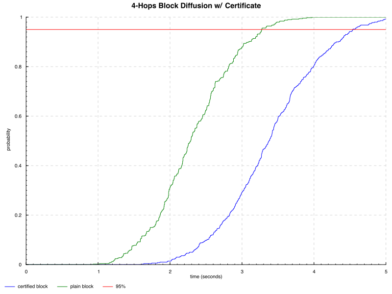

The goal of this document is to provide a detailed analysis of the Peras protocol from an engineering point of view, based upon the work done by the _Innovation team_ since January 2024.

# Previous work

## Peras Workshop

### Questions about Peras

* How do you detect double voting? Is double voting possible? How can the voting state be bounded?
* How are the voting committee members selected? What are the properties of the voting committee?
* Where should votes be included: block body, block header, or some other aggregate
* Under what circumstance can a cool down be entered?
* How significant is the risk of suppressing votes to trigger a cooldown period?
* Should vote contributions be incentivized?
* How much weight is added per round of voting?
* How to expose the weight/settlement of a block to a consumer of chain data, such as a wallet?
* Can included votes be aggregated into an artifact to prove the existence of votes & the weight they provide?

### Potential jugular experiments for Peras

* Network traffic simulation of vote messages
* Protocol formalization & performance simulations of Peras
* Optimal look-back parameter (measured in number of slots) within a round
  * Historic analytical study (n-sigma for reliability based on the number of 9s desired)
* Chain growth simulations for the accumulation of vote data
* Added chain catch-up time
* Cost of defusing votes and blocks that contain votes
* Need to refine: Voting committee selection via sampling needs to define how to analyze the needed properties of the committee.
* Later SRL: framing for vote packing to improve diffusion.

### SRL

| Questions to resolve                                                                                                 | Status                                          |
|----------------------------------------------------------------------------------------------------------------------|-------------------------------------------------|
| A concept formulated?                                                                                                | Done                                            |
| Basic scientific principles underpinning the concept identified?                                                     | Done                                            |
| Basic properties of algorithms, representations & concepts defined?                                                  | Done                                            |
| Preliminary analytical studies confirm the basic concept?                                                            |                                                 |
| Application identified?                                                                                              | Done                                            |
| Preliminary design solution identified?                                                                              | Done, provided by research                      |
| Preliminary system studies show the application to be feasible?                                                      |                                                 |
| Preliminary performance predictions made?                                                                            | Done                                            |
| Basic principles coded?                                                                                              |                                                 |
| Modeling & Simulation used to refine performance predictions further and confirm benefits?                           |                                                 |
| Benefits formulated?                                                                                                 |                                                 |
| Research & development approach formulated?                                                                          | Done                                            |
| Preliminary definition of Laboratory tests and test environments established?                                        | Preliminary definition of Laboratory tests only |
| Experiments performed with synthetic data?                                                                           |                                                 |
| Concept/application feasibility & benefits reported in scientific journals/conference proceedings/technical reports? |                                                 |

# Protocol Specification

## Overview

This diagram attempts at depicting graphically how the Peras protocol works over a period of time. A high-fidelity version is [available](../diagrams/peras-with-certs.pdf).


## Pseudo-code

* Researchers' pseudo-code is detailed in [this document](https://docs.google.com/document/d/1w_jHsojcBxZHgGrr63ZGa4nhkgEpkL6a2cFYiq8Vf8c/edit)

## Agda Specification

* Present the detailed specificaiton of the protocol in Agda
* Protocol properties
* link with q-d properties

## Pending questions

### Certificates

The exact construction of Peras certificates is still unknown but we already know the feature set it should provide:

* A Peras certificate must be reasonably "small" in order to fit within the limits of a single block without leading to increased transmission delay.
  * The current block size on `mainnet` is 90kB, with each transaction limited to 16kB
  * In order to not clutter the chain and take up too much block estate, a certificate should fit in a _single transaction_
* Certificate need to be produced _locally_ by a single node from the aggregation of multiple votes reaching a quorum
  * Certificate forging should be reasonably fast but is not on the critical of block diffusion: A round spans multiple possible blocks so there's more time to produce and broadcast it
* Certificate must be reasonably fast to verify as it's on the critical path of chain selection: When a node receives a new block and/or a new certificate, it needs to decide whether or not this changes its best chain according to the weight
* The [ALBA](https://iohk.io/en/research/library/papers/approximate-lower-bound-arguments/) paper provides a decentralised certificate construction through a mechanism called a _Telescope_ which at a high-level consists in a (pseudo-)random selection of a sequence of votes

# Network Performance Analysis

## Certificates in Block Header

This section provides high-level analysis of the impact of Peras protocol on the existing Cardano network, using [ΔQSD methodology](https://iohk.io/en/research/library/papers/mind-your-outcomes-the-dqsd-paradigm-for-quality-centric-systems-development-and-its-application-to-a-blockchain-case-study/). In order to provide a baseline to compare with, we first applied ΔQ to the existing Praos protocol reconstructing the results that lead to the current set of paremeters defining the performance characteristics of Cardano, following section 4 of the aforementioned paper. We then used the same modelling technique taking into account the Peras protocol **assuming inclusion of certificates in headers** insofar as they impact the core _outcome_ of the Cardano network, namely _block diffusion time_.

Note that one of the sub-goals for Peras project is to collaborate with PNSol, the original inventor of ΔQ methodology, to improve the usability of the whole method and promote it as a standard tool for designing distributed systems.

### Baseline - Praos ΔQ Modelling

#### Model overview

Here is a graphical representation of the _outcome diagram_ for the ΔQ model of Cardano network under Praos protocol:


This model is based on the following assumptions:
* Full block diffusion is separated in a number of steps: request and reply of the block header, then request and reply of the block body,
* Propagating a block across the network might require several "hops" as there's not a direct connection between every pair of nodes, with the distribution of paths length depending on the network topology,
* We have not considered probability of loss in the current model.

The block and body sizes are assumed to be:
* Block header size is smaller than typical MTU of IP network (eg. 1500 bytes) and therefore requires a single roundtrip of TCP messages for propagation,
* Block body size is about 64kB which implies propagation requires several TCP packets sending and therefore takes more time.

> [!NOTE]
> As the Cardano network uses TCP/IP for its transport, we should base the header size on the [Maximum Segment Size](https://en.wikipedia.org/wiki/Maximum_segment_size), not the MTU.
> This size is 536 for IPv4 and 1220 for IPv6.

Average latency numbers are drawn from table 1 in the paper and depend on the (physical) distance between 2 connected nodes:

| Distance | 1 segment RTT (ms) | 64 kB RTT (ms) |
|----------|-------------------|----------------|
| Short    | 12                | 24             |
| Medium   | 69                | 143            |
| Long     | 268               | 531            |

For each step in the diffusion of block, we assume an equal ($\frac{1}{3}$) chance for each class of distance.

> [!NOTE]
> The actual block body size at the time of this writing is 90kB, but for want of an actual delay value for this size, we chose the nearest increment available.
> We need to actually measure the real value for this block size and other significant increments.

We have chosen to define two models of ΔQ diffusion, one based on an average node degree of 10, and another one on 15. Table 2 gives us the following distribution of paths length:

| Length | Degree = 10 | Degree = 15 |
|--------|-------------|-------------|
| 1      | 0.40%       | 0.60%       |
| 2      | 3.91%       | 8.58%       |
| 3      | 31.06%      | 65.86%      |
| 4      | 61.85%      | 24.95%      |
| 5      | 2.78%       | 0           |

These numbers are reflected (somewhat inaccurately) in the above graph, representing the probabilities for the number of hops a block will have to go through before reaching another node.

::: [!NOTE]

The current target valency for cardano-node's connection is 20, and while there's a large number of stake pools in operation, there's some significant concentration of stakes which means the actual number of "core" nodes to consider would be smaller and the distribution of paths length closer to 1.

:::


#### Modeling process

We have experimented with three different libraries for encoding this baseline model:
1. Original [ΔQ library](https://github.com/DeltaQ-SD/pnsol-deltaq-clone) built by Neil Davies, which uses randomized sampling to graph the _Cumulative Distribution Function_ resulting from the ΔQ model,
2. A library for [algebraic representation](https://github.com/DeltaQ-SD/Artjoms) of ΔQ models built to support the [Algebraic Reasoning with Timeliness](https://arxiv.org/pdf/2308.10654v1.pdf) paper, which uses discretization of proability density functions to approximate CFDs resulting from the various ΔQ language combinators,
3. Another recent library built by Peter Thompson to represent ΔQ probability distributions using [piecewise polynomials](https://github.com/DeltaQ-SD/dqsd-piecewise-poly), which should provide high-fidelity CDFs.

Library 2 was used to express the _outcome diagram_ depicted above using so-called _O language_, but while we were able to encode the model itself, the resulting computation of _CDFs_ for composite expressions resulting from _convolution_ of atomic expressions turned out to be unusable, yielding CDFs with accumulated probability lower than 1 even though we did not model any loss. Library 3, although the most promising to provide accurate models, turned out to be unsatisfactory as we were not able to produce proper numerical representations of a CDF for more complex expressions.

Using code from library 1, we were able to write the following ΔQ expressions to represent our Cardano model:

```haskell
oneMTU =
    fromQTA @SimpleUniform
        [(0, 0), (1 % 3, 0.012), (2 % 3, 0.069), (3 % 3, 0.268)]
blockBody64K =
    fromQTA @SimpleUniform
        [(0, 0), (1 % 3, 0.024), (2 % 3, 0.143), (3 % 3, 0.531)]
headerRequestReply = oneMTU ⊕ oneMTU -- request/reply
bodyRequestReply = oneMTU ⊕ blockBody64K -- request/reply
oneBlockDiffusion = headerRequestReply ⊕ bodyRequestReply

combine [(p, dq), (_, dq')] = (⇋) (toRational $ p / 100) dq dq'
combine ((p, dq) : rest) = (⇋) (toRational $ p / 100) dq (combine rest)

multihops = (`multiHop` oneBlockDiffusion) <$> [1 ..]

pathLengthsDistributionDegree15 =
    [0.60, 8.58, 65.86, 24.95]
hopsProba15 = zip (scanl1 (+) pathLengthsDistributionDegree15 <> [0]) multihops
deltaq15 = combine hopsProba15
```

Then using `empiricalCDF` computation with 5000 different samples yield the following graph:


To calibrate our model, we have computed an empirical distribution of block adoption time[^2] observed on the mainnet over the course of 4 weeks (from 22nd February 2024 to 18th March 2024), as provided by https://api.clio.one/blocklog/timeline/. The raw data is provided as a file with 12 millions entries similar to:

```
9963861,117000029,57.128.141.149,192.168.1.1,570,0,60,30
9963861,117000029,57.128.141.149,192.168.1.1,540,0,60,40
9963861,117000029,158.101.97.195,150.136.84.82,320,0,10,50
9963861,117000029,185.185.82.168,158.220.80.17,610,0,50,50
9963861,117000029,74.122.122.114,10.10.100.12,450,0,10,50
9963861,117000029,69.156.16.141,69.156.16.141,420,0,10,50
9963861,117000029,165.227.139.87,10.114.0.2,620,10,0,70
9963861,117000029,192.99.4.52,144.217.78.44,460,0,10,100
9963861,117000029,49.12.89.235,135.125.188.228,550,0,20,50
9963861,117000029,168.119.9.11,3.217.90.52,450,150,10,50
...
```

Each entry provides:

* Block height,
* Slot number,
* Emitter and receiver's IP addresses,
* Time (in ms) to header announcement,
* then additional time to fetch header,
* time to download block,
* and finally time to adopt block on the receiver.

Therefore the total time for block diffusion is the sum of the last 4 columns.

This data is gathered through a network of over 100 collaborating nodes that agreed to report various statistics to a central aggregator, so it's not exhausitve and could be biased.
The following graph compares this observed CDF to various CDFs for different distances (in the graph sense, eg. number of hops one need to go through from an emitting node to a recipient node) between nodes.


While this would require some more rigorous analysis to be asserted in a sound way, it seems there is a good correlation between empirical distribution and 1-hop distribution, which is comforting as it validates the relevance of the model.

### Peras ΔQ Model - Blocks

Things to take into account for modelling peras:

* Impact of the size of the certificate: If adding the certificate increases the size of the header beyond the MSS (or MTU?), this will impact header diffusion
  * We might need to just add a hash to the header (32 bytes) and then have the node request the certificate, which also increases (full) header diffusion time
* Impact of validating the certificate: If it's not cheap (eg. a few ms like a signature verification), this could also lead to an increase in block adoption time as a node receiving a header will have to add more time to validate it before sharing it with its peers
* There might not be a certificate for each header, depending on the length of the rounds. Given round length R in slots and average block production length S, then frequency of headers with certificate is S/R
  * Model must take into account different path for retrieving a header, one with a certificate and one without
* Diffusion of votes and certificates does not seem to have other impact on diffusion of blocks, eg. just because we have more messages to handle and therefore we consume more bandwidth between nodes could lead to delays for block propagation, but it seems there's enough bandwidth (in steady state, perhaps not when syncing) to diffuse both votes, certificates, transactions, and blocks without one impacting the other

The following diagram compares the ΔQ distribution of block diffusion (for 4 hops) under different assumptions:

1. Standard block without a certificate,
3. Block header point to a certificate.

Certificate validation is assumed to be a constant 50ms.



Obviously, adding a roundtrip network exchange to retrieve the certificate for a given header degrades the "timeliness" of block diffusion.
For the case of 2500 nodes with average degree 15, we get the following distributions, comparing blocks with and without certificates:


::: [!NOTE]

Depending on the value of $T$, the round length, not all block headers will have a certificate and the ratio could actually be quite small, eg. if $T=60$ then we would expect 1/3rd of the headers to have a certificate on average. While we tried to factor that ratio in the model, that's misleading because of the second order effect an additional certificate fetching could have on the whole system: More delay in the block diffusion process increases the likelihood of forks which have an adversarial impact on the whole system, and averaging this impact hides it.

:::

::: [!NOTE]

In practice, cardano-node use _pipelining_ to avoid having to confirm individually every block/header, eg. when sending multiple blocks to a peer a node won't wait for its peer's request and will keep sending headers as long as not instructed to do otherwise.

:::

### Conclusion

This analysis demonstrates that Peras certificates cannot be on the critical path of block headers diffusion lest we run the risk of increased delays in block diffusion and number of forks. Certificates either have to be small enough to not require an additional round-trip to transmit on top of the block header, or be part of the block body. Note that in the latter case the certificates should also be relatively small as there's limited space available in blocks.

## Impact on User Experience

### Model

We would like to model the outcomes of Peras in terms of _user experience_, eg. how does Peras impacts the user experience?
From the point of view of the users, the thing that matters is the _settlement time_ of their transactions: How long does it take for a transaction submitted to be _settled_, eg. to have enough (how much?) guarantee that the transaction is definitely part of the chain?

From this point of view, the whole path from transaction submission to observing a (deep enough) block matters which means we need to take into account in our modelling the propagation of the transaction through the mempools of various nodes in the network until it reached a block producer. This also means we need to take into account the potential _delays_ incurred in that journey that can occur because of _mempool congestion_ in the system: When the mempool of a node is full, it won't pull more transactions from the peers that are connected to it.

The following diagram illustrates the "happy path" of a transaction until the block it's part of gets adopted by the emitting node, in Praos.


## Impact of Load congestion

* load congestion

# Simulations

## Haskell-based simulation

The initial phase of the first Peras PI's work on simulation revolves around discovery. This involves several key tasks, including prototyping and evaluating different simulation architectures, investigating simulation-based analysis workflows, assessing existing network simulation tools, establishing interface and serialization formats, eliciting requirements for both simulation and analysis purposes, and gaining a deeper understanding of Peras behaviors. The first prototype simulation, developed in Haskell, is closely intertwined with the Agda specification. This integration extends to the generation of types directly from Agda. Subsequent work will migrate a significant portion of the Peras implementation from Haskell to functions within the Agda specification, which will necessitate reconceptualizing and refining various components of the simulation.

The Peras simulation employs language-agnostic components that collaborate seamlessly (see figure below). This includes node implementations in Haskell, with Rust implementations forthcoming. Additionally, the native-Haskell simulation utilizes the IOSim packages in a manner consistent with QuickCheck tests in `peras-quickcheck`, which also supports a Foreign Function Interface (FFI) connection to Netsim and `peras-rust`. The simulation setup also encompasses statistically designed experiments, the ability to inject rare events or adversarial behaviors, tools for generating networks and scenarios, as well as analysis and visualization tools to interpret the simulation results. A significant aspect of the workflow is geared towards analysis. This involves an observability approach to gathering metrics, utilization of language-independent file formats, visualization of network structures, and statistical analyses primarily conducted using R.


The IOSim-based Haskell simulator for Peras currently provides a provisional implementation of the Peras protocol's intricacies, including committee selection, voting rounds, and cool-down periods. Presently, the fidelity of the simulation to the Peras protocol is moderate, while the fidelity at the network layer remains low. Substantial refactoring and refinement efforts are deemed necessary moving forward to enhance the simulation's accuracy and effectiveness.

The simulation implements the February version of the Peras protocol, illustrated in the UML (unified modeling language) sequence diagrams below for node behavior and the activity diagram for node state transitions. Nodes receive messages for entering a new slot or new voting round; they also receive new preferred chains or votes from their upstream peers via messages. When the vote, forge blocks, or adopt a new preferred chain, they notify their downstream peers via messages. Note that the detailed behavior of the February protocol differs somewhat from later version such as the March protocol.


### Design


### Experiments

The simulation experiments below use slightly different versions of the ever-evolving Haskell package `peras-iosim`, which relies on the types generated by `agda2hs`, but with the now slightly outdated February version of the Peras protocol. Visualization was performed with the GraphViz tool, and statistical and data analysis was done with R.

#### Block production

The "block production" experiment laid the groundwork for testing simulated block-production rates using QuickCheck properties. Because the VRF determines which slots a node leads and forges a block, the production is sporadic and pseudo-random. Heretofore, the Peras simulation has used a simple probabilistic approximation to this process: a uniformly distributed random variable is selected and the node produces a block in the slot if that variable is less than the probability $p = 1 - (1 - \alpha) ^ (s_\text{node} / s_\text{total})$, where $\alpha$ is the active slot coefficient and $s_\text{node}$ and $s_\text{total}$ are the stake held by the node and the whole network, respectively.

The experiment involved running 1000 simulations of two hours of block production for a node with $\alpha = 0.05$. The stake held by the node was randomly chosen in each of the simulations. The plot below shows the number of blocks produced as a function of the node's stake. The probability contours in the plot indicate the theoretical relationship. For example, the 99.9% quantile (indicated by 0.999 in the legend) is expected to have only 1/1000 of the observations below it; similarly, 90% of the observations should lie between the 5% and 95% contours. The distribution of number of blocks produced in the experiment appears to obey the theoretical expectations.


Although the above plot indicates qualitative agreement, it is somewhat difficult to quantify the level of agreement because stake was varied in the different simulations. The following histogram shows another view of the same data, where the effect of different stake is removed by applying the binomial cumulative probability distribution function (CDF) for $\alpha = 0.05$ to the data. Theoretically, this transformed distribution should be uniform between zero and one. Once again, the data appears to match expectation.


A Kolmogorov-Smirnov (KS) test quantifies the conformance of the results to such a uniform distribution:
```R
ks.test(results$`Quantile`, "punif", min=0, max=1)
```

```console
D = 0.023265, p-value = 0.6587
alternative hypothesis: two-sided
```

The p-value of 66% solidly indicates that the block production count matches our expectation and the theoretical model.

Because it is slightly inconvenient to embed a KS computation within a QuickCheck property, one can instead use an approximation based on the law of large numbers. The mean number of blocks produced in this binomial process should be the number of slots times the probability of producing a block in a slot, $n p$,  and the variance should be $n p (1-p)$. The `peras-quickcheck` module contains the following function in `Data.Statistics.Util`:

```haskell
-- | Check whether a value falls within the central portion of a binomial distribution.
equalsBinomialWithinTails ::
  -- | The sample size.
  Int ->
  -- | The binomial propability.
  Double ->
  -- | The number of sigmas that define the central acceptance portion.
  Double ->
  -- | The actual observation.
  Int ->
  -- | Whether the observation falls within the central region.
  Bool
```

The Peras continuous-integration tests are configured to require that the observed number of blocks matches the theoretical value to within three standard deviations. Practically, this means that a random failure will occur about once in every ten or so invocations of the CI, since each invocation executes 100 tests.

#### Network and Praos chain generation

The simulation experiments generate a reasonable but random topology of peers, with a specified number of upstream and downstream nodes from each node. Slot leadership is determined according to the procedure outlined in the previous section above. Both the `peras-iosim` Haskell package and the `peras_topology` Rust package can generate these randomized topologies and store them in YAML files. The `peras-iosim` package generates valid Praos chains.

| Example chain                                             | Example topology                                               |
| --------------------------------------------------------- | -------------------------------------------------------------- |
|  |  |

#### February version of Peras

A reasonable set of [protocol parameters](peras-iosim/analyses/parameters-v1/protocol.yaml) and [network configuration](peras-iosim/analyses/parameters-v1/network.yaml) was set for a 100-node network with a mean committee size of 10.

Committee selection in the following simulation was set by limiting each node to a maximum of one vote. (However, the March version of the protocol clarifies that a node may have more the one vote.) The probability of becoming a member of the voting committee in a given round is

$$
P = 1 - (1 - p_\text{lottery})^s
$$
given
$$
p_\text{lottery} = (1 - 1 / c)^{(c / t)}
$$
where $s$ is the node's stake, $t$ is the total stake in the system, and $c$ is the mean committee size.

The following figure compares similar Praos and Peras chains, highlighting how the latter's voting boost affects the choice of preferred chain. The simulation involved 100 nodes and a mean committee size of 10 nodes; the active slot coefficient was set to 0.25 in order to provoke more frequent forking that would normally be observed. The voting boost is a modest 10% per vote.


The difference is fork adoption results from more Peras votes being received by the lower chain than by the upper one, as illustrated below.


Statistics for rollbacks, such as the ones shown below, are measured in these simulations to quantify the number of slots or blocks that are reverted: such can be used to compute the likelihood of a transaction appearing in a block that is later rolled back. The diagram below show shows a proof-of-principle measurement of rollback lengths in an ensemble of simulations. The horizontal axis shows the number of slots rolled back during the course of the whole simulation, and the vertical axis shows the corresponding number of blocks rolled back: the marginal histograms show the empirically observed frequency of each. Although the voting boost weight is varied among these simulations, it has almost no effect on the rollback statistics.


Findings from the simulation runs highlight the impracticality of blindly running simulations with realistic parameters and then mining the data:

- The simulation results are strongly dependent upon the speed of diffusion of messages through the network, so a moderately high fidelity model for that is required.
- Both Peras and Praos are so stable that one would need very long simulations to observe naturally occurring forks of more than one or two blocks.
	- Only in cases of very sparse connectivity or slow message diffusion are longer forks seen.
	- Peras quickly stabilizes the chain at the first block or two in each round, so even longer forks typically never last beyond then.
- Hence, even for honest nodes, one needs a mechanism to inject rare events such as multi-block forks, so that the effect of Peras can be studied efficiently.

#### "Split brain"

This first "split-brain" experiment with `peras-iosim` involved running a network of 100 nodes with fivefold connectivity for 15 minutes, but where nodes are partitioned into two non-communicating sets between the 5th and 10th minute. The nodes quickly establish consensus after genesis, but split into two long-lived forks after the 5th minute; shortly after the 10th minute, one of the forks is abandoned as consensus is reestablished.

Nodes were divided into two "parities" determined by whether the hash of their name is an even or odd number. When the network is partitioned, only nodes of the same parity are allowed to communicate with each other: the Haskell module `Peras.IOSIM.Experiment.splitBrain` implements the experiment and is readily extensible for defining additional experiments.

Both the Praos and Peras protocols were simulated, with the following Peras parameters for creating a scenario that exhibits occasional cool-down periods and a strong influence of the voting boost. 

```yaml

activeSlotCoefficient: 0.10
roundDuration: 50
pCommitteeLottery: 0.00021
votingBoost: 0.25
votingWindow: [150, 1]
votingQuorum: 7
voteMaximumAge: 100
cooldownDuration: 4
prefixCutoffWeight:  10000000
```

The control ("normal") case is a network that does not experience partitioning:

```yaml
randomSeed: 13234
peerCount: 100
downstreamCount: 5
maximumStake: 1000
messageDelay: 350000
endSlot: 1500
experiment:
  tag: NoExperiment
```

The treatment ("split") case experiences partitioning between the 5th and 10th minutes:

```yaml
randomSeed: 13234
peerCount: 100
downstreamCount: 5
maximumStake: 1000
messageDelay: 350000
endSlot: 1500
experiment:
  tag: SplitBrain
  experimentStart: 500
  experimentFinish: 1000
```

In the Peras simulation, the chain that eventually became dominant forged fewer blocks during the partition period, but it was lucky to include sufficient votes for a quorum at slot 503 and that kept the chain out of the cool-down period long enough to put more votes on the chain, which increased the chain weight. It appears that that was sufficient for the chain to eventually dominate. Note that multiple small forks occurred between the time that network connectivity was restored and consensus was reestablished.


The primary measurements related to the loss and reestablishment of consensus relate to the length of the forks, measured in blocks or slots. In the table shows the statistics of these forks, of which the Peras case had several.

| Protocol | Metric                                              | Blocks | Slots |
|----------|-----------------------------------------------------|-------:|------:|
| Praos    | Length of discarded chain at slot 1000              |     68 |  1000 |
|          | Length of dominant chain at slot 1000               |     73 |  1000 |
|          | Number of blocks in discarded chain after slot 1000 |      2 |       |
| Peras    | Length of discarded chain at slot 1000              |     75 |  1000 |
|          | Length of dominant chain at slot 1000               |     66 |  1000 |
|          | Number of blocks in discarded chain after slot 1000 |      3 |   137 |
|          |                                                     |      1 |   118 |
|          |                                                     |      1 |   137 |
|          |                                                     |      1 |   141 |
|          |                                                     |      1 |    55 |
|          |                                                     |      1 |    24 |
|          |                                                     |      1 |    18 |
|          | Number of blocks afters slot 1000 to reach quorum   |     18 |   304 |

The primary findings from this experiment follow.

- The complexity of the forking, voting, and cool-down in the Peras results highlights the need for capable visualization and analysis tools.
- The voting boost can impede the reestablishment of consensus after a network partition is restored.
- It would be convenient to be able to start a simulation from an existing chain, instead of from genesis.
- VRF-based randomization make it easier to compare simulations with different parameters. 
- Even though `peras-iosim` runs are not particularly fast, one probably does not need to parallelize them because typical experiments involve many executions of simulations, which means we can take advantage of CPU resources simply by running those different scenarios in parallel.
- The memory footprint of `peras-iosim` is small (less than 100 MB) if tracing is turned off; with tracing, it is about twenty times that, but still modest.

#### Congestion

A coarse study exercised several aspects of `peras-iosim` in a simulation experiment involving network congestion: simulation/analysis workflow, scalability and performance, and observability. A full factorial experiment varied bandwidth and latency on a small network with semi-realistic Peras parameters. Each block has its maximum size: i.e., each block is completely full of transactions. There were  250 nodes with fivefold connectivity and a mean of 25 committee members; latency varied from 0.25 s to 1.00 s and bandwidth varied from 8 Mb/s to 400 Mb/s, but other parameters remained constant.

The main caveat is that the memory pool and other non-block/non-vote messages were not modeled. Several findings were garnered from this experiment:

- A threshold is readily detectable at a bandwidth of ~20 Mb/s.
	- It is important to realize that this simulation was neither calibrated to realistic conditions nor validated.
	- Much better empirical data inputs for on node processing times (e.g., signature verification, block assembly, etc.) are needed.
- Non-block and not-vote messages such as those related to the memory pool must be accounted for in congestion.
- The existing `peras-iosim` event logging and statistics system easily supports analyses such as this.

The following diagram shows the cumulative bytes received by nodes as a function of network latency and bandwidth, illustrating the threshold below which bandwidth is saturated by the protocol and block/vote diffusion.


## Rust-based simulation

## Overall findings from simulation studies


# Integration into `cardano-node`

## Networking

* adding new protocol similar to ChainSync or TxSubmission for Votes
* Certificates are diffused as transactions within blocks

## Consensus

* impact of having to deal with dangling votes constantly to select chain
* new storage for votes
* impact of verification of votes

## Resources

* how much resources requires Peras on top of Praos?

# Conclusion

## Future work

[^2]:  This data was kindly provided by [Markus Gufler](https://www.linkedin.com/in/markus-gufler)
