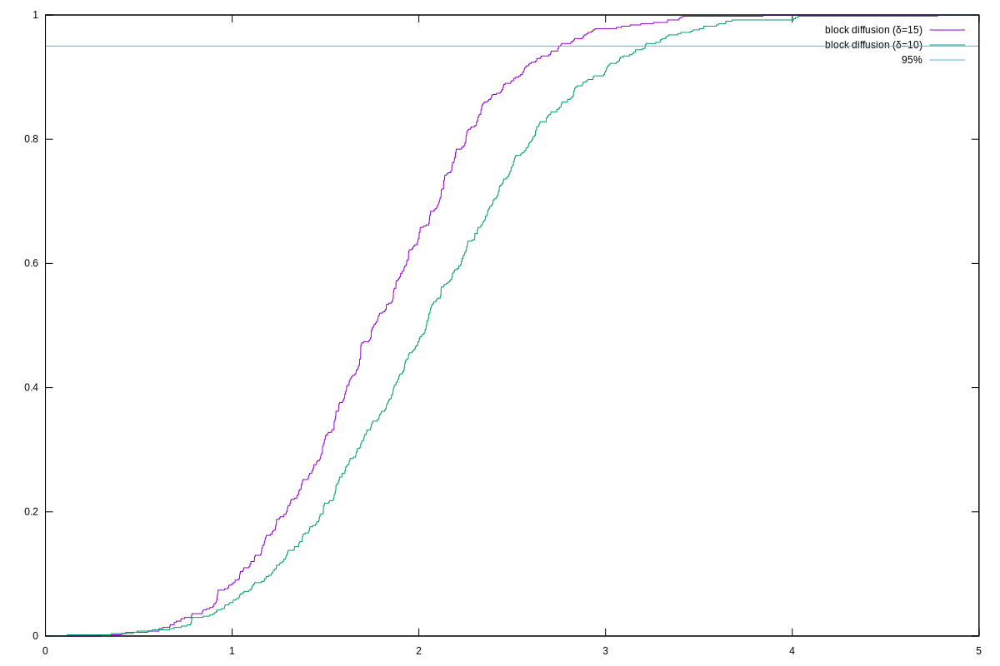
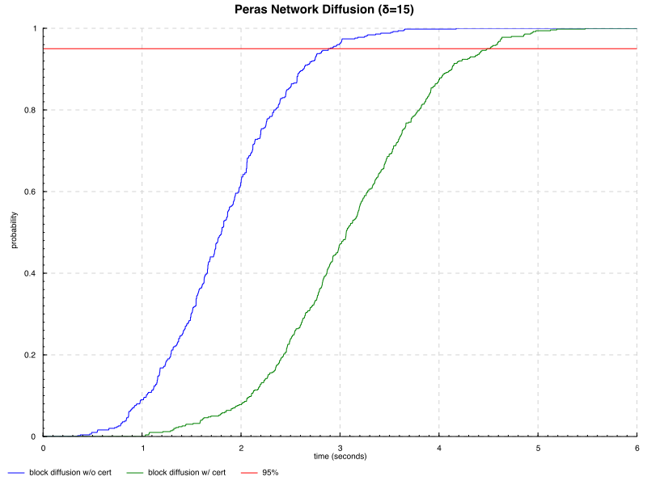
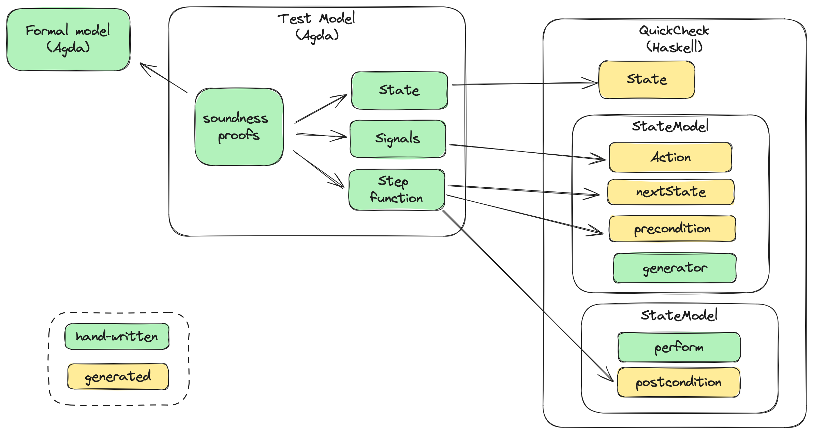

The goal of this document is to provide a detailed analysis of the Peras protocol from an engineering point of view, based upon the work done by the _Innovation team_ between November and April 2024. The design of the protocol itself is carried out by the _Research team_ and is not the focus of this document as the paper is still actively being worked on.

# Executive summary

This section lists a number of findings, conclusions, ideas, and known risks that we have garnered as part of the Peras innovation project.

## Findings

### Product-wise

We built evidence that the Peras protocol in its most recent incarnation can be implemented on top of Praos, in the existing [ouroboros-consensus](https://github.com/IntersectMBO/ouroboros-consensus) codebase, without compromising the core operations of the node (block creation, validation, and diffusion):

  * [Network Modelling](#network-performance-analysis) has shown initial versions would add an unbearable overhead to block diffusion,
  * [Simulation](#simulations) and prototyping have allowed us to sketch implementation and better understand the interplay between Peras and Praos,
  * Decoupling votes and certificates handling from blocks handling could pave the way to a smooth incremental [building and deployment](#integration-into-cardano-node) of Peras,
  * While still not formally evaluated (see _Remaining questions_ section) it seems the impact of vote and certificates diffusion on node operation will not be significant and the network will provide strong guarantees those messages can be delivered in a timely fashion.

We clarified the expected benefits of Peras over Praos expressed in terms of [_settlement failure probabilities_](#settlement-time): Outside cool-down period, with the proper set of parameters, Peras provides the same probability of settlement failure than Praos **faster** by a factor of roughly 1000, i.e. roughly 2 minutes instead of 36 hours.

### Process-wise

The following picture sketches the architecture of the project and the interaction between the various "domains" relevant to Innovation team. Black lines represent _implemented_ direct relations, grey lines and boxes represent _planned_ relations and tools, green lines represent _expected_ feedback relations.


We confirmed the relevance of [ΔQ modeling](#network-performance-analysis) technique to provide insights on a protocol's performance profile, and how particular design decisions (even apparently minor ones) can impact this performance profile. We also gave feedback to the maintainers on the current state of the tool and libraries, and how to improve it in order to increase the reach of this technique.

We explored the use of formal modeling language Agda to [specify](#protocol-specification) the protocol and application of Proof-of-Stake-specific [proof techniques](#small-step-semantics) to state and prove relevant properties of the protocol. We also started work on building a trail of evidence from research to implementation by:

- Experimenting with Quviq on the [generation of quickcheck-dynamic](#relating-test-model-to-formal-model) test models from Agda models,
- Sketching a research-centric [_Domain Specific Language_](#pseudo-code) that could be used in research papers and as a foundation for formal modeling and engineering work.

While prototyping, we demonstrated the applicability of an Agda-centric chain of evidence even to "foreign" languages by testing with `quickcheck-dynamic` the same properties against Haskell and [Rust prototypes](#rust-based-simulation), collaborating with the Creative engineering team on sketching a [network simulator](https://github.com/input-output-hk/ce-netsim) library in Rust.

## Remaining questions

There remain a number of open questions that could be investigated in future work increments.

- Peras features, both benefits and shortcomings, need to be aligned with business cases and overall strategy for scaling Cardano. This implies more research is needed in two directions:
	- From a product and user perspective, to evaluate the actual value that Peras delivers and the possible countermeasures to its drawbacks (e.g. the risk of cool-down could be covered by an _options_ or _insurance premium_ mechanism),
    - From a technical perspective, to explore the parameters space and find the best combinations.
- There are a number of components about which we have some ideas but no concrete figures or design:
    - Certificate structure and capabilities,
    - Vote and certificate CPU requirements and their possible impact on the node,
    - Optimal committee size,
- The protocol leaves room for a wide choice of options to design an implementation that should be considered and refined,
- There is a need for more theoretical research on ways to make cool-down less impactful.

# Contents

-   [Previous work](#previous-work)
    -   [Peras workshop](#peras-workshop)
        -   [Questions about Peras](#questions-about-peras)
        -   [Potential experiments for Peras](#potential-experiments-for-peras)
        -   [SRL](#srl)
-   [Protocol Specification](#protocol-specification)
    -   [Overview](#overview)
        -   [Certificates](#certificates)
    -   [Pseudo-code](#pseudo-code)
    -   [Settlement time](#settlement-time)
        -   [Settlement bounds for Peras](#settlement-bounds-for-peras)
    -   [Agda Specification](#agda-specification)
        -   [Domain model](#domain-model)
        -   [Small-step semantics](#small-step-semantics)
        -   [Proofs](#proofs)
-   [Network Performance Analysis](#network-performance-analysis)
    -   [Certificates in Block Header](#certificates-in-block-header)
        -   [Baseline - Praos ΔQ Modeling](#baseline---praos-δq-modeling)
        -   [Peras ΔQ Model - Blocks](#peras-δq-model---blocks)
        -   [Conclusion](#conclusion)
    -   [Votes & Certificates diffusion](#votes--certificates-diffusion)
    -   [Impact on User Experience](#impact-on-user-experience)
        -   [Model](#model)
-   [Property-based testing with Dynamic QuickCheck](#property-based-testing-with-dynamic-quickcheck)
    -   [Praos properties](#praos-properties)
    -   [Peras properties](#peras-properties)
    -   [Relating test model to formal model](#relating-test-model-to-formal-model)
-   [Simulations](#simulations)
    -   [Haskell-based simulation](#haskell-based-simulation)
        -   [Design](#design)
        -   [Experiments](#experiments)
    -   [Rust-based simulation](#rust-based-simulation)
    -   [Overall findings from simulation studies](#overall-findings-from-simulation-studies)
        -   [Simulation results](#simulation-results)
        -   [Simulation experiments](#simulation-experiments)
        -   [Simulator design](#simulator-design)
        -   [Integration with QuickCheck Dynamic](#integration-with-quickcheck-dynamic)
-   [Integration into Cardano Node](#integration-into-cardano-node)
    -   [Networking](#networking)
        -   [Votes](#votes)
        -   [Certificates](#certificates-1)
    -   [Consensus](#consensus)
    -   [Resources](#resources)
    -   [Implementation path](#implementation-path)
-   [Conclusion](#conclusion-1)
    -   [Recommendations](#recommendations)
-   [References](#references)
-   [Endnotes](#endnotes)

# Previous work

## Peras workshop

A follow-up action from the [Peras workshop in Edinburgh](https://docs.google.com/document/d/1dv796m2Fc7WH38DNmGc68WOXnqtxj7F30o-kGzM4zKA/edit), which happened in September 2023, was to define a set of questions and experiments to be conducted in order to better understand the properties of the Peras protocol, along with an assessment of the protocol's _Software readiness level_. The following sections recall the questions that were raised during the workshop, points to the answers given, and details the SRL assessment along with a comparison with current estimated SRL.

### Questions about Peras

For each of these questions we check whether or not it has been answered:

* [x] How do you detect double voting? Is double voting possible? How can the voting state be bounded?
  * _each vote is signed individually and the signature is checked by the receiving node_
  * _the voting state is bound by the committee size and the limited validity for each vote_
* [x] How are the voting committee members selected? What are the properties of the voting committee?
  * _Committee members are selected by a VRF-based sortition, its properties are exposed in the paper and [overview](#overview)_
* [x] Where should votes be included: block body, block header, or some other aggregate
  * _models and simulation show that votes need to be propagated and aggregated independently  while not in cooldown period_
  * _the "anchor" certificate used in cooldown period will need to be part of or attached to block bodies while its weight could be recorded as part of the corresponding block header_
* [ ] Under what circumstance can a cool down be entered?
  * _The question of how much adversarial power is needed to trigger a cool-down period is still open_
* [x] How significant is the risk of suppressing votes to trigger a cool-down period?
  * _it is significant, as being able to trigger cool-downs often ruins the benefits of Peras_
* [ ] Should vote contributions be incentivized?
  * _this question has not been explored in this report_
* [x] How much weight is added per round of voting?
  * _This is a parameter $B$ in the protocol whose exact value depends on business requirements_
* [ ] How to expose the weight/settlement of a block to a consumer of chain data, such as a wallet?
  * _This has not been addressed yet, as most of the user-facing and business domain aspects of the protocol_
* [x] Can included votes be aggregated into an artifact to prove the existence of votes & the weight they provide?
  * _This is the role of certificates_

### Potential experiments for Peras

We refer the reader to the relevant section for each of those potential experiments to demonstrate (in)feasability of Peras:

* [x] Network traffic simulation of vote messages
  * _This has been [simulated](#simulations) but needs to be refined_
* [x] Protocol formalization & performance simulations of Peras
  * _This has been done in [Agda](#agda-specification) with (parts of) performance modeling using [ΔQ](#network-performance-analysis) and simulation_
* [x] Optimal look-back parameter (measured in number of slots) within a round
  * [ ] _Historic analytical study ($n$-$\sigma$ for reliability based on the number of 9s desired)_
  * [x] _Some parameters value are provided in the research paper and [slides](https://docs.google.com/presentation/d/1QGCvDoOJIWug8jJgCNv3p9BZV-R8UZCyvosgNmN-lJU/edit#slide=id.g2ca1209fec0_0_450)_
* [ ] Chain growth simulations for the accumulation of vote data
  * _This has not been done as the protocol has evolved since the workshop_
* [x] Added chain catch-up time
  * _This is cool-down period length and is estimated in the [slides](https://docs.google.com/presentation/d/1QGCvDoOJIWug8jJgCNv3p9BZV-R8UZCyvosgNmN-lJU/edit#slide=id.g2ca1209fec0_0_450)_
* [ ] Cost of diffusing votes and blocks that contain votes
  * _not estimated_
* [ ] Need to refine: Details of VRF-based committee selection and its size

### SRL

SRL (software readiness level) was initially assessed to be between 1 and 2, with the following definitions:

| Questions to resolve                                                                       | Status                |
|--------------------------------------------------------------------------------------------|-----------------------|
| A concept formulated?                                                                      | Done                  |
| Basic scientific principles underpinning the concept identified?                           | Done                  |
| Basic properties of algorithms, representations & concepts defined?                        | Done                  |
| Preliminary analytical studies confirm the basic concept?                                  |                       |
| Application identified?                                                                    | Done (Partner chains) |
| Preliminary design solution identified?                                                    | Partial               |
| Preliminary system studies show the application to be feasible?                            |                       |
| Preliminary performance predictions made?                                                  | Done                  |
| Basic principles coded?                                                                    |                       |
| Modeling & Simulation used to refine performance predictions further and confirm benefits? |                       |
| Benefits formulated?                                                                       |                       |
| Research & development approach formulated?                                                | Done                  |
| Preliminary definition of Laboratory tests and test environments established?              | Preliminary           |
| Experiments performed with synthetic data?                                                 |                       |
| Concept/application feasibility & benefits reported in paper                               |                       |

We assess the current SRL to be between 3 and 4, given the following [SRL 3](https://input-output.atlassian.net/wiki/spaces/CI/pages/3875110920/SRL+3+Analytical+and+or+experimental+critical+function+or+characteristic+proof-of-concept.) definition:

| Questions to resolve                                                                                          | Status  |
|---------------------------------------------------------------------------------------------------------------|---------|
| Critical functions/components of the concept/application identified?                                          | Done    |
| Subsystem or component analytical predictions made?                                                           | Partial |
| Subsystem or component performance assessed by Modeling and Simulation?                                       | Partial |
| Preliminary performance metrics established for key parameters?                                               | Done    |
| Laboratory tests and test environments established?                                                           | Done    |
| Laboratory test support equipment and computing environment completed for component/proof-of-concept testing? | N/A     |
| Component acquisition/coding completed?                                                                       | No      |
| Component verification and validation completed?                                                              | Partial |
| Analysis of test results completed establishing key performance metrics for components/ subsystems?           | Done    |
| Analytical verification of critical functions from proof-of-concept made?                                     | Done    |
| Analytical and experimental proof-of-concept documented?                                                      | Done    |

# Protocol specification

## Overview

A presentation of the motivation and principles of the protocol is available in these [slides](https://docs.google.com/presentation/d/1QGCvDoOJIWug8jJgCNv3p9BZV-R8UZCyvosgNmN-lJU/edit). We summarize the main points here but refer the interested reader to the slides and the research article for details.

* Peras adds a Voting layer on top of Praos, Cardano's Nakamoto-style consensus protocol.
* In every voting round, stakeholders (SPOs) get selected to be part of the voting committee through a stake-based sortition mechanism (using their existing VRF keys) and vote for the newest block at least $L$ slots old, where $L$ is a parameter of the construction (e.g., $L$ = 120 slots).
* Votes are broadcast to other nodes through network diffusion.
* If a block gains more than a certain threshold of votes (from the same round), a so-called _quorum_ ($\tau$), it gets extra weight $B$ (where each block has a base weight of 1). Since nodes always select the heaviest chain (as opposed to the longest chain in Praos), these blocks with extra weight accelerate settlement of all blocks before them.
* A set of votes (from the same round) can be turned into a short certificate. Certificates are needed during the cool-down period (see below), but they can also be broadcast to nodes that are catching up.
* If a quorum is not reached in a round, the protocol enters a cool-down period, in order to heal from the “damage” that could result from adversarial strategies centered around withholding adversarial votes. During the cool-down, voting is suspended, and block producers include information required to coordinate the restart (the latest known certificate) in their blocks. The duration of the cool-down period is roughly equal to the number of slots equivalent to produce *k* + *B* blocks, where *k* is the settlement parameter of Praos.

### Certificates

The exact construction of Peras certificates is still unknown but we already know the feature set it should provide:

* A Peras certificate must be reasonably "small" in order to fit within the limits of a single block without leading to increased transmission delay.
  * The current block size on `mainnet` is 90kB, with each transaction limited to 16kB.
  * In order to not clutter the chain and take up too much block estate, a certificate should fit in a _single transaction_.
* Certificates need to be produced _locally_ by a single node from the aggregation of multiple votes reaching a quorum.
  * Certificate forging should be reasonably fast but is not critical for block diffusion: A round spans multiple possible blocks so there is more time to produce and broadcast it.
* A certificate must be reasonably fast to verify as it is on the critical path of chain selection: When a node receives a new block and/or a new certificate, it needs to decide whether or not this changes its best chain according to the weight,
* The [ALBA](https://iohk.io/en/research/library/papers/approximate-lower-bound-arguments/) paper provides a construction through a mechanism called a _Telescope_ which seems like a good candidate for Peras certificates.

## Pseudo-code

We initially started working from researchers' pseudo-code which was detailed in various documents:

* The initial [protocol definition](https://docs.google.com/document/d/1QMn1CqS4zSbKzvozhcAtc7MN_nMfVHhP25pMTxyhhZ8/edit#heading=h.8bsvt41k7bj1) as presented in the Edinburgh workshop, in September 2023,
* The [post-workshop definition](https://docs.google.com/document/d/1lywi65s1nQpAGgMpzPXD-sLzYNES-FZ8SHXF75VCKuI/edit#heading=h.dqvlvyqlb2s4)  which considered votes and blocks diffusion and chain selection in a more integrated manner,
* The newest version from [March 2024](https://docs.google.com/document/d/1w_jHsojcBxZHgGrr63ZGa4nhkgEpkL6a2cFYiq8Vf8c/edit) which addressed the shortcomings of tallying individual votes in the chain selection process from earlier versions.

In the Paris Workshop in April 2024, we tried to address a key issue of this pseudo-code: The fact it lives in an unstructured and informal document, is not machine-checkable, and is therefore poised to be quickly out of the sync with both the R&D work on the formal specification, the prototyping work, and the research work. This collective effort led to writing the exact same pseudo-code as a _literate Agda_ document, the internal consistency of which can be checked by the Agda compiler, while providing a similar level of flexibility and readability than the original document.

This document is available in the [Peras repository](../../src/Peras/ProtocolL.lagda.md) and is a first step towards better integration between research and engineering work streams.

Next steps include:

* Refining the pseudo-code's syntax to make it readable and maintainable by researchers and engineers alike,
* Understanding how this code relates with the actual Agda code,
* Adding some semantics.

It is envisioned that at some point this kind of code could become commonplace in the security researchers community in order to provide formally verifiable and machine-checkable specifications, based on the theoretical framework used by researchers (e.g. Universal Composition).

## Settlement time

[Practical Settlement Bounds for Longest-Chain Consensus](https://eprint.iacr.org/2022/1571.pdf) _(Gazi, Ren, and Russell, 2023)_ provides a formal treatment of the settlement guarantees for proof-of-stake (PoS) blockchains.

_Settlement time_ can be defined as the time needed for a given transaction to be considered permanent by some honest party. On Cardano, the upper bound for settlement time is $3k / f$ to produce $k$ subsequent blocks, where $k$ is the _security parameter_ and $f$ is the _active slot coefficient_. On the current mainchain, this time is 36 hours. Note that even if in practice the settlement time is fixed, in theory this bound is always probabilistic. The security parameter $k$ is chosen in such a way that the probability of a transaction being reverted after $k$ blocks is lower than $10^{-60}$.

The following picture from the aforementioned paper shows block settlement failure probability given some block depth for Cardano PoS chain. Under the assumptions given there, the probability for a transaction to be rolled back after 20 blocks is 0.001% , and is exponentially decreasing with the block depth.


We also have anecdotal evidence from observations of the Cardano mainchain over the past few years that the settlement time is much shorter than the theoretical bound, as basically forks over 2 blocks length are exceedingly rare, and no fork over 3 blocks length has been observed on core nodes since the launch of Shelley.

There's however no evidence this situation will continue in the future, obviously, as it could very well be the case the network was never seriously under attack, hence we should take those numbers with caution.

### Settlement bounds for Peras

> [!WARNING]
>
> Take the following analysis with a grain of salt as the researchers are still actively working on the protocol's security properties and numeric analysis.

While these numbers seem comforting and reasonably small to provide a very high degree of confidence after less than 10 minutes (a block is produced on average every 20s), it should be noted that they are based on non-existent to low adversarial power assumption (e.g. lower than 10% total stake), in other words they represent the best case scenario and say nothing about the potential impact of an adversary with significant resources and high motivation to either disrupt the network, e.g. as a form of denial of service to degrade the perceived value of Cardano, or more obviously to double spend. As the stakes increase and the network becomes more valuable, the probability of such an attack increases and our confidence in the settlement time should be adjusted accordingly.

In the optimistic case, Peras is expected to provide the level of settlement Praos provides after $k$ blocks but after only about a few rounds of voting. With the following parameters:

* Committee size $\cal{S}$ = 2000,
* Boost per certificate $B = k / 10 = 216$,
* Quorum $\tau = 3\cal{S} / 4 = 1500$,
* Round length $U = 10$ slots.

we can expect a negligible ($< 10^{-60}$) probability of settlement failure after 10 rounds or 100 slots, which is less than 2 minutes. In other words, Peras improves settlement upper bound over Praos by a factor of 1000, in the _optimistic case_, e.g. outside of a _cool-down period_.

However, triggering cool-down is cheap and does not require a large adversarial power as it is enough for an adversary to be able to create a relatively short fork that lasts slightly longer than the length of the voting window ($L$) to be able to force a split vote and a cool-down period.

## Agda specification

The formal specification of the Peras protocol is implemented in Agda. It is a declarative specification, there are entities that are only defined by properties rather than by an explicit implementation. But still the specification is extractable to Haskell and allows to generate QuickCheck tests for checking an arbitrary implementation against the reference specification.

### Domain model

**Note**: The code here is substantially different from the [pseudo-code](#pseudo-code) mentioned before. These represent two different lines of work that ultimately should be reconciled.

The domain model is defined as Agda data types and implemented with Haskell code extraction in mind. The extractable domain model comprises entities like `Block`, `Chain`, `Vote` or `Certificate`. For example the Agda record type for `Block`

```agda
record Block where
  field slotNumber : Slot
        creatorId : PartyId
        parentBlock : Hash Block
        certificate : Maybe Certificate
        leadershipProof : LeadershipProof
        signature : Signature
        bodyHash : Hash (List Tx)
```

is extracted to the Haskell data type:

```haskell
data Block = Block
  { slotNumber :: Slot
  , creatorId :: PartyId
  , parentBlock :: Hash Block
  , certificate :: Maybe Certificate
  , leadershipProof :: LeadershipProof
  , signature :: Signature
  , bodyHash :: Hash [Tx]
  }
  deriving (Eq)
```

Cryptographic functions are not implemented in the specification. For example, for hash functions there is the record type `Hashable`

```agda
record Hashable (a : Set) : Set where
  field hash : a → Hash a
```
that is extracted to a corresponding type class in Haskell:

```haskell
class Hashable a where
  hash :: a -> Hash a
```

For executing the reference specification, an instance of the different kind of hashes (for example for hashing blocks) needs to be provided.

#### Agda2hs

In order to generate "readable" Haskell code, we use [agda2hs](https://agda.github.io/agda2hs) rather than relying on the standard Haskell generator code (`MAlonzo`) directly. It happens that `agda2hs` is not compatible with the Agda standard library and therefore we are using the custom `Prelude` provided by `agda2hs` that is also extractable to Haskell.

For extracting properties from Agda to Haskell we can use a similar type as the `Equal` type from the `agda2hs` examples. The constructor for `Equal` takes a pair of items and a proof that those are equal. When extracting to Haskell the proof gets erased. We can use this idea for extracting properties to be used with quick-check.

```agda
prop-genesis-in-slot0 : ∀ {c : Chain} → (v : ValidChain c) → slot (last c) ≡ 0
prop-genesis-in-slot0 = ...

propGenesisInSlot0 : ∀ (c : Chain) → (@0 v : ValidChain c) → Equal ℕ
propGenesisInSlot0 c v = MkEqual (slot (last c) , 0) (prop-genesis-in-slot0 v)
```

### Small-step semantics

In order to describe the execution of the protocol, we are proposing a [small-step semantics for Ouroboros Peras](../../src/Peras/SmallStep.lagda.md) in Agda based on ideas from the small-step semantics for Ouroboros Praos as laid out in the PoS-NSB paper. The differences in the small-step semantics of the Ouroboros Praos part of the protocol are explained in the following sections.

#### Local state

The local state is the state of a single party, respectively a single node. It consists of a declarative _blocktree_, i.e. an abstract data structure representing possible chains specified by a set of properties. In addition to blocks, the blocktree for Ouroboros, Peras also includes votes and certificates and for this reason there are additional properties with respect to those entities.

The fields of the blocktree allow to:

* Extend the tree with blocks and votes,
* Get all blocks, votes and certificates,
* Get the best chain.

The property stating that the best chain is always a valid chain is such a property:

```agda
valid : ∀ (t : tT) (sl : Slot)
  → ValidChain (bestChain sl t)
```

The condition which chain is considered the best is given by the following property:

```agda
optimal : ∀ (c : Chain) (t : tT) (sl : Slot)
  → let b = bestChain sl t
    in
    ValidChain c
  → c ⊆ allBlocksUpTo sl t
  → weight c (certs t c) ≤ weight b (certs t b)
```

In words, this says that the *best* chain is *valid* (`ValidChain` is a predicate asserting that a chain is valid with respect to Ouroboros Praos) and the *heaviest* chain out of all valid chains is the best.

#### Global state

In order to describe progress with respect to the Ouroboros Peras protocol, a global state is introduced. The global state consists of the following entities:

* *clock:* Keeps track of the current slot of the system.
* *state map:* Map storing local state per party, i.e. the blocktrees of all the nodes.
* *messages:* All the messages that have been sent but not yet delivered.
* *history:* All the messages that have been sent.
* *adversarial state:* The adversarial state can be anything, with the type is passed to the specification as a parameter.

The differences compared to the model proposed in the PoS-NSB paper are:

* the execution order is not stored in the global state and therefore permutations of the messages as well as permutations of parties are not needed,
* the `Progress` of the system as described in the PoS-NSB paper is not stored in the global state, as we define the global relation more granular

Instead of keeping track of the execution order of the parties in the global state, the global relation is defined with respect to parties. The list of parties is considered fixed from the beginning and passed to the specification as a parameter. Together with a party, we know as well the party's honesty (`Honesty` is a predicate for a party).
Instead of keeping track of progress globally we only need to assert that before the clock reaches the next slot, all the deliverable messages (i.e. messages where the delay is 0) in the global message buffer have been consumed.

#### Global relation

The protocol defines messages to be distributed between parties of the system. The specification currently implements the following message types:

* *Block message:* When a party is the slot leader a new block can be created and a message notifying the other parties about the block creation is broadcast. Note that, in case a cool-down phase according to the Ouroboros Peras protocol is detected, the block also includes a certificate that references a block of the party's preferred chain,
* *Vote message:* When a party creates a vote according to the protocol, this is wrapped into a message and delivered to the other parties.

The global relation expresses the evolution of the global state:

```agda
    data _↝_ : Stateᵍ → Stateᵍ → Set where

      Deliver : ∀ {M N p} {h : Honesty p} {m}
        → h ⊢ M [ m ]⇀ N
          --------------
        → M ↝ N

      CastVote : ∀ {M N p} {h : Honesty p}
        → h ⊢ M ⇉ N
          ---------
        → M ↝ N

      CreateBlock : ∀ {M N p} {h : Honesty p}
        → h ⊢ M ↷ N
          ---------
        → M ↝ N

      NextSlot : ∀ {M}
        → Delivered M
          -----------
        → M ↝ tick M
```

The global relation consists of the following constructors:

* *Deliver*: A party consuming a message from the global message buffer is a global state transition. The party might be *honest* or *adversarial*, in the latter case a message will be delayed rather than consumed,
* *Cast vote*: A vote is created by a party and a corresponding message is put into the global message buffer for all parties respectively,
* *Create block*: If a party is a slot leader, a new block can be created and put into the global message buffer for the other parties. In case that a chain according to the Peras protocol enters a cool-down phase, the party adds a certificate to the block as well,
* *Next slot*: Allows to advance the global clock by one slot. Note that this is only possible, if all the messages for the current slot are consumed as expressed by the `Delivered` predicate.

The reflexive transitive closure of the global relation describes what global states are reachable.

### Proofs

The properties and proofs that we can state based upon the formal specification are in [Properties.lagda.md](../../src/Peras/SmallStep/Properties.lagda.md).

A first property is `knowledge-propagation`, a lemma that states that knowledge about blocks is propagated between honest parties in the system. In detail the lemma expresses that for two honest parties the blocks in the blocktree of the first party will be a subset of the blocks of the second party after any number of state transitions into a state where all the messages have been delivered. Or in Agda:

```agda
    knowledge-propagation : ∀ {N₁ N₂ : GlobalState}
      → {p₁ p₂ : PartyId}
      → {t₁ t₂ : A}
      → {honesty₁ : Honesty p₁}
      → {honesty₂ : Honesty p₂}
      → honesty₁ ≡ Honest {p₁}
      → honesty₂ ≡ Honest {p₂}
      → (p₁ , honesty₁) ∈ parties
      → (p₂ , honesty₂) ∈ parties
      → N₀ ↝⋆ N₁
      → N₁ ↝⋆ N₂
      → lookup (stateMap N₁) p₁ ≡ just ⟪ t₁ ⟫
      → lookup (stateMap N₂) p₂ ≡ just ⟪ t₂ ⟫
      → Delivered N₂
      → clock N₁ ≡ clock N₂
      → allBlocks blockTree t₁ ⊆ allBlocks blockTree t₂
```

Knowledge propagation is a pre-requisite for the chain growth property, it informally states that in each period, the best chain of any honest party will increase at least by a number that is proportional to the number of lucky slots in that period, where a lucky slot is any slot where an honest party is a slot leader.

# Network performance analysis

We provide in this section the methodology and results of the analysis of the Peras protocol performance in the context of the Cardano network. This analysis is not complete as it only covers the impact of including certificates in block headers, which is not a property of the protocol anymore. More analysis is needed on the votes and certificates diffusion process following changes to the protocol in March 2024.

## Certificates in block header

This section provides high-level analysis of the impact of Peras protocol on the existing Cardano network, using [ΔQSD methodology](https://iohk.io/en/research/library/papers/mind-your-outcomes-the-dqsd-paradigm-for-quality-centric-systems-development-and-its-application-to-a-blockchain-case-study/). In order to provide a baseline to compare with, we first applied ΔQ to the existing Praos protocol reconstructing the results that lead to the current set of parameters defining the performance characteristics of Cardano, following section 4 of the aforementioned paper. We then used the same modeling technique taking into account the Peras protocol **assuming inclusion of certificates in headers** insofar as they impact the core _outcome_ of the Cardano network, namely _block diffusion time_.

> [!NOTE]
> One of the sub-goals for Peras project is to collaborate with PNSol, the original inventor of ΔQ methodology, to improve the usability of the whole method and promote it as a standard tool for designing distributed systems.

### Baseline - Praos ΔQ modeling

#### Model overview

Here is a graphical representation of the _outcome diagram_ for the ΔQ model of Cardano network under Praos protocol:


This model is based on the following assumptions:

* Full block diffusion is separated in a number of steps: request and reply of the block header, then request and reply of the block body,
* Propagating a block across the network might require several "hops" as there is not a direct connection between every pair of nodes, with the distribution of paths length depending on the network topology,
* We have not considered the probability of loss in the current model.

The block and body sizes are assumed to be:

* Block header size is smaller than typical MTU of IP network (e.g. 1500 bytes) and therefore requires a single roundtrip of TCP messages for propagation,
* Block body size is about 64kB which implies propagation requires several TCP packets sending and therefore takes more time.

> [!NOTE]
> As the Cardano network uses TCP/IP for its transport, we should base the header size on the [Maximum Segment Size](https://en.wikipedia.org/wiki/Maximum_segment_size), not the MTU.
> This size is 536 for IPv4 and 1220 for IPv6.

Average latency numbers are drawn from table 1 in the paper and depend on the (physical) distance between 2 connected nodes:

| Distance | 1 segment RTT (ms) | 64 kB RTT (ms) |
|----------|-------------------|----------------|
| Short    | 12                | 24             |
| Medium   | 69                | 143            |
| Long     | 268               | 531            |

For each step in the diffusion of a block, we assume an equal ($\frac{1}{3}$) chance for each class of distance.

> [!NOTE]
> The actual maximum block body size at the time of this writing is 90kB, but for want of an actual delay value for this size, we chose the nearest increment available. We need to actually measure the real value for this block size and other significant increments.

We have chosen to define two models of ΔQ diffusion, one based on an average node degree of 10, and another one on 15. Table 2 gives us the following distribution of paths length:

| Length | Degree = 10 | Degree = 15 |
|--------|-------------|-------------|
| 1      | 0.40%       | 0.60%       |
| 2      | 3.91%       | 8.58%       |
| 3      | 31.06%      | 65.86%      |
| 4      | 61.85%      | 24.95%      |
| 5      | 2.78%       | 0           |

These numbers are reflected (somewhat inaccurately) in the above graph, representing the probabilities for the number of hops a block will have to go through before reaching another node.

> [!NOTE]
> The current target valency for cardano-node's connection is 20, and while there are a large number of stake pools in operation, there is some significant concentration of stake, which means the actual number of "core" nodes to consider would be smaller and the distribution of paths length closer to 1.

#### Modeling process

We have experimented with three different libraries for encoding this baseline model:

1. Original [ΔQ library](https://github.com/DeltaQ-SD/pnsol-deltaq-clone) built by Neil Davies, which uses randomized sampling to graph the _Cumulative Distribution Function_ resulting from the ΔQ model,
2. A library for [algebraic representation](https://github.com/DeltaQ-SD/Artjoms) of ΔQ models built to support the [Algebraic Reasoning with Timeliness](https://arxiv.org/pdf/2308.10654v1.pdf) paper, which uses discretization of probability density functions to approximate CFDs resulting from the various ΔQ language combinators,
3. Another recent library built by Peter Thompson to represent ΔQ probability distributions using [piecewise polynomials](https://github.com/DeltaQ-SD/dqsd-piecewise-poly), which should provide high-fidelity CDFs.

Library 2 was used to express the _outcome diagram_ depicted above using so-called _O language_, but while we were able to encode the model itself, the resulting computation of _CDFs_ for composite expressions resulting from _convolution_ of atomic expressions turned out to be unusable, yielding CDFs with accumulated probability lower than 1 even though we did not model any loss. Library 3, although the most promising to provide accurate models, turned out to be unsatisfactory as we were not able to produce proper numerical representations of a CDF for more complex expressions.

Using code from library 1, we were able to write the following ΔQ expressions to represent our Cardano model:

```haskell
oneMTU =
    fromQTA @SimpleUniform
        [(0, 0), (1 % 3, 0.012), (2 % 3, 0.069), (3 % 3, 0.268)]
blockBody64K =
    fromQTA @SimpleUniform
        [(0, 0), (1 % 3, 0.024), (2 % 3, 0.143), (3 % 3, 0.531)]
headerRequestReply = oneMTU ⊕ oneMTU -- request/reply
bodyRequestReply = oneMTU ⊕ blockBody64K -- request/reply
oneBlockDiffusion = headerRequestReply ⊕ bodyRequestReply

combine [(p, dq), (_, dq')] = (⇋) (toRational $ p / 100) dq dq'
combine ((p, dq) : rest) = (⇋) (toRational $ p / 100) dq (combine rest)

multihops = (`multiHop` oneBlockDiffusion) <$> [1 ..]

pathLengthsDistributionDegree15 =
    [0.60, 8.58, 65.86, 24.95]
hopsProba15 = zip (scanl1 (+) pathLengthsDistributionDegree15 <> [0]) multihops
deltaq15 = combine hopsProba15
```

Then computing the empirical CDF over 5000 different random samples yield the following graph:



To calibrate our model, we have computed an empirical distribution of block adoption time[^2] observed on the `mainnet` over the course of 4 weeks (from 22nd February 2024 to 18th March 2024), as provided by https://api.clio.one/blocklog/timeline/. The raw data is provided as a file with 12 millions entries similar to:

```
9963861,117000029,57.128.141.149,192.168.1.1,570,0,60,30
9963861,117000029,57.128.141.149,192.168.1.1,540,0,60,40
9963861,117000029,158.101.97.195,150.136.84.82,320,0,10,50
9963861,117000029,185.185.82.168,158.220.80.17,610,0,50,50
9963861,117000029,74.122.122.114,10.10.100.12,450,0,10,50
9963861,117000029,69.156.16.141,69.156.16.141,420,0,10,50
9963861,117000029,165.227.139.87,10.114.0.2,620,10,0,70
9963861,117000029,192.99.4.52,144.217.78.44,460,0,10,100
9963861,117000029,49.12.89.235,135.125.188.228,550,0,20,50
9963861,117000029,168.119.9.11,3.217.90.52,450,150,10,50
...
```

Each entry provides:

* Block height,
* Slot number,
* Emitter and receiver's IP addresses,
* Time (in ms) to header announcement,
* then additional time to fetch header,
* time to download block,
* and finally time to adopt a block on the receiver.

Therefore the total time for block diffusion is the sum of the last 4 columns.

This data is gathered through a network of over 100 collaborating nodes that agreed to report various statistics to a central aggregator, so it is not exhaustive and could be biased. The following graph compares this observed CDF to various CDFs for different distances (in the graph sense, e.g. number of hops one need to go through from an emitting node to a recipient node) between nodes.


While this would require some more rigorous analysis to be asserted in a sound way, it seems there is a good correlation between empirical distribution and 1-hop distribution, which is comforting as it validates the relevance of the model.

### Peras ΔQ model - blocks

Things to take into account for modeling Peras:

* *Impact of the size of the certificate:* If adding the certificate increases the size of the header beyond the MSS (or MTU?), this will impact header diffusion.
  * We might need to just add a hash to the header (32 bytes) and then have the node request the certificate, which also increases (full) header diffusion time.
* *Impact of validating the certificate:* If it is not cheap (e.g. a few ms like a signature verification), this could also lead to an increase in block adoption time as a node receiving a header will have to add more time to validate it before sharing it with its peers.
* There might not be a certificate for each header, depending on the length of the rounds. Given round length *R* in slots and average block production length *S*, then frequency of headers with certificate is *S*/*R*.
  * The model must take into account different paths for retrieving a header, one with a certificate and one without.
* Diffusion of votes and certificates does not seem to have other impacts on diffusion of blocks: e.g. just because we have more messages to handle and therefore we consume more bandwidth between nodes, this could lead to delays for block propagation, but it seems there is enough bandwidth (in steady state, perhaps not when syncing) to diffuse both votes, certificates, transactions, and blocks without one impacting the other.

The following diagram compares the ΔQ distribution of block diffusion (for 4 hops) under different assumptions:

1. Standard block without a certificate,
2. Block header points to a certificate.

Certificate validation is assumed to be a constant 50ms.


Obviously, adding a round-trip network exchange to retrieve the certificate for a given header degrades the "timeliness" of block diffusion.
For the case of 2500 nodes with average degree 15, we get the following distributions, comparing blocks with and without certificates:



> [!NOTE]
> Depending on the value of $U$, the round length, not all block headers will have a certificate and the ratio could actually be quite small, e.g. if $T=60$ then we would expect 1/3rd of the headers to have a certificate on average. While we tried to factor that ratio in the model, that is misleading because of the second order effect an additional certificate fetching could have on the whole system: More delay in the block diffusion process increases the likelihood of forks which have an adversarial impact on the whole system, and averaging this impact hides it.

> [!NOTE]
> In practice, `cardano-node` uses _network-level pipelining_ to avoid having to request individually every block/header: e.g. when sending multiple blocks to a peer a node will not wait for its peer's request and will keep sending headers as long as not instructed to do otherwise.
>
> This is not to be confused with _consensus pipelining_ which streamlines block headers diffusion from upstream to downstream peers. ???

### Conclusion

This analysis demonstrates that Peras certificates cannot be on the critical path of block headers diffusion lest we run the risk of increased delays in block diffusion and number of forks. Certificates either have to be small enough to not require an additional round-trip to transmit on top of the block header, or be part of the block body. Note that in the latter case the certificates should also be relatively small as there is limited space available in blocks.

## Votes & certificates diffusion

Detailed analysis of votes and certificates diffusion is still ongoing and will be reported in a future document. Some preliminary discussions with PNSol allowed us to identify the following points to consider:

* The vote diffusion will very likely be unproblematic on "sunny days", so the modeling and thinking effort should be focused on "rainy days", e.g. what happens under heavy load, e.g. CPU load (also possibly network load?). These are the circumstances into which backpressure should be applied.
* Some key questions to answer to:
  * How much computation do we do on each vote?
  * How much computation do we do on each certificate?
  * What kind of backpressure do we need to bake in?
* An interesting observation: We could build certificates to reduce the amount of data transferred, e.g. trading CPU time (building certificate) for space and network bandwidth consumption.

## Impact on user experience

### Model

We could want to model the outcomes of Peras in terms of _user experience_, e.g. how does Peras impact the user experience? From the point of view of the users, the thing that matters is the _settlement time_ of their transactions: How long does it take for a transaction submitted to be _settled_, e.g. to have enough (how much?) guarantee that the transaction is definitely part of the chain?

From this point of view, the whole path from transaction submission to observing a (deep enough) block matters, which means we need to take into account in our modeling the propagation of the transaction through the mempools of various nodes in the network until it reaches a block producer. This also means we need to take into account the potential _delays_ incurred in that journey that can occur because of _mempool congestion_ in the system: When the mempool of a node is full, it will not pull more transactions from the peers that are connected to it.

The following diagram illustrates the "happy path" of a transaction until the block its part of gets adopted by the emitting node, in Praos.


This question is discussed in much more detail in the [report on timeliness](https://docs.google.com/document/d/1B42ep9mvP472-s6p_1qkVmf_b1-McLNPyXGjGHEVJ0w/edit) and should be considered outside of the scope of Peras protocol itself.

# Property-based testing with state-machine based QuickCheck

The `quickcheck-dynamic` Haskell package enables property-based testing of state machines. It is the primary testing framework used for testing the Peras implementations in Haskell and Rust. Eventually, the dynamic model instances used in `quickcheck-dynamic` will be generated directly from the Agda specification of Peras using `agda2hs`.

Testing that uses the standard (non-dynamic) `quickcheck` package is limited to the JSON serialization tests, such as golden and roundtrip tests and round-trip tests.

## Praos properties

Praos `NodeModel` and `NetworkModel` test the state transitions related to slot leadership and forging blocks. They can be used with the Haskell node and network implemented in `peras-iosim`, or the Rust node and network implementation in `peras-rust`. This dual-language capability demonstrated the feasibility of providing dynamic QuickCheck models for language-agnostic testing. The properties tested are that the forging rate of a node matches the theoretical expectation to within statistical variations and that, sufficiently after genesis, the nodes in a network have a common chain-prefix.

## Peras properties

A `quickcheck-dynamic` model was created for closer and cleaner linkage between code generated by `agda2hs` and Haskell and Rust simulations. The model has the following features:

The "idealized" votes, certificates, blocks, and chains of the QuickCheck model are separated from "realized" ones generated by `agda2hs` and used in the simulations. The idealized version ignores some details like signatures and proofs. It is possible to remove this separation between ideal and real if behaviors are fully deterministic (including the bytes of signatures and proofs). However, this prototype demonstrates the feasibility of having a slightly more abstract model of a node for use in `Test.QuickCheck.StateModel`.

The [`NodeModel`](https://github.com/input-output-hk/peras-design/blob/4bc364f52dd33665cbb13d03d7ca16efea98f4ee/peras-quickcheck/src/Peras/OptimalModel.hs#L1) has sufficient detail to faitfully represents Peras protocol. Ideally, this would be generated directly by `agda2hs`. This instance of `StateModel` uses the executable specification for state transitions and includes generators for actions, constrained by preconditions.

```haskell
data NodeModel = NodeModel { ... }
```

```haskell
instance StateModel NodeModel where
  data Action NodeModel a where
    Initialize :: Protocol -> PartyId {- i.e., the owner of the node -} -> Action NodeModel ()
    ATick :: IsSlotLeader -> IsCommitteeMember -> Action NodeModel [MessageIdeal]
    ANewChain :: ChainIdeal -> Action NodeModel [MessageIdeal]
    ASomeCert :: CertIdeal -> Action NodeModel [MessageIdeal]
    ASomeVote :: VoteIdeal -> Action NodeModel [MessageIdeal]
  arbitraryAction = ...
  precondition = ...
  initialState = ...
  nextState = ...
``````

The executable specification for the node model is embodied in a typeclass `PerasNode` representing the abstract interface of nodes. An `instance (Monad m, PerasNode n m) => RunModel NodeModel (RunMonad n m)` executes actions on a `PerasNode` and checks postconditions. This also could be generated by `agda2hs` from the specification.

```haskell
class Monad m => PerasNode a m where
  newSlot :: IsSlotLeader -> IsCommitteeMember -> a -> m ([Message], a)
  newChain :: Chain -> a -> m ([Message], a)
  ...
```

For demonstration purposes, an `instance PerasNode ExampleNode` implements a simple, intentionally buggy, node for exercising the dynamic logic tests. This could be a full Haskell or Rust implementation, an implementation generated via `agda2hs` from operational (executable) semantics in Agda, etc.

```haskell
data ExampleNode = ExampleNode { ... }

instance PerasNode ExampleNode Gen where
  ...
```

The example property below simply runs a simulation using `ExampleNode` and checks the trace conforms to the executable specification.

```haskell
propSimulate :: (Actions NodeModel -> Property) -> Property
propSimulate = forAllDL simulate

simulate :: DL NodeModel ()
simulate = action initialize >> anyActions_

-- | Act on the example node.
propOptimalModelExample :: Actions NodeModel -> Property
propOptimalModelExample actions = property . runPropExampleNode $ do
  void $ runActions actions
  assert True

-- | Test a property in the example node.
runPropExampleNode :: Testable a => PropertyM (RunMonad ExampleNode Gen) a -> Gen Property
runPropExampleNode p = do
  Capture eval <- capture
  flip evalStateT def . runMonad . eval $ monadic' p
```

Because the example node contains a couple of intentional bugs, one expects the test to fail. Shrinking reveals a parsimonious series of actions that exhibit one of the bugs.

```haskell
spec :: Spec
spec = describe "Example node" . prop "Simulation respects model"
         . expectFailure $ propSimulate propOptimalModelExample
```
```console
$ cabal run test:peras-quickcheck-test -- --match "/Peras.OptimalModel/Example node/Simulation respects model/"

Peras.OptimalModel
  Example node
    Simulation respects model [✔]
      +++ OK, failed as expected. Assertion failed (after 4 tests and 1 shrink):
      do action $ Initialize (Peras {roundLength = 10, quorum = 3, boost = 0.25}) 0
         action $ ANewChain [BlockIdeal {hash = "92dc9c1906312bb4", creator = 1, slot = 0, cert = Nothing, parent = ""}]
         action $ ATick False True
         pure ()

Finished in 0.0027 seconds
1 example, 0 failures
```

## Relating test model to formal model

The team has been working with [_Quviq_](https://drive.google.com/file/d/1vDfwiR24t3K6INkabwR43A4Ryc-j7SzG/view) to provide assistance and expertise on tighter integration between the Agda specification and the `quickcheck-dynamic` model. This work resulted in the development of a prototype that demonstrates the feasibility of generating the `quickcheck-dynamic` model from the Agda specification, as described in Milestone 1 of the _Statement of Work_.

The following picture summarizes how the various parts of the testing framework for Peras are related:



The key points of this line of work are:

1. While both written in Agda, we differentiate the _Formal model_ from the _Test model_ as they serve different purposes. More importantly, we acknowledge the fact there be more than one _Test model_ for a given _Formal model_, depending on the level of abstraction and the properties we want to test,
2. The _Formal model_ is the actual [specification](#agda-specification) of the protocol and is meant to write _proofs_ related to the protocol (e.g the usual blockchain properties like chain growth, chain quality, etc. and the specific properties of Peras). Ideally, this model should be part of the research work and written in close collaboration with them,
3. The _Test model_ describes some relevant behavior of the system for the purpose of asserting a liveness or safety property, in the form of a state machine relating: A state data type, some _signals_ sent to the SUT for testing purpose, and a _step_ function describing possible transitions of the system,
4. The _Test model_'s soundness w.r.t the _Formal model_ is proven through a _soundness_ theorem that guarantees each sequence of transition in the _Test model_ can be mapped to a valid sequence of transitions in the _Formal model_,
5. Using `agda2hs` Haskell code is generated from the _Test model_ and integrated in a small hand-written wrapper complying with quickcheck-dynamic API,
6. Note the `perform` function is not generated because it's specific to the actual implementation of the _System-Under-Test_ (SUT).

The provided models are very simple toy examples of some chain protocol as the purpose of this first step was to validate the approach and identify potential issues. In further steps, we need to:

1. Work on a more complex and realistic Test model checking some core properties of the Peras protocol,
2. Ensure the Formal model's semantics is amenable to testability and proving soundness of the Test model.

# Simulations

In order to test the language-neutrality of the testing framework for Peras, we developed both Haskell-based and Rust-based simulations of the Peras and Praos protocols.

## Haskell-based simulation

The initial phase of the first Peras PI's work on simulation revolves around discovery. This involves several key tasks, including prototyping and evaluating different simulation architectures, investigating simulation-based analysis workflows, assessing existing network simulation tools, establishing interface and serialization formats, eliciting requirements for both simulation and analysis purposes, and gaining a deeper understanding of Peras behaviors. The first prototype simulation, developed in Haskell, is closely intertwined with the Agda specification. This integration extends to the generation of types directly from Agda. Subsequent work will migrate a significant portion of the Peras implementation from Haskell to functions within the Agda specification, which will necessitate reconceptualizing and refining various components of the simulation.

The Peras simulation employs language-agnostic components that collaborate seamlessly (see figure below). This includes node implementations in Haskell, with Rust implementations forthcoming. Additionally, the native-Haskell simulation utilizes the [IOSim](https://hackage.haskell.org/package/io-classes) packages in a manner consistent with QuickCheck tests in `peras-quickcheck`, which also supports a _Foreign Function Interface_ (FFI) connection to [Netsim](https://github.com/input-output-hk/ce-netsim) and `peras-rust`. The simulation setup also encompasses statistically designed experiments, the ability to inject rare events or adversarial behaviors, tools for generating networks and scenarios, as well as analysis and visualization tools to interpret the simulation results. A significant aspect of the workflow is geared towards analysis. This involves an observability approach to gathering metrics, utilization of language-independent file formats, visualization of network structures, and statistical analyses primarily conducted using [R](https://www.r-project.org/).


The IOSim-based Haskell simulator for Peras currently provides a provisional implementation of the Peras protocol's intricacies, including committee selection, voting rounds, and cool-down periods. Presently, the fidelity of the simulation to the Peras protocol is moderate, while the fidelity at the network layer remains low. Substantial refactoring and refinement efforts are deemed necessary moving forward to enhance the simulation's accuracy and effectiveness.

The simulation implements the February version of the Peras protocol, illustrated in the [UML](https://en.wikipedia.org/wiki/Unified_Modeling_Language) sequence diagrams below for node behavior, and the activity diagram for node state transitions. Nodes receive messages for entering a new slot or new voting round; they also receive new preferred chains or votes from their upstream peers via messages. When they vote, forge blocks, or adopt a new preferred chain, they notify their downstream peers via messages.

> [!WARNING]
> The detailed behavior of the February protocol differs somewhat from later versions such as the March protocol.


### Design

The architecture, design, and implementation of the Haskell-based `peras-iosim` package evolved significantly during Peras's first PI, so here we just summarize the software approach that the series of prototypes has converged upon.

#### IOSim

The simulator initially relied heavily on `io-sim` and `io-classes` as it was inspired by similar work based on IOSim, like [hydra-sim](https://github.com/input-output-hk/hydra-sim): Each node would be a separate actor, possibly running several threads. We then moved to a much more lightweight use of IOSim's capabilities.

First of all, IOSim's implementation is currently single-threaded with a centralized scheduler that handles the simulated threads. Thus, IOSim does not provide the speed advantages of a parallel simulator. However, it conveniently provides many of the commonly used MTL (monad transformer library) instances typically used with `IO` or `MonadIO` but in a manner compatible with a simulation environment. For example, `threadDelay` in `IOSim` simulates the passage of time whereas in `IO` it blocks while time actually passes. Furthermore, the STM usage in earlier Peras prototypes was first refactored to higher-level constructs (such as STM in the network simulation layer instead of in the nodes themselves) but then finally eliminated altogether. The elimination of STM reduces the boilerplate and thread orchestration in QuickCheck tests and provides a cleaner testing interface to the node, so that interface is far less language dependent. Overall, the added complexity of STM simply was not justified by requirements for the node, since the reference node purposefully should not be highly optimized. Additionally, IOSim's event logging is primarily used to handle logging via the `contra-tracer` package. IOSim's `MonadTime` and `MonadTimer` classes are used for managing the simulation of the passage of time.

#### Node interface

The node interface has evolved towards a request-response pattern, with several auxiliary getters and setters. This will further evolve as alignment with the Agda-generated code and QuickCheck Dynamic become tighter. At this point, however, the node interface and implementation is sufficient for a fully faithful simulation of the protocol, along with the detailed observability required for quantifying and debugging its performance.

```haskell
class PerasNode a where
  getNodeId :: a -> NodeId
  getOwner :: a -> PartyId
  getStake :: a -> Coin
  setStake :: a -> Coin -> a
  getDownstreams :: a -> [NodeId]
  getPreferredChain :: a -> Chain
  getPreferredVotes :: a -> [Vote]
  getPreferredCerts :: a -> [Certificate]
  getPreferredBodies :: a -> [BlockBody]
  handleMessage :: Monad m => a -> NodeContext m -> InEnvelope -> m (NodeResult, a)
  stop :: Monad m => a -> NodeContext m -> m a
```

Honest versus adversarial nodes can be wrapped in the existential type `SomeNode`. The `NodeResult` captures the messages emitted by the node in response to the message (`InEnvelope`) that it receives, specifies the lower bound on the time of the node's next activity (`wakeup`), and collects metrics regarding the node's activity:

```haskell
data NodeResult = NodeResult
  { wakeup :: UTCTime
  , outputs :: [OutEnvelope]
  , stats :: NodeStats
  }

data NodeStats = NodeStats
  { preferredTip :: [(Slot, BlockHash)]
  , rollbacks :: [Rollback]
  , ...
  }
```

The `NodeContext` includes critical environmental information such as the current time and the total stake in the system:

```haskell
data NodeContext m = NodeContext
  { protocol :: Protocol
  , totalStake :: Coin
  , slot :: Slot
  , clock :: UTCTime
  , traceSelf :: TraceSelf m
  }
```

#### Auxiliary data structures

An efficient Haskell simulation requires auxiliary data structures to index the blocks, votes, and certificates in the block tree, to memoize quorum checks, etc. A node can use a small state machine for each channel to an upstream node and supplement that with its own global state machine.

```haskell
data ChainState = ChainState
  { tracker :: ChainTracker
  , channelTrackers :: Map NodeId ChainTracker
  , chainIndex :: ChainIndex
  }
```

Each `ChainTracker` records node- or peer-specific states.

```haskell
data ChainTracker = ChainTracker
  { preferredChain :: Chain
  , preferredVoteHashes :: Set VoteHash
  , preferredCertHashes :: Set CertificateHash
  , missingBodies :: Set BodyHash
  , latestSeen :: Maybe Certificate
  , latestPreferred :: Maybe Certificate
  }
```

An index facilitates efficient lookup and avoids recomputation of quorum information.

```haskell
data ChainIndex = ChainIndex
  { headerIndex :: Map BlockHash Block
  , bodyIndex :: Map BodyHash BlockBody
  , voteIndex :: Map VoteHash Vote
  , certIndex :: Map CertificateHash Certificate
  , votesByRound :: Map RoundNumber (Set VoteHash)
  , certsByRound :: Map RoundNumber (Set VoteHash)
  , weightIndex :: Map BlockHash Double
  }
```

Combined, these types allow a node to track the information it has sent or received from downstream or upstream peers, to eliminate recomputing chain weights, to avoid asking multiple peers for the same information, and to record its and its peers' preferred chains, votes, and certificates. Note that this instrumentation and optimization does not affect the simulated performance of the node because that performance is tracked via a cost model, regardless of the performance of the simulation code.

#### Observability

Tracing occurs via a `TraceReport` which records ad-hoc information or the structured statistics.

```haskell
data TraceReport
  = TraceValue
      { self :: NodeId
      , slot :: Slot
      , clock :: UTCTime
      , value :: Value
      }
  | TraceStats
      { self :: NodeId
      , slot :: Slot
      , clock :: UTCTime
      , statistics :: NodeStats
      }
```

The `value` in the interface above can hold the result of a single "big step", recorded in a `StepResult` of outputs and events.

```haskell
data StepResult = StepResult
  { stepTime :: UTCTime
  , stepOutputs :: [OutEnvelope]
  , stepEvents :: [Event]
  }

data Event
  = Send { ... }
  | Drop { ... }
  | ...
  | Trace Value
```

The `peras-iosim` executable supports optional capture of the trace as a stream of JSON objects. In experiments, `jq` is used for ad-hoc data extraction and `mongo` is used for complex queries. The result is analyzed using R scripts.

#### Message routing

The messaging and state-transition behavior of the network of nodes can be modeled via a discrete event simulation (DES). Such simulations are often parallelized (PDES) in order to take advantage of the speed gains possible from multiple threads of execution. Otherwise, a single thread must manage routing of messages and nodes' computations: for large networks and long simulated times, the simulation's execution may become prohibitively slow. Peras simulations are well suited to *conservative PDES* where strong guarantees ensure that messages are always delivered at monotonically non-decreasing times to each node; the alternative is an *optimistic PDES* where the node and/or message queue states have to be rolled back if a message with an out-of-order timestamp is delivered. A PDES for Peras can be readily constructed if each time a node emits a message it also declares a guarantee that it will not emit another message until a specified later time. Such declarations provide sufficient information for its downstream peers to advance their clocks to the minimum timestamp guaranteed by their upstream peers: i.e., when a node sees empty incoming message queues from all of its upstream peers, it can compute a safe time to advance forward, thus avoiding race conditions or deadlock. Hence, each node can run its own thread and have upstream and downstream message queues directly connected to its peers, all without the centrally managed message routing that would form a potential bottleneck for scaling performance. The experiments described later in this document indicate that PDES is not needed at this time because simulations execute sufficiently fast without it and the cpu resources could be better used for running ensembles of simulations in parallel.

That said, it likely is the case that Peras simulations will not need to simulate contiguous weeks or months of network operation, so at this point `peras-iosim` uses a centrally managed time-ordered priority queue for message routing. Also, instead of each node running autonomously in its own thread, nodes are driven by the receipt of a message and respond with timestamped output messages and a "wakeup" timestamp bounding the node's next activity. If long-running simulations are later required, the node design is consistent with later upgrading the message-routing implementation to a conservative PDES and operating each node in its own thread in a fully parallelized or distributed simulation. The basic rationales against long-running simulations are (1) that ΔQ analyses are better suited for network traffic and resource studies and (2) simulation is best focused on the rare scenarios involving forking and cool-down, which occur below Cardano's Ouroboros security parameter $k$ of 2160 blocks (approximately thirty-six hours).

#### Sync protocol

Five designs for node sync protocol were considered.

1. Simple handoffs between client and server
    - Closely corresponds to Agda Message
    - Client could use blocking calls to tidily process messages
    - `FetchChain` does not stream, so another `FetchChain` request must be made for each subsequent block header in the new chain
    - Cannot handle `FetchVotes` or `FetchBlocks` when multiple hashes are provided, so all queries must be singletons
2. Messy multiplexing
    - Similar to how early prototypes used incoming and outgoing STM channels
    - Incoming messages will not be in any particular order
    - Client needs to correlate what they received to what they are waiting for, and why - maybe use futures or promises with closures
3. Sequential mini-protocols
    - Reminiscent of the Ouroboros design currently in production
    - Client needs to `Cancel` and re-query when they want a different type of information, a pattern which differs from real nodes' simple abandonment of responses that become irrelevant
4. Parallel mini-protocols
    - Separate threads for each type of sync (header, vote, block)
    - Client needs to orchestrate intra-thread communication
5. Constrained fetching
    - Supports the most common use case of fetching votes and bodies right after a new header is received
    - Reduces to a request/replies protocol if the protcol's state machine is erased or implicit

| Design 1                                                 | Design 2                                              | Design 3                                                | Design 5                                                      |
| -------------------------------------------------------- | ----------------------------------------------------- | ------------------------------------------------------- | ------------------------------------------------------------- |
|  |  |  |  |

These highlight some key design issues:

- `FetchVotes` and `FetchBlocks` trigger multiple responses, as `FetchChain` may also do,
- Three types of information are being queried (headers, votes, blocks) in only a semi-predictable sequence,
- The DoS attack surface somewhat depends upon when the node yields agency to its peers,
- Pull-based protocols involve more communication than push-based ones.

The current implementation uses a simple request/reply protocol that avoids complexity, but is not explicitly defined as a state machine. This is actually quite similar to the fifth design, but with no `Next` request. It abandons the notion of when the client or server has agency. If the client sends a new request before the stream of responses to the previous request is complete, then responses will be multiplexed.

### Experiments

The simulation experiments below use slightly different versions of the ever-evolving Haskell package `peras-iosim`, which relies on the types generated by `agda2hs`, but with the now slightly outdated February version of the Peras protocol. Visualization was performed with the [GraphViz](https://graphviz.org) tool, and statistical and data analysis was done with R.

#### Block production

The "block production" experiment laid the groundwork for testing simulated block-production rates using QuickCheck properties. Because the VRF determines which slots a node leads and forges a block, the production is sporadic and pseudo-random. Heretofore, the Peras simulation has used a simple probabilistic approximation to this process: a uniformly distributed random variable is selected and the node produces a block in the slot if that variable is less than the probability $p = 1 - (1 - f) ^ (s_\text{node} / s_\text{total})$, where $f is the active slot coefficient and $s_\text{node}$ and $s_\text{total}$ are the stake held by the node and the whole network, respectively.

The experiment involved running 1000 simulations of two hours of block production for a node with $\alpha = 0.05$. The stake held by the node was randomly chosen in each of the simulations. The plot below shows the number of blocks produced as a function of the node's stake. The probability contours in the plot indicate the theoretical relationship. For example, the 99.9% quantile (indicated by 0.999 in the legend) is expected to have only 1/1000 of the observations below it; similarly, 90% of the observations should lie between the 5% and 95% contours. The distribution of the number of blocks produced in the experiment appears to obey the theoretical expectations.


Although the above plot indicates qualitative agreement, it is somewhat difficult to quantify the level of agreement because stake was varied in the different simulations. The following histogram shows another view of the same data, where the effect of different stake is removed by applying the binomial cumulative probability distribution function (CDF) for $\alpha = 0.05$ to the data. Theoretically, this transformed distribution should be uniform between zero and one. Once again, the data appears to match expectations.


A Kolmogorov-Smirnov (KS) test quantifies the conformance of the results to such a uniform distribution:
```R
ks.test(results$`Quantile`, "punif", min=0, max=1)
```

```console
D = 0.023265, p-value = 0.6587
alternative hypothesis: two-sided
```

The *p*-value of 66% solidly indicates that the block production count matches our expectation and the theoretical model.

Because it is slightly inconvenient to embed a KS computation within a QuickCheck property, one can instead use an approximation based on the law of large numbers. The mean number of blocks produced in this binomial process should be the number of slots times the probability of producing a block in a slot, $n p$,  and the variance should be $n p (1-p)$. The `peras-quickcheck` module contains the following function in `Data.Statistics.Util`:

```haskell
-- | Check whether a value falls within the central portion of a binomial distribution.
equalsBinomialWithinTails ::
  -- | The sample size.
  Int ->
  -- | The binomial probability.
  Double ->
  -- | The number of sigmas that define the central acceptance portion.
  Double ->
  -- | The actual observation.
  Int ->
  -- | Whether the observation falls within the central region.
  Bool
```

The Peras continuous-integration tests are configured to require that the observed number of blocks matches the theoretical value to within three standard deviations. Practically, this means that the test measurement is a random variable that will fall outside the three σ range about once in every ten or so invocations of the CI (continuous integration) tests, since each invocation executes 100 tests.

#### Network and Praos chain generation

The simulation experiments generate a reasonable but random topology of peers, with a specified number of upstream and downstream nodes from each node. Slot leadership is determined according to the procedure outlined in the previous section above. Both the `peras-iosim` Haskell package and the `peras_topology` Rust package can generate these randomized topologies and store them in YAML files. The `peras-iosim` package generates valid Praos chains.

| Example chain                                             | Example topology                                               |
| --------------------------------------------------------- | -------------------------------------------------------------- |
|  |  |

#### February version of Peras

A semi-realistic set of protocol parameters and network configuration was set for a 100-node network with a mean committee size of 10.
Committee selection in the following simulation was set by limiting each node to a maximum of one vote. (However, the March version of the protocol clarifies that a node may have more than one vote.) The probability of becoming a member of the voting committee in a given round is

$$
P = 1 - (1 - p_\text{lottery})^s
$$

given

$$
p_\text{lottery} = (1 - 1 / c)^{(c / t)}
$$

where $s$ is the node's stake, $t$ is the total stake in the system, and $c$ is the mean committee size.

The following figure compares similar Praos and Peras chains, highlighting how the latter's voting boost affects the choice of preferred chain. The simulation involved 100 nodes and a mean committee size of 10 nodes; the active slot coefficient was set to 0.25 in order to provoke more frequent forking than would normally be observed. The voting boost is a modest 10% per vote.


The difference is fork adoption results from more Peras votes being received by the lower chain than by the upper one, as illustrated below.


Statistics for rollbacks, such as the ones shown below, are measured in these simulations to quantify the number of slots or blocks that are reverted: such can be used to compute the likelihood of a transaction appearing in a block that is later rolled back. The diagram below shows a proof-of-principle measurement of rollback lengths in an ensemble of simulations. The horizontal axis shows the number of slots rolled back during the course of the whole simulation, and the vertical axis shows the corresponding number of blocks rolled back: the marginal histograms show the empirically observed frequency of each. (Note that the point indicating the number of slots vs blocks rolled back do not represent single rollbacks of that many slots or blocks: instead a simulation might have had many rollbacks and the slots and blocks listed are the total among the rollbacks. Also note that the active slot coefficient was set to a high value in order to provoke more forking.) Although the voting boost weight is varied among these simulations, it has almost no effect on the rollback statistics.


Findings from the simulation runs highlight the impracticality of blindly running simulations with realistic parameters and then mining the data:

- The simulation results are strongly dependent upon the speed of diffusion of messages through the network, so a moderately high fidelity model for that is required.
- Both Peras and Praos are so stable that one would need very long simulations to observe naturally occurring forks of more than one or two blocks.
    - Only in cases of very sparse connectivity or slow message diffusion are longer forks seen.
    - Peras quickly stabilizes the chain at the first block or two in each round, so even longer forks typically never last beyond then.
- Hence, even for honest nodes, one needs a mechanism to inject rare events such as multi-block forks, so that the effect of Peras can be studied efficiently.

#### "Split brain"

This first "split-brain" experiment with `peras-iosim` involved running a network of 100 nodes with fivefold connectivity for 15 minutes, but where nodes are partitioned into two non-communicating sets between the 5th and 10th minute. The nodes quickly establish consensus after genesis, but split into two long-lived forks after the 5th minute; shortly after the 10th minute, one of the forks is abandoned as consensus is reestablished.

Nodes were divided into two "parities" determined by whether the hash of their name is an even or odd number. When the network is partitioned, only nodes of the same parity are allowed to communicate with each other: the Haskell module `Peras.IOSIM.Experiment.splitBrain` implements the experiment and is readily extensible for defining additional experiments.

Both the Praos and Peras protocols were simulated, with the following Peras parameters for creating a scenario that exhibits occasional cool-down periods and a strong influence of the voting boost.

```yaml

activeSlotCoefficient: 0.10
roundDuration: 50
pCommitteeLottery: 0.00021
votingBoost: 0.25
votingWindow: [150, 1]
votingQuorum: 7
voteMaximumAge: 100
cooldownDuration: 4
prefixCutoffWeight:  10000000
```

The control ("normal") case is a network that does not experience partitioning:

```yaml
randomSeed: 13234
peerCount: 100
downstreamCount: 5
maximumStake: 1000
messageDelay: 350000
endSlot: 1500
experiment:
  tag: NoExperiment
```

The treatment ("split") case experiences partitioning between the 5th and 10th minutes:

```yaml
randomSeed: 13234
peerCount: 100
downstreamCount: 5
maximumStake: 1000
messageDelay: 350000
endSlot: 1500
experiment:
  tag: SplitBrain
  experimentStart: 500
  experimentFinish: 1000
```

In the Peras simulation, the chain that eventually became dominant forged fewer blocks during the partition period, but it was lucky to include sufficient votes for a quorum at slot 503 and that kept the chain out of the cool-down period long enough to put more votes on the chain, which increased the chain weight. It appears that that was sufficient for the chain to eventually dominate. Note that multiple small forks occurred between the time that network connectivity was restored and consensus was reestablished.


The primary measurements related to the loss and reestablishment of consensus relate to the length of the forks, measured in blocks or slots. The table shows the statistics of these forks, of which the Peras case had several.

| Protocol | Metric                                              | Blocks | Slots |
|----------|-----------------------------------------------------|-------:|------:|
| Praos    | Length of discarded chain at slot 1000              |     68 |  1000 |
|          | Length of dominant chain at slot 1000               |     73 |  1000 |
|          | Number of blocks in discarded chain after slot 1000 |      2 |       |
| Peras    | Length of discarded chain at slot 1000              |     75 |  1000 |
|          | Length of dominant chain at slot 1000               |     66 |  1000 |
|          | Number of blocks in discarded chain after slot 1000 |      3 |   137 |
|          |                                                     |      1 |   118 |
|          |                                                     |      1 |   137 |
|          |                                                     |      1 |   141 |
|          |                                                     |      1 |    55 |
|          |                                                     |      1 |    24 |
|          |                                                     |      1 |    18 |
|          | Number of blocks afters slot 1000 to reach quorum   |     18 |   304 |

The primary findings from this experiment follow.

- The complexity of the forking, voting, and cool-down in the Peras results highlights the need for capable visualization and analysis tools.
- The voting boost can impede the reestablishment of consensus after a network partition is restored.
- It would be convenient to be able to start a simulation from an existing chain, instead of from genesis.
- VRF-based randomization makes it easier to compare simulations with different parameters.
- Even though `peras-iosim` runs are not particularly fast, one probably does not need to parallelize them because typical experiments involve many executions of simulations, which means we can take advantage of CPU resources simply by running those different scenarios in parallel.
- The memory footprint of `peras-iosim` is small (less than 100 MB) if tracing is turned off; with tracing, it is about twenty times that, but still modest.

#### Congestion

A coarse study exercised several aspects of `peras-iosim` in a simulation experiment involving network congestion: simulation/analysis workflow, scalability and performance, and observability. A full factorial experiment varied bandwidth and latency on a small network with semi-realistic Peras parameters. Each block has its maximum size: i.e., each block is completely full of transactions. There were  250 nodes with fivefold connectivity and a mean of 25 committee members; latency varied from 0.25 s to 1.00 s, and bandwidth varied from 8 Mb/s to 400 Mb/s, but other parameters remained constant.

The main caveat is that the memory pool and other non-block/non-vote messages were not modeled. Several findings were garnered from this experiment:

- A threshold is readily detectable at a bandwidth of ~20 Mb/s.
    - It is important to realize that this simulation was neither calibrated to realistic conditions nor validated.
    - Much better empirical data inputs for on node processing times (e.g., signature verification, block assembly, etc.) are needed.
- Non-block and not-vote messages such as those related to the memory pool must be accounted for in congestion.
- The existing `peras-iosim` event logging and statistics system easily supports analyses such as these.

The following diagram shows the cumulative bytes received by nodes as a function of network latency and bandwidth, illustrating the threshold below which bandwidth is saturated by the protocol and block/vote diffusion.


## Rust-based simulation

The Rust types for Peras nodes and networks mimic the Haskell ones and the messages conform to the Agda-generated types. The Rust implementation demonstrates the feasibility of using language-independent serialization and a foreign-function interface (FFI) for Haskell-based QuickCheck testing of Peras implementations. In particular, the Rust package `serde` has sufficiently configurable serialization so that it interoperates with the default Haskell serializations provided by `Data.Aeson`. (The new `agda2rust` tool has not yet reached a stable release, but it may eventually open possibilities for generating Rust code from the Agda types and specification.) A Rust static library can be linked into Haskell code via Cabal configuration.

The Rust node generates Praos blocks according to the slot-leadership recipe. The Rust network uses the Innovation Team's new network simulation [ce-netsim](https://github.com/input-output-hk/ce-netsim) for transportation block-production and preferred-chain messages among the nodes.

The key findings from Rust experiments follow.

* It is eminently practical to interface non-Haskell code to QuickCheck Dynamic via language-independent serialization and a foreign-function interface.
* It is also possible to co-design Rust and Haskell code for Peras so that the implementations mirror each other, aside from language-specific constructs. This might result in not employing the advanced and idiosyncratic features of these two languages, however.
* The `ce-netsim` architecture and threading model is compatible with Peras simulations, even ones linked to `quickcheck-dynamic` test via FFI.

## Overall findings from simulation studies

### Simulation results

- Both Peras and Praos are so stable that one would need very long simulations to observe forks of more than one or two blocks.
    - Only in cases of very sparse connectivity or slow message diffusion are longer forks seen in honest networks.
    - Peras quickly stabilizes the chain at the first block or two in each round, so even longer forks typically never last beyond then.
    - Hence, even for honest nodes, we need a mechanism to inject rare events such as multi-block forks, so that the effect of Peras can be studied efficiently.
- The voting boost can impede the reestablishment of consensus after a network partition is restored.
- The simulation results are strongly dependent upon the speed of diffusion of messages through the network, so a moderately high fidelity model for that is required.
- Congesting experiments can detect when vote-related messages impact node performance.

### Simulation experiments

- Single-threaded simulations of 1000s of nodes for one or more simulated days are feasible.
- The parameter space is large enough (approximately ten dimensions) that statistically designed experiments (latin hypercubes, orthogonal arrays, or hybrids) and importance sampling will be needed to focus computational resources on the performance regimes of most interest.
- Finely crafted, demonstrative simulation scenarios are needed for highlighting the value added by Peras.
- The complexity of the forking, voting, and cool-down in the Peras results highlights the need for capable visualization and analysis tools.
- More data on CPU usage for various node activities (verifying signatures, forging blocks, etc.) is needed for realistic simulation of node resource usage.
    - The performance reports being prepared for the Conway era have some of this information, but it is not quite at the granularity needed for a simulation.

### Simulator design

- There is little point in expending the extra effort to develop multi-threaded, parallel network simulations because CPU resources could instead be devoted to the large ensembles of simulations that will be needed for some studies.
    - Furthermore, the Ouroboros security parameter of 2160 blocks limits the duration of interesting simulations.
    - However, A conservative parallel discrete event is feasible to implement if higher performance is needed for the simulation studies.
- Congestion modeling may require representing all message traffic between nodes (not just blocks, votes, and certificates).
    - However, the March version of the Peras protocol imposes a far lighter network load than the February version.
    - Hence, analytic estimates or ΔQ analyses may be sufficient for assessing the message-traffic overhead resulting from Peras.
- It would be convenient to be able to start a simulation from an existing chain, instead of from genesis.
- Non-block and not-vote messages such as those related to the memory pool must be accounted for in congestion.
- The following detail for event logging is sufficient for analysis and visualization of the simulations.
    - CPU resource consumption.
    - Bytes transmitted and received.
    - Slot leadership and committee membership.
    - Occurrence of rollbacks.
    - The sending, receiving, and dropping of messages.
- Language-independent schemas (in YAML or JSON) for scenario definition, network topology, observability, and visualization create seamless interoperability between Haskell and Rust simulators.
    - Query tools such as `jq` and `mongo` work well for ad-hoc analysis of the event logs.
    - Log analysis and visualization tools can be compatible with Peras observability.
- Haskell
    - The `agda2hs` tool generates Haskell that is usable in simulations and QuickCheck.
        - The biggest awkwardness is that one has to write some orphan instances (including `Arbitrary`) in Haskell instead of in Agda.
    - Keeping the exported Haskell implementation "boring" (i.e., avoiding type-level machinery, complex monad transformer stacks, no STM, etc.) facilitates its interoperability with `quickcheck-dynamic` and language-independent APIs.
    - An efficient Haskell simulation requires auxiliary data structures to index the blocks, votes, and certificates in the block tree, to memoize quorum checks, etc.
- Rust
    - The `serde` Rust libraries successfully mimic Haskell's `aeson` serialization for JSON.
    - The `serde` library also supports serialization as CBOR, though its compatibility with Cardano's CBOR serialization has not yet been assessed.
    - The `agda2rust` tool is not sufficiently mature to generate Peras's Agda types for use in Rust.
    - The `ce-netsim` library is useful for the message-passing portions of Peras simulations written in Rust.
    - Using WASM as a Rust compilation target may enable running serverless simulations in a web browser.
- IOSim
    - IOSim's single-threaded implementation hinders its usefulness for high performance simulations.
    - It is quite awkward to use random numbers (e.g., `StatefulGen`) within `IOSim` because it lacks the requisite monad-transformer instances. The experimental and outdated `io-classes-mtl` package does not solve this problem.
- QuickCheck
    - Some tests of node behavior may be statistical, but the current codebase demonstrates how properties that only hold statistically can be incorporated into continuous-integration (CI) tests.
- Ideally, simulation analysis and visualization tools could be browser-based, so that stakeholders could explore Peras and build intuition about it without installing any software.

### Integration with QuickCheck Dynamic

Now that it has been demonstrated that it is feasible to export Agda types, functions, and QuickCheck dynamic models to Haskell for testing, an optimal path forward would be to have those generated types dictate the public interfaces for node and network simulations (both in Haskell and in Rust). The current simulation codebase is consistent with this test-driven development (TDD) approach and will only require minor adjustments to yield simulations that are faithful to Peras and that are primarily based on exported Agda types and functions. The same simulation implementation will both conform to the `quickcheck-dynamic` models and the requirement for efficient simulation.

# Integration into Cardano Node

This section studies the required work and potential impacts of implementing Peras as a core component of the Cardano node. The main impacts identified are that:

* Peras requires significant changes to message traffic between nodes, with new types of messages and network protocols,
* It _might_ require changes to the structure of blocks,
* It increases the computational resources used by nodes through the need to produce and validate votes.

## Networking

Peras introduces two new constructs: votes and certificates. Members of the Peras committee cast votes each voting round, and the votes must be received by a block-producing node before the votes expire. A certificate memorializes a quorum of votes (approximately 80% of the committee)  made in the same round for a particular block. A certificate must be included in the first block of a cool-down period, though at least one variant of the protocol envisions each round's certificate being included regardless of cool-down status. Nodes syncing from genesis or an earlier point in the chain's history must be provided the votes or equivalent certificates in order for them to verify the weight of the chain. Thus, the protocol results in the following message traffic:

### Votes

* Vote messages diffuse votes from voters to the block-producing nodes.
    * An upper bound (worst-case scenario) on message traffic is that every vote diffuses to every node.
    * Votes would likely be sent via a new mini-protocol very similar to how transactions are propagated:
        * The downstream peers request list of IDs from upstream peers
        * They select the ones they do not have in their "mempools" for download
        * When quorum is reached they stop downloading votes for given round
    * Backpressure for a node's receiving is necessary in order to mitigate DoS attacks that flood a node with votes.
    * Nodes that have large stake might be allotted several votes. Instead of sending one message per vote, these could be bundled as a message that indicates the number of votes cast.
    * Votes not recorded on the chain or in a certificate need to be kept by the node and persistently cached if the node is restarted. They might have to be provided to newly syncing nodes.
* It is relatively straightforward to know the size the votes mempool would take
    * The size of a vote is likely a couple of hundred bytes.
    * Votes have a TTL (parameter max. age $A$ of the protocol) which implies there is a strict upper bound on the overall size of the votes mempool
    * There is also a cap on the number of votes per round (quorum parameter $\tau$)
    * And it is always possible to trade a bunch of votes with a certificate representing those votes

### Certificates

Certificates (or equivalently quorum of votes in a round) have an impact on the chain selection process as they change the weight:

* Sending a certificate is equivalent to sending a quorum of votes.
    * Once a node sees a quorum, it can create and diffuse a certificate so it no longer needs to send any more votes for the round.
    * If non-quorum certificates were to obey monoid laws, then votes could be sent as singleton certificates that progressively aggregate votes towards a quorum. This use of non-quorum certificates would reduce message traffic.
    * If a certificate for every round is included on the chain, then newly started or syncing nodes need not request certificates or votes for rounds older than the last certificate recorded on the chain.
    * Certificates not recorded on the chain need to be kept by the node and persistently cached in case the node is restarted. They might have to be provided to newly syncing nodes.
    * The size of a certificate is likely a few thousand bytes or more
    * Conceptually, diffusion of certificates can be thought as similar to the diffusion of blocks as certificates are explicitly or implicitly chained together
* Certificates are likely too large to be included in the block header without increasing its size over the constitutionally-constrained byte limit.
    * If the CDDL for blocks were altered, they could be included as a new entry in the block.
    * Alternatively, a certificate could be stored as a transaction in the block. Such certificate-transactions would incur a fee and would also need to be prioritized ahead of transactions in the memory pool.
* At least conceptually, certificates are _fungible_: e.g. if I have certificate X for block A and a certificate Y for block B s.t. A extends B, then I can count the chain from B as having twice the weight which is equivalent to having a certificate $Z = X \circ Y$.
  * This implies that an implementation could choose to merge certificates that are past some threshold, e.g. when enough weight has been accumulated the chances of chain fork are negligible, which would limit the storage requirements.
  * This needs to be validated by researchers and is highly dependent on the particular technology used to form certificates.
* Creating, and to a lesser extent validating, certificates could be relatively CPU intensive operations.
  * This means there is an interesting operational tradeoff between resources, CPU on one hand, and memory/network bandwidth on the other, that could be used by an implementation adaptively depending on the environment's conditions: Share quorum of votes directly if there is no pressure on memory and network bandwidth, or spend CPU time to build certificates to reduce footprint.

## Consensus

The node's chain-selection algorithm will have to be modified to compute chain weight that includes the boosts from the certificates on the chain. It will also have to do bookkeeping on unrecorded votes and certificates and adjust the relevant data structures when a new preferred chain is selected.

## Resources

Peras requires several new types of work by the node: votes and certificates must be created, diffused, persistently cached, and verified. CPU resources for creating a vote are on the order of those used by creating a signature. Verifying a vote likely will use resources similar to verifying the slot leadership of another node, since a similar VRF scheme is used for both voting and slot leadership. Resources for creating or verifying a certificate will depend upon the particular certification scheme selected, for example Approximate Lower Bounds. The burden of verifying votes might be lessened if the certificates containing them can be built incrementally and forwarded to downstream peers which will not have to re-verify the votes.

If certificates for each round are not stored permanently on the chain, then they will have to be persisted locally by each node. This has the drawback of making it impossible to verify the evolution of the chain without having the off-chain information about certificates.

## Implementation path

The somewhat nice decoupling between the voting layer and the Nakamoto consensus layer, along with the fact that votes are only taken into account in bulk, e.g. when they form a quorum on some round, seems to make it possible to implement Peras in a way that does not impact too much consensus, and at very least in an incremental way.

* It might be possible to experiment with Peras using real nodes on a special-purpose testnet. Votes and certificates could be represented as ordinary transactions with well-known characteristics. A thread could be added to the node to create and verify votes and certificates. The node's chain-selection code would have to communicate with that thread.
* A dedicated votes and certificate management process could be built and run separately, with the node only periodically checking this process when it needs to decide upon chain selection. While this might not be acceptable on a real production network due to the added latency on a critical path, it might be good enough to experiment with Peras on a testnet.
* The network protocol for diffusing votes bears a lot of similarity to the kind of network needed by [Mithril](https://hackmd.io/jwAdFPzZQj-llwfavl8Ahw) on its path to increased decentralization, so the effort to develop those protocols could be shared.

# Conclusion

The analyses described in this report provides some evidence that the Peras protocol could be a viable addition to the Cardano blockchain, in that it would significantly speed settlement (or, more precisely, rapidly decrease settlement-failure probabilities) without burdening the nodes with substantial additional computational or bandwidth requirements. Feedback regarding early versions of the Peras protocol, which was untenable for efficient implementation, resulted in minor adjustments to the protocol which seem to make it more practical for deployment. The analyses were achieved via a combined program of formalization in Agda, network modeling using the ΔQ methodology, message-passing simulations in Haskell and Rust, and dynamic QuickCheck testing. An important byproduct of this work was the formulation and demonstration of a potentially reusable methodology that delivers a formal specification that is closely tied to a chain of evidence involving modeling, simulation, and conformance testing.

The foregoing analyses have quantified and reduced several risks related to adoption of Peras. In particular, the number and size of vote and certificate messages passing between nodes would not significantly impact a node's performance or tax its bandwidth. Similarly, the size of the block headers would not be impacted by Peras, though some block bodies (one per voting round) would be several hundred bytes longer to accommodate a certificate that attests to a voting quorum having been achieved. The chain weight can be verified externally by examining the history of certificates attached to blocks, but following the current best chain would require a knowledge of the votes or certificates that had not yet been memorialized by inclusion of a certificate in a block: nodes would have to persistently cache such information, which would only require negligible memory and disk space.  Vote and certificate processing have some temporal flexibility, so their resource usage can be managed via backpressure and thread pools.

Several Peras-related risks remain. Primary is that the amount of adversarial stake required to repeatedly force the protocol into a cool-down period has not yet been quantified: the length of that cool-down period would be inversely proportional to the length of the round. Further research is warranted to study variants of the Peras protocol that would shrink the duration of cool-down, or eliminate it altogether, but without increasing the attack surface of the protocol. A related risk is that the settings for the Peras parameters have not been concretised: this would elucidate the tradeoff between rapidity of settlement versus vulnerability to adversarial stake or network disruptions. Committee size is a particularly important parameter to tune because it affects not only the resistance to adversarial conditions but also the network and computations resource burdens, and the size of certificates to be shared and stored. Other heretofore unmitigated risks relate to the computational burden on nodes. Specifically, the CPU resources required to construct and verify voting certificates can only be measured after the detailed algorithm for certificate construction has been specified.

## Recommendations

The next steps for Peras center upon consolidating the findings of this technical report into a full specification for Peras with suitable level of detail and quantification for the drafting of a Cardano Improvement Proposal (CIP). The detail should be sufficient to subsequently write a request for proposals (RFP) that includes acceptance criteria for implementations. Concomitant with that would be an executable specification and QuickCheck Dynamic conformance tests for evaluating implementations: ideally, both would be directly derived from the Agda formulation of Peras. The executable specification could be packaged as a web-based, interactive simulator so that stakeholders can explore the behavior of Peras themselves and build intuition about the protocol. Such artifacts could play an important role in developing a unique value proposition for Peras.

Work on the Peras protocol highlighted three areas where co-evolving improved tooling would facilitate the full specification of the protocol and provide evidence for the business case for Peras's adoption. Such improvements would lay the groundwork for rapid assessment of other proposed and future protocols.

First, numerically quantifying the tradeoffs in settlement time vs. resistance to adversaries as a function of the nine new parameters required for configuring Peras requires moderately detailed network simulation. Although work on Peras could continue down the path of elaborating the "homegrown" network simulations described in this document, the alternative approach would be to invest in a more general simulator of network mini-protocols. Such a simulation would operate at a higher level than the existing `netsim`, which currently emphasizes the routing of messages, but could be built upon it. In general, time management and representation of mini-protocols would be required in such a simulator. This recommendation reinforces the conclusions of the recent *Network Simulation Tools Comparison* document, which states "We are now ready to extract these utility tools and combine them into a general-purpose framework so that the team and partners can utilize them and produce consistent output."

Second, polishing the ΔQ toolset via a few capability enhancements, calibrated default settings, improved documentation, and publication would enable a more rigorous analysis of Peras that stakeholders such as researchers, SPOs, and implementers could reproduce and use in studying Peras variants and other proposed protocols. The ΔQ software is already reasonably close to providing such capabilities, but needs some investment and refinement.

Third, the Peras work so far has highlighted the opportunity for co-design of an Agda DSL (domain-specific language) for specifying network consensus protocols in order to bridge the gap between research and implementation. Researchers could employ such a DSL to concretely express the core constructs of protocols, and prototyping teams can elaborate that into a formal specification along with the QuickCheck Dynamics tests that would verify conformance of implementations to that specification. This provides a tighter "chain of evidence" from the research papers defining a protocol into an implementable specification. The proof of principle in this Peras work can be generalized to support development of other consensus protocols and network definitions.

Finally, additional research may further improve the efficiency of the certificate schema by making the certificates monoidal (i.e., composable) or otherwise incremental. Safely shortening the cool-down period would also be highly advantageous.

# References

* [Protocol overview](https://docs.google.com/presentation/d/1QGCvDoOJIWug8jJgCNv3p9BZV-R8UZCyvosgNmN-lJU/edit?usp=sharing) (April 2023)
* [Latest version of the algorithm](https://docs.google.com/document/d/1w_jHsojcBxZHgGrr63ZGa4nhkgEpkL6a2cFYiq8Vf8c/edit) (March 2024)
* [Post-workshop algorithm pseudocode](https://docs.google.com/document/d/1lywi65s1nQpAGgMpzPXD-sLzYNES-FZ8SHXF75VCKuI/edit#heading=h.dqvlvyqlb2s4) (November 2023)
* [Pre-workshop algorithm pseudocode](https://docs.google.com/document/d/1QMn1CqS4zSbKzvozhcAtc7MN_nMfVHhP25pMTxyhhZ8/edit#heading=h.8bsvt41k7bj1) (November 2023)
* [Peras Workshop Report](https://docs.google.com/document/d/1dv796m2Fc7WH38DNmGc68WOXnqtxj7F30o-kGzM4zKA/edit) (November 2023)
* [Quick wins for settlement](https://docs.google.com/document/d/1PsmhCYlpSlkpICghog0vBWVTnWAdICuQT1khGZ_feec/edit#heading=h.wefcmsmvzoy5) (November 2023)
* [Peras presentation at CSM](https://docs.google.com/presentation/d/1eKkrFeQMKlCRQV72yR7xg_RzD8WHaM4jPtUh9rwsrR0/edit#slide=id.g27ebcf9a0c4_3_0) (September 2023)
* [Practical Settlement bounds for longest-chain consensus](https://eprint.iacr.org/2022/1571.pdf) (August 2023)
* [Sidechains requirements for fast settlement](https://input-output.atlassian.net/wiki/spaces/SID/pages/3829956994/Main+Chain+to+Sidechain+Finality+Improvement) (April 2023)
* [Polkadot's Grandpa finality algorithm](https://github.com/w3f/consensus/blob/master/pdf/grandpa.pdf) (June 2020)
* [Afgjort: A Partially Synchronous Finality Layer for Blockchains](https://eprint.iacr.org/2019/504) (November 2021)
* [Thunderella](https://eprint.iacr.org/2017/913.pdf) (2017)
* [Goldfish](https://arxiv.org/abs/2209.03255) (September 2022)
* [Towards Formal Verification of HotStuff-based Byzantine Fault Tolerant Consensus in Agda](https://arxiv.org/abs/2203.14711) (March 2022)
* [Ouroboros High Assurance work](https://github.com/input-output-hk/ouroboros-high-assurance)
* [Peras Project February Monthly demo](https://docs.google.com/presentation/d/1xNgpC6ioIC4xM3Gn-LvFPZpw4onwAKNc-3EJY4GKEjs/edit#slide=id.p) (February 2023)
* [Peras Project March Monthly demo](https://docs.google.com/presentation/d/1LZn1FhfbLH6rXtgxTvui1gz9yN0vT6NpmCrOdo2xnfo/edit#slide=id.g124655d21b1_2_509) (March 2023)
* [Network Simulation Tools Comparison](https://drive.google.com/file/d/1loxfRSv7q-TBM9f0Ch4Ap_SuBPOKk0uu/view?usp=sharing) (April 2024)
* [Approximate Lower Bound Arguments (ALBA)](https://iohk.io/en/research/library/papers/approximate-lower-bound-arguments/) (May 2024)

# Endnotes

[^2]:  This data was kindly provided by [Markus Gufler](https://www.linkedin.com/in/markus-gufler)
