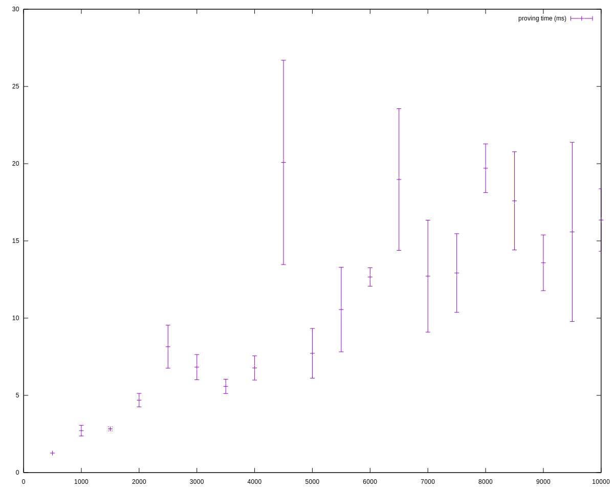
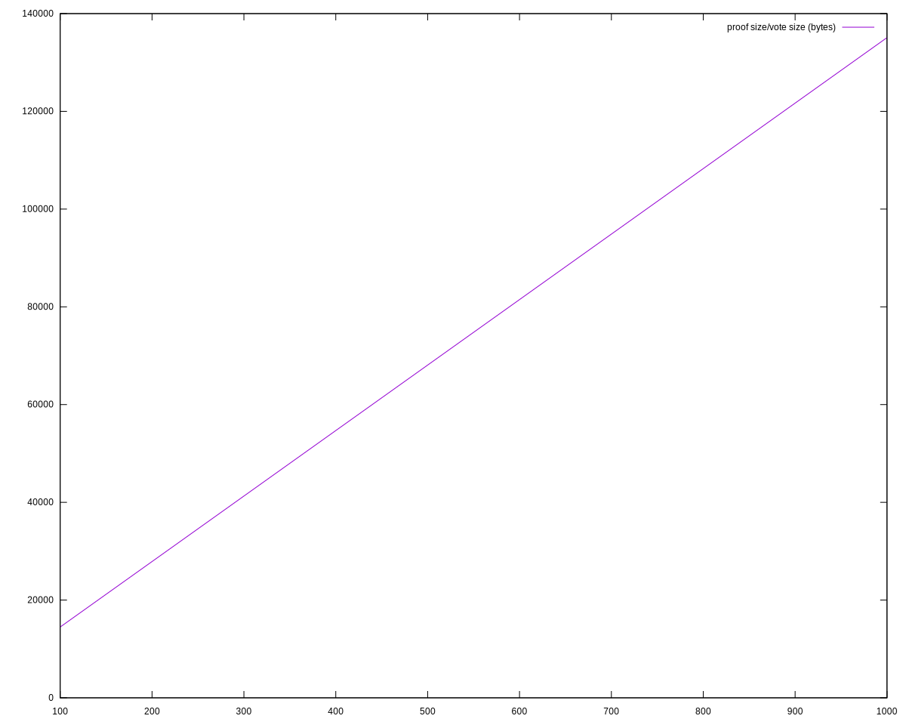
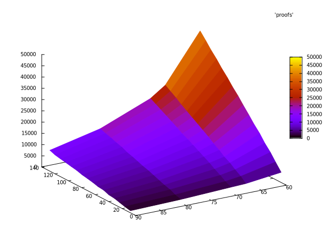

# Votes & Certificates

## ALBA Certificates

* [ALBAs](https://iohk.io/en/research/library/papers/approximate-lower-bound-arguments/) appears to provide a good basis for Peras certificates
* The [Prototype implementation in Haskell](https://github.com/cardano-scaling/alba) provides some evidence this construction could be feasible in the context of Peras

### Proving & Verification time

The following picture plots the time needed (in milliseconds) to build certificate for varying number of votes, assuming a security parameter of 128, honest share of 67% and vote size of 256 bytes.

We can observe that even in some extreme cases proving time stays consistently under 20ms and on the average is between 10 and 15ms for even large number of items. The wild variation in proving time for different number of input set is explained by the non-deterministic nature of the algorithm: We construct the proof through depth-first search, by repeatedly comparing hash values _modulo_ the expected number of honest items, so the number of comparisons and hashes to make may vary significantly depending on how the ordering of the list of items.

It's worth considering whether or not this dependency on the ordering of the items could be an attack vector as proving time could easily explode in case we need to explore more than a small fraction of the tree.

Verification time has not been plotted but is lower than 1ms in all the cases considered as it is tied to the number of hash computation one has to make which is $O(u + s_p)$.

### Certificate size

For a given set of parameters, eg. fixed values for $\lambda_{sec}$, $\lambda_{rel}$, and $n_p/n_f$ the proof size is perfectly linear and only depends on the size of each vote:

Varying the security parameter and the honest votes ratio for a fixed set of 1000 votes of size 200 yields the following diagram, showing the critical factor in proof size increase is the $n_p/n_f$ ratio: As this ratio decreases, the number of votes to include in proof grows superlinearly.

## Votes
