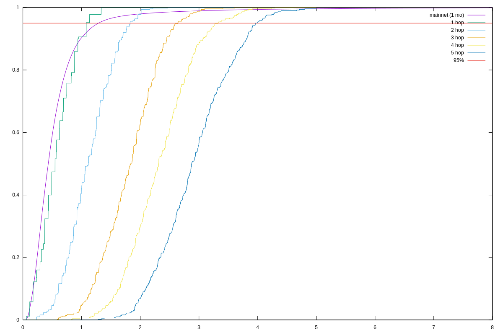

> [!NOTE]
> This is a copy of https://github.com/DeltaQ-SD/pnsol-deltaq-clone which is integrated in Peras to simplify modeling as the library is still a bit in flux.
> Potentially interesting changes will be upstreamed.


# Building Peras Model

All Peras-related models are written as Haskell code in the [plot-dqsd.hs](plot-dqsd.hs) file using the combinators provided in [DeltaQ.Algebra](lib/DeltaQ/Algebra.hs).

To generate diagrams, simply run this program:

```
$ cabal run
```


