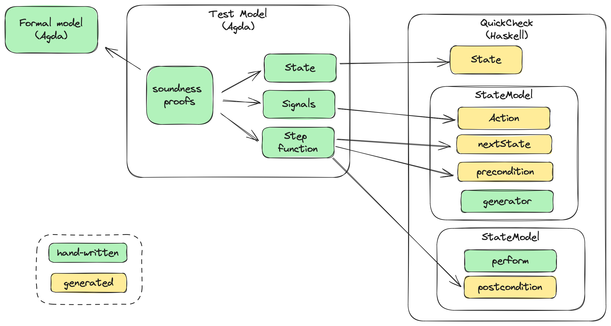

# Peras Team Paris Workshop

## Agenda

* (current) Peras walkthrough by Sandro
* Clarify what finality and settlement really are?
  * Write some checkable property
* Walkthrough of formal spec
  * Relate Bas Spitter's design w/ current Crypto proofs
  * Does BS's proof system scale to Peras?
* Write the current algorithm in Agda

## Day 1

### Peras Algorithm Walkthrough

Basic proof principle for Praos is to define a _Characteristic string_ where each character represents either some honest slot (0) or adversarial (1)
* An adversary can create several blocks
* An honest node builds on previous blocks up to Δ (maximum number of slots a honest node can look in the past to build a chain)

To prove some settlement bounds and safety of the protocol, we need to compute the _margin_, that is the difference between longest chain known to honest guys and second longest chain that an adversary can craft
* look at all possible graphs for a given string and compute minimum difference
* random walk b/w 0 and 1 (0 => down, 1 => up) => want to ensure the margin is negative
  * want to know the negative value of $k$ after which the probability of the margin ever going up to 0+ is very low
* Note the goal of the adversary is usually to double spend and create forks, the benefits of which are expected to be side-effects
  * Have honest parties accept a transaction that has a non reversible side-effect in the real world and then cancel the transaction in a fork

What's the difference b/w settlement & finality?
  * improving finality = at what point a block becomes part of the chain forever (but at the risk of some error margin)
  * improving settlement = a probabilistic notion, what's the probability for a transaction to be reverted?
  * what happens when something goes wrong?
    * finality ⟶ game over
    * Settlement ⟶ the network can recover over time
    * With Praos, even if the adversary manages to get an advantage for some time, when this advantage disappears the chain can "heal" itself
    * Of course, as long as this happens with $k$ blocks

Ethereum implemented protocols for fast finality after switching to PoS but they were proven to have flaws
* Casper + Ghost -> Ghasper
* Voting schemes are subject to _balancing attack_: The adversary has a easier time to balance the chains (match honest chain's weight)  with votes
* Good example of why we need to do proofs!
* Goldfish -> provably secure

Peras principles:
* In practice, we know that only small forks are observed on mainnet
* We want to calibrate voting rounds length so that probability of all nodes seeing same block is very high -> don't want to use # of blocks but depends on time (slots)
* the goal is to ensure that there's only one winner for each block
* proof that $\tau >= 3n/4$ with n = committee size, assuming adversarial t < n/2 (eg. one-third adversarial power)

The reason for _cooldown_ is counter the balancing attack whereby an adversary can withold votes and then later cast them to force a fork
* because of the initial advantage to adversary from failed vote, cooldown needs to take longer than k
* use the chain to store the certificate (public proof there was a quorum at some point) with max age A

A certificate is "just" a set of votes larger than quorum in a given round for the same block
* certificates can be slightly different for each node depending on vote diffusion and that's fine
* need R = chain ignorance period to say how long to ignore the chain for when in cooldown period, in order to avoid the shortening the cooldown period by seeing another (adversarial) cooldown trigger while waiting for recovery
* Note that $\mathrm{Cert}_{chain} ⊆ \mathrm{Cert}_{seen}$

Where do we put the certificate?
* [block body](https://github.com/IntersectMBO/cardano-ledger/blob/master/eras/babbage/impl/cddl-files/babbage.cddl) is not only the list of txs -> could add a field for certificate
* We could also put the certificate in a transaction within the block which would have the advantage of not requiring a change in block structures
* As the certificate is created and included in "cooldown block" by the BP, it's not a problem to be included as a (valid) transaction as it would bypass the whole mempool process and therefore would not be subject to congestion issues

### Questions

Q: Do we really need to store all the certs/votes?
* We could record the history of certificates in the latest one we bake and share that instead
* this is something research team could investigate post-submission

Q: How faster does Peras settles?
* If we have B = 1/10th of k (=2160) => need 10 rounds to get same settlement than k blocks (if U = 10s --> 100s)
* T_heal = k/10
* K = 11/10th T_CP + T_CQ

Rem: Risks from misbehaviour
* with Peras, you'll have consensus because of cooldown period so you can agree on who misbehaved!
* a possible extension of the protocol to limit cooldown periods which could happen due to bad network conditions would be for nodes to vote on _cancelling_ a cooldown certificate

Q: In what circumastances would Peras >> Praos ?
* Pb: Even with low/moderate adversarial power, it's possible to force entering cooldown which breaks the benefits of the prootocl
* Hard to quantify precisely rn, depends on L

Q: Is there some dominance of adversarial strategies in Praos vs. Peras?
* feels like it's easier in Peras

Q: Would there be a way to prove that an adversary can only force cooldown if they double vote (which is detectable) and therefore damage their reputation of produce?

Q: What are our Competitors doing?
* [Thunderella](https://eprint.iacr.org/2017/913.pdf)
* [Goldfish](https://arxiv.org/abs/2209.03255)
  * Also https://www.youtube.com/watch?v=DHlkydKPjkk
* Concordium
* [Ebb and Flow](https://www.computer.org/csdl/proceedings-article/sp/2021/893400a768/1t0x8EdnqoM)

### Writing Pseudo-code Algorithim in Agda

We spent time working on converting [Peras pseudo-code](https://docs.google.com/document/d/1w_jHsojcBxZHgGrr63ZGa4nhkgEpkL6a2cFYiq8Vf8c/edit) to actual (typechecked) Agda code, inventing a DSL that would be familiar to researchers. Here is a sample, with the full code available in the [Protocol.agda](https://github.com/input-output-hk/peras-design/blob/main/src/Peras/Protocol.agda#L178) file

Original specification from Google doc:

```
 upon entering new slot s
    if P is leader in slot s
      B := new block extending Cpref
      if Certs[rcurrent-2] = null
         and rcurrent - round(certseen) <= A
         and round(certseen) > round(certchain)
           B := (B, certseen)
           Cpref := Cpref || B
           output (chain, Cpref<-W>) to Z
```

The Agda code:

```agda
onNewSlot : Party -> Slot -> Node ⊤
onNewSlot p s =
 when (p isLeaderInSlot s) (do
     cpref ← preferredChain
     b ← forgeBlock cpref
     certs ← certificates
     certseen ← latestCertificateSeen
     certchain ← latestCertificateOnChain cpref
     let rcurrent = s / U
     when
       ( (certs [ rcurrent - 2 ]) == null
           ∧ ((rcurrent - round certseen) <= A)
           ∧ (round certseen > round certchain)
       ) do
         let b' = Certify b certseen
         cpref ← cpref extendWith b
         output (cpref trimmedBy W))
```

## Day 2

### Quviq presentation

Max and Ulf walked us through their prototype integration of Agda and quickcheck-dynamic, available in a [branch](https://github.com/input-output-hk/peras-design/tree/55ab966196f23adf5b684df815ca0e447f8598b7/test-demo). The basic principles are sketched in the following diagram:



* There's a distinct _Test Model_ which describes what the QC tests are interested in testing on the implementation, eg. it does not need to reflect the full _Formal model_ but can focus on specific aspects and use different data structures
* The _soundness_ of the Test model is guaranteed by Agda proofs that ensure tests only produce sequence of state transitions that are valid w.r.t to the formal model
* The grunt of the quickcheck-dynamic structure, apart from the `perform` code which is needed to connect with the SUT, is generated from this _Test model_

### Agda Model & Proofs

We went through the existing Agda model and discussed how this model relates to the researcher's formalism on one side, and to the original PoS paper on the other side

### Next steps

1. Move pseudo-code from Google doc to Agda code
   * Contemplate publishing it as a future paper?
   * Ensure both engineering and research use this as a reference point
2. Express settlement bounds improvement from Peras as a QCD property in Agda
   * Reuse "example" from Quviq
   * How to relate this model to the  "real" one
3. More work on Agda Peras model
   * Finish current proof
   * Align/reflect on the researchers' proof and model from the paper
4. ΔQ -> modeling vote diffusion
   * include vote verification/certificate creation time
5. Simulation(s)
6. Visual toy model of protocol
