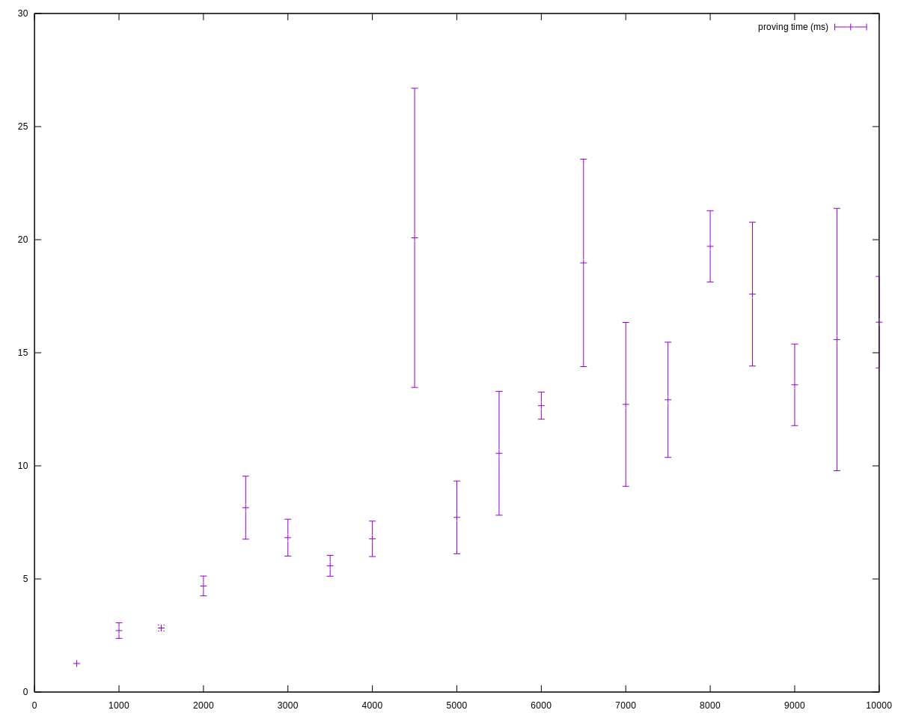
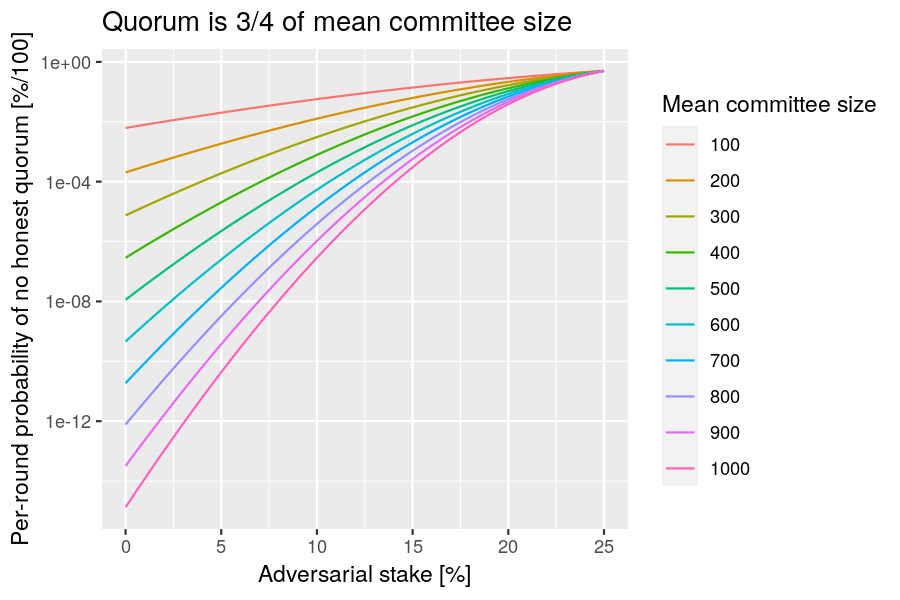
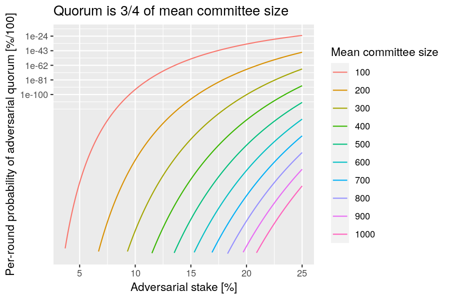
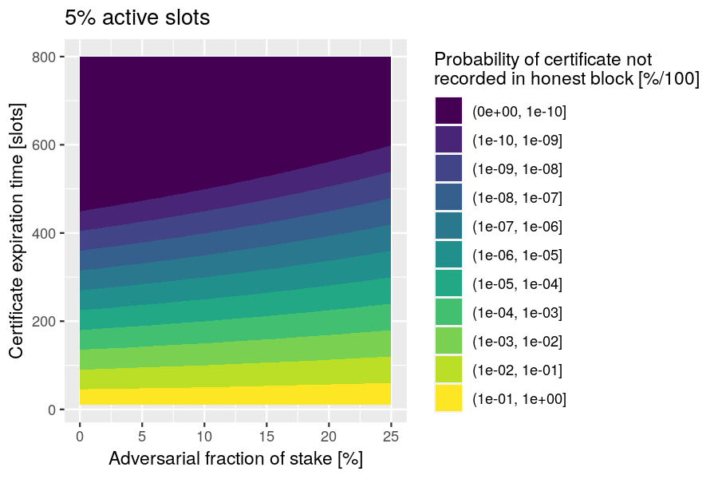
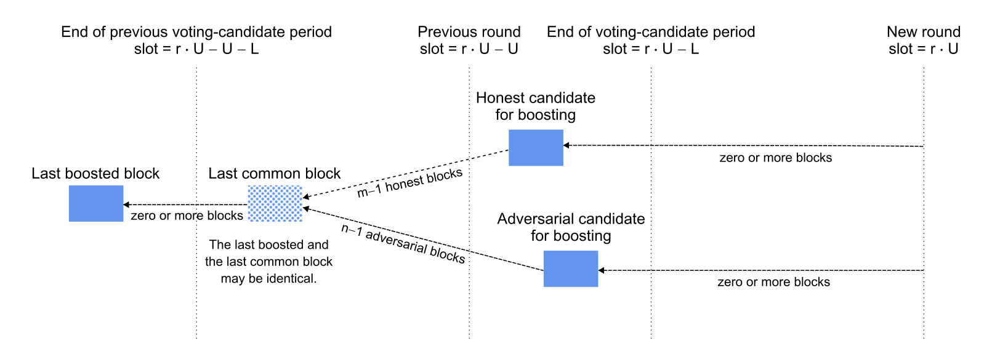
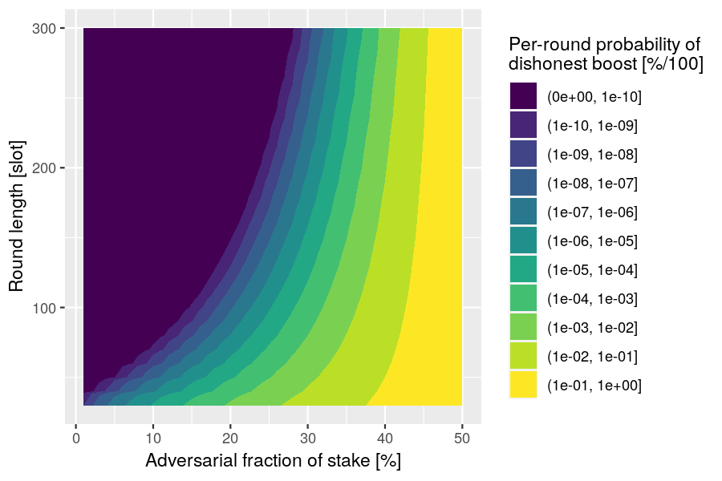
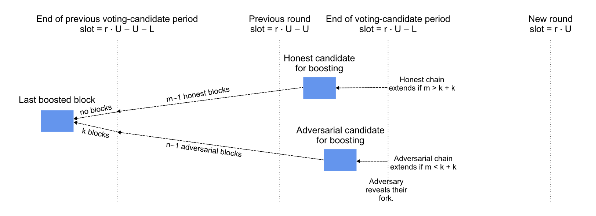
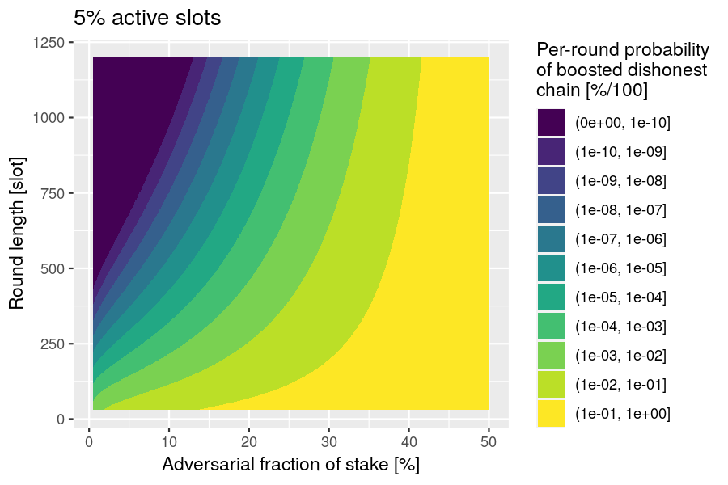

> [!IMPORTANT]
> Unlike for the first tech report, we should only include analyses that conform to the latest version of the protocol.

# Protocol definition

> [!WARNING]
> The following is a near-verbatim copy of Figure 2 of the draft Peras paper. The only signficant alterations are the following:
>
> - Omit preagreement
>     - Set the termination bound to zero: T ≡ 0
>     - The proposed block for voting is simply the youngest block at least L slots old on the locally preferred chain.
> - Do not track certificate arrival time: Δ ≡ 0
> - The initial set of certificates is the genesis certificate, not the empty set.
> - Clarified ambiguities.
> - Omit irrelevant details.

> [!TIP]
> In the sections below, should we specify how equivocation is handled?

## Variables

The protocol keeps track of the following variables, initialized to the values below:

- `In1`: $C_\text{pref} \gets C_\text{genesis}$: preferred chain;
- `In2`: $\mathcal{C} \gets \{C_\text{genesis}\}$: set of chains;
- `In3`: $\mathcal{V} \gets \emptyset$: set of votes;
- `In4`: $\mathsf{Certs} \gets \{\mathsf{cert}_\text{genesis}\}$: set of certificates;
- `In5`: $\mathsf{cert}^\prime \gets \mathsf{cert}_\text{genesis}$: the latest certificate seen;
- `In6`: $\mathsf{cert}^* \gets \mathsf{cert}_\text{genesis}$: the latest certificate on chain.

## Fetching

> [!TIP]
> In `Fe4`, do we want to specify that a new preferred chain is chosen only if the previously preferred chain is less weightier? As it stands now, a node might keep switching its preferred chain if there is a tie.

At the beginning of each slot:
- `Fe1`: Fetch new chains $\mathcal{C}_\text{new}$ and votes $\mathcal{V}_\text{new}$.
- `Fe2`: Add any new chains in $\mathcal{C}_\text{new}$ to $\mathcal{C}$, add any new certificates contained in chains in $\mathcal{C}_\text{new}$ to $\mathsf{Certs}$.
- `Fe3`: Add $\mathcal{V}_\text{new}$ to $\mathcal{V}$ and turn any new quorum in $\mathcal{V}$ into a certificate $\mathsf{cert}$ and add $\mathsf{cert}$ to $\mathsf{Certs}$.
- `Fe4`: Set $C_\text{pref}$ to the heaviest (w.r.t.\ $\mathsf{Wt}_\mathsf{P}(\cdot)$) valid chain in $\mathcal{C}$.
    - Each party $\mathsf{P}$ assigns a certain weight to every chain $C$, based on $C$'s length and all certificates that vote for blocks in $C$ that $\mathsf{P}$ has seen so far (and thus stored in a local list $\mathsf{Certs}$).
    - `CW1`: Let $\mathsf{certCount}_\mathsf{P}(C)$ denote the number of such certificates, i.e., $\mathsf{certCount}_\mathsf{P}(C) := \left| \left\{ \mathsf{cert} \in \mathsf{Certs} : \mathsf{cert} \text{ votes for a block on } C \right\} \right|$.
    - `CW2`: Then, the weight of the chain $C$ in $\mathsf{P}$'s view is $\mathsf{Wt}_\mathsf{P}(C) := \mathsf{len}(C) + B \cdot \mathsf{certCount}_\mathsf{P}(C)$ for a protocol parameter $B$.
- `Fe5`: Set $\mathsf{cert}^\prime$ to the certificate with the highest round number in $\mathsf{Certs}$.
- `Fe6`: Set $\mathsf{cert}^*$ to the certificate with the highest round number on (i.e., included in) $C_\text{pref}$.

## Block creation

> [!TIP]
> Do we want to specify that block creation occurs after fetching?

Whenever party $\mathsf{P}$ is slot leader in a slot $s$, belonging to some round $r$:

- `BC1`: Create a new block $\mathsf{block} = (s, \mathsf{P}, h, \mathsf{cert}, ...)$, where
    - `BC2`: $h$ is the hash of the last block in $C_\text{pref}$,
    - `BC3`: $\mathsf{cert}$ is set to $\mathsf{cert}^\prime$ if
        - `BC4`: there is no round-$(r-2)$ certificate in $\mathsf{Certs}$, and
        - `BC5`: $r - \mathsf{round}(\mathsf{cert}^\prime) \leq A$, and
        - `BC6`: $\mathsf{round}(\mathsf{cert}^\prime) > \mathsf{round}(\mathsf{cert}^*)$,
        - `BC7`: and to $\bot$ otherwise,
- `BC8` Extend $C_\text{pref}$ by $\mathsf{block}$, add the new $C_\text{pref}$ to $\mathcal{C}$ and diffuse it.

## Voting

> [!TIP]
> Do we want to specify that voting occurs after fetching and block creation?

Party $\mathsf{P}$ does the following at the beginning of each voting round $r$:

- `Vo1`: Let $\mathsf{block}$ be the youngest block at least $L$ slots old on $C_\text{pref}$.
- `Vo2`: If party $\mathsf{P}$ is (voting) committee member in a round $r$,
    - either
        - `VR-1A`: $\mathsf{round}(\mathsf{cert}^\prime) = r-1$ and $\mathsf{cert}^\prime$ was received before the end of round $r-1$, and
        - `VR-1B`: $\mathsf{block}$ extends (i.e., has the ancestor or is identical to) the block certified by $\mathsf{cert}^\prime$,
    - or
        - `VR-2A`: $r \geq \mathsf{round}(\mathsf{cert}^\prime) + R$, and
        - `VR-2B`: $r = \mathsf{round}(\mathsf{cert}^*) + c \cdot K$ for some $c > 0$,
    - `Vo3`: then create a vote $v = (r, \mathsf{P}, h,...)$,
    - `Vo4`: Add $v$ to $\mathcal{V}$ and diffuse it.

# Votes & Certificates

## ALBA Certificates

* [ALBAs](https://iohk.io/en/research/library/papers/approximate-lower-bound-arguments/) appears to provide a good basis for Peras certificates
* The [Prototype implementation in Haskell](https://github.com/cardano-scaling/alba) provides some evidence this construction could be feasible in the context of Peras

### Proving & Verification time

The following picture plots the time needed (in milliseconds) to build certificate for varying number of votes, assuming a security parameter of 128, honest share of 67% and vote size of 256 bytes.



We can observe that even in some extreme cases proving time stays consistently under 20ms and on the average is between 10 and 15ms for even large number of items. The wild variation in proving time for different number of input set is explained by the non-deterministic nature of the algorithm: We construct the proof through depth-first search, by repeatedly comparing hash values _modulo_ the expected number of honest items, so the number of comparisons and hashes to make may vary significantly depending on how the ordering of the list of items.

It's worth considering whether or not this dependency on the ordering of the items could be an attack vector as proving time could easily explode in case we need to explore more than a small fraction of the tree.

Verification time has not been plotted but is lower than 1ms in all the cases considered as it is tied to the number of hash computation one has to make which is $O(u + s_p)$.

### Certificate size

For a given set of parameters, eg. fixed values for $\lambda_{sec}$, $\lambda_{rel}$, and $n_p/n_f$ the proof size is perfectly linear and only depends on the size of each vote:


Varying the security parameter and the honest votes ratio for a fixed set of 1000 votes of size 200 yields the following diagram, showing the critical factor in proof size increase is the $n_p/n_f$ ratio: As this ratio decreases, the number of votes to include in proof grows superlinearly.


## Votes

# Constraints on Peras Parameters

| Parameter | Symbol | Units | Description | Constraints | Rationale |
| ---- | ---- | ---- | ---- | ---- | ---- |
| Round length | $U$ | slots | The duration of each voting round. | $U \geq \Delta$ | All of a round's votes must be received before the end of the round. |
| Block selection offset | $L$ | slots | The minimum age of a candidate block for being voted upon. | $L \leq U$ | Rule VR-1B will fail if the candidate block is older than the most recently certified block. |
| Chain ignorance period | $R$ | rounds | The number of rounds for which to ignore certificates after entering a cool-down period. | $R = \left\lceil A / U \right\rceil$ | Ensure chain-ignorance period lasts long enough to include a certificate on the chain. |
| Cool-down period | $K$ | rounds | The minimum number of rounds to wait before voting again after a cool-down period starts. | $K = \left\lceil \frac{A + T_\text{CP}}{U} \right\rceil$ | After a quorum failure, the chain must heal, achieve quality, and attain a common prefix. |
| Certificate expiration | $A$ | slots | The maximum age for a certificate to be included in a block. | $A = T_\text{heal}+T_\text{CQ}$ | After a quorum failure, the chain must heal and achieve quality. |
| Certification boost | $B$ | blocks | The extra chain weight that a certificate gives to a block. | $B \gt 0$ | Peras requires that some blocks be boosted. |
| Quorum size | $\tau$ | parties | The number of votes required to create a certificate. | $\tau \gt 3 n / 4$ | Guard against a minority (<50%) of adversarial voters. |
| Committee size | $n$ | parties | The number of members on the voting committee. | $n \gt 0$ | Peras requires a voting committee. |
| Preagreement termination | $T$ | slots | The maximum number of slots needed for preagreement. | $T \lt U$ | Preagreement must complete before the round ends. |
| Network diffusion time | $\Delta$ | slots | Upper limit on the time needed to diffuse a message to all nodes. | $\Delta \gt 0$ | Messages have a finite delay. |
| Active slot coefficient | $\alpha$ | 1/slots | The probability that a party will be the slot leader for a particular slot. | $0 \lt \alpha \leq 1$ | Blocks must be produced. |
| Healing time | $T_\text{heal}$ | slots | Healing period to mitigate a strong (25-50%) adversary. | $T_\text{heal} ≟ \mathcal{O}\left( B / \alpha \right)$ | Sufficient blocks must be produced to overcome an adversarially boosted block. |
| Chain-quality time | $T_\text{CQ}$ | slots | Ensure the presence of at least one honest block on the chain. | $T_\text{CQ} ≟ \mathcal{O} \left( \left( \log (1 - \alpha) \right)^{-1} \right)$ | A least one honest block must be produced. |
| Common-prefix time | $T_\text{CP}$ | slots | Achieve settlement. | $T_\text{CP} ≟ \mathcal{O} \left( k / \alpha \right)$ | The Ouroboros Praos security parameter defines the time for having a common prefix. |
| Security parameter | $k$ | blocks | The Ouroboros Praos security parameter. | $k = 2160$ | Value for the Cardano mainnet. |

*Note that parameters $T$ and $\Delta$ are not used in this initial specification of the Peras protocol.

# Simulating Peras

## Protocol simulation

> [!IMPORTANT]
> Discuss the protocol simulation

## Protocol visualization

> [!IMPORTANT]
> Write up a description of the Peras visualizer.

## Markov-chain simulation

> [!IMPORTANT]
> Discuss the Markov-chain simulation and results

# Analyses of adversarial scenarios

> [!CAUTION]
> Several correctly-formatted equations are not rendered correctly by GitHub's MathJAX. Make sure that these render correctly via `pandoc`.

In this section we use the following notation:

- Active-slot coefficient: $\alpha$
- Round length: $U$
- Block-selection offset: $L$
- Certificate expiration: $A$
- Quorum for creating a certificate: $\tau = \frac{3}{4} C$
- Fraction of adversarial stake: $f$
- Mean size of the voting committee: $C$
- Per-slot probability of a block:
	- Honest block: $p = 1 - (1 - \alpha)^{1 - f} \approx \alpha \cdot (1 - f)$
	- Adversarial block: $q = 1 - (1 - \alpha)^f \approx \alpha \cdot f$
- Binomial distribution of $n$ trials each with probability $p$ :
	- Probability density function: $\mathbf{p}_\text{binom}(k,n,p)= {n\choose{k}} \cdot p^k \cdot (1 - p)^{n-k}$
	- Cumulative probability function: $\mathbf{P}_\text{binom}(m,n,p) = \sum_{k=0}^m \mathbf{p}(k,n,p)$
- Normal distribution with mean $\mu$ and standard deviation $\sigma$:
	- Probability density function: $\mathbf{p}_\text{normal}(x, \mu, \sigma) = \frac{1}{\sqrt{2 \pi \sigma^2}} e^{- \frac{(x - \mu)^2}{2 \sigma^2}}$
	- Cumulative probability function: $\mathbf{P}_\text{normal}(x,\mu,\sigma) = \int_{-\infty}^x dt \, \mathbf{p}_\text{normal}(t, \mu, \sigma)$

> [!IMPORTANT]
> Discuss the relationship between per-slot probabilities and per-block probabilities.

> [!IMPORTANT]
> Add paragraphs discussing how to interpret probabilities in terms of the security of a long-running blockchain.

## No honest quorum in round

***Question:*** What is the probability of not reaching a quorum if adversaries abstain from voting?

***Relevance:*** This analysis can be used to select a mean committee size that is appropriate for a given risk tolerance.

***Risk:*** A adversary can trigger a cool-down period if they abstain from voting.

***Scenario:*** Consider the situation where the adversary decides not to vote in a round, in order to prevent a quorum from occurring and to force the chain into a cool-down period. This occurs when the number of honest voters is less than the quorum size.

***Analysis:*** Let $\beta$ be the probability that a unit of stake is selected for voting-committee membership. Let $S$ be the total stake and $H = (1 - f) \cdot S$ be the honest stake. Assuming the total stake is large, we can approximate the binomial distribution by a normal one and express the probability of not having an an honest quorum as follows:

$$
P = \mathbf{P}_\text{binom} (\lfloor\tau\rfloor, H, \beta) \approx \mathbf{P}_\text{normal} \left( \tau, H \cdot \beta, \sqrt{H \cdot \beta \cdot (1 - \beta)} \right) \approx \mathbf{P}_\text{normal} \left( \tau, H \cdot \beta, \sqrt{H \cdot \beta} \right)
$$

Now set the quorum size to the recommended value $\tau = \frac{3}{4} C$ to discover a simple relationship:

$$
P \approx \mathbf{P}_\text{normal} \left( f , \frac{1}{4} , \sqrt{\frac{1 - f}{C}} \right)
$$

The following R function performs this computation:

```R
function(f, C)
  pnorm(f, 1 / 4, sqrt((1 - f) / C))
```

***Example:*** Plot the probability of not having an honest quorum as a function of the adversarial fraction of stake, for various mean sizes of the voting committee.



## Adversarial quorum

***Question:*** What is the probability that adversaries can form a voting quorum in a round?

***Relevance:*** This analysis can be used to select a mean committee size that is appropriate for a given risk tolerance.

***Risk:*** An adversary can boost an adversarial fork.

***Scenario:*** Consider the situation where adversaries are lucky enough in the voting-committee sortition to hold a quorum of votes.

***Analysis:*** The analysis proceeds similarly to the "no honest quorum" scenario, but for adversaries having at least a quorum of votes.

$$
P = 1 - \mathbf{P}_\text{binom} (\lceil\tau\rceil, S - H, \beta) \approx 1 - \mathbf{P}_\text{normal} \left( \tau, (S - H) \cdot \beta, \sqrt{(S - H) \cdot \beta \cdot (1 - \beta)} \right) \approx 1 - \mathbf{P}_\text{normal} \left( \tau, f \cdot C, \sqrt{f \cdot C} \right)
$$

Now set the quorum size to the recommended value $\tau = \frac{3}{4} C$ to discover a simple relationship:

$$
P \approx \mathbf{P}_\text{normal} \left( f , \frac{3}{4} , \sqrt{\frac{f}{C}} \right)
$$

The following R function performs this computation:

```R
function(f, C)
  pnorm(f, 3 / 4, sqrt(f / C))
```

***Example:*** Plot the probability of having an adversarial quorum as a function of the adversarial fraction of stake, for various mean sizes of the voting committee.



## No certificate in honest block

***Question:*** What is the probability that adversaries can prevent a certificate from being included in a block before the certificate expires?

***Relevance:*** This analysis can be used to set the certificate-expiration parameter $A$.

***Risk:*** An adversary can trigger a premature ending of the cool-down period (via rule VR-2B) by preventing a new *cert\** from being recorded in a block.

***Scenario:***  Consider the situation where the voting certificate must be included on the chain (via rule Block Creation 1b), but no honest blocks are forged before the last *cert′* expires and adversaries abstain from updating *cert′* when they forge blocks.

***Analysis:***. The probability that adversaries forge every block during the period when the certificate hasn't expired is

$$
P = (1 - p)^A = (1 - \alpha)^{(1 - f) \cdot A}
$$

and this can be represented as the following R function:

```R
function(A, f, alpha)
  (1 - alpha)^((1 - f) * A)
```

***Example:*** Assuming an active-slot coefficient of 5%, plot the probability of a certificate not being recorded in an honest block before the certificate expires.



## Adversarial chain receives boost

> [!IMPORTANT]
> Discuss why there are several variants here.

### Variant 1

> [!CAUTION]
> This variant needs reworking!

***Question.*** What is the probability that an adversarial chain receives the next boost?

***Relevance:*** This analysis provides guidance on selecting the round length.

***Risk:*** An adversary can anchor their chain by having one of its later blocks boosted.

***Scenario.*** It currently is round $r$ and a certificate was created in round $r - 1$ for a block at least $U + L$ slots in the past that is also in the common prefix of the honest and adversarial chains. The honest parties lengthen one fork by $m \ge 0$ blocks to the next candidate for voting (i.e., the newest block on that fork that is at least $L$ slots old) and the adversarial parties similarly lengthen a separate fork by $n \ge 0$ blocks. If the adversarial chain is revealed to the honest parties before the start of the new round $r$ and if the adversarial chain is longer (i.e., $n \gt m$), then the voting committee will vote to boost the adversarial chain. The per-slot probability of adding a block to the honest or adversarial chain is $p$ or $q$, respectively.



***Analysis.*** Assume that the block- and vote-diffusion times are negligible, so that the last boosted block is indeed the last block before slot $r \cdot U - U - L$ and that the honest and adversarial candidates are indeed the last blocks on their forks before slot $r \cdot U - l$. (Note that this neglects the probability that the adversary will privately extend the last boosted block before slot $r \cdot U - U - L$.) Thus the lengthening of the two forks during the $U$ slots are the last boosted block are binomially distributed with parameters $m$ and $p$ (honest) and $n$ and $p$ (adversarial). The probability of $m < n$ is

$$
P = \sum_{0 \le m \lt n \le U} \mathbf{p}_\text{binom}(m,U,p) \cdot \mathbf{p}_\text{binom}(n,U,q) = \sum_{n=1}^U \mathbf{P}_\text{binom}(n-1,U,p) \cdot \mathbf{p}_\text{binom}(n,U,q)
$$

and the following R function implements this computation:

```R
function(U, p, q)
  sum( pbinom(1:U-1, U, p) * dbinom(1:U, U, q) )
```

***Example.*** Let the active-slot coefficient $\alpha = 0.05 \, \text{slot}^{-1}$ and let $f$ be the fraction of adversarial stake, so $p = \alpha \cdot (1 - f)$ and $q = \alpha \cdot f$. Plot the probability of the dishonest boost as a function of the adversarial fraction of stake and the round length.



### Variant 2

***Question.*** What is the probability that an adversarial chain receives the next boost?

***Relevance:*** This analysis provides guidance on selecting the round length.

***Risk:*** An adversary can anchor their chain by having one of its later blocks boosted, resulting in honest blocks being rolled back.

***Scenario.*** It currently is round $r$ and a certificate was created in round $r - 1$ for a block at least $U + L$ slots in the past that is also the common prefix of the honest and adversarial chains. The honest parties lengthen one fork by $m \ge 0$ blocks to the next candidate for voting (i.e., the newest block on that fork that is at least $L$ slots old) and the adversarial parties similarly lengthen a separate fork by $k \ge 0$ blocks before slot $r \cdot U - U - L$ and by $n \ge 0$ blocks subsequently. If the adversarial chain is revealed to the honest parties at slot $r \cdot U = L$ and if the adversarial chain is longer (i.e., $k + n \gt m$), then all parties will extend the adversarial chain and then next voting committee will boost the adversarial chain, causing the $m$ honest blocks to be rolled back.



***Analysis.*** Assume that the block- and vote-diffusion times are negligible, so that the last boosted block is indeed the last public block before slot $r \cdot U - U - L$ and that the honest and adversarial candidates are indeed the last blocks on their forks before slot $r \cdot U - l$. Thus the lengthening of the two forks during the $U$ slots are the last boosted block are binomially distributed with parameters $m$ and $p$ (honest) and $n$ and $p$ (adversarial). Additionally, the adversary may privately produce $k$ blocks after the last boosted block and before slot $r \cdot U - U - L$: this random variable for producing such blocks is negative-binomially distributed. The probability of $m < k + n$ is

$$
P = \sum_{\substack{0 \le m \le U \\ 0 \le n \le U \\ 0 \le k \le \infty \\ m \lt n + k}} (1 - f) f^k \cdot {U\choose{m}} p^m (1-p)^{U-m} \cdot {U\choose{n}} q^n (1-q)^{U-n}
$$
which simplifies to
$$
P = (1 - f) \cdot \sum_{n=1}^U \mathbf{P}_\text{binom}(n-1,U,p) \cdot \mathbf{p}_\text{binom}(n,U,q) + (1 - f) \cdot \sum_{k=1}^U f^k \cdot \sum_{n=0}^{U-k} \mathbf{P}_\text{binom}(n+k-1,U,p) \cdot \mathbf{p}_\text{binom}(n,U,q) + f^{U+1}
$$

and we can be implemented in R as the following function:

```R
function (U, p, q) {
  f <- q / (p + q)
  p0 <- (1 - f) * sum( pbinom(0:(U-1), U, p) * dbinom(1:U, U, q) )
  pk <- (1 - f) * sum( mapply(function(k) f^k * sum( pbinom((k-1):(U-1), U, p) * dbinom(0:(U-k), U, q) ), 1:U) )
  pinf <- f^(U+1)
  p0 + pk + pinf
}
```

***Example.*** Let the active-slot coefficient $\alpha = 0.05 \, \text{slot}^{-1}$ and let $f$ be the fraction of adversarial stake, so $p = \alpha \cdot (1 - f)$ and $q = \alpha \cdot f$. Plot the probability of the dishonest boost as a function of the adversarial fraction of stake and the round length.



# Recommendations for Peras Parameters

> [!IMPORTANT]
> List the recommended ranges for Peras parameters, based on theoretical guidance, analytic results, and simulation studies.

## Conclusion
