> [!IMPORTANT]
> Unlike for the first tech report, we should only include analyses that conform to the latest version of the protocol.

# Executive summary

This section lists a number of findings, conclusions, ideas, and known risks that we have garnered as part of the Peras innovation project.

## Product

We have refined our analysis and understanding of Peras protocol, taking into account its latest evolutions:

* A promising solution for votes and certificates construction has been identified based on existing VRF/KES keys and ALBAs certificates
  * This solution relies on existing nodes' infrastructure and cryptographic primitives and therefore should be straightforward to implement and deploy
* Peras' votes and certificates handling will have a negligible impact on existing node CPU, network bandwidth, and memory requirements.
  * They will have a moderate impact on storage requirements leading to a potential increase of disk storage of 15 to 20%.
  * Peras might have a modereate economical impact for SPOs running their nodes with Cloud providers due to increasing network _egress traffic_
* Peras impact on settlement probabilities is still _unclear_ and will require some more time to analyse
  * Latest adversarial scenarios analysis lead to an increase in expected settlement time to roughly 30 minutes
* We think development of a pre-alpha prototype integrated with the cardano-node should be able to proceed

## Process

The following pictures shows how our R&D process evolved over the course of the past few months.

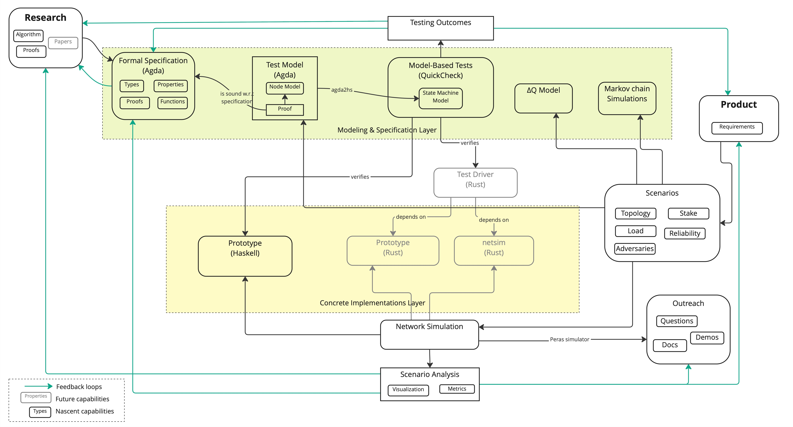

* Formal specification work has focused on aligning with _pre-alpha_ version of the protocol and writing safety proofs for Peras using _characteristic string_ technique similar to the one used in various Praos-related papers
* The link between the _Formal specification_ and implementation through [_Conformance tests_](#conformance-testing) has been strenghthened thanks to fruitful collaboration with Quviq:
  * The _Test model_ aka. _executable  specification_ is defined in Agda then projected to Haskell for direct reuse by `quickcheck-dynamic` execution engine
  * A _Soundness proof_ ensures it's consistent with the (higher level) formal specification
  * We haven't yet covered _adversarial behaviour_ but most scenarios should be straightforward to implement
* We have discontinued Rust prototype support, from want of time but we haven't changed how tests are run so we have strong confidence any implementation with a compatible API should be testable
* We have built a user-facing simulation tool that proved helpful to better understand the protocol's behaviour, spot potential issues, and align all stakeholders over an umanbiguous prototype
* We have built [Markov chains](#markov-chain-simulation)-based models to simulate various interesting large scale behaviours of Peras probabilistically, providing a wealth of insights on parameters interaction
* We have continued investigating the use of ΔQ formalism, trying to leverage more recent implementations for modelling [vote diffusion](#vote-diffusion)
* While there remain some work to be done on that front, we should be able to make Peras work including the present report fully public

# Introduction

## Software Readiness Level

### Last stage (SRL 3)

| Questions to resolve                                                                                          | Status  |
|---------------------------------------------------------------------------------------------------------------|---------|
| Critical functions/components of the concept/application identified?                                          | Done    |
| Subsystem or component analytical predictions made?                                                           | Done    |
| Subsystem or component performance assessed by Modeling and Simulation?                                       | Done    |
| Preliminary performance metrics established for key parameters?                                               | Done    |
| Laboratory tests and test environments established?                                                           | Done    |
| Laboratory test support equipment and computing environment completed for component/proof-of-concept testing? | N/A     |
| Component acquisition/coding completed?                                                                       | Partial |
| Component verification and validation completed?                                                              | Mostly  |
| Analysis of test results completed establishing key performance metrics for components/ subsystems?           | Done    |
| Analytical verification of critical functions from proof-of-concept made?                                     | Done    |
| Analytical and experimental proof-of-concept documented?                                                      | Done    |

### Current stage (SRL 4)

| Questions to resolve                                                                                                                     | Status  |
|------------------------------------------------------------------------------------------------------------------------------------------|---------|
| Concept/application translated into detailed system/subsystem/component level software architecture design?                              | Partial |
| Preliminary definition of operational environment completed?                                                                             | Done    |
| Laboratory tests and test environments defined for integrated component testing?                                                         | Partial |
| Pre-test predictions of integrated component performance in a laboratory environment assessed by Modeling and Simulation?                | Done    |
| Key parameter performance metrics established for integrated component laboratory tests?                                                 | Done    |
| Laboratory test support equipment and computing environment completed for integrated component testing?                                  | Partial |
| System/subsystem/component level coding completed?                                                                                       | Partial |
| Integrated component tests completed?                                                                                                    | Partial |
| Analysis of test results completed verifying performance relative to predictions?                                                        | Done    |
| Preliminary system requirements defined for end users' application?                                                                      | Done    |
| Critical test environments and performance predictions defined relative operating environment?                                           | Done    |
| Relevant test environment defined?                                                                                                       | Done    |
| Integrated component tests completed for reused code?                                                                                    | Done    |
| Integrated component performance results verifying analytical predictions and definition of relevant operational environment documented? | Done    |

Relevant documents:

| document                 | status  |
|--------------------------|---------|
| Detailed Design Document | Partial |
| Formal Specification     | Done    |
| Proofs                   | Done    |
| Simulations              | Done    |

# Protocol definition

> [!WARNING]
> The following is a near-verbatim copy of Figure 2 of the draft Peras paper. The only signficant alterations are the following:
>
> - Omit preagreement
>     - Set the termination bound to zero: T ≡ 0
>     - The proposed block for voting is simply the youngest block at least L slots old on the locally preferred chain.
> - Do not track certificate arrival time: Δ ≡ 0
> - The initial set of certificates is the genesis certificate, not the empty set.
> - Clarified ambiguities.
> - Omit irrelevant details.
> - Made chain-preference deterministic.
> - Sequenced operations.

> [!IMPORTANT]
> Do we want to provide a detailed description of the protocol here?
> Seems to me we should reference the Agda specification and only provide a high-level overview of what has changed since last tech report.
> If we delete this section, then we need to document how the executable specification varies from the paper and/or the relational specification.

## Variables

The protocol keeps track of the following variables, initialized to the values below:

- `In1`: $C_\text{pref} \gets C_\text{genesis}$: preferred chain;
- `In2`: $\mathcal{C} \gets \{C_\text{genesis}\}$: set of chains;
- `In3`: $\mathcal{V} \gets \emptyset$: set of votes;
- `In4`: $\mathsf{Certs} \gets \{\mathsf{cert}_\text{genesis}\}$: set of certificates;
- `In5`: $\mathsf{cert}^\prime \gets \mathsf{cert}_\text{genesis}$: the latest certificate seen;
- `In6`: $\mathsf{cert}^* \gets \mathsf{cert}_\text{genesis}$: the latest certificate on chain.

## Sequence

The protocol operations occur sequentially in the following order:

- Fetching
- Block Creation
- Voting

## Fetching

At the beginning of each slot:
- `Fe1`: Fetch new chains $\mathcal{C}_\text{new}$ and votes $\mathcal{V}_\text{new}$.
- `Fe2`: Add any new chains in $\mathcal{C}_\text{new}$ to $\mathcal{C}$, add any new certificates contained in chains in $\mathcal{C}_\text{new}$ to $\mathsf{Certs}$.
    - `Fe2x`: Discard any equivocated blocks or certificates: i.e., do not add them to $\mathcal{C}$ or $\mathsf{Certs}$.
- `Fe3`: Add $\mathcal{V}_\text{new}$ to $\mathcal{V}$ and turn any new quorum in $\mathcal{V}$ into a certificate $\mathsf{cert}$ and add $\mathsf{cert}$ to $\mathsf{Certs}$.
    - `Fe3x`: Discard any equivocated votes: i.e., do not add the to $\mathcal{V}$.
- `Fe4`: Set $C_\text{pref}$ to the heaviest (w.r.t. $\mathsf{Wt}_\mathsf{P}(\cdot)$) valid chain in $\mathcal{C}$.
    - `Fe4x`: *If several chains have the same weight, select the one whose tip has the smallest block hash as the preferred one.*
    - Each party $\mathsf{P}$ assigns a certain weight to every chain $C$, based on $C$'s length and all certificates that vote for blocks in $C$ that $\mathsf{P}$ has seen so far (and thus stored in a local list $\mathsf{Certs}$).
    - `CW1`: Let $\mathsf{certCount}_\mathsf{P}(C)$ denote the number of such certificates, i.e., $\mathsf{certCount}_\mathsf{P}(C) := \left| \left\{ \mathsf{cert} \in \mathsf{Certs} : \mathsf{cert} \text{ votes for a block on } C \right\} \right|$.
    - `CW2`: Then, the weight of the chain $C$ in $\mathsf{P}$'s view is $\mathsf{Wt}_\mathsf{P}(C) := \mathsf{len}(C) + B \cdot \mathsf{certCount}_\mathsf{P}(C)$ for a protocol parameter $B$.
- `Fe5`: Set $\mathsf{cert}^\prime$ to the certificate with the highest round number in $\mathsf{Certs}$.
- `Fe6`: Set $\mathsf{cert}^*$ to the certificate with the highest round number on (i.e., included in) $C_\text{pref}$.

## Block creation

Whenever party $\mathsf{P}$ is slot leader in a slot $s$, belonging to some round $r$:

- `BC1`: Create a new block $\mathsf{block} = (s, \mathsf{P}, h, \mathsf{cert}, ...)$, where
    - `BC2`: $h$ is the hash of the last block in $C_\text{pref}$,
    - `BC3`: $\mathsf{cert}$ is set to $\mathsf{cert}^\prime$ if
        - `BC4`: there is no round-$(r-2)$ certificate in $\mathsf{Certs}$, and
        - `BC5`: $r - \mathsf{round}(\mathsf{cert}^\prime) \leq A$, and
        - `BC6`: $\mathsf{round}(\mathsf{cert}^\prime) > \mathsf{round}(\mathsf{cert}^*)$,
        - `BC7`: and to $\bot$ otherwise,
- `BC8` Extend $C_\text{pref}$ by $\mathsf{block}$, add the new $C_\text{pref}$ to $\mathcal{C}$ and diffuse it.

## Voting

Party $\mathsf{P}$ does the following at the beginning of each voting round $r$:

- `Vo1`: Let $\mathsf{block}$ be the youngest block at least $L$ slots old on $C_\text{pref}$.
- `Vo2`: If party $\mathsf{P}$ is (voting) committee member in a round $r$,
    - either
        - `VR-1A`: $\mathsf{round}(\mathsf{cert}^\prime) = r-1$ and $\mathsf{cert}^\prime$ was received before the end of round $r-1$, and
        - `VR-1B`: $\mathsf{block}$ extends (i.e., has the ancestor or is identical to) the block certified by $\mathsf{cert}^\prime$,
    - or
        - `VR-2A`: $r \geq \mathsf{round}(\mathsf{cert}^\prime) + R$, and
        - `VR-2B`: $r = \mathsf{round}(\mathsf{cert}^*) + c \cdot K$ for some $c > 0$,
    - `Vo3`: then create a vote $v = (r, \mathsf{P}, h,...)$,
    - `Vo4`: Add $v$ to $\mathcal{V}$ and diffuse it.

# Votes & Certificates

This section details the Peras voting process, from the casting and detailed structure of votes, to the creation, diffusion, and storage of certificates.

## Votes

### Overview

Voting in Peras is mimicked after the _sortition_ algorithm used in Praos, e.g it is based on the use of a _Verifiable Random Function_ by each stake-pool operator guaranteeing the following properties:

* The probability for each voter to cast their vote in a given round is correlated to their share of total stake,
* It should be computationally impossible to predict a given SPO's schedule without access to their secret key VRF key,
* Verification of a voter's right to vote in a round should be efficiently computable,
* Vote should be unique and non-malleable (this is a requirement for the use of efficient certificates aggregation, see [below](#alba-certificates)).

Additionally we would like the following property to be provided by our voting scheme:

* Voting should require minimal additional configuration (ie. key management) for SPOs,
* Voting and certificates construction should be fast in order to ensure we do not interfere with other operations happening in the node.

We have experimented with two different algorithms for voting, which we detail below.

### Structure of votes

We have used an identical structure for single `Vote`s, for both algorithms. We define this structure as a CDDL grammar, inspired by the [block header](https://github.com/input-output-hk/cardano-ledger/blob/e2aaf98b5ff2f0983059dc6ea9b1378c2112101a/eras/conway/impl/cddl-files/conway.cddl#L27) definition from cardano-ledger:

```cddl
vote =
  [ voter_id         : hash32
  , voting_round     : round_no
  , block_hash       : hash32
  , voting_proof     : vrf_cert
  , voting_weight    : voting_weight
  , kes_period       : kes_period
  , kes_vkey         : kes_vkey
  , kes_signature    : kes_signature
  ]
```

This definition relies on the following primitive types (drawn from Ledger definitions in [crypto.cddl](https://github.com/input-output-hk/cardano-ledger/blob/e2aaf98b5ff2f0983059dc6ea9b1378c2112101a/eras/conway/impl/cddl-files/crypto.cddl#L1))

```cddl
round_no = uint .size 8
voting_weight = uint .size 8
vrf_cert = [bytes, bytes .size 80]
hash32 = bytes .size 32
kes_vkey = bytes .size 32
kes_signature = bytes .size 448
kes_period = uint .size 8
```

As already mentioned, `Vote` mimicks the block header's structure which allows Cardano nodes to reuse their existing VRF and KES keys. Some additional notes:

* Total vote size is **710 bytes** with the above definition,
* Unless explicitly mentioned, `hash` function exclusively uses 32-bytes Blake2b-256 hashes,
* The `voter_id` is it's pool identifier, ie. the hash of the node's cold key.

#### Casting vote

A vote is _cast_ by a node using the following process which paraphrases the [actual code](https://github.com/input-output-hk/peras-design/blob/4ab6fad30b1f8c9d83e5dfb2bd6f0fe235e1395c/peras-vote/src/Peras/Voting/Vote.hs#L293)

1. Define _nonce_ as the hash of the _epoch nonce_ concatenated to the `peras` string and the round number voted for encoded as 64-bits big endian value,
2. Generate a _VRF Certificate_ using the node's VRF key from this `nonce`,
3. Use the node's KES key with current KES period to sign the VRF certificate concatenated to the _block hash_ the node is voting for,
4. Compute _voting weight_ from the VRF certificate using _sortition_ algorithm (see details below).

#### Verifying vote

[Vote verification](https://github.com/input-output-hk/peras-design/blob/34196ee6e06ee6060c189116b04a2666450c5b75/peras-vote/src/Peras/Voting/Vote.hs#L392) requires access to the current epoch's _stake distribution_ and _stake pool registration_ information.

1. Lookup the `voter_id` in the stake distribution and registration map to retrieve their current stake and VRF verification key,
2. Compute the _nonce_ (see above),
3. Verify VRF certificate matches nonce and verification key,
4. Verify KES signature,
5. Verify provided KES verification key based on stake pool's registered cold verification key and KES period,
6. Verify provided _voting weight_ according to voting algorithm.

### Leader-election like voting

The first algorithm is basically identical to the one used for [Mithril](https://mithril.network) signatures, and is also the one envisioned for [Leios](https://leios.cardano-scaling.org) (see Appendix D of the paper). It's based on the following principles:

* The goal of the algorithm is to produce a number of votes targeting a certain threshold such that each voter receives a number of vote proportionate to $\sigma$, their fraction of total stake, according to the basic probability function $\phi(\sigma) = 1 - (1 - f)^\sigma$,
* There are various parameters to the algorithm:
  * $f$ is the fraction of slots that are "active" for voting
  * $m$ is the number of _lottery_ each voter should try to get a vote for,
  * $k$ is the target total number of votes for each round (eg. quorum). $k$ should be chosen such that $k = m \dot \phi(0.5)$ to reach a majority quorum,
* When its turn to vote comes, each node run iterates over an index $i \in \[1 \dots m\]$, computes a hash from the _nonce_ and the index $i$, and compares this hash with $f(\sigma)$: if it's lower than or equal, then the node has one vote
  * Note the computation $f(\sigma)$ is exactly identical to the one used for [leader election](https://github.com/intersectmbo/cardano-ledger/blob/f0d71456e5df5a05a29dc7c0ac9dd3d61819edc8/libs/cardano-protocol-tpraos/src/Cardano/Protocol/TPraos/BHeader.hs#L434)

We [prototyped](https://github.com/input-output-hk/peras-design/blob/73eabecd272c703f1e1ed0be7eeb437d937e1179/peras-vote/src/Peras/Voting/Vote.hs#L311) this approach in Haskell.

### Sortition-like voting

The second algorithm is based on the _sortition_ process initially invented by [Algorand](https://web.archive.org/web/20170728124435id_/https://people.csail.mit.edu/nickolai/papers/gilad-algorand-eprint.pdf) and [implemented](https://github.com/algorand/sortition/blob/main/sortition.cpp) in their node. It's based on the same idea, ie. that a node should have a number of votes proportional to their fraction of total stake, given a target "committee size" expressed as a fraction of total stake $p$. And it uses the fact the number of votes a single node should get based on these parameters follows a binomial distribution.

The process for voting is thus:

* Compute the individual probability of each "coin" to win a single vote $p$ as the ratio of expected committee size over total stake
* Compute the binomial distribution $B(n,p)$ where $n$ is the node's stake
* Compute a random number between 0 and 1 using _nonce_ as the denominator over maximum possible value (eg. all bits set to 1) for the nonce as denominator
* Use [bisection method](https://en.wikipedia.org/wiki/Bisection_method) to find the value corresponding to this probability in the CDF for the aforementioned distribution

This yields a vote with some _weight_ attached to it "randomly" computed so that the overall sum of weights should be around expected committee size.

This method has also been [prototyped in Haskell](https://github.com/input-output-hk/peras-design/blob/73eabecd272c703f1e1ed0be7eeb437d937e1179/peras-vote/src/Peras/Voting/Vote.hs#L174).

### Benchmarks

The [peras-vote](../../peras-vote/) package provides some benchmarks comparing the 2 approaches, which gives us:

* Single Voting (Binomial): 139.5 μs
* Single Verification (binomial): 160.9 μs
* Single Voting (Taylor): 47.02 ms

**Note**: The implementation takes some liberty with the necessary rigor suitable for cryptographic code, but the timings provided should be consistent with real-world production grade code. In particular, when using _nonce_ as a random value, we only use the low order 64 bits of the nonce, not the full 256 bits.

## Certificates

### Mithril certificates

Mithril certificates' construction is described in details in the [Mithril](https://iohk.io/en/research/library/papers/mithril-stake-based-threshold-multisignatures/) paper and is implemented in the [mithril network](https://github.com/input-output-hk/mithril). It's also described in the [Leios paper](https://iohk.io/en/research/library/papers/high-throughput-blockchain-consensus-under-realistic-network-assumptions/), in the appendix, as a potential voting scheme for Leios, and implicitly Peras.

Mithril certificates have the following features:

* They depend on BLS-curve signatures aggregation to produce a so-called _State based Threshold Multi-Signature_ that's easy to verify,
* Each node relies on a _random lottery_ as described in the [previous section](#leader-election-like-voting) to produce a vote weighted by their share of total stake,
* The use of BLS signatures implies nodes will need to generate and exchange specialised keys for the purpose of voting, something we know from [Mithril](https://mithril.network/doc/mithril/mithril-protocol/certificates) is somewhat tricky as it requires some form of consensus to guarantee all nodes have the exact same view of the key set.

### ALBA

[Approximate Lower Bound Arguments](https://iohk.io/en/research/library/papers/approximate-lower-bound-arguments/) or _ALBAs_ in short, are a novel cryptographic algorithm based on a _telescope_ construction providing a fast way to build compact certificates out of a large number of _unique_ items. A lot more details are provided in the paper, on the [website](https://alba.cardano-scaling.org) and the [GitHub repository](https://github.com/cardano-scaling/alba) where implementation is being developed, we only provide here some key information relevant to the use of ALBAs in Peras.

#### Proving & Verification time

ALBA expected proving time is benchmarked in the following picture which shows mean execution time for generating a proof depending on: The _total_ number of votes, the actual number of votes ($s_p$), the honest ratio ($n_p$). Note that as proving time increases exponentially when $s_p \rightarrow total \dot n_p$, we only show here the situation when $s_p = total$ and $s_p = total - total n_p / 2$ to ensure graph stays legible.

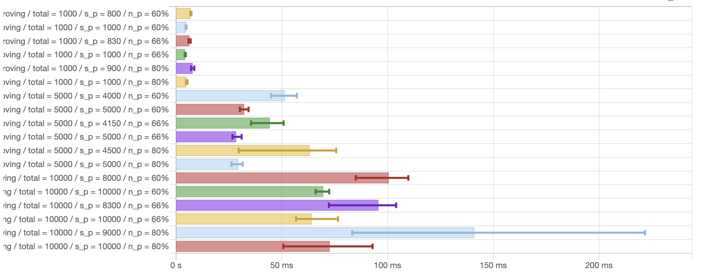

The following diagram is an excerpt from the ALBA benchmarks highlighting verification. Note these numbers do not take into account the time for verifying individual votes. As one can observe directly from these graphs, verification time is independent from the number of items and only depends on the $n_p/n_f$ ratio.

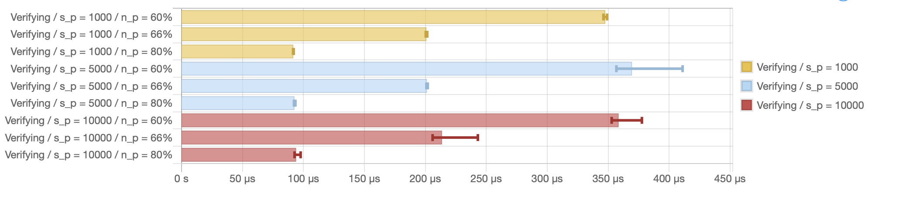

In practice, as the number of votes is expected to be in the 1000-2000 range, and there's ample time in a round to guarantee those votes are properly delivered to all potential voting nodes (see below), we can safely assume proving time of about 5ms, and verification time under a millisecond.

#### Certificate size

For a given set of parameters, eg. fixed values for $\lambda_{sec}$, $\lambda_{rel}$, and $n_p/n_f$ the proof size is perfectly linear and only depends on the size of each vote:


Varying the security parameter and the honest votes ratio for a fixed set of 1000 votes of size 200 yields the following diagram, showing the critical factor in proof size increase is the $n_p/n_f$ ratio: As this ratio decreases, the number of votes to include in proof grows superlinearly.


### Benchmarks

In the following tables we compare some relevant metrics between the two different kind of certificates we studied, Mithril certificates (using BLS signatures) and ALBA certificates (using KES signatures): Size of certificate in bytes, proving time (eg. the time to construct a single vote), aggregation time (the time to build a certificate), and verification time.

For Mithril certificates, assuming parameters similar to mainnet's ($k=2422, m=20973, f=0.2$):

| Feature                         |       |
|---------------------------------|-------|
| Certificate size                | 56kB  |
| Proving time (per vote)         | ~70ms |
| Aggregation time                | 1.2s  |
| Verification time (certificate) | 17ms  |

For ALBA certificates, assuming 1000 votes, a honest to faulty ratio of 80/20, and security parameter $λ=128$. Note the proving time _does not_ take into account individual vote verification time, whereas certificate's verification time _includes_ votes verification time.

| Feature                         |        |
|---------------------------------|--------|
| Certificate size                | 47kB   |
| Proving time (per vote)         | ~133us |
| Aggregation time                | ~5ms   |
| Verification time (certificate) | 15ms   |
|                                 |        |

## Vote diffusion

Building on [previous work](./tech-report-1#network-performance-analysis), we built a ΔQ model to evaluate the expected delay to reach _quorum_.
The model works as follows:

* We start from a base uniform distribution of single MTU latency between 2 nodes, assuming a vote fits in a single TCP frame. The base latencies are identical as the one used in previous report,
* We then use the expected distribution of paths length for a random graph with 15 average connections, to model the latency distribution across the network, again reusing previously known values,
* We then apply the `NToFinish 75` combinator to this distribution to compute the expected distribution to reach 75% of the votes (quorum)
* An important assumption is that each vote diffusion across the network is expected to be independent from all other votes,
* Verification time for a single vote is drawn from the above benchmarks, but we also want to take into account the verification time of a single vote, which we do in 2 different ways:
  * One distribution assumes a node does all verifications sequentially, one vote at a time
  * Another assumes all verifications can be done in parallel
  * Of course, the actual verification time should be expected to be in between those 2 extremes

Using the "old" version of ΔQ library based on numerical (eg. Monte-Carlo) sampling, yields the following graph:

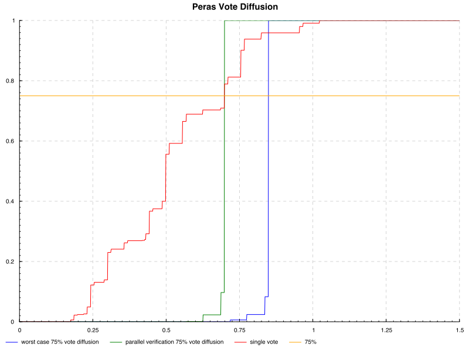

This graph tends to demonstrate vote diffusion should be non-problematic, with a quorum expected to be reached in under 1s most of the time to compare with a round length of about 2 minutes.

> [!NOTE]
>
> ### About ΔQ libraries
>
> At the time of this writing, a newer version of the ΔQ library based on _piecewise polynomials_ is [available](https://github.com/DeltaQ-SD/dqsd-piecewise-poly). Our [attempts](https://github.com/input-output-hk/peras-design/blob/01206e5d4d3d5132c59bff18564ad63adc924488/Logbook.md#L302) to use it to model votes diffusion were blocked by the high computational cost of this approach and the time it takes to compute a model, eg. about 10 minutes in our case. The code for this experiment is available as a [draft PR #166](https://github.com/input-output-hk/peras-design/pull/166).
>
    > In the old version of ΔQ based on numerical sampling, which have [vendored in our codebase](https://github.com/input-output-hk/peras-design/blob/a755cd033e4898c23ee4bacc9b677145497ac454/peras-delta-q/README.md#L1), we introduced a `NToFinish` combinator to model the fact we only take into account some fraction of the underlying model. In our case, we model the case where we only care about the first 75% of votes that reach a node.
>
> Given convolutions are the most computationally intensive part of a ΔQ model, it seems to us a modeling approach based on discrete sampling and vector/matrices operations would be quite efficient. We did some experiment in that direction, assessing various approaches in Haskell: A naive direct computation using [Vector](https://hackage.haskell.org/package/vector)s, FFT-based convolution using vectors, and [hmatrix](https://hackage.haskell.org/package/hmatrix)' convolution function.
>
> 
>
> This quick-and-dirty spike lead us to believe we could provide a fast and accurate ΔQ modelling library using native vector operations provided by all modern architectures, and even scale to very large model using GPU libraries.

# Constraints on Peras Parameters

The following constraints on Peras parameters arise for both theoretical and practical considerations.

| Parameter               | Symbol          | Units   | Description                                                                               | Constraints                                              | Rationale                                                                                    |
| ----------------------- | --------------- | ------- | ----------------------------------------------------------------------------------------- | -------------------------------------------------------- | -------------------------------------------------------------------------------------------- |
| Round length            | $U$             | slots   | The duration of each voting round.                                                        | $U \geq \Delta$                                          | All of a round's votes must be received before the end of the round.                         |
| Block selection offset  | $L$             | slots   | The minimum age of a candidate block for being voted upon.                                | $\Delta \lt L \leq U$                                    | Rule VR-1B will fail if the candidate block is older than the most recently certified block. |
| Certificate expiration  | $A$             | slots   | The maximum age for a certificate to be included in a block.                              | $A = T_\text{heal}+T_\text{CQ}$                          | After a quorum failure, the chain must heal and achieve quality.                             |
| Chain ignorance period  | $R$             | rounds  | The number of rounds for which to ignore certificates after entering a cool-down period.  | $R = \left\lceil A / U \right\rceil$                     | Ensure chain-ignorance period lasts long enough to include a certificate on the chain.       |
| Cool-down period        | $K$             | rounds  | The minimum number of rounds to wait before voting again after a cool-down period starts. | $K = \left\lceil \frac{A + T_\text{CP}}{U} \right\rceil$ | After a quorum failure, the chain must heal, achieve quality, and attain a common prefix.    |
| Certification boost     | $B$             | blocks  | The extra chain weight that a certificate gives to a block.                               | $B \gt 0$                                                | Peras requires that some blocks be boosted.                                                  |
| Quorum size             | $\tau$          | parties | The number of votes required to create a certificate.                                     | $\tau \gt 3 n / 4$                                       | Guard against a minority (<50%) of adversarial voters.                                       |
| Committee size          | $n$             | parties | The number of members on the voting committee.                                            | $n \gt 0$                                                | Peras requires a voting committee.                                                           |
| Network diffusion time  | $\Delta$        | slots   | Upper limit on the time needed to diffuse a message to all nodes.                         | $\Delta \gt 0$                                           | Messages have a finite delay.                                                                |
| Active slot coefficient | $f$             | 1/slots | The probability that a party will be the slot leader for a particular slot.               | $0 \lt f \leq 1$                                         | Blocks must be produced.                                                                     |
| Healing time            | $T_\text{heal}$ | slots   | Healing period to mitigate a strong (25-50%) adversary.                                   | $T_\text{heal} = \mathcal{O}\left( B / f \right)$        | Sufficient blocks must be produced to overcome an adversarially boosted block.               |
| Chain-quality time      | $T_\text{CQ}$   | slots   | Ensure the presence of at least one honest block on the chain.                            | $T_\text{CQ} = \mathcal{O} (k/f)$                        | A least one honest block must be produced.                                                   |
| Common-prefix time      | $T_\text{CP}$   | slots   | Achieve settlement.                                                                       | $T_\text{CP} = \mathcal{O} (k/f)$                        | The Ouroboros Praos security parameter defines the time for having a common prefix.          |
| Security parameter      | $k$             | blocks  | The Ouroboros Praos security parameter.                                                   | n/a                                                      | Value for the Cardano mainnet.                                                               |

# Simulating Peras

## Protocol simulation

The Peras simulator is a prototype/reference implementation of the Peras protocol in Haskell. The implementation aims to encode the pseudo-code for the protocol specification in as literal and transparent a manner as possible, regardless of the performance drawbacks of such literalness. Note that it simulates the Peras protocol in the abstract and does not include a simulation of network diffusion. Its core contains four modules:

- `Peras.Prototype.Fetching` handles the receipt of new chains and new votes. It includes the following logic:
    - creates new certificates when a new quorum of votes is reached,
    - selects the preferred chain, and
    - updates $\mathsf{cert}^\prime$ and $\mathsf{cert}^*$.
- `Peras.Prototype.BlockCreation` forges new blocks and, optionally, includes a certificate in the new block.
- `Peras.Prototype.BlockSelection` selects the block that a party will vote upon.
- `Peras.Prototype.Voting` casts votes.

Additional, non-core modules handle the diffusion of votes, the interactions between multiple nodes, and visualization of results. The simulator's voting behavior has been tested against the Agda-derived executable specification via the `quickcheck-dynamic` property-based state-machine testing framework: see `Peras.Conformance.Test`.

The simulator can be run from the command line or in a web browser. At the command line, one can specify the input configuration (state) of the simulation, store its output configuration, and record a trace of simulation events. The ending time of the output configuration can be edited to set it to a later time, and then the simulation can be continued by providing that edited output configuration as input to the continued simulation.

```console
$ peras-simulate --help

peras-simulate: simulate Peras protocol

Usage: peras-simulate [--version] [--in-file FILE] [--out-file FILE]
                      [--trace-file FILE]

  This command-line tool simulates the Peras protocol.

Available options:
  -h,--help                Show this help text
  --version                Show version.
  --in-file FILE           Path to input YAML file containing initial simulation
                           configuration.
  --out-file FILE          Path to output YAML file containing final simulation
                           configuration.
  --trace-file FILE        Path to output JSON-array file containing simulation
                           trace.
```

The input configuration file specifies the protocol parameters, the initial state of the simulation, and the slot-leadership and committee-membership schedules for each node/party. This gives the user full control over the simulation and ensures reproducibility of the simulation results.

```json
{
  "params":{"U":20,"A":200,"R":10,"K":17,"L":10,"τ":2,"B":10,"Δ":5},
  "start":0,
  "finish":300,
  "payloads":{},
  "parties":{
    "1":{"leadershipSlots":[2,10,25,33,39,56,71,96,101,108,109,115],"membershipRounds":[1,2,6],"perasState":{"certPrime":{"blockRef":"","round":0},"certStar":{"blockRef":"","round":0},"certs":[],"chainPref":[],"chains":[[]],"votes":[]}},
    "2":{"leadershipSlots":[12,17,33,44,50,67,75,88,105],"membershipRounds":[2,3,5,6],"perasState":{"certPrime":{"blockRef":"","round":0},"certStar":{"blockRef":"","round":0},"certs":[],"chainPref":[],"chains":[[]],"votes":[]}},
    "3":{"leadershipSlots":[5,15,42,56,71,82,124],"membershipRounds":[3,4,5,6],"perasState":{"certPrime":{"blockRef":"","round":0},"certStar":{"blockRef":"","round":0},"certs":[],"chainPref":[],"chains":[[]],"votes":[]}},
    "4":{"leadershipSlots":[8,15,21,38,50,65,127],"membershipRounds":[1,5],"perasState":{"certPrime":{"blockRef":"","round":0},"certStar":{"blockRef":"","round":0},"certs":[],"chainPref":[],"chains":[[]],"votes":[]}}
  },
  "diffuser":{"delay":0,"pendingChains":{},"pendingVotes":{}}
}
```

The output configuration file reveals all of the chains, votes, etc. tracked by each node/party. The trace file is a JSON array of events occurring in the simulation. The trace file converted to a GraphViz `.dot` file for visualization. Traces can also be piped into tools for real-time analysis.

| Tag                         | Event                                                      |
|-----------------------------|------------------------------------------------------------|
| `Protocol`                  | new protocol parameters                                    |
| `Tick`                      | new slot                                                   |
| `NewChainAndVotes`          | new chains and votes received                              |
| `NewCertificatesReceived`   | new certificates received (embedded in new chains)         |
| `NewCertificatesFromQuorum` | new certificates created after new votes have been fetched |
| `NewChainPref`              | node prefers a new chain                                   |
| `NewCertPrime`              | node selected a new $\mathsf{cert}^\prime$                 |
| `NewCertStar`               | node selected a new $\mathsf{cert}^*$                      |
| `ForgingLogic`              | logic for including a certificate in a new block           |
| `DiffuseChain`              | chain extended by a new block                              |
| `SelectedBlock`             | block to be voted upon                                     |
| `NoBlockSelected`           | no block voted for                                         |
| `VotingLogic`               | logic for casting a vote                                   |
| `DiffuseVote`               | diffuse a new vote                                         |

```console
$ peras-visualize --help

peras-visualize: visualize Peras simulation traces

Usage: peras-visualize [--version] --trace-file FILE [--dot-file FILE]

  This command-line tool visualizes Peras simulation traces.

Available options:
  -h,--help                Show this help text
  --version                Show version.
  --trace-file FILE        Path to input JSON-array file containing simulation
                           trace.
  --dot-file FILE          Path to output GraphViz DOT file containing
                           visualization.
```

## Protocol visualization

The results of simulations can be viewed graphically in a web application (see https://peras-simulation.cardano-scaling.org/) that lets one explore the operation of the Peras protocol and the influence that each of the protocol parameters has upon the evolution of the block tree. This can be used for education, for studying voting behavior, for selecting optimal values of the protocol parameters, or for debugging a simulation.

The screenshot below shows the user interface for the Peras simulation web application.

- Each of the Peras protocol parameters may be set, and tooltips provide explanations of them.
- Simulation-related parameters such as the duration of the simulation, the number of nodes involved, and the random-number seen may be set.
- Users can share simulations by copying a URL that embeds sufficient information to fully reproduce the simulation.
- Buttons allow the user to run, step singly, pause or stop the simulation.
- A zoomable display visualizes the simulated block tree.

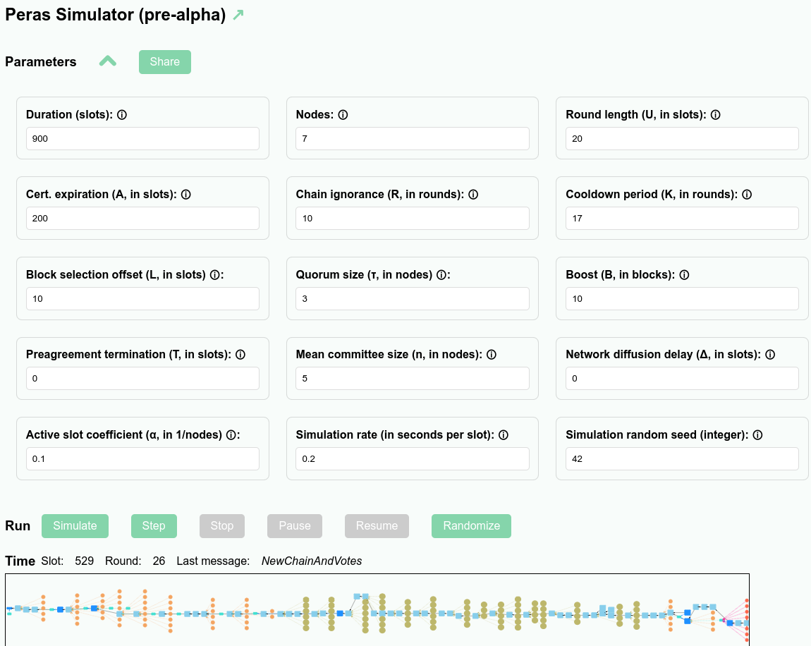

The screenshot below shows the visualization of the Peras block tree:

- Light blue rectangles represent blocks that do not record Peras certificates, whereas dark blue rectangles represent blocks that do record Peras certificates recorded in them.
    - Block lines point to the parent block.
    - The three ⊤ and ⊥ symbols in the block indicate whether each of the three certificate-inclusion rules are true or false, respectively.
- Salmon-colored circles represent votes for blocks, whereas olive-colored circles represent situation were a party was on the voting committee but not allowed to vote.
    - Salmon-colored dashed lines point to the block being voted for.
    - The four ⊤ and ⊥ symbols in the block indicate whether each of the four voting rules are true or false, respectively.
- Certificates are aqua rectangles.
    - Aqua dashed lines point to the block being certified.
- Nodes are red circles.
    - The red dashed lines point to the tip of their preferred blockchain.
    - The orange dashed lines point to their $\mathsf{cert}^\prime$ and $\mathsf{cert}^*$ certificates.

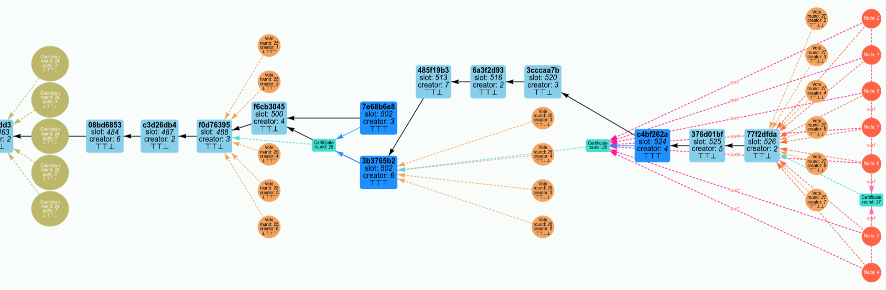

The visualizer can be deployed as a server via Docker. It supports multiple simultaneous web clients running each their own simulations and it supports basic HTTP authentication.

```console
$ peras-server --help

peras-server: server Peras simulations

Usage: peras-server [--version] [--port PORT]
                    [--username STRING --password STRING]

  This server provides Peras simulations.

Available options:
  -h,--help                Show this help text
  --version                Show version.
  --port PORT              Port on which the server listens.
  --username STRING        Authorized user.
  --password STRING        Password for authorized user.
```

## Markov-chain simulation

> [!IMPORTANT]
> Discuss the Markov-chain simulation and results

# Analyses of adversarial scenarios

> [!CAUTION]
> Several well-formatted equations are not rendered correctly by GitHub's MathJAX. Make sure that these render correctly via `pandoc`.

The probability of adversarial success can be computed analytically, either exactly or approximately, for some scenarios. Such analytic computations are typically faster and more comprehensive than running ensembles of simulations and analyzing those results. The scenarios analyzed in this section are intended to provide guidance on how the probability of adversarial success depends upon Peras parameters, so that the parameters can be set appropriately for stakeholder user cases. In this section we use the following notation:

- Active-slot coefficient: $\alpha$
- Round length: $U$
- Block-selection offset: $L$
- Certificate expiration: $A$
- Quorum for creating a certificate: $\tau = \frac{3}{4} n$
- Fraction of adversarial stake: $f$
- Mean size of the voting committee: $n$
- Per-slot probability of a block:
    - Honest block: $p = 1 - (1 - \alpha)^{1 - f} \approx \alpha \cdot (1 - f)$
    - Adversarial block: $q = 1 - (1 - \alpha)^f \approx \alpha \cdot f$
- Binomial distribution of $n$ trials each with probability $p$ :
    - Probability density function: $\mathbf{p}_\text{binom}(k,n,p)= {n\choose{k}} \cdot p^k \cdot (1 - p)^{n-k}$
    - Cumulative probability function: $\mathbf{P}_\text{binom}(m,n,p) = \sum_{k=0}^m \mathbf{p}(k,n,p)$
- Normal distribution with mean $\mu$ and standard deviation $\sigma$:
    - Probability density function: $\mathbf{p}_\text{normal}(x, \mu, \sigma) = \frac{1}{\sqrt{2 \pi \sigma^2}} e^{- \frac{(x - \mu)^2}{2 \sigma^2}}$
    - Cumulative probability function: $\mathbf{P}_\text{normal}(x,\mu,\sigma) = \int_{-\infty}^x dt \, \mathbf{p}_\text{normal}(t, \mu, \sigma)$

## No honest quorum in round

***Question:*** What is the probability of not reaching a quorum if adversaries abstain from voting?

***Relevance:*** This analysis can be used to select a mean committee size that is appropriate for a given risk tolerance.

***Risk:*** A adversary can trigger a cool-down period if they abstain from voting.

***Scenario:*** Consider the situation where the adversary decides not to vote in a round, in order to prevent a quorum from occurring and to force the chain into a cool-down period. This occurs when the number of honest voters is less than the quorum size.

***Analysis:*** Let $\beta$ be the probability that a unit of stake is selected for voting-committee membership. Let $S$ be the total stake and $H = (1 - f) \cdot S$ be the honest stake. Assuming the total stake is large, we can approximate the binomial distribution by a normal one and express the probability of not having an an honest quorum as follows:

$$
P = \mathbf{P}_\text{binom} (\lfloor\tau\rfloor, H, \beta) \approx \mathbf{P}_\text{normal} \left( \tau, H \cdot \beta, \sqrt{H \cdot \beta \cdot (1 - \beta)} \right) \approx \mathbf{P}_\text{normal} \left( \tau, H \cdot \beta, \sqrt{H \cdot \beta} \right)
$$

Now set the quorum size to the recommended value $\tau = \frac{3}{4} n$ to discover a simple relationship:

$$
P \approx \mathbf{P}_\text{normal} \left( f , \frac{1}{4} , \sqrt{\frac{1 - f}{n}} \right)
$$

The following R function performs this computation:

```R
function(f, n)
  pnorm(f, 1 / 4, sqrt((1 - f) / n))
```

***Example:*** Plot the probability of not having an honest quorum as a function of the adversarial fraction of stake, for various mean sizes of the voting committee.


## Adversarial quorum

***Question:*** What is the probability that adversaries can form a voting quorum in a round?

***Relevance:*** This analysis can be used to select a mean committee size that is appropriate for a given risk tolerance.

***Risk:*** An adversary can boost an adversarial fork.

***Scenario:*** Consider the situation where adversaries are lucky enough in the voting-committee sortition to hold a quorum of votes.

***Analysis:*** The analysis proceeds similarly to the "no honest quorum" scenario, but for adversaries having at least a quorum of votes.

$$
P = 1 - \mathbf{P}_\text{binom} (\lceil\tau\rceil, S - H, \beta) \approx 1 - \mathbf{P}_\text{normal} \left( \tau, (S - H) \cdot \beta, \sqrt{(S - H) \cdot \beta \cdot (1 - \beta)} \right) \approx 1 - \mathbf{P}_\text{normal} \left( \tau, f \cdot n, \sqrt{f \cdot n} \right)
$$

Now set the quorum size to the recommended value $\tau = \frac{3}{4} C$ to discover a simple relationship:

$$
P \approx \mathbf{P}_\text{normal} \left( f , \frac{3}{4} , \sqrt{\frac{f}{n}} \right)
$$

The following R function performs this computation:

```R
function(f, n)
  pnorm(f, 3 / 4, sqrt(f / n))
```

***Example:*** Plot the probability of having an adversarial quorum as a function of the adversarial fraction of stake, for various mean sizes of the voting committee.


## No certificate in honest block

***Question:*** What is the probability that adversaries can prevent a certificate from being included in a block before the certificate expires?

***Relevance:*** This analysis can be used to set the certificate-expiration parameter $A$.

***Risk:*** An adversary can trigger a premature ending of the cool-down period (via rule VR-2B) by preventing a new *cert\** from being recorded in a block.

***Scenario:***  Consider the situation where the voting certificate must be included on the chain (via rule Block Creation 1b), but no honest blocks are forged before the last *cert′* expires and adversaries abstain from updating *cert′* when they forge blocks.

***Analysis:***. The probability that adversaries forge every block during the period when the certificate hasn't expired is

$$
P = (1 - p)^A = (1 - \alpha)^{(1 - f) \cdot A}
$$

and this can be represented as the following R function:

```R
function(A, f, alpha)
  (1 - alpha)^((1 - f) * A)
```

***Example:*** Assuming an active-slot coefficient of 5%, plot the probability of a certificate not being recorded in an honest block before the certificate expires.


## Adversarial chain receives boost

Here we examine two approaches to computing the probability that an adversarial chain receives a voting boost.

### Variant 1

***Question.*** What is the probability that an adversarial chain receives the next boost?

***Relevance:*** This analysis provides guidance on selecting the round length.

***Risk:*** An adversary can anchor their chain by having one of its later blocks boosted.

***Scenario.*** It currently is round $r$ and a certificate was created in round $r - 1$ for a block at least $U + L$ slots in the past that is also in the common prefix of the honest and adversarial chains. The honest parties lengthen one fork by $m \ge 0$ blocks to the next candidate for voting (i.e., the newest block on that fork that is at least $L$ slots old) and the adversarial parties similarly lengthen a separate fork by $n \ge 0$ blocks. If the adversarial chain is revealed to the honest parties before the start of the new round $r$ and if the adversarial chain is longer (i.e., $n \gt m$), then the voting committee will vote to boost the adversarial chain. The per-slot probability of adding a block to the honest or adversarial chain is $p$ or $q$, respectively.


***Analysis.*** Assume that the block- and vote-diffusion times are negligible, so that the last boosted block is indeed the last block before slot $r \cdot U - U - L$ and that the honest and adversarial candidates are indeed the last blocks on their forks before slot $r \cdot U - l$. (Note that this neglects the probability that the adversary will privately extend the last boosted block before slot $r \cdot U - U - L$.) Thus the lengthening of the two forks during the $U$ slots are the last boosted block are binomially distributed with parameters $m$ and $p$ (honest) and $n$ and $p$ (adversarial). The probability of $m < n$ is

$$
P = \sum_{0 \le m \lt n \le U} \mathbf{p}_\text{binom}(m,U,p) \cdot \mathbf{p}_\text{binom}(n,U,q) = \sum_{n=1}^U \mathbf{P}_\text{binom}(n-1,U,p) \cdot \mathbf{p}_\text{binom}(n,U,q)
$$

and the following R function implements this computation:

```R
function(U, p, q)
  sum( pbinom(1:U-1, U, p) * dbinom(1:U, U, q) )
```

***Example.*** Let the active-slot coefficient $\alpha = 0.05 \, \text{slot}^{-1}$ and let $f$ be the fraction of adversarial stake, so $p = \alpha \cdot (1 - f)$ and $q = \alpha \cdot f$. Plot the probability of the dishonest boost as a function of the adversarial fraction of stake and the round length.


### Variant 2

***Question.*** What is the probability that an adversarial chain receives the next boost?

***Relevance:*** This analysis provides guidance on selecting the round length.

***Risk:*** An adversary can anchor their chain by having one of its later blocks boosted, resulting in honest blocks being rolled back.

***Scenario.*** It currently is round $r$ and a certificate was created in round $r - 1$ for a block at least $U + L$ slots in the past that is also the common prefix of the honest and adversarial chains. The honest parties lengthen one fork by $m \ge 0$ blocks to the next candidate for voting (i.e., the newest block on that fork that is at least $L$ slots old) and the adversarial parties similarly lengthen a separate fork by $k \ge 0$ blocks before slot $r \cdot U - U - L$ and by $n \ge 0$ blocks subsequently. If the adversarial chain is revealed to the honest parties at slot $r \cdot U = L$ and if the adversarial chain is longer (i.e., $k + n \gt m$), then all parties will extend the adversarial chain and then next voting committee will boost the adversarial chain, causing the $m$ honest blocks to be rolled back.


***Analysis.*** Assume that the block- and vote-diffusion times are negligible, so that the last boosted block is indeed the last public block before slot $r \cdot U - U - L$ and that the honest and adversarial candidates are indeed the last blocks on their forks before slot $r \cdot U - l$. Thus the lengthening of the two forks during the $U$ slots are the last boosted block are binomially distributed with parameters $m$ and $p$ (honest) and $n$ and $p$ (adversarial). Additionally, the adversary may privately produce $k$ blocks after the last boosted block and before slot $r \cdot U - U - L$: this random variable for producing such blocks is negative-binomially distributed. The probability of $m < k + n$ is

$$
P = \sum_{\substack{0 \le m \le U \\ 0 \le n \le U \\ 0 \le k \le \infty \\ m \lt n + k}} (1 - f) f^k \cdot {U\choose{m}} p^m (1-p)^{U-m} \cdot {U\choose{n}} q^n (1-q)^{U-n}
$$
which simplifies to
$$
P = (1 - f) \cdot \sum_{n=1}^U \mathbf{P}_\text{binom}(n-1,U,p) \cdot \mathbf{p}_\text{binom}(n,U,q) + (1 - f) \cdot \sum_{k=1}^U f^k \cdot \sum_{n=0}^{U-k} \mathbf{P}_\text{binom}(n+k-1,U,p) \cdot \mathbf{p}_\text{binom}(n,U,q) + f^{U+1}
$$

and we can be implemented in R as the following function:

```R
function (U, p, q) {
  f <- q / (p + q)
  p0 <- (1 - f) * sum( pbinom(0:(U-1), U, p) * dbinom(1:U, U, q) )
  pk <- (1 - f) * sum( mapply(function(k) f^k * sum( pbinom((k-1):(U-1), U, p) * dbinom(0:(U-k), U, q) ), 1:U) )
  pinf <- f^(U+1)
  p0 + pk + pinf
}
```

***Example.*** Let the active-slot coefficient $\alpha = 0.05 \, \text{slot}^{-1}$ and let $f$ be the fraction of adversarial stake, so $p = \alpha \cdot (1 - f)$ and $q = \alpha \cdot f$. Plot the probability of the dishonest boost as a function of the adversarial fraction of stake and the round length.


## Healing from adversarial boost

***Question:*** How long does it take to neutralize the adversarial advantage of a certificate?

***Relevance:*** "During the initial “healing” phase of the cooldown period, parties continue with standard Nakamoto block creation until the potential advantage of B that the adversary could gain with a certificate is neutralized." This healing time helps determine the value of the certificate-expiration time $A$ and the chain-ignorance period $R$.

***Risk:*** An adversary can cause their fork to be preferred for an extended period if it has a certificate.

***Scenario:*** The honest chain must grow at least $B$ blocks longer than the adversarial chain if it is to resist the adversarial chain's receiving a boost from a certificate.

***Analysis:*** During cooldown, the growth of the honest chain (length $m$) and adversarial chain (length $n$) can be modeled by the difference between binomially distributed random variables. The probability of $m \lt n + B$ at slot $s$ is

$$
P = \sum_{0 \le m \lt n + B \le s} \mathbf{p}_\text{binom}(m, s, p) \cdot \mathbf{p}_\text{binom}(n, s, q) = \sum_{n=0}^s \mathbf{P}_\text{binom}(n+B-1, s, p) \cdot \mathbf{p}_\text{binom}(n, s, q)
$$

and can be computed by the following R function:

```R
function(s, B, p, q)
  sum(pbinom((B-1):(s+B-1), s, p) * dbinom(0:s, s, q))
```

***Example:*** Plot the probability of the honest chain not healing from an adversarial boost, as a function of the healing time $s$ and the boost $B$, under the assumption that the active-slot coefficient $\alpha = 0.05 \, \text{slot}^{-1}$ a.

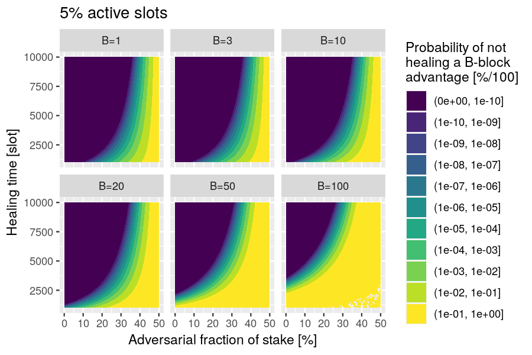

This healing time scales approximately linearly with the boost parameter. The diagram below shows the relationship between these two parameters along with a linear fit at different probabilities of not healing and different adversarial stakes.

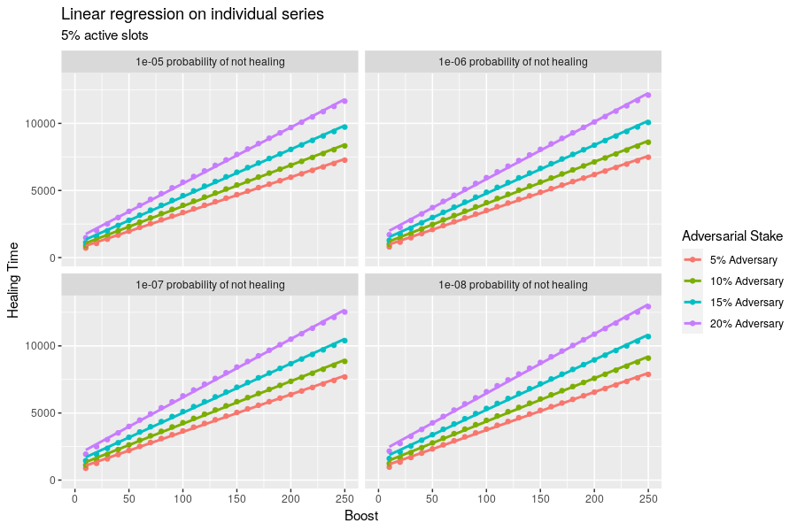

If we fit this dataset to a linear model, we find the following relationships and quality of fit. Note that this model is no suitable for use outside of the ranges of the training data: in particular, there is a much stronger dependence on boost for small probabilities and large adversarial stakes.

```
Call:
lm(formula = `Healing Time` ~ (`Boost` + `Adversarial Stake`)^2 + log(`Probability of Not Healing`))

Residuals:
    Min      1Q  Median      3Q     Max 
-539.43 -141.38  -39.61  168.45  437.53 

Coefficients:
                                    Estimate Std. Error t value Pr(>|t|)    
(Intercept)                       -1142.2130    79.5507  -14.36   <2e-16 ***
`Boost`                              21.8229     0.3509   62.19   <2e-16 ***
`Adversarial Stake`                6200.4250   380.9661   16.28   <2e-16 ***
log(`Probability of Not Healing`)  -102.2989     4.0128  -25.49   <2e-16 ***
`Boost`:`Adversarial Stake`         102.4693     2.5627   39.99   <2e-16 ***
---
Signif. codes:  0 ‘***’ 0.001 ‘**’ 0.01 ‘*’ 0.05 ‘.’ 0.1 ‘ ’ 1

Residual standard error: 206.6 on 395 degrees of freedom
Multiple R-squared:  0.9945,	Adjusted R-squared:  0.9945 
F-statistic: 1.796e+04 on 4 and 395 DF,  p-value: < 2.2e-16
```

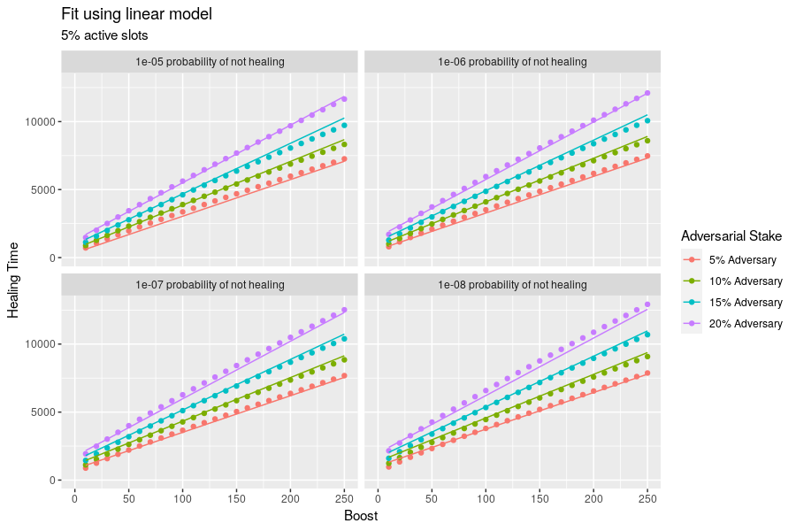

## No honest block

***Question:*** What is the probability of not having an honest block during a given period of time?

***Relevance:*** "In the subsequent phase, parties are required to submit the latest certificate they are aware of to the chain." This chain-quality time helps determine the value of the certificate-expiration time $A$ and the chain-ignorance period $R$.

***Risk:*** The registration of a certificate during cooldown might require waiting for an honest block where it can be included.

***Scenario, Analysis, Example:*** The scenario, analysis, and example are identical to the case "No certificate in honest block".

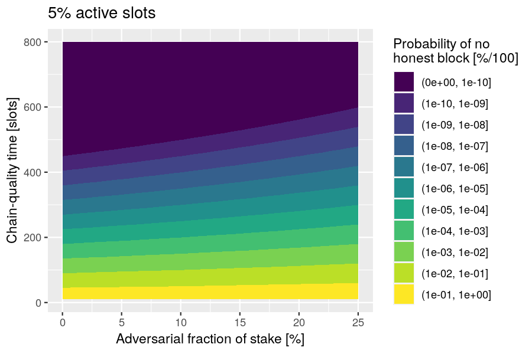

## No common prefix

***Question:*** How long can an adversary maintain a common prefix?

***Relevance:*** "Finally, in the third phase, parties wait until the blocks from the second phase have stabilized." This common-prefix time helps determine the value of the cooldown period $K$.

***Risk:*** A strong adversary can keep their fork viable for many slots.

***Scenario:*** The honest chain must grow longer than the adversarial chain.

***Analysis:*** During cooldown, the growth of the honest chain (length $m$) and adversarial chain (length $n$) can be modeled by the difference between binomially distributed random variables. The probability of $m \le n$ at slot $s$ is

$$
P = \sum_{0 \le m \le n \le s} \mathbf{p}_\text{binom}(m, s, p) \cdot \mathbf{p}_\text{binom}(n, s, q) = \sum_{n=0}^s \mathbf{P}_\text{binom}(n, s, p) \cdot \mathbf{p}_\text{binom}(n, s, q)
$$

and can be computed by the following R function:

```R
function(s, p, q)
  sum(pbinom(0:s, s, p) * dbinom(0:s, s, q))
```

***Example:*** Plot the probability of the adversarial chain being at least as long as the honest chain, as a function of the common-prefix time $s$, under the assumption that the active-slot coefficient $\alpha = 0.05 \, \text{slot}^{-1}$ a.

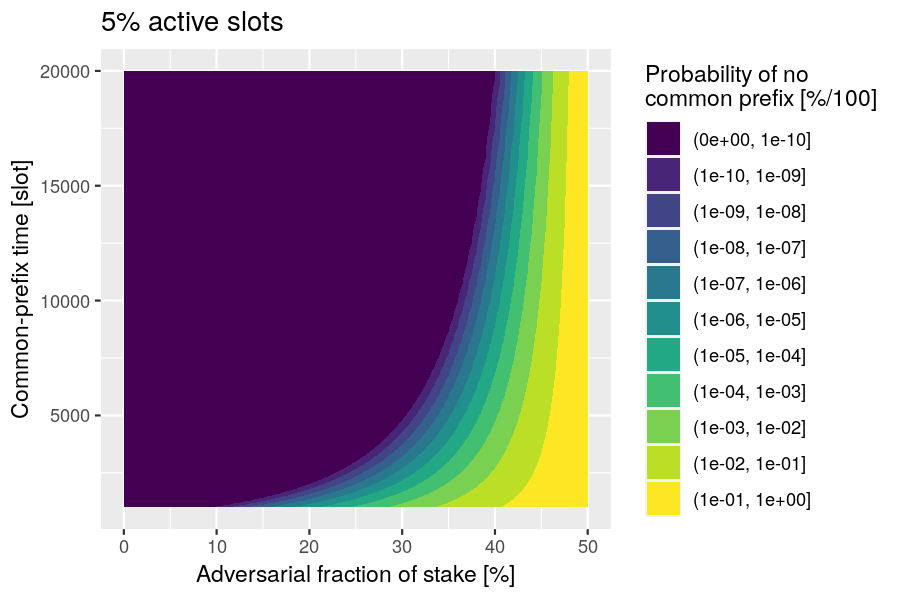

## Settlement failure in Praos

The article [Practical Settlement Bounds for Longest-Chain Consensus by Gaži, Ren, and Russell, (2023)](https://doi.org/10.1007/978-3-031-38557-5_4) provides recurrence relations for *margin* and *reach* that can be solved numerically to determine the probability of settlement failure. The computations are relevant for Peras (i) after one block has been certified and before a subsequent block is certified and (ii) during the cool-down period. We used their software (see https://github.com/renling/LCanalysis) to repeat their computation and extend it to more blocks. This approach accounts for the diffusion time Δ, computes in terms of blocks instead of slots, does not make the two-chain (one honest and one adversarial) assumption, and is supported by mathematical rigor.

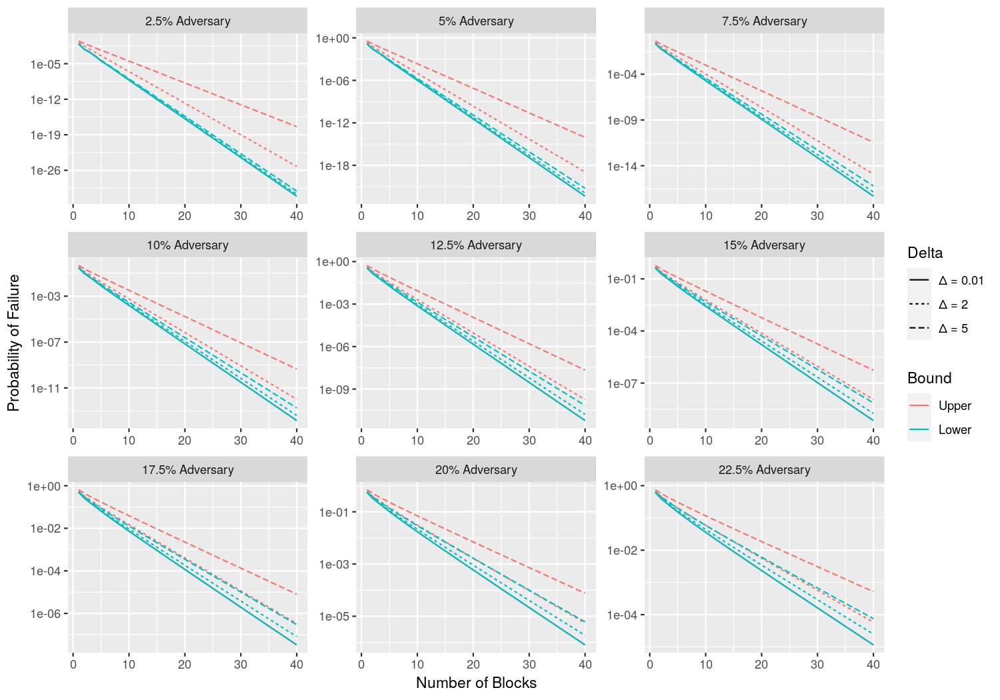

# Settlement probabilities

In the estimates below, we define the *non-settlement probability* as the probability that a transaction (or block) is rolled back. Note that this does not preclude the possibility that the transaction could be included in a later block because it remained in the memory pool of a node that produced a subsequent block. Because there are approximately 1.5 million blocks produced per year, even small probabilities of non-settlement can amount to an appreciable number of discarded blocks.

## Case 1: Blocks without boosted descendants

Blocks that are not cemented by a boost to one of their descendant (successor) blocks are most at risk for being rolled back because they are not secured by the extra weight provided by a boost.

The *Variant 2* scenario in the *Adversarial chain receives boost* section above dominates the situation where a transaction is recorded in a block but an adversarial fork later is boosted by a certificate to become the preferred chain. This scenario plays out as follows:

1. Both the honest chain and an initially private adversarial chain have a common prefix that follows the last boosted block.
2. The adversary privately grows their chain and does not include transactions in the memory pool.
3. When the time comes where the last block is first eligible for later being voted upon, the adversarial chain is published and all parties see that it is longer than the honest chain.
4. Hence the newly published adversarial chain becomes the preferred chain, and all parties build upon that.
5. Later, when voting occurs, the chain that had been adversarial will received the boost.
6. Because the adversarial prefix has been boosted, there is a negligible probability that the discarded portion of the honest chain will ever become part of the preferred chain.
7. Therefore the preferred chain does not include any transactions that were in blocks of the honest chain after the common prefix and before the adversarially boosted block.

Note that this is different from the situation where a transaction is included on honest forks because such a transaction typically reaches the memory pool of the block producers on each fork and is included on each. The adversary refrains from including the transaction on their private chain.

The active-slot coefficient (assumed to be 5%), the length of the rounds, and the adversary's fraction of stake determine the probability of non-settlement in such a scenario. The table below estimates this probability. For example, in the presence of a 5% adversary and a round length of 360 slots, one could expect about two blocks to be reverted per year in such an attack.

| Round Length | 5% Adversary | 10% Adversary | 15% Adversary | 20% Adversary | 45% Adversary |
| -----------: | -----------: | ------------: | ------------: | ------------: | ------------: |
|           60 |     1.35e-02 |      3.64e-02 |      6.99e-02 |      1.15e-01 |      4.81e-01 |
|           90 |     5.45e-03 |      1.82e-02 |      4.14e-02 |      7.77e-02 |      4.64e-01 |
|          120 |     2.16e-03 |      9.16e-03 |      2.47e-02 |      5.31e-02 |      4.48e-01 |
|          150 |     8.55e-04 |      4.63e-03 |      1.49e-02 |      3.66e-02 |      4.34e-01 |
|          180 |     3.40e-04 |      2.36e-03 |      9.08e-03 |      2.55e-02 |      4.22e-01 |
|          240 |     5.46e-05 |      6.27e-04 |      3.42e-03 |      1.25e-02 |      4.00e-01 |
|          300 |     8.91e-06 |      1.69e-04 |      1.31e-03 |      6.27e-03 |      3.81e-01 |
|          360 |     1.47e-06 |      4.63e-05 |      5.11e-04 |      3.18e-03 |      3.65e-01 |
|          420 |     2.46e-07 |      1.28e-05 |      2.00e-04 |      1.63e-03 |      3.51e-01 |
|          480 |     4.12e-08 |      3.56e-06 |      7.92e-05 |      8.37e-04 |      3.37e-01 |
|          540 |     6.97e-09 |      9.96e-07 |      3.15e-05 |      4.33e-04 |      3.25e-01 |
|          600 |     1.18e-09 |      2.80e-07 |      1.26e-05 |      2.25e-04 |      3.14e-01 |

Using the approach of Gaži, Ren, and Russell (2023) and setting $\Delta = 5 \text{\,slots}$ to compute the upper bound on the probability of failure to settle results in similar, but not identical probabilities.

| Blocks | ≈ Slots | 5% Adversary | 10% Adversary | 15% Adversary | 20% Adversary |
| -----: | ------: | -----------: | ------------: | ------------: | ------------: |
|      3 |      60 |     6.13e-02 |      1.41e-01 |      2.53e-01 |      3.89e-01 |
|      4 |      80 |     2.73e-02 |      8.15e-02 |      1.73e-01 |      3.01e-01 |
|      5 |     100 |     1.22e-02 |      4.73e-02 |      1.19e-01 |      2.34e-01 |
|      6 |     120 |     5.46e-03 |      2.75e-02 |      8.26e-02 |      1.83e-01 |
|      9 |     180 |     4.95e-04 |      5.55e-03 |      2.80e-02 |      8.89e-02 |
|     12 |     240 |     4.51e-05 |      1.13e-03 |      9.65e-03 |      4.40e-02 |
|     15 |     300 |     4.11e-06 |      2.32e-04 |      3.35e-03 |      2.20e-02 |
|     18 |     360 |     3.75e-07 |      4.77e-05 |      1.17e-03 |      1.11e-02 |
|     21 |     420 |     3.42e-08 |      9.83e-06 |      4.11e-04 |      5.60e-03 |
|     24 |     480 |     3.13e-09 |      2.03e-06 |      1.44e-04 |      2.83e-03 |
|     27 |     540 |     2.85e-10 |      4.17e-07 |      5.06e-05 |      1.44e-03 |
|     30 |     600 |     2.60e-11 |      8.60e-08 |      1.78e-05 |      7.30e-04 |

## Case 2: Blocks with boosted descendants

Once one of a block's descendants (successors) has been boosted by a certificate, it is much more difficult for an adversary to cause it to be rolled back because they adversary must overcome both count of blocks on the preferred, honest chain and the boost that chain has already received.

The *Healing from adversarial boost* section above provides the machinery for estimating the probability of an adversary building a private fork that has more weight than a preferred, honest chain that has been boosted. The scenario plays out as follows:

1. Both the honest chain and an initially private adversarial chain have a common prefix that precedes the last boosted block.
2. The adversary privately grows their chain.
3. When the adversary's chain is becomes long enough to overcome both the honest blocks and the boost, the adversarial chain is published and all parties see that it is longer than the honest chain.
4. Hence the newly published adversarial chain becomes the preferred chain, and all parties build upon that.
5. Therefore the preferred chain does not include any transactions that were in blocks of the honest chain after the common prefix.

Typically, the adversary would only have a round's length of slots to build sufficient blocks to overcome the boosted, honest, preferred fork. After that, the preferred fork would typically receive another boost, making it even more difficult for the adversary to overcome it. The table below shows the probability that of non-settlement for a block after the common prefix but not after the subsequent boosted block on the honest chain, given a 5% active slot coefficient and a 5 blocks/certificate boost.

| Round Length | 5% Adversary | 10% Adversary | 15% Adversary | 20% Adversary | 45% Adversary |
| -----------: | -----------: | ------------: | ------------: | ------------: | ------------: |
|           60 |     3.09e-08 |      1.08e-06 |      8.94e-06 |      4.07e-05 |      3.10e-03 |
|           90 |     5.91e-08 |      2.27e-06 |      2.03e-05 |      9.91e-05 |      9.36e-03 |
|          120 |     6.32e-08 |      2.73e-06 |      2.70e-05 |      1.44e-04 |      1.74e-02 |
|          150 |     5.01e-08 |      2.49e-06 |      2.77e-05 |      1.62e-04 |      2.57e-02 |
|          180 |     3.31e-08 |      1.94e-06 |      2.45e-05 |      1.59e-04 |      3.37e-02 |
|          240 |     1.07e-08 |      8.98e-07 |      1.51e-05 |      1.23e-04 |      4.74e-02 |
|          300 |     2.73e-09 |      3.44e-07 |      7.88e-06 |      8.19e-05 |      5.80e-02 |
|          360 |     6.15e-10 |      1.20e-07 |      3.78e-06 |      5.04e-05 |      6.62e-02 |
|          420 |     1.29e-10 |      3.94e-08 |      1.73e-06 |      2.96e-05 |      7.23e-02 |
|          480 |     2.57e-11 |      1.25e-08 |      7.65e-07 |      1.70e-05 |      7.70e-02 |
|          540 |     4.98e-12 |      3.88e-09 |      3.33e-07 |      9.56e-06 |      8.05e-02 |
|          600 |     9.43e-13 |      1.19e-09 |      1.43e-07 |      5.32e-06 |      8.31e-02 |

A boost of 10 blocks/certificate makes the successful adversarial behavior even less likely.

| Round Length | 5% Adversary | 10% Adversary | 15% Adversary | 20% Adversary | 45% Adversary |
| -----------: | -----------: | ------------: | ------------: | ------------: | ------------: |
|           60 |     0.00e+00 |      4.92e-14 |      2.98e-12 |      5.56e-11 |      2.23e-07 |
|           90 |     7.77e-16 |      8.89e-13 |      5.65e-11 |      1.10e-09 |      4.98e-06 |
|          120 |     3.55e-15 |      4.47e-12 |      3.01e-10 |      6.15e-09 |      3.27e-05 |
|          150 |     8.88e-15 |      1.16e-11 |      8.39e-10 |      1.82e-08 |      1.16e-04 |
|          180 |     1.38e-14 |      2.01e-11 |      1.59e-09 |      3.70e-08 |      2.90e-04 |
|          240 |     1.60e-14 |      2.97e-11 |      2.87e-09 |      7.93e-08 |      9.83e-04 |
|          300 |     1.05e-14 |      2.53e-11 |      3.08e-09 |      1.03e-07 |      2.13e-03 |
|          360 |     4.77e-15 |      1.57e-11 |      2.48e-09 |      1.02e-07 |      3.62e-03 |
|          420 |     1.55e-15 |      7.98e-12 |      1.67e-09 |      8.59e-08 |      5.31e-03 |
|          480 |     4.44e-16 |      3.56e-12 |      9.96e-10 |      6.46e-08 |      7.08e-03 |
|          540 |     4.44e-16 |      1.45e-12 |      5.49e-10 |      4.52e-08 |      8.85e-03 |
|          600 |     2.22e-16 |      5.54e-13 |      2.86e-10 |      3.00e-08 |      1.06e-02 |

A boost of 15 blocks/certificate makes the successful adversarial behavior even less likely.

| Round Length | 5% Adversary | 10% Adversary | 15% Adversary | 20% Adversary | 45% Adversary |
| -----------: | -----------: | ------------: | ------------: | ------------: | ------------: |
|           60 |     0.00e+00 |      0.00e+00 |      0.00e+00 |      0.00e+00 |      9.81e-13 |
|           90 |     0.00e+00 |      0.00e+00 |      2.22e-16 |      8.88e-16 |      2.24e-10 |
|          120 |     0.00e+00 |      0.00e+00 |      2.22e-16 |      2.39e-14 |      6.59e-09 |
|          150 |     1.11e-16 |      1.11e-16 |      2.78e-15 |      2.19e-13 |      6.90e-08 |
|          180 |     0.00e+00 |      2.22e-16 |      1.18e-14 |      1.07e-12 |      3.91e-07 |
|          240 |     0.00e+00 |      3.33e-16 |      7.89e-14 |      8.19e-12 |      4.29e-06 |
|          300 |     3.33e-16 |      4.44e-16 |      2.16e-13 |      2.61e-11 |      2.07e-05 |
|          360 |     1.11e-16 |      5.55e-16 |      3.49e-13 |      5.01e-11 |      6.26e-05 |
|          420 |     0.00e+00 |      6.66e-16 |      4.01e-13 |      6.97e-11 |      1.42e-04 |
|          480 |     0.00e+00 |      2.22e-16 |      3.68e-13 |      7.81e-11 |      2.65e-04 |
|          540 |     3.33e-16 |      2.22e-16 |      2.88e-13 |      7.53e-11 |      4.35e-04 |
|          600 |     2.22e-16 |      3.33e-16 |      2.00e-13 |      6.51e-11 |      6.47e-04 |

# Recommendations for Peras parameters

Based on the analysis of adversarial scenarios, a reasonable set of default protocol parameters for further study and simulation is show in the table below. The optimal values for a real-life blockchain would depend strongly upon external requirements such as balancing settlement time against resisting adversarial behavior at high values of adversarial stake. This set of parameters is focused on the use case of knowing soon whether a block is settled or rolled back; other sets of parameters would be optimal for use cases that reduce the probability of roll-back at the expense of waiting longer for settlement.

| Parameter              | Symbol           | Units   | Value | Rationale                                                            |
| ---------------------- | ---------------- | ------- | ----: | -------------------------------------------------------------------- |
| Round length           | $U$              | slots   |    90 | Settlement/non-settlement in under two minutes.                      |
| Block-selection offset | $L$              | slots   |    30 | Several multiples of $\Delta$ to ensure block diffusion.             |
| Certification boost    | $B$              | blocks  |    15 | Negligible probability to roll back boosted block.                   |
| Security parameter     | $k_\text{peras}$ | blocks  |  3150 | Determined by the Praos security parameter and the boost.            |
| Certificate expiration | $A$              | slots   | 27000 | Determined by the Praos security parameter and boost.                |
| Chain-ignorance period | $R$              | rounds  |   300 | Determined by the Praos security parameter, round length, and boost. |
| Cool-down period       | $K$              | rounds  |   780 | Determined by the Praos security parameter, round length and boost.  |
| Committee size         | $n$              | parties |   900 | 1 ppm probability of no honest quorum at 10% adversarial stake.      |
| Quorum size            | $\tau$           | parties |   675 | Three-quarters of committee size.                                    |

A *block-selection offset* of $L = 30 \text{\,slots}$ allows plenty of time for blocks to diffuse to voters before a vote occurs. Combining this with a *round length* of $U = 90 \text{\, slots}$ ensures that there is certainty in $U + L = 120 \text{\,slots}$ as to whether a block has been cemented onto the preferred chain by the presence of a certificate for a subsequent block. That certainty of not rolling back certified blocks is provided by a *certification boost* of $B = 15 \text{\,blocks}$ because of the infinitesimal probability of forging that many blocks on a non-preferred fork within the time $U$. Thus, anyone seeing a transaction appearing in a block need wait no more than two minutes to be certain whether the transaction is on the preferred chain (effectively permanently, less than a one in a trillion probability even at 45% adversarial stake) versus discarded because of a roll back. Unless the transaction has a stringent time-to-live (TTL) constraint, it can be resubmitted in the first $U - L = 60 \text{\,slots}$ of the current round, or in a subsequent round.

> [!WARNING]
> The security-related computations in the next paragraph are not rigorous with respect to the healing, chain-quality, and common-prefix times, so they need correction after the research team reviews them and proposes a better approach. 

The Praos security parameter $k_\text{praos} = 2160 \text{\,blocks} \approx 43200 \text{\,slots} = 12 \text{\,hours}$ implies a ~17% probability of a longer private adversarial chain at 49% adversarial stake. At that same probability, having to overcome a $B = 15 \text{\,blocks}$ adversarial boost would require $k_\text{peras} \approx 70200 \text{\,slots} = 3510 \text{\,blocks} = 19.5 \text{\,hours}$. This determines the *certificate-expiration time* as $A = k_\text{peras} - k_\text{praos} = 27000 \text{\,slots}$, the *chain-ignorance period* as $R = \left\lceil A / U \right\rceil = 300 \text{\,rounds}$, and the *cool-down period* as $K = \left\lceil k_\text{peras} / U \right\rceil = 780 \text{\,rounds}$.

The *committee size* of $n = 900 \text{\,parties}$ corresponds to a one in a million chance of not reaching a quorum if 10% of the parties do not vote for the majority block (either because they are adversarial, offline, didn't receive the block, or chose to vote for a block on a non-preferred fork). This "no quorum" probability is equivalent to one missed quorum in every 1.2 years. The *quorum size* of $\tau = \left\lceil 3 n / 4 \right\rceil = 675 \text{\,parties}$ is computed from this.

# Formal specification in Agda

In the following subsections we explain how the formal specification of Ouroboros Peras relates the research paper with the reference implementation of the protocol.

## Formal specification

The formal specification is implemented in Agda as a relational specification. It provides a small-step semantics of the protocol that describes how the system can evolve over time.
Computational aspects in general are not considered, but are only defined by types, which might be refined by properties. The block-tree is an example of such a type that is not implemented in the formal specification, but on the other hand defined by properties specifying the behavior of an implementation of this data structure.

This is different approach to for example the formal ledger specification, where the formal specification is also directly executable.

We considered and investigated the following approaches to link the formal specification with an executable specification in Haskell

* Relational specification, make it decidable and use that executable version as reference implementation
    Pro: yields an executable specification in Haskell.
    Con: requires decidable versions of each small step.

* Relational specification, formulate test properties and prove that test properties conform
    Pro: yields properties in Haskell
    Con: no executable specification in Haskell

* Relational specification together with an executable specification and prove their equivalence
    Pro: yields an executable specification in Haskell
    Con: consistency and completeness proofs may be difficult

Restrictions:

* fixed set of participants

## Formally verified properties from the research paper

## Formally verified test executions

# Conformance testing

Conformance testing is linked to the Peras paper via the following chain of evidence:

- The protocol defined in the Peras paper is encoded in Agda as a relational specification.
- The proofs in the Peras paper will be encoded as Agda proofs.
- The protocol is also implemented as an executable specification in Agda.
- Soundness proofs demonstrate that the executable specification correctly implements the relational specification.
- The `agda2hs` tool generates Haskell code implementing the Agda executable specification.
- That Haskell code is used as the *state model* in the `quickcheck-dynamic` state-machine, property-based-testing framework.
- The implementation being tested is used as the *run model*.
- The `quickcheck-dynamic` tool generates arbitrary test cases and verifies that the run model obeys the properties of the state model.

The following types in the Agda executable specification are exported to Haskell.

```agda
record NodeModel : Set where
  field
    clock        : SlotNumber
    protocol     : PerasParams
    allChains    : List Chain
    allVotes     : List Vote
    allSeenCerts : List Certificate

data EnvAction : Set where
  Tick     : EnvAction
  NewChain : Chain → EnvAction
  NewVote  : Vote → EnvAction

initialModelState : NodeModel

transition : NodeModel → EnvAction → Maybe (List Vote × NodeModel)
```

This is used in the Haskell state model as follows.

```haskell
instance StateModel NodeModel where
  data Action NodeModel a where
    Step :: EnvAction -> Action NodeModel [Vote]
  initialState = initialModelState
  precondition s (Step a) = isJust (transition s a)
  nextState s (Step a) _ = snd . fromJust $ transition s a
```

The present implementation focuses on the voting behavior, not on the block-production and network-diffusion behavior. For demonstration purposes, the `RunModel` is the Peras prototype/reference simulation describe in an earlier section of this document. Other implementations can be wired into the conformance tests via inter-process communication techniques.

```console
$ peras-simulation-test --match "/Peras.Conformance.Test/" --qc-max-success=1000

Peras.Conformance.Test
  Prototype node
    Simulation respects model [✔]
      +++ OK, passed 1000 tests.

      Action polarity (50500 in total):
      100.000% +

      Actions (50500 in total):
      38.487% +NewVote
      30.816% +Tick
      30.697% +NewChain

Finished in 4.7193 seconds
1 example, 0 failures
```

## Lessons learned from experiments with Agda-to-Haskell workflows

Aside from the workflow that we finally settle upon and that is described above, we explored several workflows for connecting the relational specification in Agda to `quickcheck-dynamic` tests in Haskell. This involves accommodating or working around several tensions:

- The relational specification uses the Agda Standard Library, which is not compatible with `agda2hs`.
    - Many of the Agda function names containing unicode characters or name patterns are not valid Haskell identifiers.
    - The MAlonzo representation of primitive types such as `Maybe` or tuples differs from the `agda2hs` representation of them in Haskell.
    - Type erasure via `@0` in Agda can remove non-essential portions of an Agda type that depend upon the standard library.
    - The use of any non-compatible identifiers or types in the arguments or implementation of an Agda function prevents its use in Haskell.
    - Module parameters appear in the export of functions made by `agda2hs`.
- The MAlonzo code generated by Agda's GHC backend contains mangled names, making it difficult to call from Haskell.
    - The `{-# COMPILE GHC ... as ... #-}` pragmas are not comprehensive enough to deeply rename Agda constructs for use in Haskell.
    - Judicious use of the `FOREIGN` and `COMPILE` pragmas for both the `GHC` and `AGDA2HS` backends can achieve a seamlessness that avoids ever having to deal with mangled names. The basic strategy is to use Agda to define types that can be exported to Haskell, but then to import those back into Agda for its use in MAlonzo.
        - The data types used by Haskell clients must be created use `Haskell.Prelude` and be created by `agda2hs` via the `{-# COMPILE AGDA2HS ... #-}` pragma.
            - Types involving natural numbers must be hand-coded using `{-# FOREIGN AGDA2HS ... #-}` because they compile to `Integer` in `MAlonzo` but to `Natural` in `agda2hs`.
            - Fields may not contain identifiers that violate Haskell naming requirements.
        - Those types are used as the concrete implementation in the very module where they are defined via the `{-# COMPILE GHC ... = data ... #-}` pragma.
        - Functions that are called by Haskell are annotated with the `{-# COMPILE GHC ... as ... #-}` pragma.
            - Every argument must be of a type that was generated with `{-# COMPILE AGDA2HS #-}` or is a basic numeric type or unit.
            - Functions cannot have arguments using natural numbers, tuples, `Maybe` etc.
            - Functions may contain identifiers that violate Haskell naming requirements.
        - The `agda --compile --ghc-dont-call-ghc --no-main` command generates mangled Haskell under `MAlonzo.Code.Peras`, except that is uses the unmangled types in `Peras` and has unmangled function names.
- The situation would be far simplier if one could use a pure Agda state-machine testing framework instead of having to export code to Haskell and then test there.
- The `StateModel` and `RunModel` of `quickcheck-dynamic` seem a little out of sync with this use case where the model and its properties are known to be correct because of Agda proofs and only the implementation is being tested.

The following picture attempts to clarify the relationship between Agda and Haskell as it has been explored in a hybrid Agda/Haskell specification/testing implementation:

* Agda code relies on the Agda _Standard Library_ which provide much better support for proofs than `agda2hs` and Haskell's `Prelude` obviously
* Therefore Haskell code needs to depend on this stdlib code which is problematic for standard types (Eg. numbers, lists, tuples, etc.)
* The Agda code separates `Types` from `Impl`ementation in order to ease generation
* `Types` are generated using agda2hs to provide unmangled names and simple structures on the Haskell side
* `Impl` is generate usign GHC to enable full use of stdlib stuff, with toplevel _interface_ functions generated with unmangled names
* `Types` are also taken into account when compiling using GHC but they are only "virtual", eg. the compiler makes the GHC-generated code depend on the `agda2hs` generated types
* Hand-written Haskell code can call unmangled types and functions

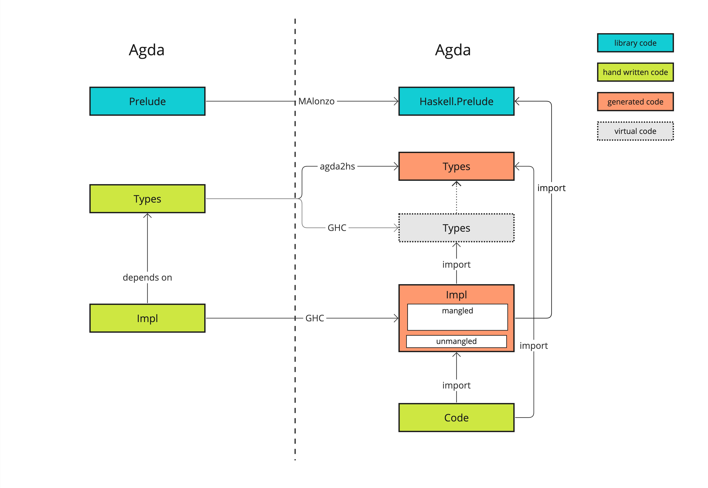

We used `agda` to generate `MAlonzo`-style Haskell code for the experimental Peras executable specification, [`Peras.QCD.Node.Specification`](https://github.com/input-output-hk/peras-design/blob/3d36761e5c72c55826d9dce1adf0dacdde4d7e3d/src/Peras/QCD/Node/Specification.agda#L1). A new `quickcheck-dynamic` test compares the `MAlonzo` version against the `agda2hs` version: these tests all pass, but the `MAlonzo` version runs significantly slower, likely because it involves more than two hundred Haskell modules.

* `agda2hs` version: 4m 45.206s (250 tests)
* `MAlonzo` version: 10m 46.280s (250 tests)

We also experimented with create a small embedded monadic DSL for writing the Peras specification in Agda in a manner so that it reads as pseudo-code understandable by non-Agda and non-Haskell programmers. For example, the executable specification for *fetching* looks like the following in this eDSL:

```agda
-- Enter a new slot and record the new chains and votes received.
fetching : List Chain → List Vote → NodeOperation
fetching newChains newVotes =
  do
    -- Increment the slot number.
    currentSlot ≕ addOne
    -- Update the round number.
    u ← peras U
    now ← use currentSlot
    currentRound ≔ divideNat now u
    -- Add any new chains and certificates.
    updateChains newChains
    -- Add new votes.
    votes ≕ insertVotes newVotes
    -- Turn any new quorums into certificates.
    newCerts ← certificatesForNewQuorums
    certs ≕ insertCerts newCerts
    -- Make the heaviest chain the preferred one.
    boost ← peras B
    heaviest ← heaviestChain boost <$> use certs <*> use chains
    preferredChain ≔ heaviest
    -- Record the latest certificate seen.
    updateLatestCertSeen
    -- Record the latest certificate on the preferred chain.
    updateLatestCertOnChain
    -- No messages need to be diffused.
    diffuse
```

There are still opportunities for syntactic sugar that would make the code more readable, but dramatic improvements probably are not feasible in this approach. Perhaps a more readable approach would be to express this in a rigorously defined, standardized pseudo-code language, which could be compiled to Agda, Haskell, Rust, Go, etc. Other lessons learned follow:

- Lenses improve readability.
- Using a `List` for the "set" data structure of the paper creates inefficiencies in the implementation.
    - Set invariants are not trivially enforced.
    - Access and query functions are slow.
- It might be difficult prove this executable specification matches the properties that are being formally proved.
- Even though the Agda code is written to look imperative, it has quite a few artifacts of functional style that could be an impediment to some implementors.
    - It might be better to use `let` statements instead of `← pure $`. Unfortunately, it would be quite difficult to design an assignment operator to replace monadic `let` in Agda.
    - The functional style avoids introducing lots of intermediate variables, but maybe that would be preferable to using functions as modifiers to monadic state (e.g., `_≕_ : Lens' s a → (a → a) → State s ⊤`).
    - The `use` and `pure` functions could be eliminated by defining operators (including logical and arithmetic ones) that hide them.
- Overall, the Agda code is more verbose than the textual specification.
- It might be difficult to create Agda code that is simultaneously easily readable by mathematical audiences (e.g., researchers) and software audiences (e.g., implementors).
- Quite a bit of boilerplate (instances, helper functions, lenses, State monad, etc.) are required to make the specification executable.
- Creating a full eDSL might be a better approach, but that would involved significantly more effort.

# Community feedback

- **Varied Needs**: Stakeholders have varying levels of technical expertise. Some require rigorous specifications (Agda, research papers), while others prefer high-level explanations and practical resources like pseudocode, diagrams, and data structure descriptions.
- **Accessibility**: There is a strong preference for CIPs (Cardano Improvement Proposals) to be understandable to a wider and diverse audience. dApp builders want to know if and what changes are required from them - i.e. how many confirmations they have to wait for before they can display to the user that the action is confirmed, SPOs want to know how much extra resources are neede and what effort is required for installation, etc.
- **Transparency and Rationale**: Stakeholders want clarity on the cost of Peras (in terms of ADA, fees, or resources) and a clear explanation of why this solution is possible now when it wasn't before.
- **Speed and Efficiency**: Some stakeholders emphasize the need for a faster development process, suggesting that the formal specification could be developed in parallel with the technical implementation.
- **Timeline**: Stakeholders are curious about the timeline for Peras development and implementation.

# Resources impact of Peras

In this section, we evaluate the impact on the day-to-day operations of the Cardano network and cardano nodes of the deployment of Peras protocol, based on the data gathered over the course of project.

## Network

### Network traffic

For a fully synced nodes, the impact of Peras on network traffic is modest:

* For votes, assuming $U ~ 100$, a committee size of 2000 SPOs, a single vote size of 700 bytes, means we will be adding an average of 14kB/s to the expected traffic to each node,
* For certificates, assuming an average of 50kB size (half way between Mithril and ALBA sizes) means an negligible increase of 0.5kB/s on average. Note that a node will download either votes or certificate for a given round, but never both so these numbers are not cumulative.

A non fully synced nodes will have to catch-up with the _tip_ of the chain and therefore download all relevant blocks _and_ certificates. At 50% load (current [monthly load](https://cexplorer.io/usage) is 34% as of this writing), the chain produces a 45kB block every 20s on average. Here are back-of-the-napkin estimates of the amount of data a node would have to download (and store) for synchronising, depending on how long it's been offline:

| Time offline | Blocks (GB) | Certificates (GB) |
|--------------|-------------|-------------------|
| 1 month      | 5.56        | 1.23              |
| 3 months     | 16.68       | 3.69              |
| 6 months     | 33.36       | 7.38              |

### Network costs

We did some research on network pricing for a few major Cloud and well-known VPS providers, based on the [share](https://pooltool.io/networkhealth) of stakes each provider is reported to support, and some typical traffic pattern as exemplified by the following picture (courtesy of Markus Gufler).

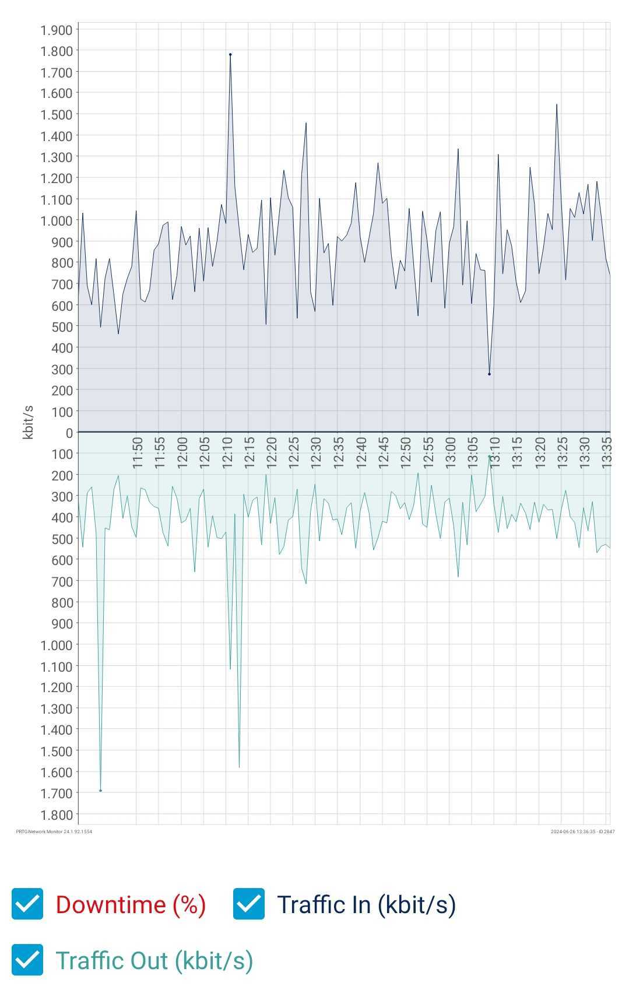

The next table compares the cost (in US$/month) for different outgoing data transfer volumes expressed as bytes/seconds, on similar VMs tailored to cardano-node's [hardware requirements](https://developers.cardano.org/docs/operate-a-stake-pool/hardware-requirements/) (32GB RAM, 4+ Cores, 500GB+ SSD disk). The base cost of the VM is added to the network cost to yield total costs depending on transfer rate.

| Provider     | VM     | 50kB/s | 125kB/s | 250kB/s |
|--------------|--------|--------|---------|---------|
| DigitalOcean | $188   | $188   | $188    | $188    |
| Google Cloud | $200   | $213.6 | $234    | $268    |
| AWS          | $150 ? | $161.1 | $177.9  | $205.8  |
| Azure        | $175   | $186   | $202    | $230    |
| OVH          | $70    | $70    | $70     | $70     |
| Hetzner      | $32    | $32    | $32     | $32     |

**Notes**:

* the AWS cost is quite hard to estimate up-front, obviously on purpose. The $150 base price is a rough average of various instances options in the target range
* Google, AWS and Azure prices are based on 100% uptime and at least 1-year reservation for discounts
* Cloud providers only charge _outgoing_ network traffic. The actual cost per GB depends on the destination, this table assumes all outbound traffic will be targeted outside of the provider which obviously won't be true, so it should be treated as an upper bound.

For an AWS hosted SPO, which represent about 20% of the SPOs, a 14kB/s increase in traffic would lead to a cost increase of **$3.8/mo** (34GB times $0.11/GB). This represents an average across the whole network: depending on the source of the vote and its diffusion pattern, some nodes might need to send a vote to more than one downstream peer which will increase their traffic, while other nodes might end up not needing to send a single vote to their own peers. Any single node in the network is expected to download each vote _at most_ once.

## Persistent storage

Under similar assumptions, we can estimate the storage requirements entailed by Peras: Ignoring the impact of cooldown periods, which last for a period at least as long as $k$ blocks, the requirement to store certificates for every round increases node's storage by about **20%**.

Votes are expected to be kept in memory so their impact on storage will be null.

## CPU

In the [Votes & Certificates](#votes--certificates) section we've provided some models and benchmarks for votes generation, votes verification, certificates proving and certificates verification, and votes diffusion. Those benchmarks are based on efficient sortition-based voting and ALBAs certificate, and demonstrate the impact of Peras on computational resources for a node will be minimal. Moreover, the most recent version of the algorithm detailed in this report is designed in such a way the voting process runs in parallel with block production and diffusion and therefore is not on this critical path.

## Memory

A node is expected to need to keep in memory:

* Votes for the latest voting round: For a committee size of 1000 and individual vote size of 700 bytes, that's 700kB.
* Cached certificates for voting rounds up to settlement depth, for fast delivery to downstream nodes: With a boost of 10/certificate, settlement depth would be in the order of 216 blocks, or 4320 seconds, which represent about 10 rounds of 400 slots. Each certificate weighing 50kB, that's another 500kB of data a node would need to cache in memory.

Peras should not have any significant impact on the memory requirements of a node.

# Integration into Cardano Node

In the [previous](tech-report-1.md) report, we already studied how Peras could be concretely implemented in a Cardano node. Most of the comments there are still valid, and we only provide here corrections and additions when needed. We have addressed resources-related issue in a previous section.

The following picture summarizes a possible architecture for Peras highlighting its interactions with other components of the system.

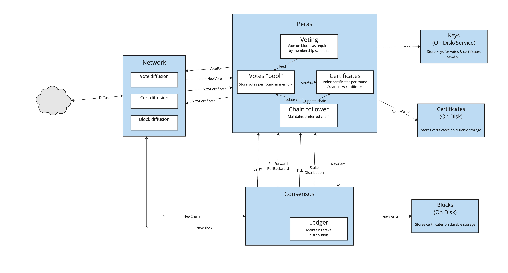

The main impacts identified so far are:

* There is no impact in the existing block diffusion process, and no changes to block headers structure
* Block body structure needs to be changed to accomodate for a certificate when entering _cooldown_ period
* Consensus _best chain_ selection algorithm needs to be aware of the existence of a _quorum_ to compute the _weight_ of a possible chain, which is manifested by a _certificate_ from the Peras component
  * Consensus will need to maintain or query a list of valid certificates (eg. similar to _volatile_ blocks) as they are received or produced
  * Chain selection and headers diffusion is not dependent on individual votes
* Peras component can be treated as another _chain follower_ to which new blocks and rollbacks are reported
  * Peras component will also need to be able to retrieve current _stake distribution_
  * It needs to have access to VRF and KES keys for voting, should we decide to forfeit BLS signature scheme
* Dedicated long term storage will be needed for certificates
* Networking layer will need to accomodate (at least) two new mini-protocols for votes and certificates diffusion
  * This seems to align nicely with current joint effort on [Mithril integration](https://hackmd.io/yn9643iKTVezLbiVb-BzJA?view)
* Our remarks regarding the possible development of a standalone prototype interacting with a modifified adhoc node still stands and could be a good next step

# Conclusion

## The case for Peras

Peras provides demonstrably fast settlement without weakening security or burdening nodes. The settlement time varies as a function of the protocol-parameter settings and the prevalence of adversarial stake. For a use case that emphasizes rapid determination of whether a block is effectively finally incorporated into the preferred chain, it is possible to achieve settlement times as short as two minutes, but at the expense of having to resubmit rolled-back transactions in cases where there is a strong adversarial stake.

The impact of Peras upon nodes falls into four categories: network, CPU, memory, and storage. We have provided [evidence](#votes--certificates) that the CPU time required to construct and verify votes and certificates is much smaller than the duration of a voting round. Similarly, the [memory](#memory) needed to cache votes and certificates and the [disk space](#persistent-storage) needed to persist certificates is trivial compared to the memory needed for the UTXO set and the disk needed for the blocks.

On the networking side, our [ΔQ studies](#vote-diffusion) demonstrate that diffusion of Peras votes and certificates consumes minimal bandwidth and would not interfere with other node operations such as memory-pool and block diffusion. However, [diffusion of votes and certificates](#network-traffic) across a network will still have a noticeable impact on the _volume_ of data transfer, in the order of 20%, which might translate to increased operating costs for nodes deployed in cloud providers.

In terms of development impacts and resources, Peras requires only a minimal modification to the ledger CDDL and block header. Around cool-down periods, a certificate hash will need to be included in the block header and the certificate itself in the block. Implementing Peras does not require any new cryptographic keys, as the existing VRF/KES will be leveraged. It will require an implementation of the ALBA algorithm for creating certificates. It does require a new mini-protocol for diffusion of votes and certificates. The node's logic for computing the chain weight needs to be modified to account for the boosts provided by certificates. Nodes will have to persist all certificates and will have to cache unexpired votes. They will need a thread (or equivalent) for verifying votes and certificates. Peras only interacts with Genesis and Leios in the chain-selection function and it is compatible with the historical evolution of the blockchain. A node-level specification and conformance test will also need to be written.

In no way does Peras weaken any of the security guarantees provided by Praos or Genesis. Under strongly adversarial conditions, where an adversary can trigger a Peras voting cool-down period, the protocol in essence reverts to the Praos protocol, but for a duration somewhat longer than the Praos security parameter. Otherwise, settlement occurs after each Peras round. This document has approximately mapped the trade-off between having a short duration for each round (and hence faster settlement) versus having a high resistance to an adversary forcing the protocol into a cool-down period. It also estimates the tradeoff between giving chains a larger boost for each certificate (and hence stronger anchoring of that chain) versus keeping the cool-down period shorter.

## Recommended next steps

- Complete proofs.
    - Voting strings.
    - Liveness of the protocol.
    - Soundness of the executable specification.
    - Synchronize with Praos formalization.
    - Prepare a publication or online supplement.
- Complete conformance suite.
    - Tests for non-voting parts of the protocol.
    - Serialization format and inter-process communication for testing third-party implementations.
    - Package for easy installation and use.
- Recommend parameter values.
    - Seek and analyze stakeholder requirements, especially from partner chains.
    - Develop a parameter-evaluation tool (based on the Markov-chain simulator) that provides a full set of impact metrics for a given set of parameters.
- Reach out to stakeholders.
    - Populate website with latest results.
    - Online versions of all analysis, simulation, and visualization tools.
    - Organize a stakeholder workshop and/or a Intersect Consensus Technical WG.
        - Feedback on specification format.
        - Feedback on conformance suite.
        - Feedback on and refinement of the draft CIP.
- Tooling fixes and enhancements
    - Improve the usability, efficiency, and testing of the ΔQ software.
        - Provide out-of-the-box and possibly interactive visualization.
        - Provide faster numeric computations (e.g. using discretized CDFs and fast vector operations, possibly offloaded to GPU).
        - Provide additional combinators (e.g., quantile-arrival time) for the DSL.
    - Improve the protocol visualizer.
        - Allow users to inject adversarial behavior or network disruptions (e.g., "split brain" scenarios).
        - Make visualization scalable in the browser to long chains (i.e., hours of simulated block production) and large networks.
    - Improve the prototype simulator.
        - Add an efficient implementation suitable for large networks and long simulations.
        - Create a simple DSL for inputting simulation scenarios for both honest and adversarial behavior.
    - Improve the Markov-chain analyzer.
        - Add a DSL for defining scenarios.
        - Add visualization and analysis tools.
    - Collaborate with higher-resolution network simulation efforts, potentially implementing Peras on them.
        - PeerNet
        - ce-netsim
- Move from the "pre-alpha" to the "alpha" version of the protocol.
    - Requires completion of the Peras paper.
    - Formalize and implement the preagreement YOSO abstraction.
