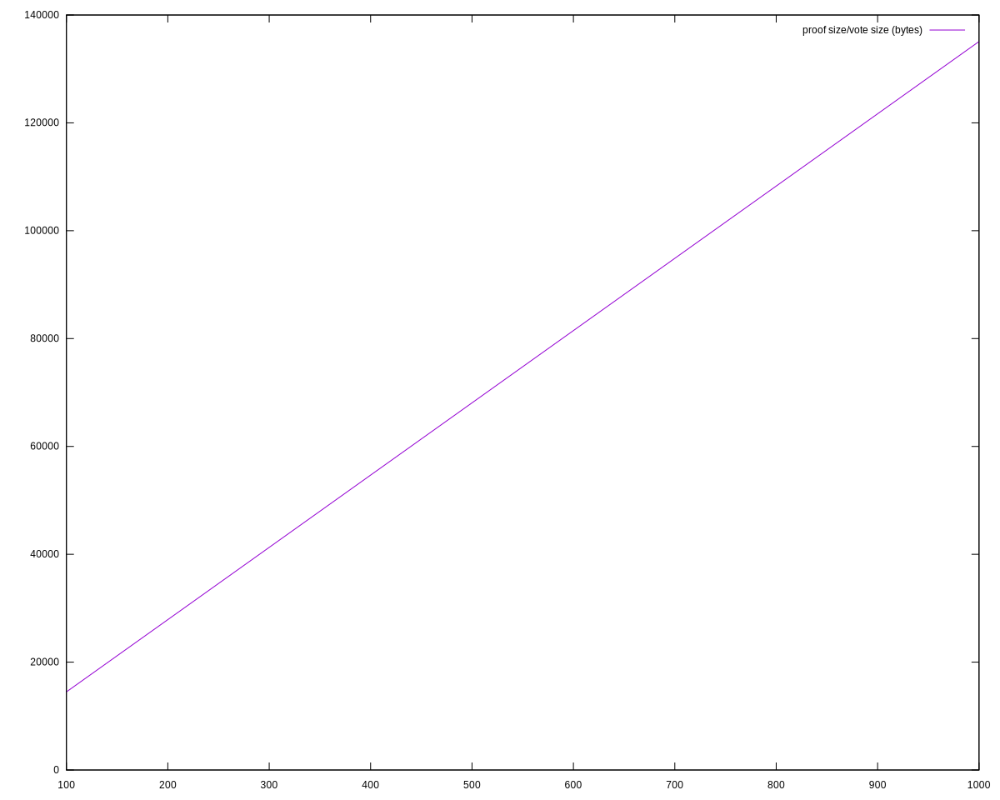

> [!IMPORTANT]
> Unlike for the first tech report, we should only include analyses that conform to the latest version of the protocol.

# Protocol definition

> [!WARNING]
> The following is a near-verbatim copy of Figure 2 of the draft Peras paper. The only signficant alterations are the following:
>
> - Omit preagreement
>     - Set the termination bound to zero: T ≡ 0
>     - The proposed block for voting is simply the youngest block at least L slots old on the locally preferred chain.
> - Do not track certificate arrival time: Δ ≡ 0
> - The initial set of certificates is the genesis certificate, not the empty set.
> - Clarified ambiguities.
> - Omit irrelevant details.
> - Made chain-preference deterministic.
> - Sequenced operations.

## Variables

The protocol keeps track of the following variables, initialized to the values below:

- `In1`: $C_\text{pref} \gets C_\text{genesis}$: preferred chain;
- `In2`: $\mathcal{C} \gets \{C_\text{genesis}\}$: set of chains;
- `In3`: $\mathcal{V} \gets \emptyset$: set of votes;
- `In4`: $\mathsf{Certs} \gets \{\mathsf{cert}_\text{genesis}\}$: set of certificates;
- `In5`: $\mathsf{cert}^\prime \gets \mathsf{cert}_\text{genesis}$: the latest certificate seen;
- `In6`: $\mathsf{cert}^* \gets \mathsf{cert}_\text{genesis}$: the latest certificate on chain.

## Sequence

The protocol operations occur sequentially in the following order:

- Fetching
- Block Creation
- Voting

## Fetching

At the beginning of each slot:
- `Fe1`: Fetch new chains $\mathcal{C}_\text{new}$ and votes $\mathcal{V}_\text{new}$.
- `Fe2`: Add any new chains in $\mathcal{C}_\text{new}$ to $\mathcal{C}$, add any new certificates contained in chains in $\mathcal{C}_\text{new}$ to $\mathsf{Certs}$.
	- `Fe2x`: Discard any equivocated blocks or certificates: i.e., do not add them to $\mathcal{C}$ or $\mathsf{Certs}$.
- `Fe3`: Add $\mathcal{V}_\text{new}$ to $\mathcal{V}$ and turn any new quorum in $\mathcal{V}$ into a certificate $\mathsf{cert}$ and add $\mathsf{cert}$ to $\mathsf{Certs}$.
	- `Fe3x`: Discard any equivocated votes: i.e., do not add the to $\mathcal{V}$.
- `Fe4`: Set $C_\text{pref}$ to the heaviest (w.r.t. $\mathsf{Wt}_\mathsf{P}(\cdot)$) valid chain in $\mathcal{C}$.
	- `Fe4x`: *If several chains have the same weight, select the one whose tip has the smallest block hash as the preferred one.*
    - Each party $\mathsf{P}$ assigns a certain weight to every chain $C$, based on $C$'s length and all certificates that vote for blocks in $C$ that $\mathsf{P}$ has seen so far (and thus stored in a local list $\mathsf{Certs}$).
    - `CW1`: Let $\mathsf{certCount}_\mathsf{P}(C)$ denote the number of such certificates, i.e., $\mathsf{certCount}_\mathsf{P}(C) := \left| \left\{ \mathsf{cert} \in \mathsf{Certs} : \mathsf{cert} \text{ votes for a block on } C \right\} \right|$.
    - `CW2`: Then, the weight of the chain $C$ in $\mathsf{P}$'s view is $\mathsf{Wt}_\mathsf{P}(C) := \mathsf{len}(C) + B \cdot \mathsf{certCount}_\mathsf{P}(C)$ for a protocol parameter $B$.
- `Fe5`: Set $\mathsf{cert}^\prime$ to the certificate with the highest round number in $\mathsf{Certs}$.
- `Fe6`: Set $\mathsf{cert}^*$ to the certificate with the highest round number on (i.e., included in) $C_\text{pref}$.

## Block creation

Whenever party $\mathsf{P}$ is slot leader in a slot $s$, belonging to some round $r$:

- `BC1`: Create a new block $\mathsf{block} = (s, \mathsf{P}, h, \mathsf{cert}, ...)$, where
    - `BC2`: $h$ is the hash of the last block in $C_\text{pref}$,
    - `BC3`: $\mathsf{cert}$ is set to $\mathsf{cert}^\prime$ if
        - `BC4`: there is no round-$(r-2)$ certificate in $\mathsf{Certs}$, and
        - `BC5`: $r - \mathsf{round}(\mathsf{cert}^\prime) \leq A$, and
        - `BC6`: $\mathsf{round}(\mathsf{cert}^\prime) > \mathsf{round}(\mathsf{cert}^*)$,
        - `BC7`: and to $\bot$ otherwise,
- `BC8` Extend $C_\text{pref}$ by $\mathsf{block}$, add the new $C_\text{pref}$ to $\mathcal{C}$ and diffuse it.

## Voting

Party $\mathsf{P}$ does the following at the beginning of each voting round $r$:

- `Vo1`: Let $\mathsf{block}$ be the youngest block at least $L$ slots old on $C_\text{pref}$.
- `Vo2`: If party $\mathsf{P}$ is (voting) committee member in a round $r$,
    - either
        - `VR-1A`: $\mathsf{round}(\mathsf{cert}^\prime) = r-1$ and $\mathsf{cert}^\prime$ was received before the end of round $r-1$, and
        - `VR-1B`: $\mathsf{block}$ extends (i.e., has the ancestor or is identical to) the block certified by $\mathsf{cert}^\prime$,
    - or
        - `VR-2A`: $r \geq \mathsf{round}(\mathsf{cert}^\prime) + R$, and
        - `VR-2B`: $r = \mathsf{round}(\mathsf{cert}^*) + c \cdot K$ for some $c > 0$,
    - `Vo3`: then create a vote $v = (r, \mathsf{P}, h,...)$,
    - `Vo4`: Add $v$ to $\mathcal{V}$ and diffuse it.

# Votes & Certificates

This section details the Peras voting process, from the casting and detailed structure of votes, to the creation, diffusion, and storage of certificates.

## Votes

### Algorithms

Voting in Peras is mimicked after the _sortition_ algorithm used in Praos, e.g it is based on the use of a _Verifiable Random Function_ by each stake-pool operator guaranteeing the following properties:

* The probability for each voter to cast their vote in a given round is correlated to their share of total stake,
* It should be computationally impossible to predict a given SPO's schedule without access to their secret key VRF key,
* Verification of a voter's right to vote in a round should be efficiently computable,
* Vote should be unique and non-malleable (this is a requirement for the use of efficient certificates aggregation, see [below](#alba-certificates)),
* Voting should require minimal additional configuration (ie. key management) for SPOs.

Here is

## ALBA Certificates

* [ALBAs](https://iohk.io/en/research/library/papers/approximate-lower-bound-arguments/) appears to provide a good basis for Peras certificates
* The [Prototype implementation in Haskell](https://github.com/cardano-scaling/alba) provides some evidence this construction could be feasible in the context of Peras

### Proving & Verification time

The following picture plots the time needed (in milliseconds) to build certificate for varying number of votes, assuming a security parameter of 128, honest share of 67% and vote size of 256 bytes.


We can observe that even in some extreme cases proving time stays consistently under 20ms and on the average is between 10 and 15ms for even large number of items. The wild variation in proving time for different number of input set is explained by the non-deterministic nature of the algorithm: We construct the proof through depth-first search, by repeatedly comparing hash values _modulo_ the expected number of honest items, so the number of comparisons and hashes to make may vary significantly depending on how the ordering of the list of items.

It's worth considering whether or not this dependency on the ordering of the items could be an attack vector as proving time could easily explode in case we need to explore more than a small fraction of the tree.

Verification time has not been plotted but is lower than 1ms in all the cases considered as it is tied to the number of hash computation one has to make which is $O(u)$.

### Certificate size

For a given set of parameters, eg. fixed values for $\lambda_{sec}$, $\lambda_{rel}$, and $n_p/n_f$ the proof size is perfectly linear and only depends on the size of each vote:



Varying the security parameter and the honest votes ratio for a fixed set of 1000 votes of size 200 yields the following diagram, showing the critical factor in proof size increase is the $n_p/n_f$ ratio: As this ratio decreases, the number of votes to include in proof grows superlinearly.


# Constraints on Peras Parameters

| Parameter | Symbol | Units | Description | Constraints | Rationale |
| ---- | ---- | ---- | ---- | ---- | ---- |
| Round length | $U$ | slots | The duration of each voting round. | $U \geq \Delta$ | All of a round's votes must be received before the end of the round. |
| Chain ignorance period | $R$ | rounds | The number of rounds for which to ignore certificates after entering a cool-down period. | $R = \left\lceil A / U \right\rceil$ | Ensure chain-ignorance period lasts long enough to include a certificate on the chain. |
| Cool-down period | $K$ | rounds | The minimum number of rounds to wait before voting again after a cool-down period starts. | $K = \left\lceil \frac{A + T_\text{CP}}{U} \right\rceil$ | After a quorum failure, the chain must heal, achieve quality, and attain a common prefix. |
| Certificate expiration | $A$ | slots | The maximum age for a certificate to be included in a block. | $A = T_\text{heal}+T_\text{CQ}$ | After a quorum failure, the chain must heal and achieve quality. |
| Certification boost | $B$ | blocks | The extra chain weight that a certificate gives to a block. | $B \gt 0$ | Peras requires that some blocks be boosted. |
| Quorum size | $\tau$ | parties | The number of votes required to create a certificate. | $\tau \gt 3 n / 4$ | Guard against a minority (<50%) of adversarial voters. |
| Committee size | $n$ | parties | The number of members on the voting committee. | $n \gt 0$ | Peras requires a voting committee. |
| Network diffusion time | $\Delta$ | slots | Upper limit on the time needed to diffuse a message to all nodes. | $\Delta \gt 0$ | Messages have a finite delay. |
| Active slot coefficient | $f$ | 1/slots | The probability that a party will be the slot leader for a particular slot. | $0 \lt f \leq 1$ | Blocks must be produced. |
| Healing time | $T_\text{heal}$ | slots | Healing period to mitigate a strong (25-50%) adversary. | $T_\text{heal} ≟ \mathcal{O}\left( B^2 / \alpha \right)$ | Sufficient blocks must be produced to overcome an adversarially boosted block. |
| Chain-quality time | $T_\text{CQ}$ | slots | Ensure the presence of at least one honest block on the chain. | $T_\text{CQ} ≟ \mathcal{O} (k)$ | A least one honest block must be produced. |
| Common-prefix time | $T_\text{CP}$ | slots | Achieve settlement. | $T_\text{CP} \approx k / \alpha$ | The Ouroboros Praos security parameter defines the time for having a common prefix. |
| Security parameter | $k$ | blocks | The Ouroboros Praos security parameter. | $k = 2160$ | Value for the Cardano mainnet. |

*Note that parameters $T$ and $\Delta$ are not used in this initial specification of the Peras protocol.*

# Simulating Peras

## Protocol simulation

The Peras simulator is a prototype/reference implementation of the Peras protocol in Haskell. The implementation aims to encode the pseudo-code for the protocol specification in as literal and transparent a manner as possible, regardless of the performance drawbacks of such literalness. Note that it simulates the Peras protocol in the abstract and does not include a simulation of network diffusion. Its core contains four modules:

- `Peras.Prototype.Fetching` handles the receipt of new chains and new votes. It includes the following logic:
	- creates new certificates when a new quorum of votes is reached,
	- selects the preferred chain, and
	- updates $\mathsf{cert}^\prime$ and $\mathsf{cert}^*$.
- `Peras.Prototype.BlockCreation` forges new blocks and, optionally, includes a certificate in the new block.
- `Peras.Prototype.Preagreement` selects the block that a party will vote upon.
- `Peras.Prototype.Voting` casts votes.

Additional, non-core modules handle the diffusion of votes, the interactions between multiple nodes, and visualization of results. The simulator's voting behavior has been tested against the Agda-derived executable specification via the `quickcheck-dynamic` property-based state-machine testing framework: see `Peras.Conformance.Test`.

The simulator can be run from the command line or in a web browser. At the command line, one can specify the input configuration (state) of the simulation, store its output configuration, and record a trace of simulation events. The ending time of the output configuration can be edited to set it to a later time, and then the simulation can be continued by providing that edited output configuration as input to the continued simulation.

```console
$ peras-simulate --help

peras-simulate: simulate Peras protocol

Usage: peras-simulate [--version] [--in-file FILE] [--out-file FILE] 
                      [--trace-file FILE]

  This command-line tool simulates the Peras protocol.

Available options:
  -h,--help                Show this help text
  --version                Show version.
  --in-file FILE           Path to input YAML file containing initial simulation
                           configuration.
  --out-file FILE          Path to output YAML file containing final simulation
                           configuration.
  --trace-file FILE        Path to output JSON-array file containing simulation
                           trace.
```

The input configuration file specifies the protocol parameters, the initial state of the simulation, and the slot-leadership and committee-membership schedules for each node/party. This gives the user full control over the simulation and ensures reproducibility of the simulation results.

```json
{
  "params":{"U":20,"A":200,"R":10,"K":17,"L":10,"τ":2,"B":10,"T":15,"Δ":5},
  "start":0,
  "finish":300,
  "payloads":{},
  "parties":{
    "1":{"leadershipSlots":[2,10,25,33,39,56,71,96,101,108,109,115],"membershipRounds":[1,2,6],"perasState":{"certPrime":{"blockRef":"","round":0},"certStar":{"blockRef":"","round":0},"certs":[],"chainPref":[],"chains":[[]],"votes":[]}},
    "2":{"leadershipSlots":[12,17,33,44,50,67,75,88,105],"membershipRounds":[2,3,5,6],"perasState":{"certPrime":{"blockRef":"","round":0},"certStar":{"blockRef":"","round":0},"certs":[],"chainPref":[],"chains":[[]],"votes":[]}},
    "3":{"leadershipSlots":[5,15,42,56,71,82,124],"membershipRounds":[3,4,5,6],"perasState":{"certPrime":{"blockRef":"","round":0},"certStar":{"blockRef":"","round":0},"certs":[],"chainPref":[],"chains":[[]],"votes":[]}},
    "4":{"leadershipSlots":[8,15,21,38,50,65,127],"membershipRounds":[1,5],"perasState":{"certPrime":{"blockRef":"","round":0},"certStar":{"blockRef":"","round":0},"certs":[],"chainPref":[],"chains":[[]],"votes":[]}}
  },
  "diffuser":{"delay":0,"pendingChains":{},"pendingVotes":{}}
}
```

The output configuration file reveals all of the chains, votes, etc. tracked by each node/party. The trace file is a JSON array of events occurring in the simulation. The trace file converted to a GraphViz `.dot` file for visualization. Traces can also be piped into tools for real-time analysis.

| Tag                         | Event                                                      |
| --------------------------- | ---------------------------------------------------------- |
| `Protocol`                  | new protocol parameters                                    |
| `Tick`                      | new slot                                                   |
| `NewChainAndVotes`          | new chains and votes received                              |
| `NewCertificatesReceived`   | new certificates received (embedded in new chains)         |
| `NewCertificatesFromQuorum` | new certificates created after new votes have been fetched |
| `NewChainPref`              | node prefers a new chain                                   |
| `NewCertPrime`              | node selected a new $\mathsf{cert}^\prime$                 |
| `NewCertStar`               | node selected a new $\mathsf{cert}^*$                      |
| `ForgingLogic`              | logic for including a certificate in a new block           |
| `DiffuseChain`              | chain extended by a new block                              |
| `PreagreementBlock`         | preagreement on a block to be voted upon                   |
| `PreagreementNone`          | no preagreement for voting                                 |
| `VotingLogic`               | logic for casting a vote                                   |
| `DiffuseVote`               | diffuse a new vote                                         |

```console
$ peras-visualize --help

peras-visualize: visualize Peras simulation traces

Usage: peras-visualize [--version] --trace-file FILE [--dot-file FILE]

  This command-line tool visualizes Peras simulation traces.

Available options:
  -h,--help                Show this help text
  --version                Show version.
  --trace-file FILE        Path to input JSON-array file containing simulation
                           trace.
  --dot-file FILE          Path to output GraphViz DOT file containing
                           visualization.
```
  
## Protocol visualization

The results of simulations can be viewed graphically in a web application (see https://peras-simulation.cardano-scaling.org/) that lets one explore the operation of the Peras protocol and the influence that each of the protocol parameters has upon the evolution of the block tree. This can be used for education, for studying voting behavior, for selecting optimal values of the protocol parameters, or for debugging a simulation.

The screenshot below shows the user interface for the Peras simulation web application.

- Each of the Peras protocol parameters may be set, and tooltips provide explanations of them.
- Simulation-related parameters such as the duration of the simulation, the number of nodes involved, and the random-number seen may be set.
- Users can share simulations by copying a URL that embeds sufficient information to fully reproduce the simulation.
- Buttons allow the user to run, step singly, pause or stop the simulation.
- A zoomable display visualizes the simulated block tree.


The screenshot below shows the visualization of the Peras block tree:

- Light blue rectangles represent blocks that do not record Peras certificates, whereas dark blue rectangles represent blocks that do record Peras certificates recorded in them.
	- Block lines point to the parent block.
	- The three ⊤ and ⊥ symbols in the block indicate whether each of the three certificate-inclusion rules are true or false, respectively.
- Salmon-colored circles represent votes for blocks, whereas olive-colored circles represent situation were a party was on the voting committee but not allowed to vote.
	- Salmon-colored dashed lines point to the block being voted for.
	- The four ⊤ and ⊥ symbols in the block indicate whether each of the four voting rules are true or false, respectively.
- Certificates are aqua rectangles.
	- Aqua dashed lines point to the block being certified.
- Nodes are red circles.
	- The red dashed lines point to the tip of their preferred blockchain.
	- The orange dashed lines point to their $\mathsf{cert}^\prime$ and $\mathsf{cert}^*$ certificates.


The visualizer can be deployed as a server via Docker. It supports multiple simultaneous web clients running each their own simulations and it supports basic HTTP authentication.

```console
$ peras-server --help

peras-server: server Peras simulations

Usage: peras-server [--version] [--port PORT] 
                    [--username STRING --password STRING]

  This server provides Peras simulations.

Available options:
  -h,--help                Show this help text
  --version                Show version.
  --port PORT              Port on which the server listens.
  --username STRING        Authorized user.
  --password STRING        Password for authorized user.
```

## Markov-chain simulation

> [!IMPORTANT]
> Discuss the Markov-chain simulation and results

# Analyses of adversarial scenarios

> [!CAUTION]
> 1. Several well-formatted equations are not rendered correctly by GitHub's MathJAX. Make sure that these render correctly via `pandoc`.
> 2. Check all of the mathematical derivations in this section.
> 3. Explain the scenarios more clearly.

In this section we use the following notation:

- Active-slot coefficient: $\alpha$
- Round length: $U$
- Block-selection offset: $L$
- Certificate expiration: $A$
- Quorum for creating a certificate: $\tau = \frac{3}{4} n$
- Fraction of adversarial stake: $f$
- Mean size of the voting committee: $n$
- Per-slot probability of a block:
	- Honest block: $p = 1 - (1 - \alpha)^{1 - f} \approx \alpha \cdot (1 - f)$
	- Adversarial block: $q = 1 - (1 - \alpha)^f \approx \alpha \cdot f$
- Binomial distribution of $n$ trials each with probability $p$ :
	- Probability density function: $\mathbf{p}_\text{binom}(k,n,p)= {n\choose{k}} \cdot p^k \cdot (1 - p)^{n-k}$
	- Cumulative probability function: $\mathbf{P}_\text{binom}(m,n,p) = \sum_{k=0}^m \mathbf{p}(k,n,p)$
- Normal distribution with mean $\mu$ and standard deviation $\sigma$:
	- Probability density function: $\mathbf{p}_\text{normal}(x, \mu, \sigma) = \frac{1}{\sqrt{2 \pi \sigma^2}} e^{- \frac{(x - \mu)^2}{2 \sigma^2}}$
	- Cumulative probability function: $\mathbf{P}_\text{normal}(x,\mu,\sigma) = \int_{-\infty}^x dt \, \mathbf{p}_\text{normal}(t, \mu, \sigma)$

> [!IMPORTANT]
> Discuss the relationship between per-slot probabilities and per-block probabilities.

> [!IMPORTANT]
> Add paragraphs discussing how to interpret probabilities in terms of the security of a long-running blockchain.

## No honest quorum in round

***Question:*** What is the probability of not reaching a quorum if adversaries abstain from voting?

***Relevance:*** This analysis can be used to select a mean committee size that is appropriate for a given risk tolerance.

***Risk:*** A adversary can trigger a cool-down period if they abstain from voting.

***Scenario:*** Consider the situation where the adversary decides not to vote in a round, in order to prevent a quorum from occurring and to force the chain into a cool-down period. This occurs when the number of honest voters is less than the quorum size.

***Analysis:*** Let $\beta$ be the probability that a unit of stake is selected for voting-committee membership. Let $S$ be the total stake and $H = (1 - f) \cdot S$ be the honest stake. Assuming the total stake is large, we can approximate the binomial distribution by a normal one and express the probability of not having an an honest quorum as follows:

$$
P = \mathbf{P}_\text{binom} (\lfloor\tau\rfloor, H, \beta) \approx \mathbf{P}_\text{normal} \left( \tau, H \cdot \beta, \sqrt{H \cdot \beta \cdot (1 - \beta)} \right) \approx \mathbf{P}_\text{normal} \left( \tau, H \cdot \beta, \sqrt{H \cdot \beta} \right)
$$

Now set the quorum size to the recommended value $\tau = \frac{3}{4} n$ to discover a simple relationship:

$$
P \approx \mathbf{P}_\text{normal} \left( f , \frac{1}{4} , \sqrt{\frac{1 - f}{n}} \right)
$$

The following R function performs this computation:

```R
function(f, n)
  pnorm(f, 1 / 4, sqrt((1 - f) / n))
```

***Example:*** Plot the probability of not having an honest quorum as a function of the adversarial fraction of stake, for various mean sizes of the voting committee.


## Adversarial quorum

***Question:*** What is the probability that adversaries can form a voting quorum in a round?

***Relevance:*** This analysis can be used to select a mean committee size that is appropriate for a given risk tolerance.

***Risk:*** An adversary can boost an adversarial fork.

***Scenario:*** Consider the situation where adversaries are lucky enough in the voting-committee sortition to hold a quorum of votes.

***Analysis:*** The analysis proceeds similarly to the "no honest quorum" scenario, but for adversaries having at least a quorum of votes.

$$
P = 1 - \mathbf{P}_\text{binom} (\lceil\tau\rceil, S - H, \beta) \approx 1 - \mathbf{P}_\text{normal} \left( \tau, (S - H) \cdot \beta, \sqrt{(S - H) \cdot \beta \cdot (1 - \beta)} \right) \approx 1 - \mathbf{P}_\text{normal} \left( \tau, f \cdot n, \sqrt{f \cdot n} \right)
$$

Now set the quorum size to the recommended value $\tau = \frac{3}{4} C$ to discover a simple relationship:

$$
P \approx \mathbf{P}_\text{normal} \left( f , \frac{3}{4} , \sqrt{\frac{f}{n}} \right)
$$

The following R function performs this computation:

```R
function(f, n)
  pnorm(f, 3 / 4, sqrt(f / n))
```

***Example:*** Plot the probability of having an adversarial quorum as a function of the adversarial fraction of stake, for various mean sizes of the voting committee.


## No certificate in honest block

***Question:*** What is the probability that adversaries can prevent a certificate from being included in a block before the certificate expires?

***Relevance:*** This analysis can be used to set the certificate-expiration parameter $A$.

***Risk:*** An adversary can trigger a premature ending of the cool-down period (via rule VR-2B) by preventing a new *cert\** from being recorded in a block.

***Scenario:***  Consider the situation where the voting certificate must be included on the chain (via rule Block Creation 1b), but no honest blocks are forged before the last *cert′* expires and adversaries abstain from updating *cert′* when they forge blocks.

***Analysis:***. The probability that adversaries forge every block during the period when the certificate hasn't expired is

$$
P = (1 - p)^A = (1 - \alpha)^{(1 - f) \cdot A}
$$

and this can be represented as the following R function:

```R
function(A, f, alpha)
  (1 - alpha)^((1 - f) * A)
```

***Example:*** Assuming an active-slot coefficient of 5%, plot the probability of a certificate not being recorded in an honest block before the certificate expires.


## Adversarial chain receives boost

> [!IMPORTANT]
> Discuss why there are several variants here.

### Variant 1

> [!CAUTION]
> This variant needs reworking!

***Question.*** What is the probability that an adversarial chain receives the next boost?

***Relevance:*** This analysis provides guidance on selecting the round length.

***Risk:*** An adversary can anchor their chain by having one of its later blocks boosted.

***Scenario.*** It currently is round $r$ and a certificate was created in round $r - 1$ for a block at least $U + L$ slots in the past that is also in the common prefix of the honest and adversarial chains. The honest parties lengthen one fork by $m \ge 0$ blocks to the next candidate for voting (i.e., the newest block on that fork that is at least $L$ slots old) and the adversarial parties similarly lengthen a separate fork by $n \ge 0$ blocks. If the adversarial chain is revealed to the honest parties before the start of the new round $r$ and if the adversarial chain is longer (i.e., $n \gt m$), then the voting committee will vote to boost the adversarial chain. The per-slot probability of adding a block to the honest or adversarial chain is $p$ or $q$, respectively.


***Analysis.*** Assume that the block- and vote-diffusion times are negligible, so that the last boosted block is indeed the last block before slot $r \cdot U - U - L$ and that the honest and adversarial candidates are indeed the last blocks on their forks before slot $r \cdot U - l$. (Note that this neglects the probability that the adversary will privately extend the last boosted block before slot $r \cdot U - U - L$.) Thus the lengthening of the two forks during the $U$ slots are the last boosted block are binomially distributed with parameters $m$ and $p$ (honest) and $n$ and $p$ (adversarial). The probability of $m < n$ is

$$
P = \sum_{0 \le m \lt n \le U} \mathbf{p}_\text{binom}(m,U,p) \cdot \mathbf{p}_\text{binom}(n,U,q) = \sum_{n=1}^U \mathbf{P}_\text{binom}(n-1,U,p) \cdot \mathbf{p}_\text{binom}(n,U,q)
$$

and the following R function implements this computation:

```R
function(U, p, q)
  sum( pbinom(1:U-1, U, p) * dbinom(1:U, U, q) )
```

***Example.*** Let the active-slot coefficient $\alpha = 0.05 \, \text{slot}^{-1}$ and let $f$ be the fraction of adversarial stake, so $p = \alpha \cdot (1 - f)$ and $q = \alpha \cdot f$. Plot the probability of the dishonest boost as a function of the adversarial fraction of stake and the round length.


### Variant 2

***Question.*** What is the probability that an adversarial chain receives the next boost?

***Relevance:*** This analysis provides guidance on selecting the round length.

***Risk:*** An adversary can anchor their chain by having one of its later blocks boosted, resulting in honest blocks being rolled back.

***Scenario.*** It currently is round $r$ and a certificate was created in round $r - 1$ for a block at least $U + L$ slots in the past that is also the common prefix of the honest and adversarial chains. The honest parties lengthen one fork by $m \ge 0$ blocks to the next candidate for voting (i.e., the newest block on that fork that is at least $L$ slots old) and the adversarial parties similarly lengthen a separate fork by $k \ge 0$ blocks before slot $r \cdot U - U - L$ and by $n \ge 0$ blocks subsequently. If the adversarial chain is revealed to the honest parties at slot $r \cdot U = L$ and if the adversarial chain is longer (i.e., $k + n \gt m$), then all parties will extend the adversarial chain and then next voting committee will boost the adversarial chain, causing the $m$ honest blocks to be rolled back.


***Analysis.*** Assume that the block- and vote-diffusion times are negligible, so that the last boosted block is indeed the last public block before slot $r \cdot U - U - L$ and that the honest and adversarial candidates are indeed the last blocks on their forks before slot $r \cdot U - l$. Thus the lengthening of the two forks during the $U$ slots are the last boosted block are binomially distributed with parameters $m$ and $p$ (honest) and $n$ and $p$ (adversarial). Additionally, the adversary may privately produce $k$ blocks after the last boosted block and before slot $r \cdot U - U - L$: this random variable for producing such blocks is negative-binomially distributed. The probability of $m < k + n$ is

$$
P = \sum_{\substack{0 \le m \le U \\ 0 \le n \le U \\ 0 \le k \le \infty \\ m \lt n + k}} (1 - f) f^k \cdot {U\choose{m}} p^m (1-p)^{U-m} \cdot {U\choose{n}} q^n (1-q)^{U-n}
$$
which simplifies to
$$
P = (1 - f) \cdot \sum_{n=1}^U \mathbf{P}_\text{binom}(n-1,U,p) \cdot \mathbf{p}_\text{binom}(n,U,q) + (1 - f) \cdot \sum_{k=1}^U f^k \cdot \sum_{n=0}^{U-k} \mathbf{P}_\text{binom}(n+k-1,U,p) \cdot \mathbf{p}_\text{binom}(n,U,q) + f^{U+1}
$$

and we can be implemented in R as the following function:

```R
function (U, p, q) {
  f <- q / (p + q)
  p0 <- (1 - f) * sum( pbinom(0:(U-1), U, p) * dbinom(1:U, U, q) )
  pk <- (1 - f) * sum( mapply(function(k) f^k * sum( pbinom((k-1):(U-1), U, p) * dbinom(0:(U-k), U, q) ), 1:U) )
  pinf <- f^(U+1)
  p0 + pk + pinf
}
```

***Example.*** Let the active-slot coefficient $\alpha = 0.05 \, \text{slot}^{-1}$ and let $f$ be the fraction of adversarial stake, so $p = \alpha \cdot (1 - f)$ and $q = \alpha \cdot f$. Plot the probability of the dishonest boost as a function of the adversarial fraction of stake and the round length.


## Healing from adversarial boost

***Question:*** How long does it take to neutralize the adversarial advantage of a certificate?

***Relevance:*** "During the initial “healing” phase of the cooldown period, parties continue with standard Nakamoto block creation until the potential advantage of B that the adversary could gain with a certificate is neutralized." This healing time helps determine the value of the certificate-expiration time $A$ and the chain-ignorance period $R$.

***Risk:*** An adversary can cause their fork to be preferred for an extended period if it has a certificate.

***Scenario:*** The honest chain must grow at least $B$ blocks longer than the adversarial chain if it is to resist the adversarial chain's receiving a boost from a certificate.

***Analysis:*** During cooldown, the growth of the honest chain (length $m$) and adversarial chain (length $n$) can be modeled by the difference between binomially distributed random variables. The probability of $m \lt n + B$ at slot $s$ is

$$
P = \sum_{0 \le m \lt n + B \le s} \mathbf{p}_\text{binom}(m, s, p) \cdot \mathbf{p}_\text{binom}(n, s, q) = \sum_{n=0}^s \mathbf{P}_\text{binom}(n+B-1, s, p) \cdot \mathbf{p}_\text{binom}(n, s, q)
$$

and can be computed by the following R function:

```R
function(s, B, p, q)
  sum(pbinom((B-1):(s+B-1), s, p) * dbinom(0:s, s, q))
```

***Example:*** Plot the probability of the honest chain not healing from an adversarial boost, as a function of the healing time $s$ and the boost $B$, under the assumption that the active-slot coefficient $\alpha = 0.05 \, \text{slot}^{-1}$ a.


## No honest block

***Question:*** What is the probability of not having an honest block during a given period of time?

***Relevance:*** "In the subsequent phase, parties are required to submit the latest certificate they are aware of to the chain." This chain-quality time helps determine the value of the certificate-expiration time $A$ and the chain-ignorance period $R$.

***Risk:*** The registration of a certificate during cooldown might require waiting for an honest block where it can be included.

***Scenario, Analysis, Example:*** The scenario, analysis, and example are identical to the case "No certificate in honest block".


## No common prefix

***Question:*** How long can an adversary maintain a common prefix?

***Relevance:*** "Finally, in the third phase, parties wait until the blocks from the second phase have stabilized." This common-prefix time helps determine the value of the cooldown period $K$.

***Risk:*** A strong adversary can keep their fork viable for many slots.

***Scenario:*** The honest chain must grow longer than the adversarial chain.

***Analysis:*** During cooldown, the growth of the honest chain (length $m$) and adversarial chain (length $n$) can be modeled by the difference between binomially distributed random variables. The probability of $m \le n$ at slot $s$ is

$$
P = \sum_{0 \le m \le n \le s} \mathbf{p}_\text{binom}(m, s, p) \cdot \mathbf{p}_\text{binom}(n, s, q) = \sum_{n=0}^s \mathbf{P}_\text{binom}(n, s, p) \cdot \mathbf{p}_\text{binom}(n, s, q)
$$

and can be computed by the following R function:

```R
function(s, B, p, q)
  sum(pbinom(0:s, s, p) * dbinom(0:s, s, q))
```

***Example:*** Plot the probability of the adversarial chain being at least as long as the honest chain, as a function of the common-prefix time $s$, under the assumption that the active-slot coefficient $\alpha = 0.05 \, \text{slot}^{-1}$ a.


## Block rolled back

***Question:***

***Relevance:***

***Risk:***

***Scenario:***

***Analysis:***

***Example:***

# Recommendations for Peras parameters

> [!IMPORTANT]
> List the recommended ranges for Peras parameters, based on theoretical guidance, analytic results, and simulation studies.

## Conclusion

# Formal specification in Agda

In the following subsections we explain how the formal specification of Ouroboros Peras relates the research paper with the reference implementation of the protocol.

## Formal specification

The formal specification is implemented in Agda as a relational specification. It provides a small-step semantics of the protocol that describes how the system can evolve over time.
Computational aspects in general are not considered, but are only defined by types, which might be refined by properties. The block-tree is an example of such a type that is not implemented in the formal specification, but on the other hand defined by properties specifying the behavior of an implementation of this data structure.

This is different approach to for example the formal ledger specification, where the formal specification is also directly executable.

We considered and investigated the following approaches to link the formal specification with an executable specification in Haskell

* Relational specification, make it decidable and use that executable version as reference implementation
    Pro: yields an executable specification in Haskell.
    Con: requires decidable versions of each small step.

* Relational specification, formulate test properties and prove that test properties conform
    Pro: yields properties in Haskell
    Con: no executable specification in Haskell

* Relational specification together with an executable specification and prove their equivalence
    Pro: yields an executable specification in Haskell
    Con: consistency and completeness proofs may be difficult

Restrictions:

* fixed set of participants

## Formally verified properties from the research paper

## Formally verified test executions

## Community feedback

- **Varied Needs**: Stakeholders have varying levels of technical expertise. Some require rigorous specifications (Agda, research papers), while others prefer high-level explanations and practical resources like pseudocode, diagrams, and data structure descriptions.
- **Accessibility**: There is a strong preference for CIPs (Cardano Improvement Proposals) to be understandable to a wider and diverse audience. dApp builders want to know if and what changes are required from them - i.e. how many confirmations they have to wait for before they can display to the user that the action is confirmed, SPOs want to know how much extra resources are neede and what effort is required for installation, etc. 
- **Transparency and Rationale**: Stakeholders want clarity on the cost of Peras (in terms of ADA, fees, or resources) and a clear explanation of why this solution is possible now when it wasn't before.
- **Speed and Efficiency**: Some stakeholders emphasize the need for a faster development process, suggesting that the formal specification could be developed in parallel with the technical implementation.
- **Timeline**: Stakeholders are curious about the timeline for Peras development and implementation.

    
